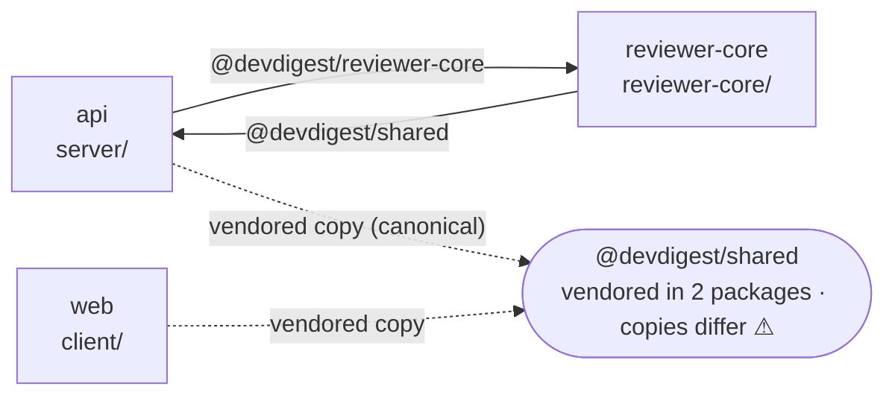

# Report template — Dependency Check

Use this exact skeleton. Keep the five numbered sections and their titles; fill every one (write
`none found` or `not measured` rather than deleting a heading). Tables and Mermaid blocks come
straight from `scripts/collect-deps.mjs --md` when it was run — paste them, then interpret.

````markdown
# Dependency Check — <repo or package set> — <YYYY-MM-DD>

## 1. Scope

| | |
|---|---|
| Packages analyzed | `server` (@devdigest/api), `client` (@devdigest/web), `reviewer-core`, `e2e`, `mcp-server`, `evals` |
| Linkage | standalone packages, one lockfile each (pnpm) — shared code via tsconfig path aliases and vendored copies, **not** `workspace:*` |
| Data sources | `collect-deps.mjs` (sizes, usage, drift, aliases, cycles) · `pnpm outdated` · `pnpm audit` · `pnpm licenses` |
| Excluded | `server/clones/**`, `client/.next/**`, `node_modules` internals |
| Not measured | <anything skipped, e.g. "audit — offline run"> |

## 2. Dependency Graph

### 2.1 Internal (package → package)



<1–3 sentences: direction of edges, which copy is canonical, anything surprising — e.g.
"reviewer-core resolves `@devdigest/shared` into `server/src/vendor`, so the pure core has a
compile-time path into the server package.">

### 2.2 External footprint

```mermaid
flowchart TB
  <script output: packages + their heaviest deps + every dep shared by ≥2 packages>
```

<1–2 sentences: where the weight is, which deps are shared by every package.>

## 3. Size & Type Breakdown

### 3.1 Per package

| Package | Prod | Dev | node_modules | Heaviest prod dep (transitive) | Heaviest dev dep (transitive) |
|---|---|---|---|---|---|
| web | 18 | 12 | 627.8 MB | next — 301.3 MB | vitest — 23.6 MB |
| api | 23 | 8 | 239.0 MB | js-tiktoken — 21.5 MB | @testcontainers/postgresql — 45.4 MB |

### 3.2 Heaviest dependencies (top N per package)

<paste the script's "Size breakdown" table(s). Columns: Dependency · Type · Declared → installed
· Own · Transitive · Exclusive · Usage. Exclusive = what removing it frees.>

### 3.3 Shared across packages & version drift

<paste the "Version drift" table. Add a row-level note for any runtime library that crosses a
package boundary (e.g. zod schemas shared via @devdigest/shared).>

## 4. Findings & Priorities

Tier definitions: see severity-rubric.md. Order: P0 → P1 → P2 → Info; within a tier by impact.

### P0 — fix before merging / shipping

#### P0-1 · <short title> — `<package>` · `<dependency or file:line>`
- **Evidence:** <the number / the quoted line / the audit id>
- **Why it matters:** <one or two sentences>
- **Fix:** <concrete action; command if applicable — not executed>
- **Effort:** S | M | L · **Gain:** <MB freed / CVE closed / risk removed>

### P1 — fix this sprint
<same mini-format>

### P2 — batch into a maintenance PR
<same mini-format; may group similar items, e.g. "6 Fastify plugins one minor behind">

### Info — no action required
- <bullet list: size league notes, DI-root cycles, patch bumps, licence summary>

### Also noted
- <anything below the cut-off, one line each>

## 5. Summary

1. <highest-impact takeaway + expected gain>
2. …
3. …
(3–5 items, ordered by priority)

**Next steps — confirm before I act**
```bash
# P0-1
cd client && diff -r src/vendor/shared ../server/src/vendor/shared   # then copy canonical → client
# P1-2
cd server && pnpm remove @fastify/autoload                           # frees ≈1.2 MB, prod dep
```
````

## Finding mini-format rules

- Title names **the thing**, not the category: `zod drifts across 4 packages (^3 … ^3.24.1)`, not
  `Version drift`.
- `Evidence` is always something a reader could re-check: a path, a `file:line`, a size from the
  table, an advisory id.
- `Fix` is an action, phrased so it can be pasted into *Next steps*. If the fix depends on a
  decision the user must make (which copy is canonical, whether a feature is still needed), say
  so in the fix line instead of guessing.
- `Gain` is quantified whenever the data allows (MB, number of vulns, number of files).

## Reading-guidance sentences

Every table or diagram gets one or two sentences *underneath* saying what to notice. A reader
should be able to skim the guidance sentences alone and get the story; the tables are the proof.
