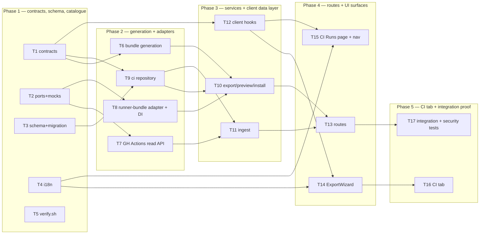

# Implementation Plan: Export a configured review agent to CI (GitHub Actions)

## Overview

Build the connective tissue between a configured DevDigest agent and a target repository's GitHub
Actions: a four-step **Export to CI** wizard that generates a deterministic, self-contained file
bundle (agent manifest + skill bodies + the `agent-runner` ncc bundle + a `pull_request` workflow),
commits it onto a dedicated branch and opens a pull request, and a pull-based reporting loop that
brings those CI runs back into an agent **CI tab** and a global **CI Runs** page.

The review engine already exists and is complete — `agent-runner` needs **no source changes**. What
is missing is generation, install, ingest, and the three UI surfaces.

Source of requirements: [`specs/2026-08-27-export-agent-to-ci.md`](../../specs/2026-08-27-export-agent-to-ci.md)
(SPEC-2026-08-27-export-agent-to-ci, 58 EARS acceptance criteria, decisions D1–D5).

## Execution mode

**multi-agent (parallel)** — requested explicitly ("non-overlapping Owned paths so
implementer-backend / implementer-ui instances can run in parallel"). The plan is therefore phased
with strictly disjoint `Owned paths` inside each phase, contracts land first, and every client task
is written against the contracts + agreed URLs rather than a live server (client tests mock `fetch`,
so UI work never blocks on the routes existing).



## Requirements (verified)

Restated from the spec's EARS list. Every `AC-N` appears in exactly one R-item.

- **R1 (covers AC-1 … AC-8)** — A `CI` tab on the agent detail page, reachable via `?tab=ci`,
  showing one row per installation (repo, target, last-run status, relative time), an
  "Active in N repos" badge, an empty state when there are none, a **Fail CI on** control bound to
  the agent's *existing* `ci_fail_on` field (all four `CiFailOn` values, with branch-protection
  guidance next to it), and a stale marker + update action when the installation's exported agent
  version differs from the agent's current version.
- **R2 (covers AC-9 … AC-12)** — A four-step modal wizard (Target → Preview → Configure → Install)
  with the current position always visible; Step 1 requires an `owner/name` repository; CircleCI /
  Jenkins / Generic CLI render as visibly disabled and unselectable; the export endpoint rejects any
  `target` other than `gha` with a 4xx and no side effect.
- **R3 (covers AC-13 … AC-19, AC-14b)** — Step 2 generates the complete bundle with **zero** side
  effects and renders a file list + contents. The bundle is exactly: the manifest at
  `.devdigest/agents/<agent-slug>.yaml` (exactly one file under `.devdigest/agents/`, validating
  against `AgentManifest` with every field equal to the agent's persisted values), one
  `.devdigest/skills/<skill-slug>.md` per attached skill (every manifest slug matching
  `^[a-zA-Z0-9_-]+$` and resolving to a bundled file), the runner bundle, and
  `.github/workflows/devdigest-review.yml`. No memory file. Only the workflow is `editable: true`.
  Two previews with identical inputs are byte-identical.
- **R4 (covers AC-20 … AC-24)** — Step 3 selects a non-empty subset of `opened` / `synchronize` /
  `reopened`, exactly one destination from `github_review` / `pr_comment` / `none` (default
  `github_review`), the chosen destination **reaches the runner at execution time**, and the step
  displays the merge-blocking guidance (Fail CI on + branch protection, no GitHub App) and the name
  of the LLM API key secret the user must add (distinguished from the automatic `GITHUB_TOKEN`).
- **R5 (covers AC-25 … AC-32)** — Step 4 offers exactly two methods (open a PR — default — and
  download). The PR path commits the bundle as one atomic commit onto a dedicated DevDigest branch,
  reuses that branch and its open PR on re-export, returns the PR URL, and upserts one
  `ci_installations` row per agent+repo carrying the exported agent version. The download path
  returns the same bundle as one archive without contacting GitHub and creates **no** installation
  record until the user explicitly confirms. Any GitHub failure surfaces repo + reason, persists
  nothing, and leaves the wizard on Step 4 with the answers intact.
- **R6 (covers AC-33 … AC-38)** — The generated workflow triggers on `pull_request` (never
  `pull_request_target`) with only the chosen types; fork PRs are **skipped with an explanation**,
  not failed; `.devdigest/**` is read from the PR's **base ref** while the head's diff is reviewed;
  the result artifact is uploaded under a stable documented name; the Node major version and every
  third-party action are pinned; DevDigest's own exported files are excluded from the reviewed diff.
- **R7 (covers AC-39 … AC-48)** — Run outcomes are obtained by **pulling** from GitHub only.
  Opening the CI Runs page or the CI tab, or invoking refresh, fetches recent workflow runs per
  installation, ingests each completed run's result artifact, and persists one `ci_runs` row per
  workflow run — at most once, ever. Queued/in-progress runs show as `running`. Status is derived
  from the **artifact**, not the exit code (`no_findings` / `succeeded` / `failed`); a malformed
  artifact yields `failed` + reason with no partial metrics and no throw. A GitHub failure keeps and
  displays existing rows and surfaces the refresh failure separately. The CI Runs page lists
  timestamp / PR / source / findings / cost / status across all installations with four filters and
  a per-row GitHub link, an empty state when nothing has been ingested, and a **CI Runs** entry in
  the global nav that highlights while active.
- **R8 (covers AC-49 … AC-51)** — Update regenerates the bundle from the agent's **current**
  configuration and re-runs the PR install path against the same repository and base branch, reusing
  the branch and PR; on success the newly exported version is recorded and the stale marker clears.
  While an export/update is in flight the initiating control is disabled and shows progress.
- **R9 (covers AC-52, AC-53)** — No secret value is written into any generated file (the workflow
  references secrets by name only) or into any API response, log line, error message, persisted run
  record, or posted PR content.
- **R10 (covers AC-54, AC-55)** — The CI path must not introduce any route that bypasses
  `wrapUntrusted()` / `INJECTION_GUARD` or the mandatory `groundFindings()` gate, and PR title/body
  must remain data — never able to change the gate, model, or system prompt. *(Already enforced
  inside `reviewer-core` / `agent-runner`; this plan verifies it rather than re-implements it.)*
- **R11 (covers AC-56, AC-57)** — A preview edit to the workflow applies to **this export only**,
  is never persisted against the installation, and is never reapplied to a later export or update.
  Invalid YAML blocks the install with an inline parse error and commits nothing.
- **R12 (non-functional)** — Preview p95 < 300 ms / p99 < 800 ms (no network); install p95 < 10 s
  with progress from 300 ms; ≤ 2 GitHub REST calls per installation per refresh + ≤ 1 artifact
  download per newly completed run, 50 installations < 5 s p95; auto-refresh at most every 30 s
  **and suspended while the document is hidden**; runner bundle ≤ 5 MB; byte-identical bundles for
  identical inputs; WCAG 2.1 AA for the wizard modal and status indicators.

**Assumed defaults — confirm.** `AskUserQuestion` is not available to me inside this agent, so the
four design gaps below are planned against my recommended default and flagged in every task that
depends on them. Each is reversible before Phase 2 starts; after that, T6/T9/T10 would need rework.

- **A1 (T8) — runner bundle source.** `agent-runner/dist/index.js` is git-ignored and only exists
  after `pnpm build`. Planned: a `CiRunnerBundle` **port** + fs adapter reading a configured path
  (default `<repo-root>/agent-runner/dist/index.js`), failing closed with an actionable
  "run `cd agent-runner && pnpm build`" error, plus T5 adding agent-runner to `scripts/verify.sh`.
  Alternative rejected: committing a built copy under `server/src/modules/ci/assets/`.
- **A2 (T1, T3) — the installation persists the wizard answers.** AC-49 requires update to reuse the
  same base branch and to regenerate the workflow, which needs the Step-3 answers. The spec's
  Contracts section only mandates the exported agent version. Planned: `ci_installations` also gains
  `base_branch`, `post_as`, `triggers`. This does **not** violate D5 — the structured answers are
  persisted, the free-text workflow edit is not.
- **A3 (T1, T10) — workflow edit transport.** Planned: `CiExportInput` gains
  `workflow_override?: string` — *contents only*. The server owns the path and regenerates every
  other file, and `yaml.parse`s the override before any GitHub call. Rejected: accepting a full
  client-supplied `CiFile[]`, which would turn the export endpoint into an arbitrary-path write
  primitive against a third-party repository.
- **A4 (T10) — spec Q9, two agents in one repo.** The runner requires exactly one manifest under
  `.devdigest/agents/`, so a second, *different* agent exported to the same repo breaks every run
  there. Planned: the export service refuses with a 409 naming the other agent when
  `ci_installations` already holds a different agent for that repo — a local DB check, zero extra
  GitHub calls. It does not catch a manifest installed outside DevDigest.

## Open questions & recommendations

Spec open questions Q6–Q12 are planned against their recommended defaults, as instructed:

- **Q6** → download alone creates **no** installation record; an explicit "I installed these files"
  confirmation does (T10 `POST /agents/:id/ci-installations`, T14 Step 4). Matches AC-31.
- **Q10** → the four-step wizard is the shipping surface; `publishDialog.*` keys are retired in T4.
- **Q11** → AC-23 is authoritative; `exportWizard.blockMergeDesc`'s "requires a GitHub App" copy is
  stale and is replaced with branch-protection guidance in T4.
- **Q12** → the generated workflow pins **Node 22**, the version `agent-runner` is built and tested
  against (repo `.nvmrc` = 22), stated explicitly in the workflow comment (T6).

Questions the spec left without a recommended default:

- **Q7 (uninstall)** — no AC covers it. **Not planned.** Recorded under Risks: deleting an agent
  cascade-deletes the installation row while leaving a live, working workflow in the customer repo.
  Recommend a follow-up spec for a removal PR path.
- **Q8 (disabled agent)** — no AC covers it. **Not planned as a block.** Recommend allowing export
  and adding a Step-1 warning ("the studio toggle does not gate CI") in a follow-up; the copy key is
  *not* added in T4 so the scope stays clean.
- **Q9** — see assumed default A4.

Recommendations (user decides; none of these edit the spec):

- **Rec 1 — add `agent-runner` to `scripts/verify.sh`.** It is absent today, so its typecheck and
  its 19 hermetic tests never run at a phase gate even though this feature ships its bundle into
  customer repositories. Planned as T5 (cheap, isolated).
- **Rec 2 — reuse `POST /agents/:id/export-ci` for update.** AC-49/AC-50 need no dedicated endpoint:
  the client re-sends the installation's stored repo/base/triggers/post_as, and the existing
  branch-reuse + upsert path satisfies both. One endpoint, less surface.
- **Rec 3 — deliver the download archive as base64 JSON**, not `application/zip`. It keeps the
  client inside its single `apiFetch` chokepoint (`client/src/lib/api.ts`) and keeps AC-30 provable
  under the client's mocked-`fetch` vitest setup, which cannot assert on a binary stream.
- **Rec 4 — close the vendored-contract drift while T1 is in the file.** `client/src/vendor/shared/contracts/eval-ci.ts`
  is already behind the canonical copy (it is missing `AgentManifest` entirely, and its
  `ConformanceInput.provider` enum lacks `openrouter`). T1 mirrors the CI additions *and* closes
  that gap so the two copies stop diverging silently.
- **Rec 5 — run `doc-writer` after Phase 5** to fold the new `server/src/modules/ci/` module into
  `server/README.md`'s API map and `client/README.md`'s route map. Not planned as a task.

## Affected modules & contracts

- **`server/`** — a new `ci` feature module (generation, install, ingest), two new `GitHubClient`
  port methods, one new `CiRunnerBundle` port + fs adapter, two altered tables + one migration, one
  new dependency (`yaml`).
- **`client/`** — a CI tab under the agent editor, a four-step export wizard, a `/ci-runs` route,
  one nav entry, one TanStack Query hook module, one i18n catalogue rewrite.
- **`reviewer-core/`** — **no changes.** Explicit non-goal; parity is verified, not modified.
- **`agent-runner/`** — **no source changes.** `DEVDIGEST_POST_AS` (AC-22), the `^[a-zA-Z0-9_-]+$`
  slug allowlist + containment check (AC-17), `stripIgnoredFiles` for `.devdigest/**` and
  `.github/workflows/**` (AC-38), the mandatory grounding gate and `wrapUntrusted` folding of the PR
  title (AC-54/AC-55), and the artifact-before-post write order (AC-42/AC-43) are all already
  implemented. This feature is the caller that finally satisfies its contract. Only
  `scripts/verify.sh` gains its build/typecheck (T5).
- **Contracts (`@devdigest/shared`, canonical `server/src/vendor/shared`, mirrored into
  `client/src/vendor/shared`)** — **changes to an existing contract file**, called out explicitly:
  - `contracts/eval-ci.ts` — **additive only.** `CiInstallation` gains `agent_version`,
    `base_branch`, `post_as`, `triggers`; `CiExportInput` gains `workflow_override`; `CiRun` gains
    `error`. New: `CiPostAs`, `CiTrigger`, `CiPreview`, `CiInstallationStatus`, `CiRunListItem`,
    `CiRunList`, `CiRunsQuery`. `CiTarget`, `CiFailOn`, `CiFile`, `AgentManifest`, `CiExport`,
    `CiRunStatus`, `CiResultArtifact` are **unchanged** — `AgentManifest` in particular stays frozen
    (AC-22 is carried by the workflow's env, per the spec's own resolution).
  - `adapters.ts` — **additive only.** `GitHubClient` gains `listWorkflowRuns` and
    `downloadRunArtifactFile`; a new `CiRunnerBundle` port is added. Adding methods to
    `GitHubClient` immediately breaks `MockGitHubClient`'s `implements` clause, so T2 owns both
    files together.
  - **No sync script exists** for the vendored copy — the mirror is a manual, explicit step in T1
    and T2, and the acceptance for both is a `diff` proving the copies match.

## Architecture changes

Onion placement for every new file (see `.claude/skills/onion-architecture/layer-map.md`):

| Layer | New file | Note |
|---|---|---|
| Ports | `server/src/vendor/shared/adapters.ts` (+ client mirror) | `CiRunnerBundle`; two `GitHubClient` methods. No vendor name in either. |
| Ports | `server/src/vendor/shared/contracts/eval-ci.ts` (+ client mirror) | API-facing shapes only. |
| Infrastructure | `server/src/adapters/github/octokit.ts` | Actions REST + `fflate` unzip live here, never in the service. |
| Infrastructure | `server/src/adapters/ci-runner/fs.ts` | Reads + caches the ncc bundle from disk. |
| Infrastructure | `server/src/adapters/mocks.ts` | `MockCiRunnerBundle`; mock Actions methods. |
| Infrastructure | `server/src/modules/ci/repository.ts` | The **only** ci file allowed to touch `db/schema` + `drizzle-orm`. |
| Composition root | `server/src/platform/container.ts` | Lazy getter + `ContainerOverrides` field for `ciRunnerBundle`. |
| Application (pure) | `server/src/modules/ci/{constants,slug,manifest,workflow,bundle}.ts` | Deterministic generation. No I/O, no clock, no randomness — that is what makes AC-19 testable. |
| Application | `server/src/modules/ci/{service,ingest}.ts` | Consume `container.github()` / `container.ciRunnerBundle` — never an SDK. |
| Transport | `server/src/modules/ci/routes.ts` + `server/src/modules/index.ts` | Zod `params`/`body`/`response` via `fastify-type-provider-zod`; no logic. |
| RSC boundary | `client/src/app/ci-runs/page.tsx` | Thin server route entry → `"use client"` view in `_components/CiRunsView/`. |
| Client data | `client/src/lib/hooks/ci.ts` | The only place `apiFetch` is called for CI. |

**Endpoints (agreed here so client and server tasks can proceed in parallel):**

| Method | Path | Body → Response | ACs |
|---|---|---|---|
| POST | `/agents/:id/ci-preview` | `CiExportInput` → `CiPreview` | AC-13 … AC-19, AC-56 |
| POST | `/agents/:id/export-ci` | `CiExportInput` (+`workflow_override`) → `CiExport` | AC-12, AC-26 … AC-29, AC-32, AC-49, AC-50, AC-57 |
| POST | `/agents/:id/ci-archive` | `CiExportInput` → `{ filename, content_base64 }` | AC-30 |
| POST | `/agents/:id/ci-installations` | `{ repo, target, base, post_as, triggers }` → `CiInstallation` | AC-31 |
| GET | `/agents/:id/ci-installations` | → `CiInstallationStatus[]` | AC-2, AC-3, AC-8, AC-40 |
| GET | `/ci-runs` | query `CiRunsQuery` → `CiRunList` | AC-40, AC-41, AC-45 … AC-47 |
| POST | `/ci-runs/refresh` | `{ agent_id? }` → `CiRunList` | AC-40, AC-45 |

## Phased tasks

### Phase 1 — Contracts, schema, catalogue (T1–T5 all run concurrently)

- **T1**
  - **Action:** Extend the CI contracts, then mirror them into the client's vendored copy. In
    `server/src/vendor/shared/contracts/eval-ci.ts`: add `CiPostAs = z.enum(['github_review','pr_comment','none'])`
    and `CiTrigger = z.enum(['opened','synchronize','reopened'])`; extend `CiInstallation` with
    `agent_version: z.number().int()`, `base_branch: z.string()`, `post_as: CiPostAs`,
    `triggers: z.array(CiTrigger)`; extend `CiExportInput` with `workflow_override: z.string().nullish()`
    and retype its `post_as`/`triggers` to the new enums (`triggers: z.array(CiTrigger).min(1)`);
    extend `CiRun` with `error: z.string().nullish()`. Add `CiPreview = { repo, files: CiFile[] }`,
    `CiInstallationStatus = { installation, last_run: CiRun|null, out_of_date: boolean }`,
    `CiRunListItem = CiRun + { repo: string|null, agent_id: string|null }`,
    `CiRunList = { items: CiRunListItem[], total: number, refresh_error: string|null }`, and
    `CiRunsQuery = { window?: '24h'|'7d'|'30d'|'all', agent_id?, repo?, status?: CiRunStatus, limit?, offset? }`.
    Export a `CiExportInputBody` input type for the client. Then copy the whole
    Export-to-CI + CI Runs section verbatim into
    `client/src/vendor/shared/contracts/eval-ci.ts`, and while there close the pre-existing drift
    (Rec 4): add the missing `AgentManifest` block and align `ConformanceInput.provider`, importing
    `Provider` / `CiFailOn` from the client's `./knowledge.js` (both already exist there).
    Leave `AgentManifest`'s own shape frozen.
  - **Module:** server (canonical shared) + client (vendored mirror)
  - **Agent:** implementer-backend
  - **Skills to use:** zod, typescript-expert, engineering-insights
  - **Owned paths:** `server/src/vendor/shared/contracts/eval-ci.ts`, `client/src/vendor/shared/contracts/eval-ci.ts`
  - **Depends-on:** none
  - **Risk:** medium (two packages typecheck against these files)
  - **Known gotchas:** NEVER give a contract field a Zod `.default([])` if that contract is ever fed
    to `zodResponseFormat` — it emits a literal `"default": []` OpenAI rejects
    (`server/insights/gotchas.md`, 2026-08-08). These are HTTP-only shapes, so `.default()` is fine,
    but zod v3's `.default(x)` makes a field optional on **input** and required on **output** — the
    client must consume `z.input<>` types (`CiExportInputBody`), which is why that alias is
    exported. The two vendored copies have **no sync script**; a manual copy is the only mechanism.
  - **Acceptance:** `cd server && pnpm typecheck` and `cd client && pnpm typecheck` both exit 0;
    `diff <(sed -n '/Export-to-CI/,/^\/\/ =\+$/p' server/src/vendor/shared/contracts/eval-ci.ts) <(sed -n '/Export-to-CI/,/^\/\/ =\+$/p' client/src/vendor/shared/contracts/eval-ci.ts)`
    produces no output; `grep -c "AgentManifest" client/src/vendor/shared/contracts/eval-ci.ts` ≥ 1.
    **→ no AC — enabling work (prerequisite for AC-8, AC-46, AC-49, AC-56)**

- **T2**
  - **Action:** Add the two ports and keep the mocks compiling. In
    `server/src/vendor/shared/adapters.ts`: add to `GitHubClient` (a) `listWorkflowRuns(repo: RepoRef, opts: { workflowFile: string; perPage?: number }): Promise<CiWorkflowRun[]>`
    where `CiWorkflowRun = { id: string; status: 'queued'|'in_progress'|'completed'; conclusion: string|null; html_url: string; pr_number: number|null; created_at: string; run_started_at: string|null; updated_at: string }`,
    and (b) `downloadRunArtifactFile(repo: RepoRef, runId: string, artifactName: string, fileName: string): Promise<string | null>`
    — returns the file's text from inside the artifact zip, or `null` when the artifact is absent or
    expired. Unzipping is deliberately behind the port so the service never sees `fflate`. Add a new
    `export interface CiRunnerBundle { read(): Promise<string> }` port (no vendor or filesystem word
    in the name). Mirror both into `client/src/vendor/shared/adapters.ts`. In
    `server/src/adapters/mocks.ts`: implement the two new methods on `MockGitHubClient` (recording
    calls, returning injectable fixtures — follow the existing `commitFiles`/`openPullRequest`
    recording style) and add `MockCiRunnerBundle` returning a short deterministic stub string.
  - **Module:** server (+ client mirror)
  - **Agent:** implementer-backend
  - **Skills to use:** onion-architecture, typescript-expert, engineering-insights
  - **Owned paths:** `server/src/vendor/shared/adapters.ts`, `client/src/vendor/shared/adapters.ts`, `server/src/adapters/mocks.ts`
  - **Depends-on:** none
  - **Risk:** medium
  - **Known gotchas:** `MockGitHubClient implements GitHubClient` — adding an interface method breaks
    the mock's typecheck in the same commit, which is why both files are in one task.
    `OctokitGitHubClient` also `implements GitHubClient`, so T7 must land in the next phase or
    `server` typecheck stays red until it does; that is the intended phase boundary. `client` never
    calls `GitHubClient` — the mirror exists only to keep the two vendored copies identical.
  - **Acceptance:** `cd server && pnpm exec tsc --noEmit` reports errors **only** in
    `src/adapters/github/octokit.ts` (the not-yet-implemented methods, closed by T7) and nothing
    else; `cd client && pnpm typecheck` exits 0; `grep -c "CiRunnerBundle" server/src/vendor/shared/adapters.ts client/src/vendor/shared/adapters.ts` is ≥ 1 for both.
    **→ no AC — enabling work (prerequisite for AC-40, AC-43, AC-14)**

- **T3**
  - **Action:** Extend the CI tables and generate the migration. In
    `server/src/db/schema/ci.ts`: `ciInstallations` gains `agentVersion: integer('agent_version').notNull().default(1)`,
    `baseBranch: text('base_branch').notNull().default('main')`,
    `postAs: text('post_as', { enum: ['github_review','pr_comment','none'] }).notNull().default('github_review')`,
    `triggers: jsonb('triggers').notNull().default(['opened','synchronize','reopened'])`, and
    `updatedAt: timestamp('updated_at', { withTimezone: true }).defaultNow().notNull()`; add
    `uniqueIndex('ci_installations_agent_repo_uniq').on(t.agentId, t.repo)` (the conflict target
    AC-29's upsert needs) and `index(...).on(t.repo)`. `ciRuns` gains
    `workflowRunId: text('workflow_run_id').notNull()` with
    `uniqueIndex('ci_runs_workflow_run_id_uniq').on(t.workflowRunId)` (AC-44's at-most-once key),
    `agent: text('agent')`, `durationS: doublePrecision('duration_s')`, `error: text('error')`, and
    an index on `(ci_installation_id, ran_at desc)` for the CI-tab last-run lookup. Then
    `pnpm db:generate` and `pnpm db:migrate`.
  - **Module:** server
  - **Agent:** implementer-backend
  - **Skills to use:** drizzle-orm-patterns, **postgresql-table-design**, typescript-expert, engineering-insights
  - **Owned paths:** `server/src/db/schema/ci.ts`, `server/src/db/migrations/**`
  - **Depends-on:** none
  - **Risk:** medium
  - **Known gotchas:** **Migrations never run on boot** — `cd server && pnpm db:migrate` by hand, or
    the API fails with `relation ... does not exist` (root `CLAUDE.md`). **NEVER
    `docker compose down -v`** to get a clean DB; `-v` drops `devdigest_pgdata` and every imported
    repo and review with it. Postgres does **not** auto-index FK columns — `ci_installation_id`
    needs its index declared. `ci_runs.workflow_run_id` must be `NOT NULL` + `UNIQUE`, not merely
    unique, or a NULL-carrying row silently defeats the dedupe (UNIQUE permits multiple NULLs).
    Both tables are empty in practice, so the `NOT NULL` addition needs no backfill.
  - **Acceptance:** `pnpm db:generate` adds exactly one new file under `src/db/migrations/`;
    `pnpm db:migrate` applies clean against a fresh database; `pnpm typecheck` exits 0;
    `psql -c "\d ci_runs"` shows `workflow_run_id text not null` and the unique index.
    **→ no AC — enabling work (prerequisite for AC-8, AC-28, AC-29, AC-44, AC-49)**

- **T4**
  - **Action:** Rewrite `client/messages/en/ci.json` to be the complete catalogue for all three
    surfaces. **Keep** the existing `runs.*` and `exportWizard.*` keys that still apply. **Replace**
    `exportWizard.blockMergeDesc` — its "Requires a GitHub App — not available with PAT in local
    mode" contradicts AC-23 (spec Q11) — with branch-protection copy that explicitly says no GitHub
    App is required. **Delete** the whole `publishDialog` block (spec Q10 — the wizard is the
    shipping surface). **Add**: `ciTab.table.{repo,target,status,lastRun}`, `ciTab.activeIn`
    (ICU plural: "Active in {count, plural, one {# repo} other {# repos}}"),
    `ciTab.emptyTitle`/`emptyBody`, `ciTab.failOn.{label,hint}` and
    `ciTab.failOn.options.{never,critical,warning,any}` each naming exactly which severities block
    (AC-6), `ciTab.branchProtectionNote` (AC-7), `ciTab.outOfDate`, `ciTab.updateAction`,
    `ciTab.updating`; `exportWizard.comingSoon` (AC-11), `exportWizard.repoInvalid` (AC-10),
    `exportWizard.editWorkflow`/`workflowInvalidYaml` (AC-57), `exportWizard.triggersRequired`
    (AC-20), `exportWizard.blockMergeNote` (AC-23), `exportWizard.secretNoteAuto` distinguishing the
    user-supplied LLM key from the automatic token (AC-24),
    `exportWizard.method.{openPr,download,downloadHint}` (AC-25),
    `exportWizard.downloadConfirm` (AC-31), `exportWizard.installFailed` (AC-32);
    `runs.refreshFailed` (AC-45), `runs.filters.status.*`, `runs.emptyTitle`/`emptyBody` retained
    (AC-47). Every string is English-only — the app is single-locale by design.
  - **Module:** client
  - **Agent:** implementer-ui
  - **Skills to use:** next-best-practices, engineering-insights
  - **Owned paths:** `client/messages/en/ci.json`
  - **Depends-on:** none
  - **Risk:** low
  - **Known gotchas:** A **new catalogue file** needs no registration, but this one already exists,
    so nothing to wire. `useTranslations()`'s `t()` **never throws** on a missing key — it logs
    `IntlError: MISSING_MESSAGE` to stderr and renders the key path, so a missing key ships as
    visible garbage rather than a failing test; the grep checks below are the real gate
    (`client/insights/gotchas.md`, 2026-08-20).
  - **Acceptance:** `node -e "JSON.parse(require('fs').readFileSync('client/messages/en/ci.json','utf8'))"`
    exits 0; `grep -c "GitHub App" client/messages/en/ci.json` returns 0 for the "requires" framing
    (the AC-23 "no GitHub App is required" phrasing is the only permitted occurrence);
    `grep -c publishDialog client/messages/en/ci.json` returns 0; `ciTab.failOn.options` has exactly
    four entries. **→ satisfies AC-6 (copy), AC-7 (copy), AC-23 (copy), AC-24 (copy)**

- **T5**
  - **Action:** Add `agent-runner` to the project-wide gate in `scripts/verify.sh` (Rec 1): a
    `wanted agent-runner` block running `check agent-runner "typecheck" "pnpm typecheck"` and
    `check agent-runner "unit" "pnpm exec vitest run --reporter=dot"`, placed after the
    `reviewer-core` block and before `mcp-server`. Do **not** add `pnpm build` to the default gate
    (ncc is slow); add it as a separate line guarded by the existing `--it` flag or a new
    `--bundle` flag, whichever keeps the default pass under its current ~20 s.
  - **Module:** server (root tooling — assigned to implementer-backend)
  - **Agent:** implementer-backend
  - **Skills to use:** engineering-insights
  - **Owned paths:** `scripts/verify.sh`
  - **Depends-on:** none
  - **Risk:** low
  - **Known gotchas:** `check()` self-skips a package with no `node_modules`, so a developer who has
    never run `cd agent-runner && pnpm install` gets a `○ skipped` line, not a failure — that is the
    intended behaviour, do not "fix" it into a hard error. `agent-runner`'s typecheck **also**
    requires `reviewer-core/node_modules` to exist (this repo is not a workspace; TS resolves from
    the *importing file's* ancestors) — note it in the skip message.
  - **Acceptance:** `./scripts/verify.sh agent-runner` prints two `agent-runner ·` lines and exits 0;
    `./scripts/verify.sh` still exits 0 and its wall time stays within ~5 s of the pre-change run.
    **→ no AC — enabling work (guards R6/R12 regressions in the shipped bundle)**

### Phase 2 — Generation + adapters (T6–T9 all run concurrently)

- **T6**
  - **Action:** Build the deterministic, side-effect-free generation core. Add `yaml@^2.6.1` to
    `server/package.json` (same version `agent-runner` already uses) and `pnpm install`.
    - `server/src/modules/ci/constants.ts` — `WORKFLOW_PATH = '.github/workflows/devdigest-review.yml'`,
      `RUNNER_PATH = '.devdigest/runner/index.js'`, `AGENTS_DIR = '.devdigest/agents'`,
      `SKILLS_DIR = '.devdigest/skills'`, `ARTIFACT_NAME = 'devdigest-result'`,
      `ARTIFACT_FILE = 'devdigest-result.json'`, `EXPORT_BRANCH = 'devdigest/ci'`,
      `NODE_MAJOR = '22'`, `LLM_SECRET_NAME = 'OPENROUTER_API_KEY'`, pinned action refs
      (`actions/checkout@v4.2.2`, `actions/setup-node@v4.1.0`, `actions/upload-artifact@v4.4.3`),
      `MAX_RUNNER_BYTES = 5 * 1024 * 1024`.
    - `server/src/modules/ci/slug.ts` — `toSlug(name)` normalising to `^[a-zA-Z0-9_-]+$` (lowercase,
      collapse runs of unsafe chars to `-`, trim leading/trailing `-`), throwing a named error when
      the result is empty. Deduplicate colliding slugs deterministically (`-2`, `-3`) ordered by the
      agent's persisted skill order, never by `Map` iteration or `Date.now()`.
    - `server/src/modules/ci/manifest.ts` — `renderManifest(agent, skillSlugs): string` emitting
      YAML with **fixed key order** (`name, provider, model, system_prompt, skills, strategy,
      ci_fail_on`) and no timestamp/nonce. It must `AgentManifest.parse()` its own output before
      returning.
    - `server/src/modules/ci/workflow.ts` — `renderWorkflow({ triggers, postAs })` producing the
      pinned workflow described below, and `validateWorkflowYaml(contents): void` that `yaml.parse`s
      an override and throws a `BadRequestError` carrying the parse position (AC-57).
    - `server/src/modules/ci/bundle.ts` — `buildBundle({ agent, skills, runnerSource, input, workflowOverride? }): CiFile[]`
      returning the files in a **fixed order** with `editable` true only for the workflow path
      (AC-18), and asserting `runnerSource.length <= MAX_RUNNER_BYTES`.

    The generated workflow (AC-33 … AC-37, AC-22, AC-52):

    ```yaml
    on: { pull_request: { types: [<chosen subset>] } }     # never pull_request_target (AC-33)
    permissions: { contents: read, pull-requests: write }  # ...: read when post_as is 'none'
    jobs:
      fork-notice:                                          # AC-34 — explain, don't fail
        if: github.event.pull_request.head.repo.full_name != github.repository
        steps: [ run: echo "DevDigest review skipped: ..." ]
      review:
        if: github.event.pull_request.head.repo.full_name == github.repository
        steps:
          - uses: actions/checkout@v4.2.2
            with: { ref: '${{ github.event.pull_request.base.sha }}' }   # AC-35 — BASE ref
          - uses: actions/setup-node@v4.1.0
            with: { node-version: '22' }                                 # AC-37, spec Q12
          - env: { OPENROUTER_API_KEY: '${{ secrets.OPENROUTER_API_KEY }}',
                   GITHUB_TOKEN: '${{ secrets.GITHUB_TOKEN }}',
                   GITHUB_REPOSITORY: '${{ github.repository }}',
                   PR_NUMBER: '${{ github.event.pull_request.number }}',
                   DEVDIGEST_POST_AS: '<chosen destination>' }           # AC-22
            run: node .devdigest/runner/index.js
          - if: always()
            uses: actions/upload-artifact@v4.4.3
            with: { name: devdigest-result, path: devdigest-result.json,
                    if-no-files-found: ignore }                          # AC-36
    ```

    Checking out the **base sha** is the whole of AC-35: the runner reads `.devdigest/**` (manifest,
    skills, `ci_fail_on`, system prompt) from the working tree, while it fetches the head's diff over
    the REST API — so a PR that edits `.devdigest/**` cannot weaken the gate judging it. Pinning
    `base.sha` rather than `base.ref` also removes a race with a concurrent push to base.
    Write hermetic tests alongside each file (`*.test.ts`, no `.it.` suffix).
  - **Module:** server
  - **Agent:** implementer-backend
  - **Skills to use:** typescript-expert, zod, **security**, engineering-insights
  - **Owned paths:** `server/src/modules/ci/constants.ts`, `server/src/modules/ci/slug.ts`, `server/src/modules/ci/manifest.ts`, `server/src/modules/ci/workflow.ts`, `server/src/modules/ci/bundle.ts`, `server/src/modules/ci/*.test.ts`, `server/package.json`
  - **Depends-on:** T1
  - **Risk:** high (this is the artifact that leaves the repo and gates other people's merges)
  - **Known gotchas:** `agent-runner`'s `loadSkillBodies` enforces `^[a-zA-Z0-9_-]+$` **and** a
    resolved-path containment check, and rejects a slug it cannot resolve — an out-of-shape slug is
    a hard runner failure, not a warning, so `toSlug` must normalise before emission (AC-17;
    `agent-runner/insights/INSIGHTS.md`, 2026-08-26). The runner's `stripIgnoredFiles` already drops
    `.devdigest/` and `.github/workflows/` from the reviewed diff (AC-38) — do **not** add a second
    strip in the workflow. `AgentManifest.skills` tolerates YAML `skills:` with no value (parses to
    `null`), so an agent with zero skills must emit `skills: []`, not a bare key. Determinism
    (AC-19) dies to exactly three things: a timestamp, `Date.now()`/`randomUUID()`, and unordered
    iteration — none of the five files may contain any of them.
  - **Acceptance:** `cd server && pnpm exec vitest run src/modules/ci --reporter=dot` green, with
    named tests proving: a two-skill agent yields exactly five paths and no `memory.jsonl`
    (`AC-14`, `AC-14b`); exactly one `*.yaml` under `.devdigest/agents/` (`AC-15`); the emitted YAML
    round-trips through `AgentManifest.parse` with every field `toEqual` the agent record
    (`AC-16`); every manifest slug matches `^[a-zA-Z0-9_-]+$` and has a bundled file, and a
    hostile name like `../../etc/passwd` normalises rather than escapes (`AC-17`); `editable` is
    true only for the workflow (`AC-18`); two `buildBundle` calls with identical inputs produce
    identical SHA-256 over the joined contents (`AC-19`); the YAML has `on.pull_request` with the
    chosen types and contains no `pull_request_target` (`AC-33`); a fork-notice job and a
    same-repo-guarded review job exist (`AC-34`); the checkout step's `ref` is
    `github.event.pull_request.base.sha` (`AC-35`); an `upload-artifact` step names
    `devdigest-result` (`AC-36`); every `uses:` carries an explicit version tag and `node-version`
    is `'22'` (`AC-37`); `DEVDIGEST_POST_AS` equals the chosen destination (`AC-22`); no generated
    file contains a value matching `gh[ps]_[A-Za-z0-9]{36,}` or `sk-` and every `secrets.` reference
    is name-only (`AC-52`); `validateWorkflowYaml('a:\n - b\n  c:')` throws (`AC-57`).
    **→ satisfies AC-14, AC-14b, AC-15, AC-16, AC-17, AC-18, AC-19, AC-22, AC-33, AC-34, AC-35, AC-36, AC-37, AC-38 (assertion), AC-52, AC-57 (server half)**

- **T7**
  - **Action:** Implement the two new `GitHubClient` methods in
    `server/src/adapters/github/octokit.ts`. `listWorkflowRuns` → `GET /repos/{owner}/{repo}/actions/workflows/{file}/runs`
    with `event=pull_request` and `per_page` (default 20), mapping each run to `CiWorkflowRun` and
    taking `pr_number` from `run.pull_requests?.[0]?.number ?? null` (safe here — forks are skipped
    by the generated workflow, so runs are always same-repo and the array is populated). A 404 for
    an unknown workflow file returns `[]` rather than throwing, so a repo whose install PR is not
    yet merged reads as "no runs", not as a refresh error. `downloadRunArtifactFile` →
    `GET .../actions/runs/{id}/artifacts`, pick by name, `GET .../artifacts/{id}/zip`, then
    `fflate.unzipSync` the response bytes and return the requested entry decoded as UTF-8; return
    `null` (never throw) when the artifact is missing, expired (410), or does not contain the entry.
    Cap the unzipped entry at a sane size before decoding. `fflate` is **already** a server
    dependency — add nothing.
  - **Module:** server
  - **Agent:** implementer-backend
  - **Skills to use:** typescript-expert, **security**, engineering-insights
  - **Owned paths:** `server/src/adapters/github/octokit.ts`
  - **Depends-on:** T2
  - **Risk:** medium
  - **Known gotchas:** The artifact zip is attacker-adjacent content (it is produced by a job running
    in a third-party repo): never write it to disk, never path-join its entry names, decode only the
    single expected entry by exact name, and bound its size before `toString('utf8')`. The token is
    injected via `container.secrets` and must never reach a log line or an error message (AC-53) —
    map an octokit `RequestError` to `${status} ${message}` and drop the request headers.
  - **Acceptance:** `cd server && pnpm exec vitest run src/adapters/github --reporter=dot` green;
    `cd server && pnpm typecheck` exits 0 (closing the T2 gap); a hermetic test with a stubbed
    octokit `request` proves a 410 artifact and a missing entry both return `null` without throwing,
    and that a thrown auth error's message contains neither the token nor an `authorization` header.
    **→ satisfies AC-53 (adapter half); enabling for AC-40, AC-43, AC-45**

- **T8**
  - **Action:** Implement the runner-bundle port and wire both new ports into the composition root.
    `server/src/adapters/ci-runner/fs.ts` — `FsCiRunnerBundle implements CiRunnerBundle`, reading a
    configured absolute path once and caching the string in memory for the process lifetime (this is
    what keeps preview inside the < 300 ms p95 budget, R12). When the file is absent it throws a
    named error whose message is exactly actionable: the resolved path plus
    `run: cd agent-runner && pnpm build`. Add `runnerBundlePath` to `server/src/platform/config.ts`
    (env `DEVDIGEST_RUNNER_BUNDLE`, default `<repo-root>/agent-runner/dist/index.js`) — a path, not
    a secret, so it belongs in `AppConfig`. In `server/src/platform/container.ts` add a lazy
    `ciRunnerBundle` getter plus a `ciRunnerBundle?: CiRunnerBundle` field on `ContainerOverrides`
    so tests inject `MockCiRunnerBundle` (added in T2).
  - **Module:** server
  - **Agent:** implementer-backend
  - **Skills to use:** **onion-architecture**, typescript-expert, engineering-insights
  - **Owned paths:** `server/src/adapters/ci-runner/fs.ts`, `server/src/adapters/ci-runner/fs.test.ts`, `server/src/platform/container.ts`, `server/src/platform/config.ts`
  - **Depends-on:** T2
  - **Risk:** medium — **rests on assumed default A1**
  - **Known gotchas:** `agent-runner/dist/` is git-ignored and `pnpm build` (ncc) is the only thing
    that creates it, so a fresh clone has no bundle — fail closed with the build instruction rather
    than silently exporting an empty file into a customer repo. `AppConfig` deliberately excludes
    secrets; this is a path, so it is the right home. The composition root is the **only** file
    allowed to know both a port and its concrete adapter — do not import `FsCiRunnerBundle` from the
    ci service.
  - **Acceptance:** `cd server && pnpm exec vitest run src/adapters/ci-runner --reporter=dot` green,
    with a test proving a missing file throws an error whose message contains
    `cd agent-runner && pnpm build` and the resolved path, and that two `read()` calls hit the
    filesystem once; `pnpm typecheck` exits 0; `grep -c "adapters/ci-runner" server/src/modules -r`
    returns 0 (no module reaches past the container).
    **→ no AC — enabling work (prerequisite for AC-14, and for R12's preview budget)**

- **T9**
  - **Action:** Write `server/src/modules/ci/repository.ts` — the only ci file that imports
    `db/schema` and `drizzle-orm`. Methods: `listInstallations(workspaceId, agentId?)` joining
    `agents` for the workspace scope and left-joining the newest `ci_runs` row per installation;
    `upsertInstallation({ agentId, repo, targetType, agentVersion, baseBranch, postAs, triggers })`
    using `onConflictDoUpdate` against the `(agent_id, repo)` unique index (AC-29) and refreshing
    `installed_at`/`updated_at`/`agent_version` (AC-28, AC-50);
    `findInstallationByRepo(workspaceId, repo)` returning the row *whatever* agent owns it (the A4
    409 check); `upsertRun(row)` using `onConflictDoUpdate` on `workflow_run_id` (AC-44), only
    overwriting a row that is still `running`; `listRuns(workspaceId, query)` applying the four
    filters + limit/offset and returning `{ items, total }`; `getRunStatuses(workflowRunIds)` so
    ingest can skip already-terminal runs without a download. Add
    `server/src/modules/ci/repository.it.test.ts` (DB-backed).
  - **Module:** server
  - **Agent:** implementer-backend
  - **Skills to use:** drizzle-orm-patterns, **postgresql-table-design**, typescript-expert, engineering-insights
  - **Owned paths:** `server/src/modules/ci/repository.ts`, `server/src/modules/ci/repository.it.test.ts`
  - **Depends-on:** T1, T3
  - **Risk:** medium
  - **Known gotchas:** A test importing `test/helpers/pg.ts` **must** carry the `.it.test.ts`
    suffix or the CI unit/integration split breaks (`server/CLAUDE.md`). `onConflictDoUpdate`
    requires an exact matching unique index — partial indexes do not work, which is why T3 declares
    plain unique indexes. `ci_runs.ci_installation_id` is nullable *on purpose* (a run whose
    installation was deleted stays listed), so `listRuns` must left-join, never inner-join, or those
    rows vanish from the CI Runs page.
  - **Acceptance:** `cd server && pnpm exec vitest run src/modules/ci/repository.it.test --reporter=dot`
    green (self-skips without Docker), with named tests proving: two `upsertInstallation` calls for
    the same agent+repo leave exactly one row with a refreshed timestamp and version (`AC-29`,
    `AC-28`); three `upsertRun` calls for the same `workflow_run_id` leave exactly one row
    (`AC-44`); a run whose installation was deleted still returns from `listRuns` with its repo
    label (edge case); each of the four filters narrows the result set.
    **→ satisfies AC-28, AC-29, AC-44**

### Phase 3 — Services + client data layer (T10–T12 all run concurrently)

- **T10**
  - **Action:** Write `server/src/modules/ci/service.ts` — `CiService(container)` with:
    - `preview(workspaceId, agentId, input)` → `CiPreview`. Rejects `input.target !== 'gha'` with a
      `BadRequestError` naming the target **before** anything else (AC-12), shape-validates
      `repo` against `^[A-Za-z0-9._-]+\/[A-Za-z0-9._-]+$` (AC-10 server side; this string becomes
      REST path segments), loads the agent + its ordered skills, reads
      `container.ciRunnerBundle.read()`, and returns `buildBundle(...)`. **No** GitHub call, **no**
      DB write (AC-13).
    - `exportToCi(workspaceId, agentId, input)` → `CiExport`. Same validation, plus the A4 conflict
      check (`findInstallationByRepo` returning a *different* agent → 409 naming it). If
      `input.workflow_override` is present, `validateWorkflowYaml` it and substitute it for the
      generated workflow **for this call only** — never persisted (AC-56, AC-57). Then
      `github.commitFiles(repo, { branch: EXPORT_BRANCH, base: input.base, files, message })` →
      `github.findOpenPr(repo, EXPORT_BRANCH)` → `github.openPullRequest(...)` only when none exists
      (AC-26, AC-27) → `repository.upsertInstallation(...)` with the agent's **current** `version`
      (AC-28, AC-50). Every GitHub error is caught and rethrown as an error carrying the repo name
      and the underlying reason with **no token substring**, and — critically — the upsert runs only
      after the PR call resolves, so a rejection persists nothing (AC-32, AC-53).
    - `archive(workspaceId, agentId, input)` → `{ filename, content_base64 }` using
      `fflate.zipSync` over the same `buildBundle` output, preserving relative paths, with **no**
      GitHub call and **no** DB write (AC-30, AC-31).
    - `confirmInstallation(workspaceId, agentId, body)` → `CiInstallation`, the explicit
      post-download confirmation that creates the record (AC-31, spec Q6).
    - `installationStatuses(workspaceId, agentId)` → `CiInstallationStatus[]`, computing
      `out_of_date` as `installation.agent_version !== agent.version` (AC-8).
    Hermetic tests in `server/src/modules/ci/service.test.ts` driving `MockGitHubClient` +
    `MockCiRunnerBundle` through `ContainerOverrides`.
  - **Module:** server
  - **Agent:** implementer-backend
  - **Skills to use:** onion-architecture, typescript-expert, zod, **security**, engineering-insights
  - **Owned paths:** `server/src/modules/ci/service.ts`, `server/src/modules/ci/service.test.ts`
  - **Depends-on:** T6, T8, T9
  - **Risk:** high — **rests on assumed defaults A3 and A4**
  - **Known gotchas:** `commitFiles` is documented as idempotent (blobs → tree → commit → ref,
    creating the branch from `base` when missing, fast-forwarding otherwise) — that is exactly
    AC-27's "update the branch", so do **not** hand-roll branch handling on top of it. This feature
    is the **first caller** of `commitFiles` / `openPullRequest` / `findOpenPr`; they are unused
    today, so treat their behaviour as unproven and cover each in `service.test.ts` against
    `MockGitHubClient`. A service must never import a concrete adapter — reach GitHub only through
    `container.github()`.
  - **Acceptance:** `cd server && pnpm exec vitest run src/modules/ci/service.test --reporter=dot`
    green, with named tests proving: `target: 'jenkins'` returns 4xx and makes zero mock GitHub calls
    and zero repository writes (`AC-12`); `preview` records zero GitHub calls and zero installation
    rows (`AC-13`); a preview and an export with the same inputs return identical file contents
    (`AC-19` at the service seam); an export returns a non-null `pr_url` and the recorded
    `commitFiles` payload contains exactly the bundle paths (`AC-26`); a second export with
    `findOpenPr` returning an existing URL yields the same `pr_url` and calls `openPullRequest` zero
    times (`AC-27`); the persisted installation's `agent_version` equals the agent's version
    (`AC-28`, `AC-50`); `archive` returns a zip that `unzipSync` expands to the bundle paths with
    zero GitHub calls (`AC-30`); `archive` writes no installation row and `confirmInstallation` does
    (`AC-31`); a rejecting `MockGitHubClient` produces an error containing the repo name and the
    reason, contains no token substring, and leaves zero installation rows (`AC-32`, `AC-53`); an
    export with `workflow_override` commits the edited contents while a follow-up export without it
    regenerates the original (`AC-56`); an override of `'a:\n - b\n  c:'` throws before any mock
    GitHub call is recorded (`AC-57`); an agent whose `version` was bumped reports
    `out_of_date: true` with the installation row untouched (`AC-8`); an export for a repo already
    installed by a *different* agent returns 409 (assumed default A4).
    **→ satisfies AC-8, AC-12, AC-13, AC-26, AC-27, AC-30, AC-31, AC-32, AC-49, AC-50, AC-53, AC-56, AC-57**

- **T11**
  - **Action:** Write `server/src/modules/ci/ingest.ts` — `CiIngestService(container)` with
    `refresh(workspaceId, { agentId?, force? })` and `list(workspaceId, query)`.
    `refresh` walks each installation, calls `github.listWorkflowRuns(repo, { workflowFile: 'devdigest-review.yml', perPage: 20 })`
    (1 call per installation), and for each run: a `queued`/`in_progress` run upserts with
    `status: 'running'` and **no** artifact download (AC-41); a `completed` run whose stored row is
    already terminal is skipped entirely (AC-44 + the R12 budget); otherwise
    `downloadRunArtifactFile(repo, runId, 'devdigest-result', 'devdigest-result.json')` runs once and
    the status is derived **from the artifact, never the exit code** (AC-42): `null` →
    `failed` + reason `"no result artifact"`; present but failing `CiResultArtifact.safeParse` →
    `failed` + the zod message, with `findings_count`/`cost_usd` left `null` (AC-43); parsed with
    `findings_count === 0` → `no_findings`; parsed with findings → `succeeded` — including a
    gate-tripped run, whose non-zero exit is the gate working, not a failed run (D3). The whole
    per-installation loop is wrapped so a GitHub error is **collected**, never thrown: `refresh`
    returns `{ refresh_error }` and every previously ingested row stays untouched (AC-45). Hold an
    in-memory `Map<workspaceId+agentId, lastRefreshAt>`; a `refresh` within 30 s returns cached data
    unless `force` (the explicit refresh action) — this is what keeps the R12 API budget honest when
    two visible surfaces both poll. Tests in `server/src/modules/ci/ingest.test.ts`.
  - **Module:** server
  - **Agent:** implementer-backend
  - **Skills to use:** onion-architecture, typescript-expert, zod, **security**, engineering-insights
  - **Owned paths:** `server/src/modules/ci/ingest.ts`, `server/src/modules/ci/ingest.test.ts`
  - **Depends-on:** T7, T9
  - **Risk:** medium
  - **Known gotchas:** The artifact is produced in a third-party repo — it is untrusted input.
    `CiResultArtifact.safeParse` is the boundary; never spread a raw parsed object into the row, and
    never let `agent`/`version` strings from it reach a log line unescaped. The runner exits non-zero
    **both** when the gate trips and when it hard-fails, which is precisely why exit code is
    unusable as a status source (AC-42) — the artifact's presence is the only reliable
    discriminator. `duration_ms` in the artifact is nullish; convert to `duration_s` defensively.
  - **Acceptance:** `cd server && pnpm exec vitest run src/modules/ci/ingest.test --reporter=dot`
    green, with named tests proving: no route or method accepts a `CiResultArtifact` as input —
    `grep -c "CiResultArtifact" server/src/modules/ci/routes.ts` is 0 and ingest is only ever
    initiated by DevDigest (`AC-39`); a stubbed client returning one completed run + one artifact
    writes one `ci_runs` row carrying PR number, timestamp, findings count, cost and run URL
    (`AC-40`); an `in_progress` run appears with status `running` (`AC-41`); an artifact with
    `findings_count: 0` → `no_findings`, one with findings → `succeeded` even when the gate tripped,
    and a completed run with a `null` artifact → `failed` (`AC-42`); a malformed artifact → `failed`
    with a reason, `findings_count` and `cost_usd` both `null`, and no throw (`AC-43`); three
    consecutive `refresh(force: true)` calls over the same completed run leave one row and download
    the artifact once (`AC-44`); a throwing client leaves previously ingested rows intact and
    returns a non-null `refresh_error` (`AC-45`); a 50-installation refresh records ≤ 2 GitHub calls
    per installation (`R12`).
    **→ satisfies AC-39, AC-40, AC-41, AC-42, AC-43, AC-45**

- **T12**
  - **Action:** Write `client/src/lib/hooks/ci.ts` — the single data layer for all three CI
    surfaces, and export it from `client/src/lib/hooks/index.ts`. Queries:
    `useCiInstallations(agentId, { poll })` → `GET /agents/:id/ci-installations`, key
    `["ci-installations", agentId]`; `useCiRuns(query, { poll })` → `GET /ci-runs?…`, key
    `["ci-runs", query]`. Mutations: `useCiPreview()` (POST `/ci-preview`),
    `useCiExport()` (POST `/export-ci`), `useCiArchive()` (POST `/ci-archive`),
    `useConfirmCiInstallation()` (POST `/agents/:id/ci-installations`), `useRefreshCiRuns()` (POST
    `/ci-runs/refresh`) — each invalidating `["ci-installations"]` / `["ci-runs"]` on success. Also
    add `client/src/lib/hooks/useDocumentVisible.ts`: a `visibilitychange`-backed boolean the two
    polling queries feed into `refetchInterval: visible ? 30_000 : false`, which is what actually
    implements R12's "suspend while the document is hidden" — `refetchIntervalInBackground` keys off
    window *focus*, not document visibility, and is not equivalent. Colocate
    `client/src/lib/hooks/ci.test.ts` and `useDocumentVisible.test.ts`.
  - **Module:** client
  - **Agent:** implementer-ui
  - **Skills to use:** react-best-practices, frontend-architecture, **react-testing-library**, typescript-expert, engineering-insights
  - **Owned paths:** `client/src/lib/hooks/ci.ts`, `client/src/lib/hooks/ci.test.ts`, `client/src/lib/hooks/useDocumentVisible.ts`, `client/src/lib/hooks/useDocumentVisible.test.ts`, `client/src/lib/hooks/index.ts`
  - **Depends-on:** T1
  - **Risk:** low
  - **Known gotchas:** Never call `fetch` from a component — everything goes through
    `src/lib/api.ts` (`client/CLAUDE.md`). Import contract types with `import type` only: the first
    *runtime* (value) import from `@devdigest/shared` in a client file used to break `next dev` with
    `Can't resolve './contracts/….js'`; the `extensionAlias` fix is in `next.config.mjs` now, but
    typecheck and vitest stay green either way so the failure only shows in the running app
    (`client/insights/gotchas.md`, 2026-08-24). `tsconfig` has `noUncheckedIndexedAccess: true` —
    any `arr[i]` types as `T | undefined`.
  - **Acceptance:** `cd client && pnpm exec vitest run src/lib/hooks/ci.test src/lib/hooks/useDocumentVisible.test --reporter=dot`
    green, with a named test proving that after dispatching `visibilitychange` with
    `document.hidden = true` no further `fetch` calls are recorded over an advanced 60 s, and that
    they resume when it flips back (`R12` auto-refresh); `pnpm typecheck` exits 0.
    **→ no AC — enabling work (prerequisite for AC-2, AC-40, AC-46, and R12's refresh budget)**

### Phase 4 — Routes + UI surfaces (T13–T15 all run concurrently)

- **T13**
  - **Action:** Write `server/src/modules/ci/routes.ts` as a Fastify plugin declaring the seven
    endpoints from the table above with `fastify-type-provider-zod` `params`/`body`/`querystring`
    **and** `response` schemas — no hand-rolled `Schema.parse(req.body)` in any handler, and no
    logic beyond `getContext` → service call → status mapping. Register it in
    `server/src/modules/index.ts` (one import + one entry). Map the service's errors onto statuses:
    unsupported target / bad `owner/name` / invalid override YAML → 422 or 400, foreign-agent
    conflict → 409, GitHub rejection → 502 with the repo name and reason.
  - **Module:** server
  - **Agent:** implementer-backend
  - **Skills to use:** **fastify-best-practices**, zod, onion-architecture, **security**, typescript-expert, engineering-insights
  - **Owned paths:** `server/src/modules/ci/routes.ts`, `server/src/modules/index.ts`
  - **Depends-on:** T10, T11
  - **Risk:** medium
  - **Known gotchas:** Validation is schema-first — invalid input is rejected with 422 *before* the
    handler (`server/CLAUDE.md`). NEVER build a route's write-body schema directly from a contract
    that carries `.default()`s without exporting the `z.input<>` alias, or the client's optional
    fields become required (`server/insights/gotchas.md`, 2026-08-20). Routes must not import
    `db/schema` or `src/adapters/**` — go through the service. `apiFetch` only sets a JSON
    content-type when a body is actually sent, so a body-less POST (`/ci-runs/refresh`) must not
    declare a required body schema or Fastify answers "Body cannot be empty".
  - **Acceptance:** `cd server && pnpm typecheck` exits 0 and `pnpm exec vitest run --exclude '**/*.it.test.ts' --reporter=dot`
    stays green; an `app.inject` test proves `POST /agents/:id/export-ci` with `target: "jenkins"`
    returns 4xx (`AC-12`); `grep -c "CiResultArtifact" server/src/modules/ci/routes.ts` returns 0
    and no route accepts run results inbound (`AC-39`); `grep -nE "drizzle-orm|db/schema" server/src/modules/ci/routes.ts`
    returns nothing.
    **→ satisfies AC-12 (transport half), AC-39 (transport half)**

- **T14**
  - **Action:** Build the four-step wizard at
    `client/src/app/agents/[id]/_components/AgentEditor/_components/ExportWizard/` — deliberately a
    **sibling** of `CiTab/` rather than nested inside it, so T14 and T16 own disjoint trees.
    `ExportWizard.tsx` (the `Modal` + `ExportWizardSteps` shell from `@devdigest/ui`, wizard state in
    one `useReducer`), plus `_components/StepTarget`, `StepPreview`, `StepConfigure`, `StepInstall`,
    `styles.ts`, `index.ts`, and a colocated `ExportWizard.test.tsx`.
    - Step 1: four target cards, `gha` selected and the other three rendered `disabled` +
      `aria-disabled` with the "coming soon" label, clicking them a no-op (AC-11); an `owner/name`
      input validated client-side, Continue disabled until valid, inline message on a bad shape
      (AC-10).
    - Step 2: on entry fire `useCiPreview` once per (repo, triggers, post_as) tuple; a selectable
      file list with the selected file's contents; only the workflow renders in an editable
      `textarea` (driven by the response's `editable` flag, not a hardcoded path); returning to
      Step 1 and changing the repo invalidates the preview so stale contents can never be installed
      (AC-13, AC-18, edge case). Edits live in wizard state only (AC-56).
    - Step 3: three trigger checkboxes with Continue disabled on an empty selection (AC-20); a
      three-way destination control defaulting to `github_review` (AC-21); the branch-protection
      note (AC-23) and the secret-name note distinguishing the LLM key from the automatic token
      (AC-24).
    - Step 4: exactly two methods with "open a PR" pre-selected (AC-25); Install disabled with a
      progress label while the mutation is pending (AC-51); on failure render the server message and
      stay on Step 4 with all answers intact (AC-32); the download method calls `useCiArchive`,
      builds a `Blob` from the base64 and triggers a download, then shows an explicit "I installed
      these files" confirmation that calls `useConfirmCiInstallation` (AC-31); an invalid-YAML 4xx
      renders inline and no PR link appears (AC-57).
    - Accessibility (R12): the modal traps focus, restores focus to the invoking control on close,
      closes on `Escape`, and exposes `aria-label="Step {n} of 4"` on the step indicator.
    All copy via `useTranslations("ci")`.
  - **Module:** client
  - **Agent:** implementer-ui
  - **Skills to use:** react-best-practices, frontend-architecture, next-best-practices, **react-testing-library**, **security**, typescript-expert, engineering-insights
  - **Owned paths:** `client/src/app/agents/[id]/_components/AgentEditor/_components/ExportWizard/**`
  - **Depends-on:** T4, T12
  - **Risk:** medium
  - **Known gotchas:** `@testing-library/user-event` is **not** a dependency here — use `fireEvent`
    from `@testing-library/react` (`client/insights/gotchas.md`, 2026-07-30). In a `*.test.tsx`, the
    relative import of `messages/en/ci.json` needs **one more `../`** than the same file's import of
    `lib/hooks/*`, because `messages/` sits at the client package root while `lib/` sits inside
    `src/`; at this nesting depth copy the depth from the sibling `AgentEditor.test.tsx`
    (2026-08-04). Max ~200 lines per component and ≤ 5–7 props — the four steps are separate
    components for exactly that reason. Never store derived values in `useState`: the "can continue"
    flag per step is computed during render from the wizard state, not synced by an effect.
  - **Acceptance:** `cd client && pnpm exec vitest run src/app/agents --reporter=dot` green, with
    named flow tests proving: the wizard opens showing four step labels with step 1 current
    (`AC-9`); Continue is disabled until a repo is entered and `not-a-repo` shows the inline message
    (`AC-10`); clicking the CircleCI card leaves GitHub Actions selected and does not advance
    (`AC-11`); reaching Step 2 renders the mocked file list and only the workflow is editable
    (`AC-13`, `AC-18`); deselecting all three triggers disables Continue (`AC-20`); the wizard opens
    with `github_review` selected and the choice appears in the export request body (`AC-21`); the
    secret name renders and the copy distinguishes it from the automatic token (`AC-24`); both
    install methods render with the PR option pre-selected (`AC-25`); a mocked 4xx leaves the user
    on Step 4 with the repo and triggers still filled and the message rendered (`AC-32`); clicking
    Install disables the control and shows the progress label (`AC-51`); a mocked YAML-parse 4xx
    renders inline and no PR link appears (`AC-57`); `Escape` closes the modal and focus returns to
    the invoking button (`R12`).
    **→ satisfies AC-9, AC-10, AC-11, AC-13 (UI half), AC-18 (UI half), AC-20, AC-21, AC-23 (UI), AC-24, AC-25, AC-31 (UI half), AC-32 (UI half), AC-51, AC-56 (UI half), AC-57 (UI half)**

- **T15**
  - **Action:** Build the CI Runs page and the nav entry. `client/src/app/ci-runs/page.tsx` — a thin
    route entry rendering `_components/CiRunsView/CiRunsView.tsx` (`"use client"`), matching
    `src/app/evals/page.tsx`'s shape exactly. The view lists `CiRunListItem`s with the six columns
    (timestamp, pull request, source, findings, cost, status), the four filters (time window, agent,
    repository, status) held in **URL search params** rather than component state, a per-row link to
    `github_url`, a status indicator conveying status by **text as well as colour** (R12), the empty
    state when zero rows have ever been ingested (AC-47), a manual Refresh button calling
    `useRefreshCiRuns`, and a separate, non-destructive `refresh_error` banner that leaves the
    existing rows rendered (AC-45). Polling is `useCiRuns(query, { poll: true })` from T12. Add
    `{ key: "ci-runs", label: "CI Runs", icon: "Workflow", href: "/ci-runs", gKey: "i" }` to the
    `SKILLS LAB` group in `client/src/vendor/ui/nav.ts` — the shell's `activeKeyFor` already returns
    `"ci-runs"` for that path and `shell.json` already carries `nav["ci-runs"]`, so nothing else is
    needed for the active highlight (AC-48). Colocate `CiRunsView.test.tsx`.
  - **Module:** client
  - **Agent:** implementer-ui
  - **Skills to use:** react-best-practices, frontend-architecture, next-best-practices, **react-testing-library**, typescript-expert, engineering-insights
  - **Owned paths:** `client/src/app/ci-runs/**`, `client/src/vendor/ui/nav.ts`
  - **Depends-on:** T4, T12
  - **Risk:** low
  - **Known gotchas:** `useSearchParams` triggers a CSR bailout unless the component sits under a
    `<Suspense>` boundary — wrap the view in `page.tsx`. `client/src/vendor/ui` is vendored but has
    **no second copy anywhere in the repo** (`server/src/vendor/` holds only `shared`), so editing
    `nav.ts` here is editing the only copy — verify with
    `find . -path ./server/clones -prune -o -type d -path "*vendor/ui" -print`. Pick a `gKey` no
    existing entry uses (`p o x a s c e ,` are taken). `t()` never throws on a missing key, so a
    typo'd namespace renders the key path instead of failing the test — assert on the real copy.
  - **Acceptance:** `cd client && pnpm exec vitest run src/app/ci-runs --reporter=dot` green, with
    named tests proving: six column headers, four filter controls and a per-row GitHub link render
    from a mocked `CiRunList` (`AC-46`); a zero-row response renders the empty-state copy instead of
    an empty table (`AC-47`); a response carrying `refresh_error` still renders the previously
    fetched rows plus a refresh-failed indication (`AC-45` UI half); an `in_progress` row renders a
    running indicator whose accessible name contains the word "Running", not colour alone (`AC-41`
    UI half, `R12`); plus `cd client && pnpm exec vitest run src/components/app-shell --reporter=dot`
    green and a check that `NAV` now contains a `ci-runs` item routing to `/ci-runs` (`AC-48`).
    **→ satisfies AC-41 (UI half), AC-45 (UI half), AC-46, AC-47, AC-48**

### Phase 5 — CI tab + integration proof (T16–T17 run concurrently)

- **T16**
  - **Action:** Add the CI tab. In
    `client/src/app/agents/[id]/_components/AgentEditor/constants.ts` append
    `{ key: "ci", labelKey: "editor.tabs.ci", icon: "Workflow" }` to `TABS` — `TAB_KEYS` is derived
    from `TABS`, so the `?tab=` allowlist updates itself; never restate the keys as a literal
    (that exact mistake made Context bounce back to the default tab). In `AgentEditor.tsx` add the
    `tab === "ci"` branch. Build
    `client/src/app/agents/[id]/_components/AgentEditor/_components/CiTab/` — `CiTab.tsx`,
    `_components/InstallationRow`, `_components/FailOnControl`, `styles.ts`, `index.ts`,
    `CiTab.test.tsx`:
    - `useCiInstallations(agent.id, { poll: true })` for the rows: repo full name, target label,
      last-run status, relative timestamp (AC-2); an "Active in N repos" badge over the count of
      **distinct** repos with correct singular/plural via the ICU key (AC-3); the empty state with
      the export action and **no** table and **no** badge when there are none (AC-4).
    - `FailOnControl` binds to `agent.ci_fail_on` and saves through the **existing**
      `useUpdateAgent` mutation and the existing `PATCH /agents/:id` `ci_fail_on` field — one
      persisted field, two surfaces; do **not** add a CI-only copy (AC-5). Render all four
      `CiFailOn` values, importing the existing `CI_FAIL_ON_VALUES` from
      `../ConfigTab/constants` (read-only import; do not edit that file — it is outside this task's
      Owned paths), each labelled with exactly which severities block (AC-6). Render the
      branch-protection explanation next to it (AC-7).
    - A row whose `out_of_date` is true renders a stale indicator and an Update action that calls
      `useCiExport` with the installation's stored `repo` / `base_branch` / `post_as` / `triggers`
      and **no** `workflow_override`, disabling itself with a progress label while pending
      (AC-8, AC-49, AC-50, AC-51, AC-56's "the edit is gone" half).
    - The export action mounts `ExportWizard` from T14.
    Add the `editor.tabs.ci` key to `client/messages/en/agents.json`.
  - **Module:** client
  - **Agent:** implementer-ui
  - **Skills to use:** react-best-practices, frontend-architecture, next-best-practices, **react-testing-library**, typescript-expert, engineering-insights
  - **Owned paths:** `client/src/app/agents/[id]/_components/AgentEditor/_components/CiTab/**`, `client/src/app/agents/[id]/_components/AgentEditor/AgentEditor.tsx`, `client/src/app/agents/[id]/_components/AgentEditor/constants.ts`, `client/src/app/agents/[id]/_components/AgentEditor/AgentEditor.test.tsx`, `client/messages/en/agents.json`
  - **Depends-on:** T4, T12, T14
  - **Risk:** medium
  - **Known gotchas:** Adding a React Query hook to a component the existing
    `AgentEditor.test.tsx` renders breaks it with `No QueryClient set, use QueryClientProvider` —
    those tests render without a provider and `vi.mock` hook *modules* instead; mock
    `lib/hooks/ci` there the way `lib/hooks/reviews` is already mocked
    (`client/insights/gotchas.md`, 2026-08-24). Gating `CiTab` behind `tab === "ci"` keeps the hook
    out of the default render, but `AgentEditor.test.tsx`'s `NextIntlClientProvider` still needs the
    `ci` namespace added or every CI string logs `MISSING_MESSAGE` (2026-08-20). **Derive, don't
    store**: the distinct-repo count and the per-row stale flag are computed during render from the
    query data — no `useState` + `useEffect` mirror. `NEVER use `{count && <X/>}`` for the badge —
    a zero count renders a literal `0`.
  - **Acceptance:** `cd client && pnpm exec vitest run src/app/agents --reporter=dot` green (the
    pre-existing `AgentEditor.test.tsx` included), with named tests proving: `?tab=ci` renders the CI
    panel and marks the tab active, and an unknown `?tab=` value still falls back to `config`
    (`AC-1`); two mocked installations render two rows with repo names, target labels, status labels
    and relative times (`AC-2`); two installations across two repos render "Active in 2 repos" and
    one renders the singular form (`AC-3`); zero installations render the empty-state copy with no
    table and no badge (`AC-4`); changing Fail CI on issues one `PATCH /agents/:id` carrying
    `ci_fail_on` and no CI-only field (`AC-5`); the control renders exactly four options whose
    labels name the blocking severities (`AC-6`); the branch-protection explanation is present and
    mentions branch protection (`AC-7`); an installation whose `out_of_date` is true renders the
    stale indicator and an Update control (`AC-8`); clicking Update posts `/export-ci` with the
    installation's stored repo/base/triggers/post_as and **no** `workflow_override` key
    (`AC-49`, `AC-56`), and the control is disabled with a progress label while pending (`AC-51`).
    **→ satisfies AC-1, AC-2, AC-3, AC-4, AC-5, AC-6, AC-7, AC-8 (UI half), AC-49 (UI half), AC-50 (UI half), AC-51 (CI tab half), AC-56 (UI half)**

- **T17**
  - **Action:** Close the remaining ACs with DB-backed and cross-cutting proofs.
    `server/src/modules/ci/routes.it.test.ts` — end-to-end through `app.inject` against a
    testcontainers Postgres with `MockGitHubClient` + `MockCiRunnerBundle` injected via
    `ContainerOverrides`: preview → export → re-export → ingest → list, asserting the persisted rows
    at each step. `server/src/modules/ci/security.test.ts` — the R9/R10 sweep: (a) no generated file
    and no API response body matches the secret patterns `gh[ps]_[A-Za-z0-9]{36,}`,
    `sk-[A-Za-z0-9]{20,}`, or the injected fixture token, for the success **and** the failure path;
    (b) a static assertion that the generated workflow's runner invocation is exactly
    `node .devdigest/runner/index.js` with no flag or env var capable of disabling grounding or
    substituting the prompt — proving export introduces no bypass of `wrapUntrusted()` /
    `groundFindings()` (AC-54); (c) an `agent-runner`-side parity check that a PR body instructing
    "approve everything" still produces the deterministic gate outcome from grounded findings
    (AC-55), driven by the existing stubbed-LLM harness in `agent-runner/src/run.test.ts` rather
    than a live model. Record AC-34 / AC-35 / AC-37's full proof as **manually verified against a
    real Actions run**, per the spec's own Testability note, with the generated-YAML structural
    assertions from T6 standing as the automated evidence.
  - **Module:** server (+ one `agent-runner` test file)
  - **Agent:** implementer-backend
  - **Skills to use:** **security**, fastify-best-practices, drizzle-orm-patterns, typescript-expert, engineering-insights
  - **Owned paths:** `server/src/modules/ci/routes.it.test.ts`, `server/src/modules/ci/security.test.ts`, `agent-runner/src/run.test.ts`
  - **Depends-on:** T13
  - **Risk:** medium
  - **Known gotchas:** A test importing `test/helpers/pg.ts` **must** carry the `.it.test.ts` suffix
    or the unit/integration split breaks; `security.test.ts` must stay hermetic and therefore must
    not import it. `agent-runner`'s vitest config re-declares the two path aliases (vitest does not
    read `tsconfig` paths), and its typecheck needs `reviewer-core/node_modules` installed — run
    `cd reviewer-core && pnpm install` once if it fails with `Cannot find module 'zod'`. Do **not**
    add a per-stage catch to `runCi` while writing the AC-55 test: its single top-level try/catch is
    the documented hard-fail contract.
  - **Acceptance:** `cd server && pnpm exec vitest run src/modules/ci --reporter=dot` and
    `cd server && pnpm exec vitest run src/modules/ci/routes.it.test --reporter=dot` both green;
    `cd agent-runner && pnpm test` green; the secret sweep asserts zero matches across every
    generated file and every response body on both the success and the token-rejection path
    (`AC-52`, `AC-53`); the runner-invocation assertion is a single exact string match (`AC-54`);
    the injection test asserts the gate outcome equals the one computed from grounded findings,
    unchanged by the adversarial PR body (`AC-55`).
    **→ satisfies AC-52 (end-to-end), AC-53 (end-to-end), AC-54, AC-55**

## Phase gates

After each phase (not after each task), the **orchestrator** runs the project-wide gate —
implementers never do, because a project-wide `tsc` fails on another agent's in-flight file:

```
./scripts/verify.sh              # typecheck + unit, every package (~20s)
./scripts/verify.sh --it         # + server integration tests, before the final phase closes
```

Phase-specific notes:

- **After Phase 1** — `verify.sh` is expected to report `server · typecheck` **FAIL** on
  `src/adapters/github/octokit.ts` only, because T2 adds two `GitHubClient` methods that T7
  implements in Phase 2. Any other failure is real. This is the one intentional red gate; do not
  let an implementer "fix" it by stubbing the adapter.
- **After Phase 2** — `verify.sh` must be fully green. Also run `cd agent-runner && pnpm build` once
  and confirm `agent-runner/dist/index.js` exists and is ≤ 5 MB (`R12`), since T8's adapter reads it.
- **After Phase 4** — `./scripts/verify.sh --it` (T9's and T17's DB-backed tests need Docker).
- **After Phase 5** — `./scripts/verify.sh --it`, then `cd server && pnpm db:migrate` on the dev
  database if it has not been applied since T3.

## Testing strategy

Per [`TESTING.md`](../../TESTING.md) and each module's `CLAUDE.md`:

- **Server hermetic** (`server/src/modules/ci/*.test.ts`, `src/adapters/**/*.test.ts`) — the bulk of
  the proof. Generation is pure, so AC-14 … AC-19, AC-22, AC-33 … AC-37, AC-52 and AC-57 are all
  assertions over returned strings with no DB and no network. Service and ingest run against
  `MockGitHubClient` / `MockCiRunnerBundle` injected through `ContainerOverrides`.
- **Server integration** (`server/src/modules/ci/*.it.test.ts`) — testcontainers Postgres, for the
  claims that are inherently about persistence: AC-28, AC-29, AC-44, and the full
  preview→export→ingest→list walk. These self-skip without Docker, so they must never be the *only*
  cover for an AC that a hermetic test could carry.
- **Client** (`*.test.tsx` colocated) — vitest + jsdom with `fetch` mocked, `fireEvent` (no
  `user-event` in this repo), one longer flow test per surface rather than many one-assertion tests.
- **agent-runner** (`agent-runner/src/run.test.ts`) — extended only for AC-55, using the existing
  stubbed-LLM harness. No production source changes in that package.
- **Each task writes its own tests.** `test-writer` runs after `plan-verifier` passes and names its
  tests after the AC ids above — but if this plan is executed by `/run-plan`, `test-writer` is
  **not** invoked, so a task whose Acceptance names a test must write it itself
  (root `insights/gotchas.md`, 2026-08-20).
- **Browser e2e** (`./scripts/e2e.sh`) — **not run.** This feature adds no change to a seeded user
  journey, and its GitHub side effects cannot be exercised deterministically in the e2e stack.
- **Manually verified, not automated** (spec Testability note): AC-34, AC-35 and AC-37's live
  behaviour inside a real GitHub Actions run. Structural assertions on the generated YAML (T6) are
  the automated evidence; record the manual confirmation in `server/insights/INSIGHTS.md`.

## Risks & mitigations

- **The runner bundle is a build artifact, not a tracked file.** A fresh clone or a stale
  `agent-runner/dist/` silently exports the wrong engine into a customer repository. → T8 fails
  closed with a build instruction, T5 puts `agent-runner` in the phase gate, and T6 hard-caps the
  bundle at 5 MB (R12). **Residual:** nothing detects a *stale-but-present* bundle. Recommend a
  follow-up that embeds the runner's git sha in the manifest and compares it at export.
- **This feature is the first caller of `commitFiles` / `openPullRequest` / `findOpenPr`.** They are
  unused today, so their idempotence (AC-27) is documented but unproven against the live API. →
  T10 covers them against `MockGitHubClient`; the first real export must be done against a throwaway
  repository before this ships to a user.
- **An agent's checked-in `.devdigest/**` is a policy surface, not data** — skill bodies reach the
  prompt in the *trusted* tier. → AC-35's base-ref checkout (T6) is the mitigation and is
  non-negotiable; the runner's slug allowlist and containment check are the second line. Any future
  change that checks out the PR head for the `.devdigest` read re-opens a self-approval hole.
- **Deleting an agent leaves a live workflow in the customer's repo** (spec Q7, unresolved). The
  `ci_installations` cascade removes DevDigest's record while the target repo keeps reviewing every
  PR forever. → **Not mitigated in this plan.** Flagged for a follow-up spec covering an uninstall /
  removal-PR path.
- **A second agent exported to the same repo breaks every run there** (spec Q9). → A4's local 409
  check catches the DevDigest-mediated case; a manifest installed by hand or by another DevDigest
  instance is not caught.
- **Contract mirroring is manual with no script.** The client copy is *already* drifted today. →
  T1 and T2 close the current drift and gate on a `diff`. Recommend a follow-up `scripts/sync-shared.sh`
  plus a `verify.sh` check, so the next contract change cannot drift silently.
- **Adding `yaml` to `server/package.json`** is a new runtime dependency in the API. → It is the
  same `yaml@^2.6.1` `agent-runner` already ships in its bundle, so it is proven in-repo; it is
  needed for AC-57's parse and for round-tripping the manifest through `AgentManifest` in T6.
- **Two visible surfaces polling every 30 s** can exceed the R12 API budget on a workspace with many
  installations. → T11's 30 s server-side throttle is the backstop; the client-side
  `useDocumentVisible` suspension is the first line.

## Red-flags check

- [x] Every requirement maps to a task — R1→T16, R2→T13/T14, R3→T6/T14, R4→T6/T14, R5→T10/T14,
      R6→T6, R7→T11/T13/T15, R8→T10/T16, R9→T6/T7/T10/T17, R10→T17, R11→T6/T10/T14, R12→T6/T8/T12/T15
- [x] Every spec `AC-N` is carried into an R-item and discharged by a task's Acceptance — AC-1 … AC-57
      plus AC-14b, 58 total, all mapped; none listed as out of scope
- [x] Every task names an `Agent` matching its module (T1–T3, T5–T11, T13, T17 backend; T4, T12,
      T14–T16 UI)
- [x] Every on-demand skill a task needs is named — `postgresql-table-design` on T3 and T9 (schema,
      indexes, constraints); `security` on T6, T7, T10, T11, T13, T14, T17 (untrusted artifact
      content, secrets, third-party repo writes, new public routes);
      `react-testing-library` on T12, T14, T15, T16; `zod` on T1, T6, T10, T11, T13
- [x] No specification was authored or edited — `specs/2026-08-27-export-agent-to-ci.md` is untouched
      input; Q6–Q12 are planned against their recommended defaults, and the four gaps the spec does
      not answer are recorded as **assumed defaults (A1–A4)**, not as spec edits
- [x] Execution mode is recorded and the plan is shaped for it — multi-agent, explicitly requested;
      disjoint `Owned paths` within every phase
- [x] Dependencies form a DAG (no cycles) — every `Depends-on` points to a strictly earlier task
- [x] Concurrent tasks have non-overlapping Owned paths — verified per phase; the two deliberate
      near-misses are `ExportWizard/` placed as a **sibling** of `CiTab/` (T14 vs T16) and
      `mocks.ts`/`container.ts` split across T2 and T8 in different phases
- [x] Every Acceptance is measurable — each names a runnable command plus a named test or a grep
      whose expected count is stated
- [x] No edits to existing shared contracts without an explicit callout — `contracts/eval-ci.ts` and
      `adapters.ts` are both changed, **additively only**, and are called out under *Affected modules
      & contracts* with the ripple (mock breakage, manual client mirror) spelled out
