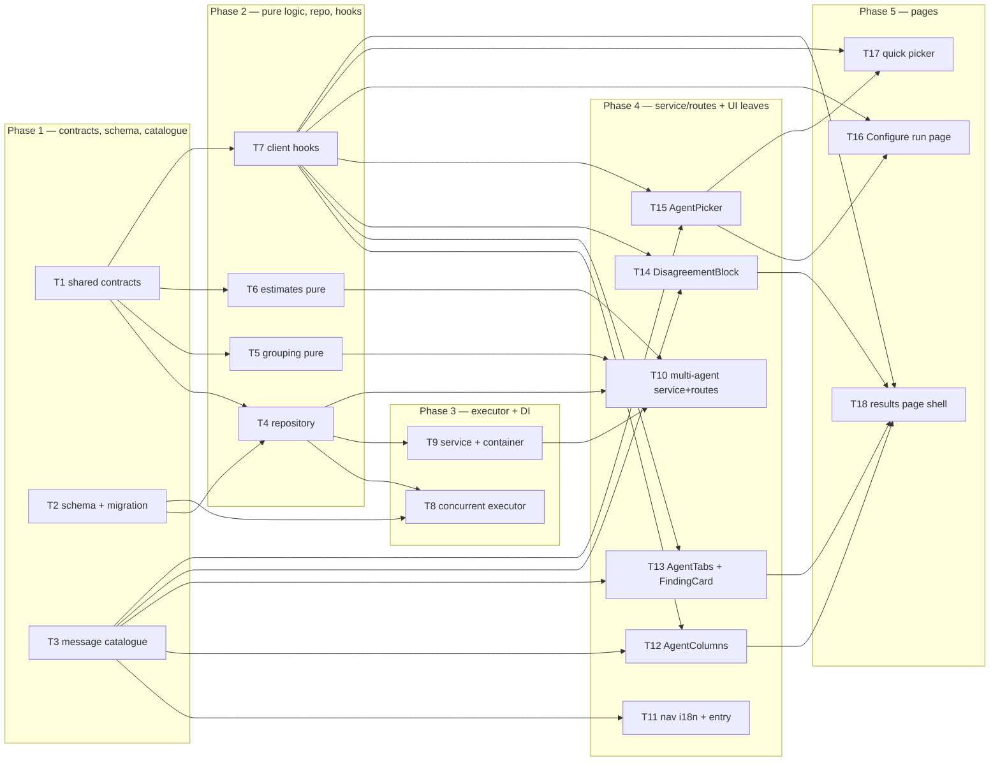

# Implementation Plan: Multi-Agent Review (Lab 7, worktree A)

## Overview
Give DevDigest a first-class concept of *a set of agents run together on one pull request*: an
explicit agent picker (quick picker on the PR page + a full Configure run page) with pre-run
duration/cost estimates, a persisted `multi_agent_runs` record that groups the agent runs it
spawned, a deterministic cross-agent location-group/conflict view, and one Multi-Agent Review
results page with Columns and Tabs modes. The run-executor also becomes genuinely concurrent.

Source of requirements: `specs/2026-08-27-multi-agent-review.md`
(SPEC-2026-08-27-multi-agent-review). This plan does not author or edit that spec.

## Execution mode
multi-agent (parallel) — the launching request explicitly asked for "owned paths that don't overlap
(so implementer-backend / implementer-ui instances can run in parallel)". `AskUserQuestion` is not
available in this runtime, so this is recorded as the mode the request stated rather than a mode
separately confirmed. Every task below carries non-overlapping `Owned paths`; the DAG is explicit.

## Requirements (verified)

Every AC in the spec is carried into exactly one R-item below. Spec `AC-N` ids are preserved
verbatim so `plan-verifier` and `test-writer` can follow the thread.

### Configure run page
- **R1 (covers AC-1, AC-11):** The Configure run page selects a pull request from the **active
  repository only**, and until one is selected the run action is disabled and the agent list is
  replaced by a "Pick a pull request first" placeholder.
- **R2 (covers AC-2):** With a PR selected, every agent in the active workspace renders as a
  checkbox card carrying name, icon, that agent's one-line summary from its most recent completed
  run **on that PR** (omitted when none), and a duration + cost estimate derived from that agent's
  recent completed runs **workspace-wide** (D-3).
- **R3 (covers AC-3, AC-4, AC-5):** "Select all" checks every listed agent; zero checked disables the
  run action; the run action's label always states the checked count.
- **R4 (covers AC-6, AC-7, AC-8, AC-9):** The aggregate pre-run estimate is `max` of the checked
  agents' duration estimates and `sum` of their cost estimates; an agent with no basis renders "—"
  and is excluded (never treated as zero); when any checked agent lacks an estimate the aggregate is
  marked a lower bound; a null cost renders "—" and **never** `$0.00`.
- **R5 (covers AC-10):** Submitting from the Configure run page starts exactly one multi-agent run
  containing exactly the checked agents, then navigates to that PR's results view.

### Quick picker on the PR detail page
- **R6 (covers AC-12, AC-13, AC-14, AC-15, AC-16):** "Run Review" on a PR detail page opens a
  checkbox row per workspace agent with that agent's duration estimate, a "Clear" action, a primary
  run action labelled with the checked count, and a link to the Configure run page. It **replaces**
  the old "run one agent / run all enabled agents" trigger entirely, issues the identical request
  shape and agent set the Configure page would, and on a merged/closed PR still permits the run
  behind a non-blocking warning.

### Multi-run grouping (persistence + read)
- **R7 (covers AC-17, AC-24):** Starting a multi-agent run persists one multi-run record scoped to
  the workspace and the PR, links every spawned agent run to it, and returns every spawned run id
  immediately, before any review completes.
- **R8 (covers AC-18, AC-19):** One read returns the latest multi-run for a PR — per-agent columns,
  cross-agent location groups, and totals — and answers **200 with an empty result**, never 404,
  when the PR has no multi-run yet.
- **R9 (covers AC-20, AC-21):** A PR or agent from another workspace is answered as not found and
  never disclosed; an empty, duplicate-carrying, or foreign agent set is rejected with a 4xx and
  creates **nothing** (no multi-run row, no agent run row).
- **R10 (covers AC-22):** The multi-run's total duration is the wall-clock span from the first
  spawned run's start to the last one's completion; its total cost is the sum of the spawned runs'
  costs, with an unpriced run yielding an **unknown** total, not a smaller number.
- **R11 (covers AC-23):** The multi-run start endpoint carries the same 10-requests-per-minute
  per-caller fence as the existing single-review trigger. *(Verification deviation — see
  Recommendations Rec-6: `@fastify/rate-limit` is not registered when `nodeEnv === 'test'`
  (`server/src/app.ts:95`, recorded in `server/insights/gotchas.md` 2026-08-09), so the spec's
  "the 11th call within a minute is rejected" is not observable under `app.inject`. The measurable
  substitute is in T10's Acceptance.)*

### Concurrent execution
- **R12 (covers AC-49):** The executor runs a multi-run's spawned agent runs concurrently, not
  sequentially, and a failure or rejection in one run never interrupts, cancels, or fails another
  run in the same multi-run (D-2).

### Cross-agent grouping and conflicts
- **R13 (covers AC-25, AC-26):** Two findings from *different* agents in the same multi-run group
  into one location group when they cite the same file and their line ranges intersect (inclusive);
  two findings from the *same* agent run never group with each other (D-4).
- **R14 (covers AC-27, AC-28):** Every location group carries one verdict entry per agent that
  completed **successfully** in the multi-run — a severity where it flagged, an explicit "did not
  flag" marker where it did not — and omits agents whose run failed or was cancelled entirely.
- **R15 (covers AC-50):** A "did not flag" entry carries a note **only** when that agent's run
  recorded a grounding-gate-rejected finding whose file and line range match the group's location,
  and then the note is that rejection's reason; otherwise the entry is note-less (D-1).
- **R16 (covers AC-30, AC-31):** The grouped output carries the originating agent id for every
  finding it contains, and is computed deterministically from persisted rows with **zero model
  calls and no new persisted table**.
- **R17 (covers AC-29):** "Show only conflicts" displays only groups whose verdicts diverge and
  hides groups where every participating agent flagged at the same severity.

### Results page
- **R18 (covers AC-32, AC-44, AC-46):** The results view offers exactly two modes — Columns and
  Tabs — preserves the selected mode across a reload of the same results view, renders the "Where
  agents disagree" block in **both** modes, and states in its header the agent count, total
  duration, total cost, and the pull request it belongs to.
- **R19 (covers AC-33, AC-34, AC-35, AC-37):** Columns mode renders one column per agent with name,
  score, duration, cost, findings as `title + file:line` cards, a findings count, and a trace link;
  an in-progress column shows a live running status off that run's existing event stream and reaches
  its terminal status without a manual reload; a failed column shows the recorded reason while every
  other column continues to its own terminal state; "View trace" opens the existing run-trace
  surface for that specific run id.
- **R20 (covers AC-36):** Mounting the results view mid-run restores each agent's status from the
  server and resumes the live feed from the stream's replay buffer without dropping pre-mount events.
- **R21 (covers AC-38):** When shared pre-work fails and therefore every spawned run fails with the
  same reason, the results view shows that reason **once** at the multi-run level, not repeated per
  column.
- **R22 (covers AC-39, AC-40, AC-41, AC-42, AC-43):** Tabs mode renders one tab per agent labelled
  name + score, an agent summary card (score, summary, duration, cost, trace link), and collapsible
  finding cards; expanding a finding shows severity, category, `file:line`, confidence, full
  description and suggested fix; accept/dismiss persists through the existing finding-action path
  and reflects the new state without a full reload; "Turn into eval case" goes through the existing
  eval-case-from-finding path and confirms; actions not implemented server-side render visibly
  unavailable and issue no request.
- **R23 (covers AC-45):** A completed multi-run with zero findings from every agent renders the
  "Where agents disagree" block's **empty state** rather than removing the block.

### Cross-cutting
- **R24 (covers AC-47):** Every user-facing string this feature introduces resolves through the
  existing `next-intl` catalogue; none is hard-coded in a component.
- **R25 (covers AC-48):** All agent-authored and third-party-authored text (finding titles,
  descriptions, suggested fixes, PR titles, file paths, location-group labels) renders as inert
  data — never as markup, never as instructions.

No AC is out of scope. All 50 ACs are carried above.

## Open questions & recommendations

`AskUserQuestion` is unavailable in this runtime, so each item below is recorded as an explicit
assumption with the resolution the plan adopts. Every one is verified against the code.

### Spec open questions Q5–Q9 — resolved

- **Q5 — "fan-out via worktrees" vs "fan-out via p-queue" → resolved: keep `p-queue`.**
  `p-queue` is already a `server/` dependency and is this repo's established bounded-concurrency
  primitive (`server/src/platform/jobs.ts:1`, `server/src/modules/repo-intel/pipeline/full.ts:25`).
  T8 implements AC-49 with `PQueue`, which makes the **existing** catalogue string
  `runs.page.meta` — `"{count} agents · fan-out via p-queue · {duration}s total · {cost}"` — honest
  as written. No copy change needed for the mechanism suffix. `runs.page.subtitle` and
  `runs.page.noAgents.body` still say "every enabled agent", which is now wrong (a picked subset) —
  T3 rewrites those two.
- **Q6 — zero-agents-in-workspace empty state → resolved: reuse `runs.page.noAgents`**
  ("Enable agents to run reviews" → "Go to Agents"), already in `client/messages/en/runs.json:133`.
- **Q7 — behaviour beyond ~5 agents → resolved:** horizontal scroll for Columns, a scrollable tab
  strip for Tabs, no column cap.
- **Q8 — where the Multi-Agent Review page lives → resolved: a global entry + a PR-scoped results
  route.** `/multi-agent` = the global Configure run page (PR picker inside);
  `/repos/:repoId/pulls/:number/multi-agent` = the results view. Verified: the client's existing
  active-nav rule already handles **both** — `activeKeyFor` returns `"multi-agent"` for any path
  containing `/multi-agent` (`client/src/components/app-shell/helpers.ts:28`), and its own test
  already asserts `/repos/abc/pulls/1/multi-agent` → `"multi-agent"`
  (`client/src/components/app-shell/helpers.test.ts:22`). No change to `activeKeyFor` is needed.
  Placing the results view as a **child route of the PR detail route** is also what makes the
  reuse the spec promises legal without moving files: `FindingCard`, `RunTraceDrawer` and
  `githubBlobUrl` are all colocated at `pulls/[number]/_components/`, the lowest common ancestor of
  both consumers.
- **Q9 — `contracts/observability.ts` is annotated "A5 owns this file" → resolved: edit it, additively
  where possible, in one task that touches both vendored copies.** Verified by grep: the
  `MultiAgentRun` / `AgentColumn` / `AgentColumnFinding` / `Conflict` / `ConflictTake` stubs have
  **zero consumers anywhere in the repo** — the only occurrences are the contract file itself and
  its client mirror. The two vendored copies are byte-identical today (`diff -rq` over
  `server/src/vendor/shared` vs `client/src/vendor/shared` reports only `eval-ci.ts` and
  `productionize.ts` as differing). T1 is the single task that owns both copies and must keep them
  identical.

### Contract gaps found against today's code — resolution per item

The spec lists 9. All are resolved below; the plan also found **two more** (10 and 11).

1. **`agent_runs` has no link to `multi_agent_runs`** — confirmed (`server/src/db/schema/runs.ts:19`
   has no such column; `multi_agent_runs` at `:58` holds only `id/workspace_id/pr_id/ran_at`).
   → **T2** adds `agent_runs.multi_run_id uuid` referencing `multi_agent_runs(id)`
   `ON DELETE SET NULL`, plus an index on it. Queryable in both directions (run → multi-run by
   column; multi-run → runs by the indexed FK).
2. **`MultiAgentRun` has no overall status** → **T1** adds
   `status: z.enum(['queued','running','complete'])`, derived server-side from the columns.
3. **`AgentColumn.status` is `done|failed|running`** → **T1** widens to
   `['queued','running','done','failed','cancelled']`. `agent_runs.status` really does produce
   `cancelled` (`run-executor.ts` catch block) and `running` at creation.
4. **`AgentColumnFinding` lacks `end_line`, `confidence`, `rationale`, `suggestion`** → **T1** adds
   all four, matching the `findings` table columns exactly
   (`server/src/db/schema/reviews.ts:47-59`) and `Finding` in `contracts/findings.ts:47`.
5. **`Conflict` carries a single `line`** → **T1** replaces `line` with `start_line` + `end_line`
   (the range the group covers). **Breaking edit to an existing exported symbol — zero consumers,
   called out here deliberately.**
6. **`ConflictTake.note` is required free text** → **T1** makes it `.nullish()` (D-1/AC-50).
   `ConflictTake.persona` is also renamed to `agent_name` to match the spec's "agent display name".
   **Breaking edit, zero consumers, called out.**
7. **`run-executor.executeRuns` iterates sequentially** — confirmed: the `for (const {agent, runId}
   of jobs)` loop at `server/src/modules/reviews/run-executor.ts:152` awaits each agent in turn.
   → **T8** replaces it with a `PQueue`-bounded concurrent fan-out preserving per-run failure
   isolation.
8. **`actOnFinding` rejects `learn`/`reply` with a 400** — confirmed
   (`server/src/modules/reviews/findings.ts` default branch), and in fact those routes are never
   registered at all (`reviews/routes.ts:33` — `FINDING_ACTIONS = ['accept','dismiss']`), so a call
   would 404. → **T13** renders them as disabled controls that issue no request (AC-43).
9. **Localisation strings assume the old shape** → **T3** rewrites `runs.page.subtitle`,
   `runs.page.noAgents.body`, `runs.page.runAll`, `runs.page.noRun.*` for a picked subset, keeps
   `runs.page.meta` (Q5), and removes the now-dead `prReview.runReview.runAll`.

**Gap 10 (found by this plan) — `AgentColumn` has no `error` field.** AC-37 ("its column shall show
a failed state carrying the recorded reason") and AC-38 both need it; `agent_runs.error` already
holds the text (`db/schema/runs.ts:40`). → **T1** adds `error: z.string().nullable()` to
`AgentColumn` and `shared_error: z.string().nullable()` to `MultiAgentRun` (set only when every
spawned run failed with the identical reason — AC-38's "once at the multi-run level").

**Gap 11 (found by this plan) — grounding-gate rejections are not persisted in any structured
form, so AC-50 is not implementable against today's data.** `reviewPullRequest` returns
`dropped: {finding, reason}[]` (`reviewer-core/src/review/run.ts:116`) and the executor receives it,
but the only trace of it is a free-text log line (`grounding dropped "<title>": <reason>`,
`reviewer-core/src/review/run.ts:219`) landing in `run_traces.trace.log` as
`{t, kind, msg}` — no file, no line range, not parseable safely.
→ **T2** adds a nullable `agent_runs.grounding_rejected jsonb` column typed
`{file, start_line, end_line, title, reason}[]`; **T8** populates it from `outcome.dropped` on the
success path. AC-31's "no new persisted table" is honoured — this is a column on an existing table,
not a table. Reading it off `agent_runs` (rather than parsing `run_traces`, which carries
`prompt_assembly` + `raw_output` and would be far heavier) is what keeps the grouped read inside
its p95 < 500 ms budget for ≤ 8 agents.

### Recommendations

- **Rec-1 — Extend `AgentColumnFinding` with `review_id`, `accepted_at`, `dismissed_at` as well.**
  The spec's per-column finding contract omits them, but AC-41 ("reflect the finding's new state
  without a full page reload") only survives a reload if the read carries the persisted decision.
  Adding them also makes `AgentColumnFinding` structurally assignable to `FindingRecord`
  (`contracts/review-api.ts:15`), so Tabs mode can reuse the existing `FindingCard` verbatim
  instead of re-implementing AC-40's six fields. Adopted by T1.
- **Rec-2 — Reconcile AC-9 with D-3.** AC-9 is phrased against "an agent's **most recent** completed
  run recorded a null cost", while D-3 makes the estimate an aggregate over the last N completed
  runs. The plan aggregates over the window's **non-null** costs and yields `null` when the window
  contains no priced run; the client then renders "—". AC-9's own observable (a fixture with
  `cost_usd: null` must not render `$0.00`) is satisfied unchanged. Adopted by T6/T15.
- **Rec-3 — Fix N = 10.** D-3 leaves the run-history window to the planner.
  `ESTIMATE_RUN_WINDOW = 10` (last 10 completed runs per agent, workspace-wide), a named constant in
  `server/src/modules/multi-agent/constants.ts`. Rationale: large enough to smooth one slow run,
  small enough that a model change shows up within a working session.
- **Rec-4 — Bound the new concurrency.** Unbounded `Promise.all` over 12 agents would fan 12
  simultaneous provider calls out of one button press. Use `PQueue` with
  `REVIEW_RUN_CONCURRENCY` (new `platform/config.ts` entry, default `4`). AC-49's "~t not ~N·t"
  observable still holds for the test's N ≤ 4.
- **Rec-5 — Make the sidebar nav labels translatable rather than adding one more hard-coded one.**
  `client/src/vendor/ui/nav.ts` hard-codes every label and `Sidebar`/`NavItem` render `item.label`
  directly, while `client/messages/en/shell.json:17-28` already carries a full `nav.*` catalogue
  **including `nav.multi-agent`** that nothing reads. Adding a raw English "Multi-Agent Review"
  label would violate AC-47 for a string this feature introduces. T11 threads an optional
  `navLabel?: (key, fallback) => string` through `ShellContext` and supplies `t("nav." + key)` from
  `useShellContext`. Deliberately **no** `gKey` / `SHORTCUTS` entry for the new item — `SHORTCUTS`
  labels are hard-coded too, and no AC asks for a chord.
- **Rec-6 — AC-23's stated observable is not achievable; substitute a structural check.**
  `server/src/app.ts:95` skips registering `@fastify/rate-limit` entirely when
  `config.nodeEnv === 'test'`, so no `app.inject`-driven test can ever observe a 429. T10 extracts
  the literal into `server/src/modules/_shared/rate-limits.ts` as
  `RUN_TRIGGER_RATE_LIMIT = { max: 10, timeWindow: '1 minute' }`, uses it on **both**
  `POST /pulls/:id/review` and the new start route, and proves AC-23 by asserting the constant's
  value plus that both route files reference it. This is strictly stronger than the current state,
  where the two limits could drift silently.
- **Rec-7 — Do not move `FindingCard`.** Placing the results view at
  `pulls/[number]/multi-agent/` makes `pulls/[number]/_components/` its lowest common ancestor, so
  the existing colocation is already correct (frontend-architecture: promote only to the lowest
  common level). Moving it would churn four files and three sibling test files for nothing.
- **Rec-8 — No browser e2e change.** Verified: no flow spec in `e2e/specs/` touches "Run Review",
  "Run all", or the multi-agent surface, so replacing the dropdown breaks no seeded journey.
  `./scripts/e2e.sh` is not part of this plan's gate.

## Affected modules & contracts

- **`@devdigest/shared`** — `contracts/observability.ts` extended (see gaps 2–6, 10 and Rec-1) and
  given three new schemas: `MultiAgentRunRequest`, `MultiAgentRunStartResponse`, `AgentRunEstimate`
  / `PrAgentEstimates`. **Both vendored copies** (`server/src/vendor/shared/contracts/` — canonical —
  and `client/src/vendor/shared/contracts/`) are edited in the same task and must stay identical.
- **`server/` — db** — `agent_runs` gains `multi_run_id` and `grounding_rejected`; one generated
  Drizzle migration.
- **`server/` — `modules/reviews`** — repository gains the multi-run write + read queries (it is the
  file that owns `agent_runs` / `reviews` / `findings`); `run-executor.ts` becomes concurrent and
  persists grounding rejections; `service.ts` threads a `multiRunId` through `runReview`.
- **`server/` — `modules/multi-agent` (new)** — `routes.ts`, `service.ts`, `grouping.ts` (pure),
  `estimates.ts` (pure), `constants.ts`. Registered in `modules/index.ts`.
- **`server/` — `platform`** — `container.ts` gains a `reviews: ReviewService` getter + override slot
  (so the new module reaches the executor through the container, not by importing a sibling
  module's internals); `config.ts` gains `REVIEW_RUN_CONCURRENCY`.
- **`client/`** — new global route `/multi-agent`; new PR-scoped route
  `/repos/[repoId]/pulls/[number]/multi-agent`; a shared `AgentPicker`; new hooks in
  `lib/hooks/multi-agent.ts`; catalogue edits in `messages/en/{runs,prReview,shell}.json`;
  `RunReviewDropdown` replaced; `FindingCard` gains one optional prop; `vendor/ui/nav.ts` + shell
  nav-label plumbing.
- **`reviewer-core/`** — **unchanged** (spec non-goal). `outcome.dropped` is already exposed; nothing
  in the engine is edited.
- **`ci/`, `agent-runner/`, `evals/`, `e2e/`, `mcp-server/`** — untouched.

## Architecture changes

- **New port-free feature module** at `server/src/modules/multi-agent/` (Application + Transport
  only). It owns **no table**: every DB access goes through `container.reviewRepo` /
  `container.agentsRepo`, honouring the "one file owns this table" rule — `agent_runs`,
  `reviews`, `findings` and `multi_agent_runs` all stay behind
  `server/src/modules/reviews/repository/{run,review}.repo.ts`.
- **New composition-root binding** `Container.reviews: ReviewService` (+
  `ContainerOverrides.reviews`) at `server/src/platform/container.ts`, mirroring the existing
  `onboarding` / `projectContext` getters. This is what keeps
  `modules/multi-agent/service.ts → modules/reviews/*` off the module→module drift list.
- **Pure domain logic** — `modules/multi-agent/grouping.ts` and `modules/multi-agent/estimates.ts`
  are pure functions over already-fetched rows: no `container`, no `db`, no I/O. That is what makes
  AC-31's "zero model calls" and AC-6/AC-7/AC-22's aggregation unit-testable without Docker.
- **Client route boundary** — `/multi-agent/page.tsx` and
  `/repos/[repoId]/pulls/[number]/multi-agent/page.tsx` stay thin RSC-free `"use client"` entries
  delegating to colocated `_components/`; the shared `AgentPicker` is promoted to
  `client/src/components/multi-agent/` because it genuinely has two consumers (AC-15 requires both
  surfaces to issue the identical request).



## Phased tasks

### Phase 1 — Contracts, schema, catalogue

- **T1**
  - **Action:** Extend `contracts/observability.ts` for the multi-agent read surface and add the
    start-request / estimate contracts. Concretely: `AgentColumnFinding` gains `end_line:
    z.number().int()`, `confidence: z.number().min(0).max(1)`, `rationale: z.string()`, `suggestion:
    z.string().nullish()`, `review_id: z.string()`, `accepted_at: z.string().nullable()`,
    `dismissed_at: z.string().nullable()` (gap 4 + Rec-1; keep `category: z.string()` unnarrowed so
    it stays assignable to `FindingRecord`'s consumers). `AgentColumn.status` widens to
    `z.enum(['queued','running','done','failed','cancelled'])` (gap 3) and gains `error:
    z.string().nullable()` (gap 10). `Conflict` replaces `line` with `start_line` + `end_line`
    (gap 5). `ConflictTake` renames `persona` → `agent_name` and makes `note` `.nullish()`
    (gap 6, D-1). `MultiAgentRun` gains `status: z.enum(['queued','running','complete'])` (gap 2),
    `shared_error: z.string().nullable()` (gap 10), and `total_duration_ms` becomes
    `z.number().int().nullable()` (AC-22). Add new: `MultiAgentRunRequest = z.object({ agent_ids:
    z.array(z.string().uuid()).min(1).refine(a => new Set(a).size === a.length, 'duplicate agent
    id') })`; `MultiAgentRunStartResponse = z.object({ multi_run_id, pr_id, runs:
    z.array(ReviewRunTarget-shaped {run_id, agent_id, agent_name}) })`; `AgentRunEstimate =
    z.object({ agent_id, agent_name, est_duration_ms: z.number().int().nullable(), est_cost_usd:
    z.number().nullable(), runs_sampled: z.number().int(), last_summary: z.string().nullable() })`;
    `PrAgentEstimates = z.object({ pr_id, agents: z.array(AgentRunEstimate) })`. Apply the **exact
    same edit to both vendored copies** and leave them byte-identical.
  - **Module:** server (shared contracts)
  - **Agent:** implementer-backend
  - **Skills to use:** zod · typescript-expert · onion-architecture · engineering-insights
  - **Owned paths:** `server/src/vendor/shared/contracts/observability.ts`,
    `client/src/vendor/shared/contracts/observability.ts`, `server/test/multi-agent-contracts.test.ts`
  - **Depends-on:** none
  - **Risk:** medium (breaking edits to two existing exported symbols — see Risks)
  - **Known gotchas:** NEVER add a Zod `.default(...)` to these contracts — zod v3's `.default` keeps
    the field **required** in `z.infer`, which breaks every hand-built object literal across
    packages (`server/insights/gotchas.md` 2026-08-19, three client test files broken that way).
    Use `.nullish()` for anything a fixture may omit (`server/insights/gotchas.md` 2026-08-20).
    The two vendored copies are byte-identical today — verify with
    `diff server/src/vendor/shared/contracts/observability.ts client/src/vendor/shared/contracts/observability.ts`.
  - **Acceptance:** `server/test/multi-agent-contracts.test.ts` parses a full `MultiAgentRun`
    fixture (running + complete, a failed column with an `error`, a range-based `Conflict`, a
    note-less and a noted `ConflictTake`), asserts `MultiAgentRunRequest.safeParse({agent_ids:[]})`
    and `...({agent_ids:[X,X]})` both fail while `...({agent_ids:[X,Y]})` succeeds, and asserts an
    `AgentColumnFinding` literal is assignable where a `FindingRecord` is expected.
    `diff server/src/vendor/shared/contracts/observability.ts client/src/vendor/shared/contracts/observability.ts`
    exits 0. `cd server && pnpm exec vitest related --run src/vendor/shared/contracts/observability.ts --exclude '**/*.it.test.ts' --reporter=dot` is green.
    **→ satisfies no AC — enabling work for AC-18, AC-21, AC-27, AC-30, AC-37, AC-38, AC-40, AC-50**

- **T2**
  - **Action:** Add two nullable columns to `agent_runs`: `multiRunId: uuid('multi_run_id')
    .references(() => multiAgentRuns.id, { onDelete: 'set null' })` and `groundingRejected:
    jsonb('grounding_rejected').$type<{file: string; start_line: number; end_line: number; title:
    string; reason: string}[]>()`. Add `index('agent_runs_multi_run_id_idx').on(t.multiRunId)` and
    `index('agent_runs_pr_status_idx').on(t.prId, t.status)` (the estimate + column reads both
    filter on those). Add `index('multi_agent_runs_pr_ran_at_idx').on(t.prId, t.ranAt)` for
    "latest multi-run for a PR". Then `pnpm db:generate` and commit the produced SQL + snapshot +
    journal entry. Do **not** run `db:migrate` against a shared DB as part of the task; note it in
    the report.
  - **Module:** server
  - **Agent:** implementer-backend
  - **Skills to use:** drizzle-orm-patterns · **postgresql-table-design** · typescript-expert ·
    engineering-insights
  - **Owned paths:** `server/src/db/schema/runs.ts`, `server/src/db/migrations/**` (generated only)
  - **Depends-on:** none
  - **Risk:** medium
  - **Known gotchas:** **Migrations never run on boot** — `cd server && pnpm db:migrate` is manual
    (root `CLAUDE.md`). Postgres does **not** auto-index FK columns — the explicit
    `agent_runs_multi_run_id_idx` is required, not optional (`postgresql-table-design`). NEVER
    regenerate an already-applied migration: `drizzle-orm/postgres-js/migrator` decides purely by
    the journal `when` timestamp, so a regenerated entry re-runs and fails with "column already
    exists" (`server/insights/gotchas.md` 2026-08-07). `ON DELETE SET NULL` (not `CASCADE`) is
    deliberate — deleting a multi-run must never delete the agent runs' history.
  - **Acceptance:** `cd server && pnpm db:generate` produces exactly one new
    `migrations/00NN_*.sql` whose text contains `ADD COLUMN "multi_run_id"`,
    `ADD COLUMN "grounding_rejected"` and all three `CREATE INDEX` statements;
    `cd server && pnpm typecheck` passes; `grep -c "multi_run_id" server/src/db/schema/runs.ts`
    ≥ 1.
    **→ satisfies no AC — enabling work for AC-17, AC-50**

- **T3**
  - **Action:** Own every catalogue change this feature needs, so no UI task has to touch a JSON
    file. In `client/messages/en/runs.json` under `page`: rewrite `subtitle` and `noAgents.body` for
    a picked subset (drop "every enabled agent"), replace `runAll` with `run` (`"Run multi-agent
    review ({count})"`), rewrite `noRun.bodyReady`/`noRun.cta` for the picker, **keep `meta`
    unchanged** (Q5), and add: `configure.*` (title, pickPr, pickPrPlaceholder, selectAll, clear,
    estimateDuration, estimateCost, estimateNone, aggregate, aggregateAtLeast, noSummary,
    submit), `results.*` (modeColumns, modeTabs, header, findingsCount, viewTrace, statusQueued /
    Running / Done / Failed / Cancelled, sharedError, columnError), `disagree.*` (title,
    onlyConflicts, didNotFlag, emptyTitle, emptyBody, rangeLabel). In
    `client/messages/en/prReview.json` under `runReview`: **remove** the now-dead `runAll`, add
    `picker.*` (title, clear, run, estimate, estimateNone, configureLink, noAgents); under
    `finding`: add `learn`, `reply`, `actionUnavailable`. In `client/messages/en/shell.json` under
    `nav`: add `"settings": "Settings"` (every other NAV key is already present, incl.
    `multi-agent`).
  - **Module:** client
  - **Agent:** implementer-ui
  - **Skills to use:** next-best-practices · frontend-architecture · engineering-insights
  - **Owned paths:** `client/messages/en/runs.json`, `client/messages/en/prReview.json`,
    `client/messages/en/shell.json`
  - **Depends-on:** none
  - **Risk:** low
  - **Known gotchas:** A catalogue file's own top level is **unprefixed** — `runs.json`'s top level
    is `page`, `severity`, … and a component does `useTranslations("runs")` then `t("page.title")`,
    never `t("runs.page.title")` (`client/insights/INSIGHTS.md` 2026-08-20). A new catalogue file
    needs no registration; only a new locale directory would.
  - **Acceptance:** `cd client && node -e "for (const f of ['runs','prReview','shell'])
    JSON.parse(require('fs').readFileSync('messages/en/'+f+'.json','utf8'))"` exits 0;
    `grep -c "fan-out via p-queue" client/messages/en/runs.json` is 1 (Q5 — the mechanism string is
    preserved, not invented); `grep -c "every enabled agent" client/messages/en/runs.json` is 0;
    `grep -c '"runAll"' client/messages/en/prReview.json` is 0; every key named in this task's
    Action resolves via `node -e` dotted lookup.
    **→ satisfies AC-47** (each UI task below re-verifies the no-literal grep over its own files)

### Phase 2 — Repository, pure logic, client data layer

- **T4**
  - **Action:** Add every DB access this feature needs to the module that owns those tables.
    In `server/src/modules/reviews/repository/run.repo.ts`: `createAgentRun` gains an optional
    `multiRunId?: string | null`; `completeAgentRun` gains an optional `groundingRejected?:
    {file,start_line,end_line,title,reason}[] | null`; add `createMultiAgentRun({workspaceId,
    prId})` → id; `latestMultiRunForPull(workspaceId, prId)` (join `pull_requests` for the
    workspace check — return `undefined` for a foreign workspace, never throw);
    `runsForMultiRun(multiRunId)` returning `agent_runs` rows joined to `agents.name` and carrying
    `groundingRejected`; `recentCompletedRunStats(workspaceId, agentIds, limit)` returning per-agent
    the last `limit` completed runs' `durationMs` + `costUsd` (workspace-wide, `status='done'`,
    D-3); `latestCompletedSummaryForPull(workspaceId, prId, agentIds)` returning per-agent the most
    recent completed run's review summary on **that** PR. In
    `server/src/modules/reviews/repository/review.repo.ts`: `reviewsWithFindingsForRunIds(runIds)`.
    Expose all of them on the `ReviewRepository` facade.
  - **Module:** server
  - **Agent:** implementer-backend
  - **Skills to use:** drizzle-orm-patterns · **postgresql-table-design** · onion-architecture ·
    typescript-expert · **security** · engineering-insights
  - **Owned paths:** `server/src/modules/reviews/repository/run.repo.ts`,
    `server/src/modules/reviews/repository/review.repo.ts`,
    `server/src/modules/reviews/repository.ts`
  - **Depends-on:** T1, T2
  - **Risk:** medium
  - **Known gotchas:** Workspace scoping is the security boundary here (AC-20): `multi_agent_runs`
    has its own `workspace_id`, but every read that starts from a `prId` must still be joined
    workspace-scoped — the codebase's own precedent for exactly this trap is `pr_intent`, which has
    no `workspace_id` and forced `getIntentDetail`'s join (`reviews/repository.ts` doc comment).
    NEVER interpolate a `Date` into a raw `sql\`\`` template — use `gte`/`lt`/`eq`, or you get
    `The "string" argument must be of type string ... Received an instance of Date` surfacing as a
    bare 500 (`server/insights/gotchas.md` 2026-08-05). drizzle-orm 0.38.3's `pg-core` exports no
    `union` combinator; a genuine `UNION` needs `db.execute()` with a raw `sql` template
    (`server/insights/gotchas.md` 2026-08-18). `db/schema` stays confined to repository files
    (`onion-architecture`).
  - **Acceptance:** `server/test/multi-agent-repository.it.test.ts` (DB-backed, `.it.test.ts` suffix
    is mandatory for anything importing `test/helpers/pg.ts`) proves: a created multi-run + three
    linked agent runs resolve in both directions; `latestMultiRunForPull` returns `undefined` for a
    PR in another workspace; `recentCompletedRunStats` returns at most `limit` rows per agent,
    workspace-wide, excluding non-`done` runs; `latestCompletedSummaryForPull` returns `null` for an
    agent with workspace history but no completed run on that PR.
    `cd server && pnpm exec vitest run multi-agent-repository --reporter=dot` is green.
    **→ satisfies no AC — enabling work for AC-17, AC-18, AC-20, AC-22, AC-50**

- **T5**
  - **Action:** Write the pure cross-agent grouper at
    `server/src/modules/multi-agent/grouping.ts`, exporting
    `buildLocationGroups(input: { columns: {agent_id, agent_name, status, findings}[]; rejections:
    Map<string, {file,start_line,end_line,reason}[]> }): Conflict[]`. Rules, in order: consider only
    columns with `status === 'done'` (AC-27, AC-28). Seed one candidate group per finding; merge two
    candidates only when their files are equal **and** their inclusive `[start_line, end_line]`
    ranges intersect **and** they come from different `agent_id`s (AC-25, AC-26) — a same-agent pair
    never merges, and a same-agent finding never contributes a second verdict entry to one group.
    A group's range is the union of its members' ranges; its `title` is the title of its
    lowest-`agent_name`, lowest-`start_line` member (deterministic; untrusted text, see AC-48).
    For each group emit one `ConflictTake` per **done** agent: `verdict` = that agent's severity
    when it has a member finding (worst severity wins if it has several), else `'ignored'`;
    `note` = for an `'ignored'` take only, the `reason` of that agent's rejection whose file matches
    and whose range intersects the group's range, else `null` (AC-50). Sort groups by
    `(file, start_line, end_line)` and takes by `agent_name` so output is byte-stable. Zero I/O, no
    `container`, no `db`, no LLM.
  - **Module:** server
  - **Agent:** implementer-backend
  - **Skills to use:** typescript-expert · zod · onion-architecture · engineering-insights
  - **Owned paths:** `server/src/modules/multi-agent/grouping.ts`,
    `server/test/multi-agent-grouping.test.ts`
  - **Depends-on:** T1
  - **Risk:** medium
  - **Known gotchas:** `Finding.severity` is `CRITICAL | WARNING | SUGGESTION`, **not**
    critical/high/medium/low — a `Record<string, number>` rank table keyed on the lowercase tiers
    typechecks fine and silently ranks everything equal; type it
    `Record<Conflict['takes'][number]['verdict'], number>` so a wrong key is a compile error
    (`server/insights/gotchas.md` 2026-08-21). `tsconfig` has `noUncheckedIndexedAccess: true`, so
    `arr[i]` is `T | undefined` — guard before assigning (`client/insights/gotchas.md` 2026-08-04,
    same setting server-side). Transitive merging matters: `a.ts:10-14`, `a.ts:12-20`, `a.ts:18-25`
    from three agents form ONE group; write the merge as a union-find / interval sweep, not a
    single pairwise pass.
  - **Acceptance:** `server/test/multi-agent-grouping.test.ts` proves, with no mock LLM constructed
    at all: `a.ts:10-14` (agent A) and `a.ts:12-20` (agent B) group; `a.ts:10-14` and `a.ts:30` do
    not; `a.ts:10` and `b.ts:10` do not **(AC-25)**; two agent-A findings at the same line stay two
    entries and never yield a group with a duplicated agent **(AC-26)**; a 4-done-agent multi-run
    where one agent flags produces one group with 4 takes, 3 of them `'ignored'` **(AC-27)**; a
    `failed` and a `cancelled` column contribute no take to any group **(AC-28)**; every take and
    every finding carries exactly one `agent_id` **(AC-30)**; a rejection at the grouped location
    yields a take whose `note` is that rejection's reason while a rejection at a different location
    yields `note: null` **(AC-50)**; and the function's module imports contain no `container`, `db`,
    or `llm` (`grep -Eqc "container|drizzle|llm" server/src/modules/multi-agent/grouping.ts` is 0)
    **(AC-31, structural half)**.
    **→ satisfies AC-25, AC-26, AC-27, AC-28, AC-30, AC-50** (and the pure half of AC-31)

- **T6**
  - **Action:** Write the pure aggregations at `server/src/modules/multi-agent/estimates.ts` plus
    `server/src/modules/multi-agent/constants.ts` (`export const ESTIMATE_RUN_WINDOW = 10;` — Rec-3).
    Export `estimateForAgent(samples: {durationMs: number|null; costUsd: number|null}[]):
    {est_duration_ms: number|null; est_cost_usd: number|null; runs_sampled: number}` — arithmetic
    mean over the **non-null** values of each field independently, `null` when that field has no
    non-null sample (AC-7, Rec-2); never `0` as a stand-in. Export
    `aggregateEstimate(estimates: {est_duration_ms: number|null; est_cost_usd: number|null}[]):
    {duration_ms: number|null; cost_usd: number|null; incomplete: boolean}` — duration = **max**,
    cost = **sum**, both over entries that have a value; `incomplete` true when any input entry
    lacks either (AC-6, AC-8). Export `multiRunTotals(runs: {ranAt: Date; durationMs: number|null;
    costUsd: number|null; status: string}[]): {total_duration_ms: number|null; total_cost_usd:
    number|null}` — duration = `max(ranAt + durationMs) − min(ranAt)`, `null` while any run is
    non-terminal; cost = sum, **`null` when any terminal run has a null cost** (AC-22).
  - **Module:** server
  - **Agent:** implementer-backend
  - **Skills to use:** typescript-expert · onion-architecture · engineering-insights
  - **Owned paths:** `server/src/modules/multi-agent/estimates.ts`,
    `server/src/modules/multi-agent/constants.ts`, `server/test/multi-agent-estimates.test.ts`
  - **Depends-on:** T1
  - **Risk:** low
  - **Known gotchas:** `MockLLMProvider` reports a fixed `costUsd: 0.001` on every call
    (`server/insights/gotchas.md` 2026-08-21) — use distinctive fixture numbers (e.g. 777) so a test
    can never pass by coincidence. `null` is load-bearing throughout: a run that failed has
    `costUsd: null` by design (`run-executor.ts` writes it explicitly rather than `0`), and folding
    it in as zero is exactly the bug AC-22 forbids.
  - **Acceptance:** `server/test/multi-agent-estimates.test.ts` proves `aggregateEstimate` over
    durations `{8200, 7400, 6900, 7100}` ms and costs `{.06,.05,.04,.05}` returns `8200` ms /
    `0.20` **(AC-6)**; an agent with zero samples contributes nothing to either max or sum and
    reports `est_duration_ms: null, est_cost_usd: null, runs_sampled: 0` **(AC-7)**; one
    estimate-less entry sets `incomplete: true` **(AC-8, server half)**; `multiRunTotals` over runs
    where one has `costUsd: null` returns `total_cost_usd: null`, not a smaller number, and
    duration is the span not the sum **(AC-22)**.
    `cd server && pnpm exec vitest run multi-agent-estimates --reporter=dot` is green.
    **→ satisfies AC-6, AC-7, AC-22**

- **T7**
  - **Action:** Add `client/src/lib/hooks/multi-agent.ts` with three hooks and re-export it from the
    barrel: `useMultiAgentRun(prId)` — `api.get<MultiAgentRun | null>('/pulls/{prId}/multi-agent')`,
    query key `["multi-agent-run", prId]`, `refetchInterval` 4000 while
    `data?.status === 'running'` and `false` otherwise (mirrors `usePrRuns`'s existing self-clearing
    poll); `useAgentEstimates(prId)` — `api.get<PrAgentEstimates>('/pulls/{prId}/agent-estimates')`,
    key `["agent-estimates", prId]`, `enabled: prId != null`; `useStartMultiAgentRun()` —
    `api.post<MultiAgentRunStartResponse>('/pulls/{prId}/multi-agent-run', { agent_ids })`,
    invalidating `["multi-agent-run", prId]`, `["pr-active-runs", prId]` and `["pr-runs", prId]`
    on success. This one mutation is what makes AC-15's "both surfaces issue the same request"
    structurally true rather than a coincidence.
  - **Module:** client
  - **Agent:** implementer-ui
  - **Skills to use:** react-best-practices · next-best-practices · frontend-architecture ·
    typescript-expert · engineering-insights
  - **Owned paths:** `client/src/lib/hooks/multi-agent.ts`, `client/src/lib/hooks/index.ts`
  - **Depends-on:** T1
  - **Risk:** low
  - **Known gotchas:** Use `import type { ... } from "@devdigest/shared"` — the FIRST **runtime**
    (value) import from the vendored barrel in a client module broke `next dev` with
    `Module not found: Can't resolve './contracts/….js'` while typecheck and vitest stayed green
    (`client/insights/gotchas.md` 2026-08-24). All server data goes through `lib/api.ts`; never
    `fetch` from a component (`client/CLAUDE.md`).
  - **Acceptance:** `cd client && pnpm typecheck` passes;
    `grep -c "api\\.\\(get\\|post\\)" client/src/lib/hooks/multi-agent.ts` is 3;
    `grep -c "^export \\* from \"./multi-agent\"" client/src/lib/hooks/index.ts` is 1;
    `grep -c "fetch(" client/src/lib/hooks/multi-agent.ts` is 0.
    **→ satisfies no AC — enabling work for AC-10, AC-15, AC-34, AC-36**

### Phase 3 — Concurrent executor + DI

- **T8**
  - **Action:** Two changes to `server/src/modules/reviews/run-executor.ts`. **(a) Concurrency
    (AC-49):** replace the sequential `for (const {agent, runId} of jobs) { ... await
    this.runOneAgent(...) ... }` at line 152 with a `PQueue`-bounded fan-out —
    `const q = new PQueue({ concurrency: this.container.config.reviewRunConcurrency });` then
    `await Promise.all(jobs.map(j => q.add(() => this.runOneAgentIsolated(j))))` where the wrapper
    keeps today's per-job `try/catch` **inside** the queued function, so a throw is logged and
    swallowed there and can never reject a sibling. Keep the post-loop
    `summarizeChangedFilesForRun` step exactly where it is (after every run settles). Nothing else
    about `runOneAgent` changes — it already narrows the shared logger with
    `parentLog.forRun(runId)`, so per-run SSE streams stay separate under concurrency.
    **(b) Grounding rejections (gap 11, enabling AC-50):** on the success path, map
    `outcome.dropped` (already returned by `reviewPullRequest`,
    `reviewer-core/src/review/run.ts:116`) to `{file, start_line, end_line, title, reason}[]` and
    pass it to `completeAgentRun` as `groundingRejected`. Do **not** touch `reviewer-core`.
    Add `reviewRunConcurrency` to `server/src/platform/config.ts` from
    `REVIEW_RUN_CONCURRENCY`, default `4` (Rec-4).
  - **Module:** server
  - **Agent:** implementer-backend
  - **Skills to use:** fastify-best-practices · onion-architecture · typescript-expert ·
    drizzle-orm-patterns · engineering-insights
  - **Owned paths:** `server/src/modules/reviews/run-executor.ts`, `server/src/platform/config.ts`,
    `server/test/run-executor-concurrency.it.test.ts`
  - **Depends-on:** T2, T4
  - **Risk:** high (this changes the execution shape of every existing review run, not just
    multi-agent ones)
  - **Known gotchas:** `p-queue` is already a `server/` dependency with two in-repo precedents —
    `platform/jobs.ts:40` (`new PQueue({ concurrency: opts.concurrency ?? 3 })`) and
    `repo-intel/pipeline/full.ts:127`. Follow them; do **not** add a new dependency (this also keeps
    the `runs.page.meta` "fan-out via p-queue" string honest — Q5). `q.add()` on some p-queue
    versions resolves `T | void`; do not rely on its return value. A `timeoutMs` passed to
    `completeStructured` bounds ONE provider attempt, so `(maxRetries+1) × timeoutMs` is the real
    wall budget — raising concurrency raises simultaneous provider load, which is why the limit is
    a config knob, not `Infinity` (`server/insights/gotchas.md` 2026-08-20). The **only** test that
    catches a concurrency-ordering regression is a real one: a `SlowLLM extends MockLLMProvider`
    with a real `setTimeout` inside `completeStructured`, never `vi.useFakeTimers()` — the exact
    technique `server/test/reviews.it.test.ts` already uses
    (`server/insights/gotchas.md` 2026-08-21).
  - **Acceptance:** `server/test/run-executor-concurrency.it.test.ts` proves: with 4 stubbed agents
    whose `completeStructured` each sleeps ~400 ms, `executeRuns` completes in well under
    `4 × 400 ms` (assert `< 900 ms`) and all 4 `agent_runs` rows reach `status='done'`; with one
    agent whose provider throws, that run persists `status='failed'` **with its error text** while
    the other three still reach `done` **(AC-49)**; and a run whose model returns a finding citing a
    line outside every diff hunk persists a non-empty `agent_runs.grounding_rejected` array carrying
    that finding's file, range and the gate's reason (persistence half of AC-50).
    `cd server && pnpm exec vitest run run-executor-concurrency --reporter=dot` is green, and
    `cd server && pnpm exec vitest run reviews.it --reporter=dot` (the pre-existing run-lifecycle
    suite) stays green.
    **→ satisfies AC-49** (and the persistence half of AC-50, whose grouping half is T5's)

- **T9**
  - **Action:** Thread the multi-run link through the application layer and give the new module a
    composition-root door. In `server/src/modules/reviews/service.ts`: `runReview` gains an optional
    `opts?: { multiRunId?: string }` and passes `multiRunId` into each `this.repo.createAgentRun({
    ... })` call, so every spawned row is linked **at creation** (AC-17) rather than patched
    afterwards. In `server/src/platform/container.ts`: add a lazy
    `get reviews(): ReviewService` getter with a `ContainerOverrides.reviews` slot, mirroring the
    existing `onboarding` / `projectContext` getters.
  - **Module:** server
  - **Agent:** implementer-backend
  - **Skills to use:** onion-architecture · fastify-best-practices · typescript-expert ·
    engineering-insights
  - **Owned paths:** `server/src/modules/reviews/service.ts`, `server/src/platform/container.ts`
  - **Depends-on:** T4
  - **Risk:** medium
  - **Known gotchas:** Do **not** construct the getter's service eagerly or call anything on it at
    plugin-registration time — a getter whose method fires at boot breaks every test that supplies a
    partial `as unknown as X` override (`server/insights/gotchas.md` 2026-08-20, the
    `registerJobHandlers` incident took out an entire route test file). Also: adding a call the
    service makes on a container member breaks sibling tests that override it with a partial object
    literal — before finishing, `grep -rn "unknown as ReviewService\|ContainerOverrides" server/test`
    and add the missing members to any override you break. `ReviewService` assigns `this.repo` in
    the **constructor body**, not as a field initializer — keep it that way or you get
    `TS2729: Property 'container' is used before its initialization`
    (`server/insights/gotchas.md` 2026-08-07).
  - **Acceptance:** `cd server && pnpm typecheck` passes;
    `grep -c "multiRunId" server/src/modules/reviews/service.ts` ≥ 1;
    `grep -c "get reviews()" server/src/platform/container.ts` is 1;
    `cd server && pnpm exec vitest related --run src/platform/container.ts src/modules/reviews/service.ts --exclude '**/*.it.test.ts' --reporter=dot`
    is green.
    **→ satisfies no AC — enabling work for AC-17**

### Phase 4 — Multi-agent service/routes + UI leaf components

- **T10**
  - **Action:** Build the new module's application + transport layers.
    `server/src/modules/multi-agent/service.ts`:
    `start(workspaceId, prId, agentIds)` — resolve the PR workspace-scoped first (404 if foreign,
    AC-20), then resolve **every** agent via `container.agentsRepo.getById(workspaceId, id)` and
    throw `NotFoundError` on the first miss **before creating anything** (AC-21), then
    `createMultiAgentRun`, then `container.reviews.runReview(workspaceId, prId, agents, {
    multiRunId })`, returning `{multi_run_id, pr_id, runs}` immediately (AC-24).
    `latest(workspaceId, prId)` — `latestMultiRunForPull` → `undefined` becomes `null` (AC-19);
    otherwise assemble columns from `runsForMultiRun` + `reviewsWithFindingsForRunIds`, derive
    `status` (`running` while any column is `queued`/`running`, else `complete`), derive
    `shared_error` (non-null only when every column is `failed` and every `error` string is
    identical — AC-38), compute totals via `multiRunTotals`, and compute `conflicts` via
    `buildLocationGroups` fed with each done column's findings and its run's `groundingRejected`.
    `estimates(workspaceId, prId)` — `recentCompletedRunStats(..., ESTIMATE_RUN_WINDOW)` +
    `latestCompletedSummaryForPull` → `estimateForAgent` per agent, for **every** agent in the
    workspace. `server/src/modules/multi-agent/routes.ts`: `POST /pulls/:id/multi-agent-run`
    (`params: IdParams`, `body: MultiAgentRunRequest`, `response: {200:
    MultiAgentRunStartResponse}`, `config: { rateLimit: RUN_TRIGGER_RATE_LIMIT }`);
    `GET /pulls/:id/multi-agent` (`response: {200: MultiAgentRun.nullable()}`);
    `GET /pulls/:id/agent-estimates` (`response: {200: PrAgentEstimates}`). Every handler starts
    with `await getContext(container, req)`. Create
    `server/src/modules/_shared/rate-limits.ts` exporting
    `RUN_TRIGGER_RATE_LIMIT = { max: 10, timeWindow: '1 minute' } as const`, use it in the new route
    **and** swap the inline literal on `POST /pulls/:id/review` in
    `server/src/modules/reviews/routes.ts` for it (Rec-6). Register the module in
    `server/src/modules/index.ts` as `multiAgent`.
  - **Module:** server
  - **Agent:** implementer-backend
  - **Skills to use:** fastify-best-practices · onion-architecture · zod · **security** ·
    typescript-expert · drizzle-orm-patterns · engineering-insights
  - **Owned paths:** `server/src/modules/multi-agent/service.ts`,
    `server/src/modules/multi-agent/routes.ts`, `server/src/modules/_shared/rate-limits.ts`,
    `server/src/modules/index.ts`, `server/src/modules/reviews/routes.ts`,
    `server/test/multi-agent.it.test.ts`
  - **Depends-on:** T4, T5, T6, T9
  - **Risk:** high
  - **Known gotchas:** **Validation is schema-first** — declare Zod `params`/`body` via
    `fastify-type-provider-zod` so bad input is a 422 before the handler; never hand-roll
    `Schema.parse(req.body)` (`server/CLAUDE.md`). NEVER build a write-body schema from a mirrored
    contract when a stricter local schema exists in the same file — that is exactly how a non-UUID
    id reached a repository as a raw string and surfaced as a Postgres `22P02` 500 instead of a 422
    (`server/insights/gotchas.md` 2026-08-20); `MultiAgentRunRequest` already carries `.uuid()`, so
    use it as-is and do not widen it. **Rate limits are inert under `app.inject`** — `app.ts:95`
    skips `@fastify/rate-limit` when `nodeEnv === 'test'`, so never write a test expecting a 429
    (`server/insights/gotchas.md` 2026-08-09); this is why AC-23's check is structural. A
    cross-workspace request must be **indistinguishable from a missing record** — same 404, no row
    data in the body (`security`, AC-20). `pnpm db:seed` writes no `agent_runs` rows at all
    (`server/insights/INSIGHTS.md` 2026-07-30), so an integration test must create its own runs
    rather than lean on seeded data.
  - **Acceptance:** `server/test/multi-agent.it.test.ts` proves, against a real Postgres:
    a start creates exactly one `multi_agent_runs` row and every spawned `agent_runs` row resolves
    back to it **(AC-17)**; the start response carries one run id per selected agent and returns
    before any review completes **(AC-24)**; one `GET /pulls/:id/multi-agent` returns columns +
    conflicts + totals in a single response **(AC-18)**; a never-run PR returns **200** with a
    `null` body, not 404 **(AC-19)**; a PR from another workspace and an agent id from another
    workspace both return 404 with no row data in the body **(AC-20)**; `agent_ids: []`,
    `agent_ids: [X, X]` and `agent_ids: [foreignId]` all return 4xx and leave
    `select count(*) from multi_agent_runs` and `from agent_runs` unchanged **(AC-21)**; and a
    grouped read performed with a `MockLLMProvider` spy asserts **zero** `completeStructured`
    invocations **(AC-31)**. For **AC-23**: assert
    `RUN_TRIGGER_RATE_LIMIT` deep-equals `{max: 10, timeWindow: '1 minute'}` and that
    `grep -c RUN_TRIGGER_RATE_LIMIT server/src/modules/reviews/routes.ts` and
    `... server/src/modules/multi-agent/routes.ts` are each ≥ 1 (Rec-6 — the spec's 429 observable
    is unreachable under `app.inject`).
    `cd server && pnpm exec vitest run multi-agent.it --reporter=dot` is green.
    **→ satisfies AC-17, AC-18, AC-19, AC-20, AC-21, AC-23, AC-24, AC-31**

- **T11**
  - **Action:** Make sidebar nav labels translatable and add the Multi-Agent Review entry (Rec-5).
    Add `navLabel?: (key: string, fallback: string) => string` to `ShellContext`
    (`client/src/vendor/ui/shell/types.ts`); have `Sidebar`/`NavItem` render
    `ctx.navLabel?.(item.key, item.label) ?? item.label`; supply
    `navLabel: (k, fallback) => t.has?.(`nav.${k}`) ? t(`nav.${k}`) : fallback` (or an equivalent
    safe lookup) from `useShellContext`, and the same for the command palette in
    `useShellCommands`. Add `{ key: "multi-agent", label: "Multi-Agent Review", icon: "Columns3"
    (or an existing `IconName`), href: "/multi-agent" }` to the `SKILLS LAB` group in
    `client/src/vendor/ui/nav.ts` — **no `gKey`**, and **no** `SHORTCUTS` entry (those labels are
    hard-coded and adding one would introduce an untranslated user-facing string). Do **not** touch
    `client/src/components/app-shell/helpers.ts` — `activeKeyFor` already returns `"multi-agent"`
    for both routes and its test already asserts it.
  - **Module:** client
  - **Agent:** implementer-ui
  - **Skills to use:** frontend-architecture · react-best-practices · next-best-practices ·
    typescript-expert · **react-testing-library** · engineering-insights
  - **Owned paths:** `client/src/vendor/ui/nav.ts`, `client/src/vendor/ui/shell/types.ts`,
    `client/src/vendor/ui/shell/Sidebar.tsx`, `client/src/vendor/ui/shell/NavItem.tsx`,
    `client/src/components/app-shell/hooks/useShellContext.ts`,
    `client/src/components/app-shell/hooks/useShellCommands.ts`
  - **Depends-on:** T3
  - **Risk:** medium (touches every sidebar entry, not just the new one)
  - **Known gotchas:** `useTranslations()`'s `t()` NEVER throws on a missing key — it logs
    `IntlError: MISSING_MESSAGE` to `console.error` and falls back
    (`client/insights/gotchas.md` 2026-08-20), so a missing `nav.*` key degrades quietly but noisily;
    T3 adds `nav.settings`, the only one absent. Adding a new `useTranslations("<ns>")` to a shared
    component pollutes `src/test/smoke.test.tsx`'s output unless that test's hand-built
    `NextIntlClientProvider` gets the namespace — `useShellContext` already uses `shell`, so this
    one is safe, but re-check if you add another. `client/src/vendor/ui` is vendored source with
    **no second copy** (unlike `shared`, which is mirrored) — verify with `ls server/src/vendor`.
  - **Acceptance:** `cd client && pnpm exec vitest run app-shell --reporter=dot` is green;
    `grep -c "multi-agent" client/src/vendor/ui/nav.ts` is 1;
    `grep -c "gKey" client/src/vendor/ui/nav.ts` is unchanged from before the task (no new chord);
    a component test renders the shell with a `shell` catalogue whose `nav.multi-agent` is a
    sentinel string and asserts the sidebar shows the sentinel, not the `nav.ts` fallback.
    **→ satisfies no AC — enabling work for AC-47 (nav entry) and Q8's global entry**

- **T12**
  - **Action:** Build `AgentColumns` — Columns mode. One column per `AgentColumn` in the multi-run,
    each showing agent name, score, duration, cost, its findings as `title` + `file:line` cards, a
    findings count, and a "View trace" control (AC-33). Column header status comes from props:
    `status` for the terminal states and, for a `running` column, a live label driven by the events
    the parent passes in (the parent owns the single `useRunEvents` subscription — this component
    takes `liveEvents: RunEvent[]` and filters by `event.runId`, so it never opens its own
    `EventSource`) and switches to the terminal status when the parent's refetched data says so,
    with no user action (AC-34). A `failed` column renders `column.error` (AC-37); a `cancelled`
    column renders its own terminal state. "View trace" calls
    `onOpenTrace(column.run_id)` — the parent mounts the existing
    `../../_components/RunTraceDrawer` (AC-35). Horizontal scroll, no column cap (Q7). All
    agent-authored text (`finding.title`) renders as plain JSX text; file paths are never used to
    build an `href` except through the existing `githubBlobUrl` helper (AC-48).
  - **Module:** client
  - **Agent:** implementer-ui
  - **Skills to use:** react-best-practices · frontend-architecture · next-best-practices ·
    **react-testing-library** · typescript-expert · **security** · engineering-insights
  - **Owned paths:**
    `client/src/app/repos/[repoId]/pulls/[number]/multi-agent/_components/AgentColumns/**`
  - **Depends-on:** T1, T3, T7
  - **Risk:** medium
  - **Known gotchas:** `@testing-library/user-event` is **not** a dependency — use `fireEvent` from
    `@testing-library/react` (`client/insights/gotchas.md` 2026-07-30). A component folder MUST
    carry its own `index.ts` re-export the moment a sibling imports it as `"../AgentColumns"`, or
    Vite/vitest fails at transform time with `Failed to resolve import`
    (`client/insights/INSIGHTS.md` 2026-08-20). Severity must never be conveyed by colour alone —
    each severity needs an icon **and** a text label (spec's Non-functional / WCAG 2.1 AA). In a
    `*.test.tsx`, a relative import of `messages/en/*.json` needs one **more** `../` than the same
    file's import of `lib/hooks/*` (`client/insights/gotchas.md` 2026-08-04).
  - **Acceptance:** `AgentColumns.test.tsx` proves: a 4-column fixture renders 4 columns each
    showing all seven elements — name, score, duration, cost, finding cards with `file:line`,
    findings count, trace link **(AC-33)**; re-rendering with a `running` column's status flipped to
    `done` (simulating the parent's refetch) transitions the header with no click and no refetch
    call from this component **(AC-34)**; clicking column 3's trace link calls `onOpenTrace` with
    column 3's `run_id` **(AC-35)**; a fixture with one `failed` (carrying `error`) and three `done`
    columns renders one failure with its reason and three results **(AC-37)**; a finding whose title
    is `<script>alert(1)</script>` and whose rationale contains "ignore previous instructions"
    renders as visible text with `container.querySelector('script')` null **(AC-48)**. Plus
    `grep -rnE '>[A-Z][a-z]+ [a-z]' client/src/app/repos/\[repoId\]/pulls/\[number\]/multi-agent/_components/AgentColumns --include=*.tsx | grep -v test`
    finds no hard-coded user-facing sentence **(AC-47)**.
    `cd client && pnpm exec vitest run AgentColumns --reporter=dot` is green.
    **→ satisfies AC-33, AC-34, AC-35, AC-37, AC-48**

- **T13**
  - **Action:** Build `AgentTabs` — Tabs + detail mode — and add the one prop `FindingCard` needs.
    One tab per agent labelled name + score, with a scrollable tab strip (Q7); the selected tab
    shows an agent summary card (score, summary, duration, cost, trace link) and that agent's
    findings as collapsible cards (AC-39). Reuse the existing
    `../../_components/FindingCard` verbatim for the finding cards — with T1's `AgentColumnFinding`
    it is assignable to `FindingRecord`, so AC-40's six fields (severity, category, `file:line`,
    confidence, full description, suggested fix) come for free from the shipped component. Wire
    `onAction` to the existing `useFindingAction` hook and `onEvalCase` to the existing
    `useCreateEvalCaseFromFinding` path (`POST /findings/:id/eval-case`), invalidating
    `["multi-agent-run", prId]` so the card re-renders its accepted/dismissed state without a full
    reload (AC-41, AC-42). Add an optional `unavailableActions?: FindingActionKind[]` prop to
    `FindingCard` that renders each named action as a **disabled** control with
    `title={t("finding.actionUnavailable")}` and **no** `onClick` wiring; pass `["learn","reply"]`
    from `AgentTabs` (AC-43).
  - **Module:** client
  - **Agent:** implementer-ui
  - **Skills to use:** react-best-practices · frontend-architecture · next-best-practices ·
    **react-testing-library** · typescript-expert · **security** · engineering-insights
  - **Owned paths:**
    `client/src/app/repos/[repoId]/pulls/[number]/multi-agent/_components/AgentTabs/**`,
    `client/src/app/repos/[repoId]/pulls/[number]/_components/FindingCard/FindingCard.tsx`
  - **Depends-on:** T1, T3, T7
  - **Risk:** medium
  - **Known gotchas:** Changing `FindingCard` ripples to its **existing sibling tests** — adding a
    React Query hook or a new `useTranslations` namespace to a widely-rendered component broke every
    test of it with `No QueryClient set` (`client/insights/gotchas.md` 2026-08-24); this prop adds
    neither, but before finishing run
    `cd client && pnpm exec vitest run FindingCard FindingsPanel FindingsTab --reporter=dot` and fix
    anything you broke. Keep the prop **optional with a default of none**, so the PR-detail page's
    existing call sites are untouched. `@devdigest/ui`'s `Markdown` has no `rehype-raw`: embedded
    raw HTML renders as **literal escaped text**, not a DOM element — so
    `getByText(/<script>/)` finds it while `querySelector('script')` is null; assert both
    (`client/insights/gotchas.md` 2026-08-18). `FindingCard` already gates "Turn into eval case" on
    the finding being decided (`disabled={... || !muted}`) — do not fight that, AC-42's test must
    use an accepted/dismissed fixture.
  - **Acceptance:** `AgentTabs.test.tsx` proves: a 4-agent fixture renders 4 tabs each selecting a
    summary card + finding list **(AC-39)**; expanding a finding shows all six fields **(AC-40)**;
    clicking Accept issues exactly one action request and the card renders its accepted state with
    no remount **(AC-41)**; clicking "Turn into eval case" on a decided finding issues the seeded
    create carrying the finding id and renders a confirmation **(AC-42)**; the Learn and Reply
    controls are present, `toBeDisabled()`, and clicking them issues **zero** requests **(AC-43)**;
    a finding whose title contains a script tag and an "ignore previous instructions" line renders
    as visible text and executes nothing **(AC-48, detail surface)**.
    `cd client && pnpm exec vitest run AgentTabs FindingCard FindingsPanel FindingsTab --reporter=dot`
    is green.
    **→ satisfies AC-39, AC-40, AC-41, AC-42, AC-43**

- **T14**
  - **Action:** Build `DisagreementBlock` — the "Where agents disagree" block, rendered identically
    in both modes. Takes `conflicts: Conflict[]` and renders one row per location group: the file, a
    `start_line–end_line` range label, the group's short label, and one verdict chip per take —
    a severity (icon + text, never colour alone) or an explicit "did not flag" marker, with the
    take's `note` shown only when present (AC-50's rendering half). A "Show only conflicts" toggle
    (`aria-pressed` reflecting state) filters to groups whose takes diverge — any `'ignored'` take,
    or two different severities — and hides groups where every participating agent flagged at the
    same severity (AC-29). When `conflicts` is empty the block renders an **empty state**, never
    nothing (AC-45). Group labels and file paths are agent/third-party text and render as inert
    text (AC-48).
  - **Module:** client
  - **Agent:** implementer-ui
  - **Skills to use:** react-best-practices · frontend-architecture · **react-testing-library** ·
    typescript-expert · **security** · engineering-insights
  - **Owned paths:**
    `client/src/app/repos/[repoId]/pulls/[number]/multi-agent/_components/DisagreementBlock/**`
  - **Depends-on:** T1, T3
  - **Risk:** low
  - **Known gotchas:** The toggle must expose its state to assistive technology (spec's
    Non-functional — use `aria-pressed`, not colour). A plain `Record[value]` lookup keyed by
    server-supplied enum data throws on an unrecognised value while the neighbouring `t()` call
    degrades safely — guard the record, not the translation
    (`client/insights/gotchas.md` 2026-08-20, the `PROJECT_CONTEXT_OUTCOME_TONE` fix). Add the
    folder's own `index.ts` re-export in the same pass.
  - **Acceptance:** `DisagreementBlock.test.tsx` proves: with the toggle on, a unanimous group
    (every take the same severity) disappears while a divergent group remains **(AC-29)**; a
    zero-conflict fixture renders the empty state and the block is still in the document
    **(AC-45)**; a group label containing markup renders as visible text with no injected element
    **(AC-48, label surface)**; the toggle reports `aria-pressed` and is reachable by keyboard.
    `cd client && pnpm exec vitest run DisagreementBlock --reporter=dot` is green.
    **→ satisfies AC-29, AC-45**

- **T15**
  - **Action:** Build the shared `AgentPicker` at `client/src/components/multi-agent/AgentPicker/`
    — the one component both surfaces use, which is what makes AC-15 structurally true. Props:
    `agents`, `estimates: PrAgentEstimates | undefined`, `selected: string[]`,
    `onChange`, `variant: "full" | "compact"`, `onSubmit`, `submitting`. Renders one checkbox
    card/row per workspace agent with name, icon, that agent's `last_summary` when non-null (omitted
    otherwise), and its duration + cost estimate rendered "—" when null and **never** `$0.00`
    (AC-2, AC-9). `variant: "full"` shows "Select all"; `variant: "compact"` shows "Clear"
    (AC-3, AC-13). The run action's label always carries the checked count and is disabled at zero
    (AC-4, AC-5). Renders the aggregate estimate whenever ≥1 checked agent has an estimate, marked
    as a lower bound when any checked agent lacks one (AC-6, AC-8). Put the aggregation in a **pure**
    `helpers.ts` (`aggregateEstimate(selected, estimates)` → `{duration_ms, cost_usd, incomplete}`)
    mirroring T6's server-side rule so both sides can be tested independently. When the workspace
    has zero agents, render the existing `runs.page.noAgents` empty state (Q6).
  - **Module:** client
  - **Agent:** implementer-ui
  - **Skills to use:** react-best-practices · frontend-architecture · next-best-practices ·
    **react-testing-library** · typescript-expert · engineering-insights
  - **Owned paths:** `client/src/components/multi-agent/AgentPicker/**`
  - **Depends-on:** T1, T3, T7
  - **Risk:** medium
  - **Known gotchas:** `tsconfig` has `noUncheckedIndexedAccess: true` — `arr[i]` is `T | undefined`
    even when provably in range (`client/insights/gotchas.md` 2026-08-04). Derive the aggregate
    during render; do **not** store it in `useState` + `useEffect` (`react-best-practices`,
    "Derive, Don't Store"). Icon-only controls need an `aria-label`. In `*.test.tsx`, the relative
    depth to `messages/en/*.json` is one `../` deeper than to `lib/hooks/*`.
  - **Acceptance:** `helpers.test.ts` proves `aggregateEstimate` over `{8.2, 7.4, 6.9, 7.1}` s /
    `{.06,.05,.04,.05}` returns `8.2 s / $0.20` **(AC-6)** and that an estimate-less agent
    contributes to neither max nor sum **(AC-7)**. `AgentPicker.test.tsx` proves: a 5-agent fixture
    renders 5 cards each with summary + estimate, and an agent with workspace history but no run on
    this PR shows an estimate and **no** summary line **(AC-2)**; "Select all" checks all five and
    the run label reads the full count **(AC-3)**; unchecking all disables the run control
    **(AC-4)**; checking 2 of 5 makes the label read "(2)" **(AC-5)**; with one estimate-less agent
    checked the aggregate carries an "at least"/incomplete marker **(AC-8)**; a fixture whose
    estimate has `est_cost_usd: null` renders "—" and the string `"$0.00"` does not appear anywhere
    in the container **(AC-9)**.
    `cd client && pnpm exec vitest run AgentPicker --reporter=dot` is green.
    **→ satisfies AC-2, AC-3, AC-4, AC-5, AC-6, AC-7, AC-8, AC-9**

### Phase 5 — Pages

- **T16**
  - **Action:** Build the global Configure run page at `client/src/app/multi-agent/page.tsx` (thin
    route entry) delegating to `_components/ConfigureRunView/`. Wraps `AppShell` with a crumb
    (`runs.page.crumb`), following the `/evals/page.tsx` precedent. A PR dropdown listing **only**
    the active repository's pull requests via `usePulls(activeRepo.id)` (AC-11). While no PR is
    selected, the run action is disabled and the agent list is replaced by the
    "Pick a pull request first" placeholder (AC-1). Once selected, render `AgentPicker`
    (`variant: "full"`) fed by `useAgents()` + `useAgentEstimates(prId)`. Submit calls
    `useStartMultiAgentRun()` once with exactly the checked ids, then
    `router.push('/repos/{activeRepo.id}/pulls/{pr.number}/multi-agent')` (AC-10).
  - **Module:** client
  - **Agent:** implementer-ui
  - **Skills to use:** next-best-practices · react-best-practices · frontend-architecture ·
    **react-testing-library** · typescript-expert · engineering-insights
  - **Owned paths:** `client/src/app/multi-agent/**`
  - **Depends-on:** T3, T7, T15
  - **Risk:** medium
  - **Known gotchas:** Pages stay thin — feature logic lives in a colocated `_components/<Name>/`
    folder with its test next to it (`client/CLAUDE.md`). Any component using `useSearchParams`
    needs a Suspense boundary or it bails out to CSR (`next-best-practices`). Only
    `page`/`route`/`layout` files are routes; everything else colocated under `app/` goes in a
    private `_folder` (`frontend-architecture`).
  - **Acceptance:** `ConfigureRunView.test.tsx` proves: rendering with no PR selected disables the
    run control and shows the placeholder in place of the agent list **(AC-1)**; a fixture with two
    repos offers only the active repo's PRs in the dropdown **(AC-11)**; submitting issues exactly
    one request whose `agent_ids` equals the checked set and then routes to
    `/repos/:repoId/pulls/:number/multi-agent` (assert on a mocked `useRouter().push`) **(AC-10)**.
    `grep -rnE '"[A-Z][a-z]+ [a-z]+' client/src/app/multi-agent --include=*.tsx | grep -v test`
    finds no hard-coded user-facing string **(AC-47)**.
    `cd client && pnpm exec vitest run ConfigureRunView --reporter=dot` is green.
    **→ satisfies AC-1, AC-10, AC-11**

- **T17**
  - **Action:** Replace `RunReviewDropdown`'s contents with the quick picker. The dropdown now
    renders `AgentPicker` (`variant: "compact"`): a checkbox row per **workspace** agent with that
    agent's duration estimate, a "Clear" action, a primary run action labelled with the checked
    count, and a link to `/multi-agent` (AC-12). Delete the `runAll` item and every per-agent
    immediate-run entry — the old `kick({all:true})` / `kick({agentId})` paths and the
    `useRunReview` import go with them (AC-14). Submit goes through `useStartMultiAgentRun()`, the
    same hook the Configure page uses, with the same `{agent_ids}` body (AC-15). Keep the existing
    `warnMerged` behaviour: warning shown, run control still enabled (AC-16). Update the PR-detail
    page's wiring at `pulls/[number]/page.tsx` where it reads `onRunsStarted` (the response shape
    changes from `ReviewRunResponse` to `MultiAgentRunStartResponse`; `res.runs.map(r =>
    r.run_id)` still works). Update `RunReviewDropdown.test.tsx` to the new behaviour.
  - **Module:** client
  - **Agent:** implementer-ui
  - **Skills to use:** react-best-practices · frontend-architecture · next-best-practices ·
    **react-testing-library** · typescript-expert · engineering-insights
  - **Owned paths:**
    `client/src/app/repos/[repoId]/pulls/[number]/_components/RunReviewDropdown/**`,
    `client/src/app/repos/[repoId]/pulls/[number]/page.tsx`
  - **Depends-on:** T3, T7, T15
  - **Risk:** medium (this is the one user-visible removal in the feature)
  - **Known gotchas:** `useRunReview` may become unused in this file — if no other consumer remains,
    leave the hook itself in `lib/hooks/reviews.ts` (other surfaces and tests import it) and only
    drop the import here; `lib/hooks/reviews.ts` is **not** in this task's owned paths. The dropdown
    is rendered from more than one place on the PR page — `grep -rn "RunReviewDropdown"
    client/src/app` before finishing and update every call site's props. `@testing-library/
    user-event` is unavailable; use `fireEvent`.
  - **Acceptance:** `RunReviewDropdown.test.tsx` proves: opening it shows all five elements —
    per-agent checkbox rows with duration estimates, "Clear", a primary run action labelled with the
    checked count, and a Configure-run link **(AC-12)**; "Clear" unchecks everything and disables
    the run control **(AC-13)**; the strings "Run all agents"/"Run all enabled agents" and any
    per-agent immediate-run entry are **absent** **(AC-14)**; submitting issues a request whose
    method, path and `agent_ids` are identical to the ones `ConfigureRunView` issues for the same
    selection **(AC-15)**; with a merged fixture the warning is present and the run control is
    enabled **(AC-16)**. `cd client && pnpm exec vitest run RunReviewDropdown --reporter=dot` is
    green, and `cd client && pnpm typecheck` passes (the PR page's call site compiles against the
    new response type).
    **→ satisfies AC-12, AC-13, AC-14, AC-15, AC-16**

- **T18**
  - **Action:** Build the results view at
    `client/src/app/repos/[repoId]/pulls/[number]/multi-agent/page.tsx` (thin) +
    `_components/MultiAgentResults/`. Resolves `number → prId` the same way the PR detail page does
    (via the cached `usePulls` list), then `useMultiAgentRun(prId)`. Header states agent count,
    total duration, total cost and the pull request, using the existing `runs.page.meta` string
    (AC-46). Exactly two modes, Columns and Tabs, driven by a `?view=columns|tabs` search param so
    the choice survives a reload of the same view (AC-32; URL state per `react-best-practices`,
    matching the PR page's existing `?tab=` precedent). Renders `AgentColumns` or `AgentTabs`, and
    `DisagreementBlock` in **both** modes (AC-44). Owns the single `useRunEvents(runningRunIds)`
    subscription and passes the events down, so N columns share one set of `EventSource`s and the
    server's replay buffer delivers pre-mount events on a mid-run mount (AC-36); the query's own
    `refetchInterval` (T7) drives the terminal-status transition. When `run.shared_error` is
    non-null, render **one** run-level error banner instead of per-column errors (AC-38). Mounts the
    existing `../_components/RunTraceDrawer` when a child calls `onOpenTrace(runId)`.
  - **Module:** client
  - **Agent:** implementer-ui
  - **Skills to use:** next-best-practices · react-best-practices · frontend-architecture ·
    **react-testing-library** · typescript-expert · engineering-insights
  - **Owned paths:**
    `client/src/app/repos/[repoId]/pulls/[number]/multi-agent/page.tsx`,
    `client/src/app/repos/[repoId]/pulls/[number]/multi-agent/_components/MultiAgentResults/**`
  - **Depends-on:** T3, T7, T12, T13, T14
  - **Risk:** high (it composes four other tasks' output — see Risks)
  - **Known gotchas:** **jsdom does not implement `EventSource`** and no existing client test mocks
    it (`grep -rl EventSource client/src` returns only `lib/hooks/reviews.ts`) — AC-34/AC-36's tests
    must install a module-scope stub (`class MockEventSource { addEventListener = vi.fn(); close =
    vi.fn(); ... }` assigned to `global.EventSource`) **before** importing the component, the same
    shape `client/insights/gotchas.md` 2026-08-20 prescribes for `IntersectionObserver`. A `?view=`
    allowlist must be **derived from** the mode array, never restated — a hand-written literal is
    exactly how the agents page's Context tab silently bounced back to Config
    (`client/insights/INSIGHTS.md` 2026-08-19). `{count && <X/>}` renders a literal `0` when count
    is 0 — use `count > 0 &&` (`react-best-practices`). Announce the mode switch's state to
    assistive technology and keep it keyboard-operable (spec's WCAG 2.1 AA).
  - **Acceptance:** `MultiAgentResults.test.tsx` proves: selecting Tabs and remounting with the same
    search params leaves Tabs selected **(AC-32)**; mounting mid-run with a replay fixture shows
    pre-mount events in the feed **(AC-36)**; an all-failed fixture whose columns share one reason
    renders exactly **one** run-level error banner (`getAllByRole('alert')` length 1, or an
    equivalent single-node assertion) rather than four **(AC-38)**; the "Where agents disagree"
    block renders in **both** modes **(AC-44)**; the header renders all four of agent count, total
    duration, total cost and the pull request **(AC-46)**.
    `grep -rnE '"[A-Z][a-z]+ [a-z]+' 'client/src/app/repos/[repoId]/pulls/[number]/multi-agent' --include=*.tsx | grep -v test`
    finds no hard-coded user-facing string **(AC-47)**.
    `cd client && pnpm exec vitest run MultiAgentResults --reporter=dot` is green.
    **→ satisfies AC-32, AC-36, AC-38, AC-44, AC-46**

## Phase gates

After each phase (not after each task), the orchestrator runs the project-wide gate — implementers
never do, because a project-wide `tsc` fails on another agent's in-flight file:

```
./scripts/verify.sh              # typecheck + unit, every package (~20s)
./scripts/verify.sh --it         # + server integration tests, before the final phase closes
```

Additional, phase-specific:

- **After Phase 1:** run `cd server && pnpm db:migrate` once against the local dev DB before any
  Phase 2+ integration test — migrations never run on boot, and the symptom of forgetting is
  `relation ... does not exist` / `column ... does not exist` from the API. **Never
  `docker compose down -v`** (it drops `devdigest_pgdata`).
- **Before Phase 3 closes:** `./scripts/verify.sh --it server` — T8 changes the execution shape of
  every review run, so the pre-existing `reviews.it.test.ts` lifecycle suite is the regression net.
- **Before the final phase closes:** `./scripts/verify.sh --it`.
- **Node ≥22 is required** (`nvm use`); below it Fastify 5 fails at suite collection with
  `TypeError: diagnostics.tracingChannel is not a function` and Next refuses to boot.
- If `server/` typecheck fails with `TS2307: Cannot find module '@devdigest/reviewer-core'`, run
  `cd reviewer-core && pnpm install` first — the server type-checks reviewer-core's raw source.

## Testing strategy

Per the root insight (`insights/gotchas.md` 2026-08-20), **every task writes the test its own
Acceptance names** — `test-writer` is not assumed to arrive later, and `/run-plan` does not invoke
it. `test-writer` may still be run manually after `plan-verifier` passes, to broaden coverage; it
names its tests after the AC ids above.

Suite allocation:

- **server-unit** (`server/test/*.test.ts`, hermetic, no Docker) — T1 contracts, T5 grouping
  (AC-25–28, AC-30, AC-50, the pure half of AC-31), T6 estimates (AC-6, AC-7, AC-22).
  Run: `cd server && pnpm exec vitest run --exclude '**/*.it.test.ts' --reporter=dot`.
- **server-integration** (`server/test/*.it.test.ts`, real Postgres via testcontainers, self-skips
  without Docker) — T4 repository, T8 concurrency + rejection persistence (AC-49, AC-50 half),
  T10 routes/service (AC-17–21, AC-23, AC-24, AC-31). **A test importing `test/helpers/pg.ts` must
  carry the `.it.test.ts` suffix or the CI split breaks.**
  Run: `cd server && pnpm exec vitest run .it.test --reporter=dot`.
- **client** (vitest + jsdom + RTL, `fetch` mocked, no API) — T11 nav, T12 Columns (AC-33–35,
  AC-37, AC-48), T13 Tabs (AC-39–43), T14 disagreement (AC-29, AC-45), T15 picker (AC-2–9),
  T16 configure (AC-1, AC-10, AC-11), T17 quick picker (AC-12–16), T18 results shell (AC-32,
  AC-36, AC-38, AC-44, AC-46). Run: `cd client && pnpm exec vitest run --reporter=dot`.
- **reviewer-core** — untouched; its suite is a regression net only.
- **Browser flows (`./scripts/e2e.sh`)** — **not run**. Verified that no spec in `e2e/specs/`
  exercises "Run Review", "Run all", or any multi-agent surface, so replacing the dropdown changes
  no seeded journey (Rec-8).

AC-47's "repo grep finds no user-facing literal outside the message catalogue" is verified per-task
over that task's own files (the greps are in each UI task's Acceptance) rather than once at the end,
because a repo-wide grep matches comments and test-assertion literals and produces false positives
(`client/insights/gotchas.md` 2026-08-20).

## Risks & mitigations

- **T8 changes how *every* review run executes, not just multi-agent ones.** A latent
  order-dependency in `runOneAgent` would surface as flaky reviews everywhere.
  → Mitigation: `runOneAgent` already narrows the shared logger per run (`parentLog.forRun(runId)`)
  and each run owns its own `agent_runs` row, its own SSE stream and its own trace; the only shared
  writes are `markReviewed(prId, headSha)` (idempotent, same value) and the post-loop file-summary
  step (unchanged, still after every run settles). Bound the concurrency (Rec-4) and gate Phase 3
  on the pre-existing `reviews.it.test.ts` staying green.
- **Breaking edits to two exported shared symbols (`Conflict.line` → range, `ConflictTake.persona`
  → `agent_name`).** Contract churn normally ripples across packages.
  → Mitigation: verified zero consumers by grep before planning it; T1's Acceptance includes the
  byte-identity `diff` of the two vendored copies; the change is called out here and in the
  red-flags check rather than made silently.
- **AC-50 is unimplementable against today's data (gap 11).** Grounding rejections exist only as
  free-text log lines.
  → Mitigation: a nullable `agent_runs.grounding_rejected` jsonb column (T2) populated from the
  already-returned `outcome.dropped` (T8). No new table (AC-31 holds), no reviewer-core change
  (non-goal holds), and no back-fill is possible — historical runs simply produce note-less "did not
  flag" entries, which is the AC's own fallback.
- **AC-23's stated observable cannot be met** — rate limiting is disabled in the test environment.
  → Mitigation: Rec-6's structural check, which is strictly stronger than today's state (the two
  limits currently can drift). Flagged here so `plan-verifier` does not read it as a gap.
- **T18 composes four other tasks' components; per-file correctness does not imply the composition
  works** (`insights/INSIGHTS.md` 2026-08-20 — three locally-correct, jointly-broken fixes in one
  session).
  → Mitigation: T18 is alone in its phase and owns the end-to-end assertions (AC-36, AC-38, AC-44),
  not just its own file; the props each child accepts are specified in this plan so the four can be
  written in parallel without a handshake.
- **Vendored-contract drift** between `server/src/vendor/shared` (canonical) and
  `client/src/vendor/shared`. → Mitigation: one task owns both copies; `diff` is in its Acceptance.
- **The migration must be applied manually.** Any integration test run before
  `cd server && pnpm db:migrate` fails with `column "multi_run_id" does not exist`, which reads like
  a code fault. → Mitigation: stated in the Phase 1 gate.
- **Unbounded provider fan-out on a 12-agent selection.** → Mitigation: Rec-4's
  `REVIEW_RUN_CONCURRENCY` default 4, plus the unchanged 10/min route fence.

## Red-flags check

- [x] Every requirement maps to a task
- [x] Every spec `AC-N` (AC-1 … AC-50) is carried into an R-item and discharged by a task's
      Acceptance; none is out of scope
- [x] Every task names an `Agent` (implementer-backend | implementer-ui) matching its module
- [x] Every on-demand skill a task needs is named in its `Skills to use` —
      `postgresql-table-design` on T2 and T4 (schema/index/constraint work), `security` on T4, T10,
      T12, T13, T14 (untrusted input, workspace isolation, a new public route),
      `react-testing-library` on every UI task that writes a component test, `zod` on T1 and T10
- [x] No specification was authored or edited — `specs/2026-08-27-multi-agent-review.md` was read as
      input only
- [x] Execution mode is recorded (multi-agent, as the launching request stated; `AskUserQuestion`
      unavailable, noted explicitly) and the plan is shaped for it
- [x] Dependencies form a DAG (no cycles) — see the mermaid graph; every `Depends-on` points to an
      earlier phase
- [x] Concurrent tasks have non-overlapping `Owned paths` — verified within each phase:
      Phase 1 {contracts | schema | catalogue}; Phase 2 {reviews/repository | multi-agent/grouping |
      multi-agent/estimates+constants | client hooks}; Phase 3 {run-executor+config |
      service+container}; Phase 4 {multi-agent module+index+reviews/routes | vendor-ui nav+shell |
      AgentColumns | AgentTabs+FindingCard | DisagreementBlock | AgentPicker}; Phase 5
      {app/multi-agent | RunReviewDropdown+pulls page | multi-agent results page}
- [x] Every Acceptance is measurable (a named test file + the assertions it makes, or a command with
      a stated exit code / grep count)
- [ ] **No edits to existing shared contracts without an explicit callout** — this box is
      deliberately not ticked: T1 makes two **breaking** edits to existing exported symbols
      (`Conflict.line` → `start_line`/`end_line`; `ConflictTake.persona` → `agent_name`, `note` →
      `.nullish()`) plus additive widenings of `AgentColumn.status`, `AgentColumnFinding` and
      `MultiAgentRun`. Justification: verified zero consumers repo-wide; the spec's contract gaps
      5 and 6 require exactly these shapes. Called out here, in "Contract gaps found against today's
      code", and in Risks.
