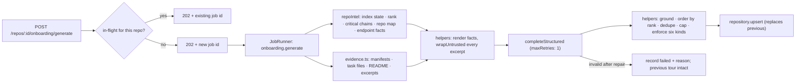
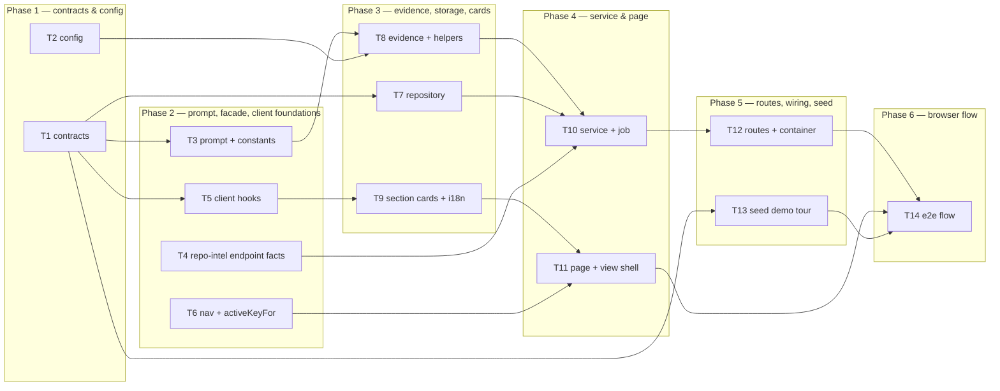

# Implementation Plan: Onboarding Tour

## Overview

Build the missing **producer** and the missing **surface** for onboarding machinery that is already
committed and completely inert. `server/src/prompts/onboarding.system.md` is a finished system
prompt nothing loads; the `onboarding` table is migrated and empty; the `Onboarding` contracts are
tested but served by no route; `FEATURE_MODELS[0]` (`onboarding`) already has a Settings row nothing
reads; and `repoIntel.getCriticalPaths()` is fully implemented with zero callers. This feature wires
those pieces into a six-section, per-repository guided tour at `/repos/:repoId/onboarding`,
generated once by a background job, grounded item-by-item against the `repo-intel` index and the
clone, and served from storage at zero model cost.

Source of requirements:
`/Users/zhabskyi/AI/Neoversity/dev-digest/specs/2026-08-19-onboarding-tour.md`
(`SPEC-2026-08-19-onboarding-tour`, AC-1 … AC-53). This plan does not re-litigate scope decisions —
it plans them. The spec's four "Resolved" decisions (six sections with `routes_and_apis` third;
`Share link` = clipboard copy; `Regenerate` = background job; re-index marks stale, never
auto-regenerates) were made by the user on 2026-08-19 and are treated as final.

## Execution mode

**multi-agent (parallel)** — stated explicitly by the requesting orchestrator ("Phase it into waves
with non-overlapping Owned paths per task, so `run-plan` can dispatch `implementer-backend` /
`implementer-ui` concurrently. Contracts land first."). The plan is therefore phased into six waves,
contracts and configuration land first, and no two tasks that can run concurrently share a file.
**14 tasks across 6 phases; the widest wave is 4 concurrent tasks.**

## Requirements (verified)

Every `AC-N` in the spec appears in **exactly one** R-item. None is out of scope — AC-1 … AC-53 are
all planned.

**Generation inputs & bounds**

- **R1 (covers AC-1, AC-2):** A tour is exactly six sections, always in the order
  `architecture` → `critical_paths` → `routes_and_apis` → `local_setup` → `reading_path` →
  `first_tasks`. `{{sections}}` is filled from a server-side constant naming those six kinds; a
  response with a seventh, a missing, or a reordered section is rejected rather than stored. The
  shipped prompt's `routes_and_apis` block — grouped "Frontend routes" / "API endpoints" lists,
  group-by-area, and its diagram permission — is **retained unedited**.
- **R2 (covers AC-3, AC-12):** Generation inputs come solely from the repository's `repo-intel`
  index (via the `container.repoIntel` facade) and its clone on disk — file rank, critical
  dependency chains, the repo map, endpoint facts, discovered manifests/scripts, bounded key-file
  excerpts. Every repository-derived excerpt reaches the model inside `wrapUntrusted(...)`
  delimiters, and the system prompt keeps its `<untrusted>…</untrusted>` SECURITY paragraph.
- **R3 (covers AC-4, AC-5, AC-48):** Provider/model come from resolving the existing `onboarding`
  feature-model slot (workspace override, else `FEATURE_MODELS` default). One generation attempt
  issues **at most two** structured provider calls (the initial call plus one schema-repair
  re-prompt). Reading a stored tour issues **zero**.
- **R4 (covers AC-6, AC-7):** No usable index → HTTP 200, no tour, machine-readable `not_indexed`,
  **zero** model calls. Index present but `partial`/`degraded` → generate anyway from what exists
  and record the degradation reason on the stored tour.

**Grounding — nothing invented**

- **R5 (covers AC-8, AC-9, AC-10):** Before storage, drop every cited path that is neither in the
  index nor resolvable in the clone; drop every `local_setup` command whose leading executable or
  script name is not attested by a real file in the clone (manifest script, compose service,
  task-runner target, or a documented README command). If dropping leaves a section below a
  configured minimum, store the section **empty** with a machine-readable `insufficient_grounding`
  reason — never backfill.

**Section content**

- **R6 (covers AC-13, AC-14):** `architecture` carries a non-empty markdown body; `architecture`
  and `routes_and_apis` are the **only** two sections permitted a mermaid diagram, and a diagram
  supplied on any other kind is discarded. An invalid diagram renders the section without a diagram
  and without an error graphic, independently per section.
- **R7 (covers AC-15, AC-16, AC-17):** `critical_paths` is an ordered list of `{path, why}` items —
  one line each, never a paragraph — ordered by the repository's file rank (not alphabetical, not
  by date, not by the model's choice), excluding tests, fixtures, configs, declaration files, and
  migrations.
- **R8 (covers AC-49, AC-50, AC-51, AC-52, AC-53):** `routes_and_apis` carries typed entries
  (`{surface, group, method, route, source_path, note}`), never a prose inventory; the client renders
  two labelled surfaces with API endpoints grouped by area, and omits a surface entirely when it is
  empty. An entry whose `source_path` is absent or ungrounded is dropped. Where the index carries
  extracted endpoint facts, API entries whose `METHOD /path` is not among them are dropped; where it
  carries none, the section is stored with a `facts_unavailable` marker and entries survive on
  declaring-file grounding alone. Entries are unique by `surface + method + route` and their order
  is deterministic for a given set of facts.
- **R9 (covers AC-18, AC-38, AC-44):** `local_setup` is an ordered list of discrete `{command}`
  items, one shell command per item. Its copy control puts exactly that row's command text on the
  clipboard — no numbering, no neighbours, no markup. No command is ever executed or offered for
  execution.
- **R10 (covers AC-19, AC-20):** `reading_path` is an ordered `{path, rationale}` sequence where the
  rationale justifies *that position*; a repeated path is stored once, keeping the earlier position,
  with the remainder renumbered contiguously.
- **R11 (covers AC-21, AC-22, AC-23, AC-46):** `first_tasks` items carry `{title, target,
  complexity}` with `complexity ∈ low | medium | high`; an item with any other complexity value is
  **dropped, never coerced**; a `target` may be an existing directory as well as a file; and the
  badge conveys its level in text ("Low complexity"), not by colour alone.

**Persistence, regeneration, staleness**

- **R12 (covers AC-24, AC-25, AC-29, AC-30, AC-31):** At most one tour per repository; a successful
  regeneration replaces it with no history kept. Each stored tour records generated-at, the indexed
  revision it came from, that revision's indexed file count, and the resolved provider and model.
  When the repository's current indexed revision differs from the recorded one the tour is marked
  stale wherever freshness is shown — and is still served and rendered **in full**. Nothing
  generates or regenerates except an explicit user request.
- **R13 (covers AC-26, AC-27, AC-28):** A regeneration request is accepted immediately (202), runs
  as a background job, and leaves the previous tour readable throughout. While one is in flight the
  repository reports a generating state and a second request is answered with the in-flight job's
  identity rather than starting another. A failure — provider error, timeout, or schema failure
  after the repair attempt — leaves any previous tour intact and surfaces a reason.

**Page, navigation, interaction**

- **R14 (covers AC-32, AC-33, AC-34):** The tour lives at `/repos/:repoId/onboarding`, distinct from
  the untouched add-repository screen at `/onboarding`. Opening `/onboarding` highlights **no**
  workspace nav item (fixing the pre-existing `activeKeyFor()` collision), while
  `/repos/:repoId/onboarding` highlights `Onboarding Tour`. The workspace nav gains that item
  between `Pull Requests` and `Project Context`, resolving its repo id from the active repository.
- **R15 (covers AC-11, AC-35, AC-36, AC-37):** The page shows a breadcrumb of the repository's full
  name followed by the page name, a header reading "Onboarding for &lt;short name&gt;", and an
  `ON THIS PAGE` table of contents listing all six sections in AC-1 order, marking the section in
  view and scrolling to a section when activated. Every section is independently collapsible without
  leaving the TOC, and an **empty** section still renders its card with an explicit reason line and
  keeps its TOC entry.
- **R16 (covers AC-39, AC-40, AC-45):** `Open` on a `critical_paths` row targets the hosting
  provider's blob URL built from the repository full name, the recorded indexed revision (falling
  back to the default branch when no revision is recorded), and the row path, opened with
  `rel="noopener noreferrer"`. `Share link` copies the page's own in-app URL (with a section anchor
  when one is in view), confirms the copy, and mints no token, record, or endpoint. Any link target
  that is not an http(s) URL derived from a grounded repository path is not rendered as activatable.
- **R17 (covers AC-41, AC-42):** A repository with a usable index and no tour renders an empty state
  explaining what will be generated with a single generate action, using the existing
  `onboarding.generate.*` keys **after their body copy is corrected** to name the six sections of
  AC-1 (today it names a stale, different five). All user-facing text comes from the message
  catalogue; paths, commands, model prose, titles, and rationales are data and are never translated.

**Safety & accessibility**

- **R18 (covers AC-43):** Model-written markdown renders without executing embedded HTML or scripts
  — via the shared `Markdown` component, which runs without `rehype-raw`.
- **R19 (covers AC-47):** The whole page is keyboard-operable to WCAG 2.1 AA — TOC entries, collapse
  controls, every copy control, every `Open`, `Regenerate`, and `Share link` reachable by Tab and
  activatable by Enter/Space, each with an accessible name naming its target.

> No requirement here rests on an unconfirmed answer. The four decisions the spec records as
> *Resolved* are treated as settled; the spec's four *Still open* items are non-blocking and are
> given explicit defaults below.

## Open questions & recommendations

The spec's still-open items are non-blocking. Each gets a default here so no task waits on an
answer; none changes the DAG.

- **Q1 — How many items per section?** → **default: configuration, applied as caps.**
  `ONBOARDING_MAX_CRITICAL_PATHS=8`, `ONBOARDING_MAX_COMMANDS=12`,
  `ONBOARDING_MAX_READING_PATH=7`, `ONBOARDING_MAX_FIRST_TASKS=5`,
  `ONBOARDING_MAX_FRONTEND_ROUTES=12`, `ONBOARDING_MAX_API_ENDPOINTS=24`, and
  `ONBOARDING_MIN_SECTION_ITEMS=1` as AC-10's threshold. All are env-defaulted `AppConfig` fields
  (T2), never inline literals. The routes cap is the one that actually bites the generation budget.
- **Q2 — Endpoint facts are not exposed as a general facade read.** → **decided: add the facade
  read.** See **Rec-1** below — this is the one item in the spec that needed real planning
  attention, and it was verified against the code rather than taken on trust.
- **Q3 — Where does `first_tasks` complexity come from?** → **default: the model's judgement,
  constrained to the closed three-value set and dropped otherwise (AC-21, AC-22).** No deterministic
  signal is derived in v1. **Recommendation:** revisit once real tours exist — target file rank is
  already available (`repoIntel.getFileRank`) and would make a cheap sanity check, but inventing a
  rank→complexity mapping now would be un-grounded in a different way. Flagged, not built.
- **Q4 — Language of the generated tour.** → **default: a config key `ONBOARDING_LANGUAGE`
  defaulting to `English`**, feeding the prompt's existing `{{language}}` placeholder. Not the client
  locale: `client/messages/` ships `en` only, so wiring the locale through would add a cross-package
  dependency for a setting with exactly one possible value today.
- **Q5 — `Open` targets the provider, not DevDigest.** → **confirmed as specified (AC-39).** No
  in-app file viewer exists and building one is out of scope.
- **Q6 — `activeKeyFor` is a shared-surface change.** → **handled: T6 owns it alone**, in its own
  wave, with acceptance covering every other nav key so no neighbouring route regresses.

**Recommendations (not spec edits):**

- **Rec-1 — Add one small `repo-intel` facade read; do not live on the fallback.** *Verified
  first-hand:* `file_facts` really does hold `(repo_id, file_path) → endpoints jsonb` (
  `server/src/db/schema/repo-intel.ts:75`), and `RepoIntelRepository.getFileFacts` really is scoped
  by `inArray(t.fileFacts.filePath, files)` (`repository.ts:561`), reachable only through
  `getBlastRadius`, which requires a `changedFiles` set. The `RepoIntel` interface
  (`modules/repo-intel/types.ts:234`) has **no** repository-wide endpoint read. Faking one by calling
  `getBlastRadius` with every indexed file is not viable — it runs a frontier walk with
  `MAX_BLAST_FRONTIER_FILES` clipping and a degraded path that re-reads the clone. So the plan adds
  `RepoIntel.getEndpointFacts(repoId, limit?)` (T4), backed by a new `listFileFacts(repoId, limit)`
  repository read, returning `[]` when the flag is off or no rows exist — exactly the documented
  degraded array contract. **Why the read rather than the fallback:** without it, endpoint facts
  cannot even be supplied as *generation input*, which the spec's Cross-module section explicitly
  requires ("server → repo-intel facade: … endpoint facts"), and `routes_and_apis` — the section
  most likely to contain a plausible invention — would be the least checkable thing on the page.
  AC-52's `facts_unavailable` path survives unchanged as the runtime fallback for repositories whose
  index genuinely carries no facts. Cost is low: every existing `RepoIntel` test double is an
  `as unknown as RepoIntel` cast (`test/blast.it.test.ts:68`, `test/conventions.it.test.ts:106`), so
  the interface addition breaks nothing.
- **Rec-2 — A stored tour is served regardless of current index state; `not_indexed` governs only
  the *absent-tour* path.** AC-6's observable describes a repository with no tour, while AC-30
  requires a stale tour to be served in full and AC-7 allows generation from a degraded index. The
  read precedence is therefore: **stored tour present → serve it** (`state: 'ready'`, plus `stale` /
  `degraded` / `generating` markers); **absent → consult the index** → unusable gives `not_indexed`,
  usable gives the empty-with-generate state. This also makes the e2e flow (T14) possible against a
  seeded row without seeding `repo_index_state` and perturbing every other repo-intel consumer.
- **Rec-3 — `state` gains an `empty` value.** The spec's contract lists
  `ready | generating | failed | not_indexed`, which has no value for "index is fine, nobody has
  generated yet" — the exact case AC-41 describes. The response `state` therefore becomes
  `ready | empty | generating | failed | not_indexed`. The spec says field names are indicative, so
  this is a filled gap, not a deviation.
- **Rec-4 — Two contracts, not one: a model-facing draft and a stored/served tour.** The recorded
  gotcha (server insight 2026-08-08) is that a Zod `.default(...)` in a schema passed as
  `schema:` to `completeStructured` emits a `"default"` keyword OpenAI's strict mode rejects; the
  mirrored gotcha (2026-08-19) is that a `.default(...)` on a *served* shape makes the field required
  in `z.infer` and ripples into every hand-built fixture in both packages. So: `OnboardingDraft` is
  flat, plain, and fully required (model-facing), while `Onboarding`/`OnboardingSection` is a
  `z.discriminatedUnion('kind', …)` with `.nullish()` optional markers (stored/served). The union
  also makes AC-13 **structural**: the four non-diagram arms type `diagram` as
  `z.null().optional()`, so an illegal diagram cannot be represented, let alone stored.
- **Rec-5 — The draft carries all five item arrays on every section; the server keeps only the one
  matching the kind.** A `discriminatedUnion` as a strict structured-output schema is a genuine risk
  (six `anyOf` arms, each with its own required set). A flat draft section with five required arrays
  and a prompt instruction to leave the irrelevant ones `[]` is trivially strict-valid, costs a
  handful of tokens, and moves all the shape enforcement to code that can be unit-tested.
- **Rec-6 — Section headings come from the message catalogue keyed by `kind`, not from the model's
  `title`.** AC-42 requires switching locale to change the section headings; a model-written title is
  data and must not be translated. The stored `title` is kept for provenance and rendered, if at all,
  as a subtitle. This also makes T14's e2e assertions deterministic.
- **Rec-7 — `completeStructured` must be called with `maxRetries: 1`.** *Verified:*
  `server/src/adapters/llm/openai.ts:99` reads `req.maxRetries ?? 2` and loops
  `attempt <= maxRetries + 1` — the default is **three** provider calls per call site, not two.
  AC-5 bounds a generation at two, so the default silently breaks the cost fence. The service must
  never add its own repair loop on top; the adapter already owns that behaviour.
- **Rec-8 — The routes section carries an optional `items_capped` flag.** Q1's caps mean a large
  service silently loses endpoints. One boolean plus one catalogue string ("Showing the first {n}")
  keeps the section honest at near-zero cost. The fuller "showing N of M" affordance the spec
  suggests is deferred.

## Affected modules & contracts

- **`server/` (`@devdigest/api`)** — new feature module `src/modules/onboarding/` (constants,
  evidence reader, pure helpers, repository, service, routes); the existing `onboarding` table is
  consumed as-is (**no migration** — its `repo_id` PK already encodes AC-24 and its payload column is
  jsonb); new configuration keys in `src/platform/config.ts`; a `container.onboarding` binding; a
  new job kind on the existing `JobRunner`; a small additive read on the `repo-intel` facade; one
  seeded demo row.
- **`server/src/prompts/onboarding.system.md`** — minimally edited: `{{sections}}` filled from the
  six-kind constant, and the typed-items instruction added. The `routes_and_apis` block, mermaid
  rules, grounding rules, SECURITY paragraph, and `{{language}}` stay **verbatim** (AC-2).
- **`server/src/modules/repo-intel/`** — additive facade read only (Rec-1). No pipeline internals,
  no re-index, no behaviour change to any existing method.
- **`client/` (`@devdigest/web`)** — new route `/repos/[repoId]/onboarding`; six section-card
  components; TOC + header + state components; new TanStack Query hooks; nav item; the
  `activeKeyFor()` fix; a rewritten `messages/en/onboarding.json`.
- **`reviewer-core/`** — **no change**. `wrapUntrusted` (re-exported through
  `server/src/platform/prompt.ts`) and the adapters' `parseWithRepair` path are consumed as they are.
  T10's acceptance re-asserts the package is untouched.
- **`mcp-server/`** — no change.
- **`e2e/`** — one new read-only flow plus its README coverage row.
- **Contracts:**
  - **Edited (explicit callout):** `server/src/vendor/shared/contracts/knowledge.ts` — the existing
    `OnboardingSection` / `Onboarding` shapes are **replaced**, not extended: `OnboardingSection`
    becomes a discriminated union with typed per-kind `items`. This is a breaking change to an
    already-asserted contract, so `server/test/contracts.test.ts:150` must be updated in the same
    task. It is safe in practice because the contract has **zero producers and zero consumers** today
    — `grep` finds `Onboarding` only in the contract file, its client mirror, and that one test — and
    the `onboarding` table is empty, so no persisted payload can fail to parse. `OnboardingLink` is
    kept as-is.
  - **Edited (server-internal facade, explicit callout):** `server/src/modules/repo-intel/types.ts`
    gains `RepoIntel.getEndpointFacts` (Rec-1). Every existing double is an
    `as unknown as RepoIntel` cast, so no test breaks.
  - **Not edited:** `contracts/platform.ts` — `FEATURE_MODELS`' `onboarding` slot is *read*
    unchanged (AC-4). No trace, agent, or skill contract is touched.
  - **Mirroring:** `client/src/vendor/shared/contracts/knowledge.ts` is a hand-maintained copy; the
    canonical file is the server one. There is no sync script — the change must be mirrored by hand
    and verified with `diff`.

## Architecture changes

Onion placement for every new server piece:

| Layer | File | Role |
|---|---|---|
| Ports / contracts | `server/src/vendor/shared/contracts/knowledge.ts` | tour, section union, per-kind item shapes, draft shape, response envelopes |
| Ports (facade) | `server/src/modules/repo-intel/types.ts` | `getEndpointFacts` on the `RepoIntel` interface |
| Infrastructure | `server/src/modules/repo-intel/repository.ts` | `listFileFacts(repoId, limit)` — the only new SQL |
| Infrastructure | `server/src/modules/onboarding/evidence.ts` | the **only** fs-touching file: manifests, task files, README, key-file excerpts, path/dir existence, command attestation set |
| Infrastructure | `server/src/modules/onboarding/repository.ts` | the **only** file touching `t.onboarding` |
| Application (pure) | `server/src/modules/onboarding/helpers.ts` | grounding, rank ordering, dedupe, minimums, caps, draft→stored mapping, fact rendering — no I/O, fully unit-testable |
| Application | `server/src/modules/onboarding/service.ts` | read path, generate path, job handler, in-flight dedupe; reaches the LLM/git/index **only** via `container.*` |
| Composition root | `server/src/platform/container.ts` | `onboarding` lazy getter + `ContainerOverrides.onboarding` |
| Transport | `server/src/modules/onboarding/routes.ts` | Zod `params`/`response` via `fastify-type-provider-zod`; job-handler registration at boot (the `repo-intel/routes.ts` pattern) |

Route surface (two endpoints, nothing more):

```
GET  /repos/:id/onboarding           → OnboardingTourResponse   AC-6,7,11,24,25,29,30,41,48,52
POST /repos/:id/onboarding/generate  → 202 { state, job }       AC-26,27,28,31   (3/min, advisory)
```

Client structure:

```
app/repos/[repoId]/onboarding/page.tsx                     (thin — useParams → view)
  _components/OnboardingTourView/
    OnboardingTourView.tsx · helpers.ts · constants.ts · styles.ts · index.ts   [T11]
    _components/TourHeader/**            breadcrumb, header, Regenerate, Share  [T11]
    _components/TableOfContents/**       six entries, scrollspy, scroll-to      [T11]
    _components/SectionCards/**          six cards + copy/Open controls         [T9]
```

Generation flow (one model call, everything else deterministic):



Task dependency DAG:



## Phased tasks

### Phase 1 — Contracts & configuration

- **T1**
  - **Action:** Replace the inert `Onboarding` contracts in
    `server/src/vendor/shared/contracts/knowledge.ts` with the typed set, keeping `OnboardingLink`
    unchanged. Add:
    `OnboardingSectionKind` = `z.enum(['architecture','critical_paths','routes_and_apis',
    'local_setup','reading_path','first_tasks'])`;
    `OnboardingComplexity` = `z.enum(['low','medium','high'])`;
    `OnboardingSurface` = `z.enum(['frontend','api'])`;
    item shapes `OnboardingCriticalPath {path, why}`, `OnboardingRouteEntry {surface, group, method:
    string|null, route, source_path, note: string|null}`, `OnboardingCommand {command}`,
    `OnboardingReadingStep {path, rationale}`, `OnboardingFirstTask {title, target, complexity}`.
    **Stored/served shape:** `OnboardingSection = z.discriminatedUnion('kind', [...six arms])` where
    the four non-diagram arms declare `diagram: z.null().optional()` (making AC-13 structural), the
    `architecture` arm declares `body: z.string()` and `diagram: z.string().nullish()`, the
    `routes_and_apis` arm declares `diagram: z.string().nullish()`, `items:
    z.array(OnboardingRouteEntry)`, `facts_unavailable: z.boolean().nullish()` and
    `items_capped: z.boolean().nullish()` (Rec-8), and every list arm declares
    `empty_reason: z.string().nullish()`. `Onboarding = { sections: z.array(OnboardingSection),
    generated_at, indexed_revision, indexed_file_count, provider, model, degraded_reason:
    z.string().nullish() }` — the stored payload. `OnboardingTourResponse = { tour: Onboarding |
    null, state: z.enum(['ready','empty','generating','failed','not_indexed']), stale: z.boolean(),
    failure_reason: z.string().nullish(), job_id: z.string().nullish() }` (Rec-3).
    `OnboardingGenerateResponse = { state: z.literal('generating'), job: { id: z.string() } }`.
    **Model-facing shape (Rec-4, Rec-5):** `OnboardingDraftSection` — flat, every field plain and
    **required**, no `.default()` anywhere: `{ kind, title, body: z.string(), diagram:
    z.string().nullable(), links: z.array(OnboardingLink), critical_paths: [...], routes: [...],
    commands: [...], reading_path: [...], first_tasks: [...] }`; `OnboardingDraft = { sections:
    z.array(OnboardingDraftSection) }`. Export everything from
    `server/src/vendor/shared/index.ts` if that file enumerates symbols. Update the existing
    assertion at `server/test/contracts.test.ts:150` to the new shape (this is keeping an existing
    test green, not authoring new coverage). Then **manually mirror** the contract file into
    `client/src/vendor/shared/contracts/knowledge.ts` (and the client `index.ts` if it enumerates).
  - **Module:** server (contracts)
  - **Agent:** implementer-backend
  - **Skills to use:** zod, typescript-expert, onion-architecture, engineering-insights
  - **Owned paths:** `server/src/vendor/shared/contracts/knowledge.ts`,
    `server/src/vendor/shared/index.ts`, `server/test/contracts.test.ts`,
    `client/src/vendor/shared/contracts/knowledge.ts`, `client/src/vendor/shared/index.ts`
  - **Depends-on:** none
  - **Risk:** medium — a breaking replacement of an already-asserted exported contract.
  - **Known gotchas:** **NEVER** put a `.default(...)` on any field of `OnboardingDraft*` — it is
    passed as `schema:` to `completeStructured`, `toJsonSchema` emits a literal `"default"` keyword,
    and OpenAI's strict structured-output mode rejects it (server insight 2026-08-08). Equally,
    avoid `.default([])` on the **stored** shapes: zod's `z.infer` marks a defaulted field
    *required*, so it ripples into every hand-built fixture in both packages — three client test
    files broke exactly this way on 2026-08-19. Use `.nullish()` for optional markers. This contract
    is safe to break only because nothing produces or consumes it: confirm with
    `grep -rn "OnboardingSection" server/src client/src --exclude-dir=vendor` before and after.
    `client/src/vendor/shared` is a hand-maintained copy with no sync script; two files
    (`eval-ci.ts`, `productionize.ts`) already differ for unrelated reasons, so diff the
    **knowledge.ts pair specifically**, not the whole tree.
  - **Acceptance:** `cd server && pnpm typecheck` and `cd client && pnpm typecheck` both pass;
    `diff server/src/vendor/shared/contracts/knowledge.ts client/src/vendor/shared/contracts/knowledge.ts`
    reports no differences; `cd server && pnpm exec vitest related --run test/contracts.test.ts --exclude '**/*.it.test.ts' --reporter=dot`
    passes; a node one-liner proves `OnboardingSection.parse({kind:'first_tasks', title:'T',
    items:[], diagram:'flowchart LR'})` **throws** (diagram not representable on a non-diagram kind)
    while the same object without `diagram` parses; and
    `grep -n "default(" server/src/vendor/shared/contracts/knowledge.ts` shows no `.default(` on any
    `OnboardingDraft*` field.
    **→ satisfies AC-13 (structurally, for the four non-diagram kinds), AC-21, AC-49; enabling work
    for AC-1, AC-22, AC-25, AC-52**

- **T2**
  - **Action:** Add onboarding configuration to `server/src/platform/config.ts` (Zod env schema +
    `AppConfig` fields), following the existing `PROJECT_CONTEXT_*` block's shape — all defaulted,
    none a bare constant: `ONBOARDING_PROMPT_TOKEN_BUDGET` (28000),
    `ONBOARDING_EXCERPT_CHAR_CAP` (4000), `ONBOARDING_MAX_EXCERPT_FILES` (10),
    `ONBOARDING_MAX_ENDPOINT_FACTS` (200), `ONBOARDING_MIN_SECTION_ITEMS` (1),
    `ONBOARDING_MAX_CRITICAL_PATHS` (8), `ONBOARDING_MAX_COMMANDS` (12),
    `ONBOARDING_MAX_READING_PATH` (7), `ONBOARDING_MAX_FIRST_TASKS` (5),
    `ONBOARDING_MAX_FRONTEND_ROUTES` (12), `ONBOARDING_MAX_API_ENDPOINTS` (24),
    `ONBOARDING_GENERATION_TIMEOUT_MS` (90000), `ONBOARDING_LANGUAGE` (`English`). Document each in
    `server/.env.example`.
  - **Module:** server
  - **Agent:** implementer-backend
  - **Skills to use:** zod, typescript-expert, fastify-best-practices, engineering-insights
  - **Owned paths:** `server/src/platform/config.ts`, `server/.env.example`
  - **Depends-on:** none
  - **Risk:** low
  - **Known gotchas:** `ONBOARDING_GENERATION_TIMEOUT_MS` defaults **below** `JobRunner`'s own
    120 s timeout (`new JobRunner(db)` at `platform/container.ts:117` takes the default
    `timeoutMs: 120_000`). If the model call is allowed to run longer than the job, `JobRunner`
    aborts it, then **retries** — see T10's gotchas. Every consumer reads `container.config.*`; no
    call site may hardcode any of these numbers.
  - **Acceptance:** `cd server && pnpm exec vitest related --run src/platform/config.ts --exclude '**/*.it.test.ts' --reporter=dot`
    passes; `cd server && pnpm typecheck` passes;
    `grep -rn "28000\|4000\b\|90000" server/src/modules server/src/adapters` returns nothing (the
    numbers exist only as env defaults).
    **→ no AC — enabling work for AC-5, AC-10, AC-12, AC-52 and the spec's generation-budget NFRs**

### Phase 2 — Prompt, facade read, client foundations

- **T3**
  - **Action:** Create `server/src/modules/onboarding/constants.ts` exporting
    `SECTION_KINDS` (the six kinds of AC-1 **in order**, the single source of truth for both the
    prompt's `{{sections}}` fill and the server's shape check), `DIAGRAM_KINDS`
    (`['architecture','routes_and_apis']`), `ONBOARDING_JOB_KIND` (`'onboarding.generate'`),
    `MANIFEST_FILES` / `TASK_FILES` / `README_NAMES` (the clone files evidence reads for AC-9), and
    `EXCLUDED_PATH_SEGMENTS`. Then make the **minimal** edit to
    `server/src/prompts/onboarding.system.md`: keep the `routes_and_apis` formatting block, the
    group-by-area instruction, the diagram permission sentence, the mermaid rules, the grounding
    rules, the SECURITY paragraph, and `{{language}}` **byte-for-byte unchanged** (AC-2), and add
    only the typed-items instruction — that each section returns the five item arrays of
    `OnboardingDraftSection`, filling **only** the array matching its own `kind` and returning `[]`
    for the other four (Rec-5), with the field names spelled out per kind, plus the explicit note
    that `body` may be `""` for the five list sections and must be non-empty for `architecture`.
  - **Module:** server
  - **Agent:** implementer-backend
  - **Skills to use:** typescript-expert, security, onion-architecture, engineering-insights
  - **Owned paths:** `server/src/modules/onboarding/constants.ts`,
    `server/src/prompts/onboarding.system.md`
  - **Depends-on:** T1
  - **Risk:** medium — AC-2 exists specifically to stop a well-meaning cleanup deleting prompt text
    the third section depends on.
  - **Known gotchas:** This template is a **prompt**, not documentation: an edit that "tidies" the
    `routes_and_apis` block fails AC-2 even if the tour still generates. Do not add a keyword
    denylist over repository content anywhere — the defence is the trusted-rule-plus-wrapper design
    (`server/CLAUDE.md`). `renderTemplate` (`platform/prompts.ts:33`) leaves unknown `{{…}}`
    placeholders **intact**, so a typo in a variable name ships the literal `{{typo}}` to the model
    rather than failing. Templates are read relative to the module, so `src/prompts` in dev and
    `dist/prompts` in a build — do not move the file.
  - **Acceptance:** `cd server && pnpm typecheck` passes;
    `grep -c "Frontend routes" server/src/prompts/onboarding.system.md` returns `1` and
    `grep -n "group endpoints by area\|SECURITY\|{{language}}\|suppress\|flowchart LR" server/src/prompts/onboarding.system.md`
    shows the grounding/security/mermaid blocks still present;
    `git diff -- server/src/prompts/onboarding.system.md` shows **only additions** (no deleted line
    inside the `routes_and_apis` or Mermaid/SECURITY blocks);
    `node -e "…"` printing `SECTION_KINDS` yields exactly
    `architecture,critical_paths,routes_and_apis,local_setup,reading_path,first_tasks`.
    **→ satisfies AC-2; enabling work for AC-1, AC-12, AC-13**

- **T4**
  - **Action:** Add the repository-wide endpoint-fact read to the `repo-intel` facade (Rec-1). In
    `server/src/modules/repo-intel/types.ts`: add
    `export interface EndpointFactRow { file: string; endpoints: string[] }` and
    `getEndpointFacts(repoId: string, limit?: number): Promise<EndpointFactRow[]>` to the `RepoIntel`
    interface, documented under the existing "T3: onboarding" comment block and explicitly covered by
    the file's **degraded array contract** (returns `[]`, never throws). In
    `server/src/modules/repo-intel/repository.ts`: add
    `listFileFacts(repoId, limit)` selecting `file_path` + `endpoints` from `t.fileFacts` for the
    repo, filtered to rows with at least one endpoint, ordered by `file_path` for determinism, with
    the limit applied. In `server/src/modules/repo-intel/service.ts`: implement `getEndpointFacts`
    returning `[]` when `!this.container.config.repoIntelEnabled`, else mapping the repository rows.
    Change no existing method.
  - **Module:** server
  - **Agent:** implementer-backend
  - **Skills to use:** drizzle-orm-patterns, postgresql-table-design, onion-architecture,
    typescript-expert, engineering-insights
  - **Owned paths:** `server/src/modules/repo-intel/types.ts`,
    `server/src/modules/repo-intel/repository.ts`, `server/src/modules/repo-intel/service.ts`
  - **Depends-on:** none
  - **Risk:** medium — a shared facade three other features already read from; the change must be
    strictly additive.
  - **Known gotchas:** `file_facts` is keyed `(repo_id, file_path)` with `endpoints`/`crons` as
    **jsonb**, so the selected value is `unknown` and needs the same
    `(r.endpoints as string[]) ?? []` cast `getFileFacts` (`repository.ts:574`) already uses — do not
    add a new column or migration. The table is written only for rows with at least one endpoint or
    cron (`repository.ts:381`), so a repo with routes but an unindexed clone legitimately yields
    `[]`, which is AC-52's `facts_unavailable` path, not a bug. Never interpolate a JS `Date` into a
    raw `sql\`\`` template (server insight 2026-08-05) — this query needs none. Every existing
    `RepoIntel` double is an `as unknown as RepoIntel` cast, so no test needs updating; verify rather
    than assume with a grep. Ordering by `file_path` is load-bearing for AC-53's determinism.
  - **Acceptance:** `cd server && pnpm exec vitest related --run src/modules/repo-intel/service.ts src/modules/repo-intel/repository.ts src/modules/repo-intel/types.ts --exclude '**/*.it.test.ts' --reporter=dot`
    passes (including the existing `repo-intel-facade-degraded.test.ts`);
    `cd server && pnpm typecheck` passes; a unit test proves `getEndpointFacts` returns `[]` with
    `repoIntelEnabled: false` and never throws; an `.it.test.ts` against testcontainers Postgres
    proves two `file_facts` rows come back ordered by `file_path` and that a rows-with-no-endpoints
    row is excluded; `git diff --stat server/src/modules/repo-intel/` shows only additions to the
    three files and no change to any existing method body.
    **→ no AC directly — enabling work for AC-52 (and the endpoint-fact generation input of AC-3)**

- **T5**
  - **Action:** Add `client/src/lib/hooks/onboarding.ts` with TanStack Query hooks over the two
    endpoints: `useOnboardingTour(repoId)` — key `["onboarding", repoId]`, `enabled: !!repoId`, with
    `refetchInterval` set only while the response `state === 'generating'` so the page follows a
    background job to completion and stops polling afterwards (AC-26, AC-27); and
    `useGenerateOnboardingTour(repoId)` — a body-less `api.post` to
    `/repos/${repoId}/onboarding/generate` that on success writes the returned `generating` state
    into the cache and invalidates `["onboarding", repoId]`. Re-export from
    `client/src/lib/hooks/index.ts`.
  - **Module:** client
  - **Agent:** implementer-ui
  - **Skills to use:** frontend-architecture, react-best-practices, next-best-practices,
    typescript-expert, engineering-insights
  - **Owned paths:** `client/src/lib/hooks/onboarding.ts`, `client/src/lib/hooks/index.ts`
  - **Depends-on:** T1
  - **Risk:** low
  - **Known gotchas:** All server data goes through `src/lib/hooks/*` → `src/lib/api.ts`; never
    `fetch` from a component (`client/CLAUDE.md`). `apiFetch` only sets a JSON content-type when a
    body is present (`api.ts:26-29`, whose comment already names "tour generate"), so the body-less
    POST is correct as-is. Polling must be **conditional** — an unconditional `refetchInterval` turns
    a zero-model-call read (AC-48) into a permanent request loop against every open tab.
  - **Acceptance:** `cd client && pnpm typecheck` passes;
    `cd client && pnpm exec vitest related --run src/lib/hooks/onboarding.ts --reporter=dot` passes;
    `grep -rn "fetch(" client/src/lib/hooks/onboarding.ts` returns nothing;
    `grep -n "refetchInterval" client/src/lib/hooks/onboarding.ts` shows it derived from the query
    data's `state`, not a constant.
    **→ no AC — enabling work for AC-26, AC-27, AC-41, AC-48**

- **T6**
  - **Action:** Two changes to shared navigation surfaces. (a) In `client/src/vendor/ui/nav.ts`, add
    `{ key: "onboarding-tour", label: "Onboarding Tour", icon: <an existing IconName>, href:
    "/repos/:repoId/onboarding", gKey: "o" }` to the `WORKSPACE` group **between** `pulls` and
    `context` (AC-34), and add the matching `g o` entry to `SHORTCUTS`. (b) In
    `client/src/components/app-shell/helpers.ts`, fix `activeKeyFor()` (AC-33): replace
    `if (pathname.includes("/onboarding")) return "onboarding-tour";` with a **repo-scoped** match —
    `if (/^\/repos\/[^/]+\/onboarding/.test(pathname)) return "onboarding-tour";` — so the
    add-repository screen at `/onboarding` falls through to `""` and highlights nothing, while
    `/repos/<id>/onboarding` highlights the new item. Change no other branch of the function.
  - **Module:** client
  - **Agent:** implementer-ui
  - **Skills to use:** frontend-architecture, react-best-practices, react-testing-library,
    typescript-expert, engineering-insights
  - **Owned paths:** `client/src/vendor/ui/nav.ts`,
    `client/src/components/app-shell/helpers.ts`
  - **Depends-on:** none
  - **Risk:** medium — `activeKeyFor` is a shared helper every route's sidebar highlight goes
    through; the spec flags it for extra care.
  - **Known gotchas:** The `nav.onboarding-tour` label key **already exists** in
    `client/messages/en/shell.json` and needs no addition. Note the existing asymmetry: `Sidebar.tsx`
    renders `item.label` (the literal in `nav.ts`) while `useShellCommands.ts:24` translates
    `nav.${it.key}` for the command palette — match the existing pattern rather than "fixing" it
    here. Branch **order matters** in `activeKeyFor`: the new repo-scoped test must sit where the old
    `includes("/onboarding")` line was, above `/context`, or a future route could shadow it. Verify
    that `resolveHref` (`nav.ts`) substitution still works — the href carries `:repoId` like its
    neighbours. `@testing-library/user-event` is **not** a dependency in this package; use
    `fireEvent` (client insight 2026-07-30).
  - **Acceptance:** `cd client && pnpm typecheck` passes;
    `cd client && pnpm exec vitest related --run src/components/app-shell/helpers.ts src/vendor/ui/nav.ts --reporter=dot`
    passes; a unit test asserts `activeKeyFor("/onboarding") === ""`,
    `activeKeyFor("/repos/abc/onboarding") === "onboarding-tour"`, and that **every other** existing
    mapping is unchanged (`/settings/api-keys`→`settings`, `/repos/abc/context`→`context`,
    `/repos/abc/conventions`→`conventions`, `/repos/abc/pulls`→`pulls`, `/skills`→`skills`,
    `/agents`→`agents`, `/eval`→`eval`, `/memory`→`memory`, `/repos/abc/pulls/1/multi-agent`→
    `multi-agent`); `node -e` printing the WORKSPACE group's keys yields
    `pulls,onboarding-tour,context` in that order.
    **→ satisfies AC-33, AC-34**

### Phase 3 — Evidence & storage, section presentation

- **T7**
  - **Action:** Create `server/src/modules/onboarding/repository.ts` — the **only** file touching
    `t.onboarding`. Methods: `get(repoId): Promise<{ json: unknown; generatedAt: Date } | null>`;
    `upsert(repoId, payload)` — `insert … onConflictDoUpdate` on the `repo_id` primary key setting
    `json` and `generatedAt: new Date()`, so a successful regeneration replaces the single row
    (AC-24); `remove(repoId)` for completeness. Return the raw `json` — parsing it through the
    `Onboarding` contract is the service's job, because a row that fails the six-section shape must
    be treated as **absent** (the spec's "legacy row" edge case), which is a domain decision, not a
    storage one.
  - **Module:** server
  - **Agent:** implementer-backend
  - **Skills to use:** drizzle-orm-patterns, postgresql-table-design, onion-architecture,
    typescript-expert, engineering-insights
  - **Owned paths:** `server/src/modules/onboarding/repository.ts`
  - **Depends-on:** T1
  - **Risk:** low
  - **Known gotchas:** **No migration is needed** — `onboarding` (`db/schema/context.ts:125`) is
    already migrated with `repo_id` as the primary key, a `json jsonb not null`, and
    `generated_at timestamptz default now()`, and is re-exported through `db/schema.ts:73`. Do not
    add columns: AC-25's provenance lives inside the jsonb payload (the spec explicitly permits
    this), and adding a column would mean a migration on a table whose PK already encodes AC-24. The
    `repo_id` foreign key already cascades on repo delete, which is the spec's accepted
    "repository removed → its tour disappears" behaviour. Repositories return domain rows, never
    query builders. This repo has **zero** colocated tests under `src/modules/**` — any DB test for
    this file belongs at `server/test/onboarding-repository.it.test.ts` (server insight 2026-08-18).
  - **Acceptance:** `cd server && pnpm typecheck` passes;
    `cd server && pnpm exec vitest related --run src/modules/onboarding/repository.ts --exclude '**/*.it.test.ts' --reporter=dot`
    passes; an `.it.test.ts` against testcontainers Postgres proves two successive `upsert` calls for
    the same `repoId` leave exactly **one** row whose `json` is the second payload and whose
    `generated_at` advanced (AC-24); `git status --porcelain server/src/db/migrations/` is empty (no
    migration was generated); `grep -rn "db/schema" server/src/modules/onboarding/` matches only
    `repository.ts`.
    **→ satisfies AC-24**

- **T8**
  - **Action:** Create the deterministic half of generation — the part that makes the model's output
    checkable. Two files.
    `server/src/modules/onboarding/evidence.ts` (**the only fs-touching file in the module**):
    `collectEvidence(clonePath, opts)` returning `{ manifests, taskFiles, readme, excerpts,
    commandAttestations: Set<string>, fileExists(path), dirExists(path) }`. It reads the
    `MANIFEST_FILES`/`TASK_FILES`/`README_NAMES` of T3's constants and up to
    `config.onboardingMaxExcerptFiles` key-file excerpts, each truncated to
    `config.onboardingExcerptCharCap`; it builds `commandAttestations` from `package.json` scripts +
    `packageManager`, Makefile targets, `docker-compose*.yml` services, task-runner targets, and
    fenced/inline commands found in the README (AC-9); and it resolves path/dir existence against the
    clone with a **realpath-then-recheck containment guard**, copying the two-guard shape at
    `server/src/modules/reviews/intent/docs.ts`. Every failure is a skip, never a throw.
    `server/src/modules/onboarding/helpers.ts` (**pure, no I/O**):
    `renderFacts(facts)` composing the user message and wrapping **every** repository excerpt in
    `wrapUntrusted(path, body)` (AC-12, the `conventions/service.ts:246` precedent);
    `groundTour(draft, evidence, rank, endpointFacts, config)` implementing, in order —
    enforce the six kinds and AC-1 order from `SECTION_KINDS`, reject a draft that is missing,
    duplicates, or adds a kind; strip `diagram` from every kind outside `DIAGRAM_KINDS` (AC-13);
    drop items whose `path`/`target`/`source_path` is neither indexed nor resolvable in the clone,
    allowing an existing **directory** as a `first_tasks` target (AC-8, AC-23, AC-51);
    drop commands whose leading executable/script name is not in `commandAttestations` (AC-9);
    drop API entries whose `METHOD /path` is absent from a **non-empty** endpoint-fact set, and set
    `facts_unavailable: true` when that set is empty (AC-52);
    de-duplicate routes by `surface + method + route` and sort them deterministically
    (surface, then group, then route, then method) (AC-53);
    de-duplicate `reading_path` by path keeping the earlier position (AC-20);
    drop `first_tasks` items whose `complexity` is outside the enum — never coerce (AC-22);
    reorder `critical_paths` strictly by the supplied rank order, ignoring the model's order
    (AC-16); apply the per-section caps of Q1 and set `items_capped` on the routes section (Rec-8);
    and finally set `empty_reason: 'insufficient_grounding'` on any section left below
    `config.onboardingMinSectionItems` (AC-10).
  - **Module:** server
  - **Agent:** implementer-backend
  - **Skills to use:** security, onion-architecture, typescript-expert, zod, engineering-insights
  - **Owned paths:** `server/src/modules/onboarding/evidence.ts`,
    `server/src/modules/onboarding/helpers.ts`
  - **Depends-on:** T2, T3
  - **Risk:** high — this is the entire grounding gate; every AC-8 … AC-10 and AC-51 … AC-53 failure
    mode lives here, and its inputs are third-party repository content.
  - **Known gotchas:** **NEVER** write a literal glob containing the two-character sequence that
    closes a block comment inside a `/** … */` comment — it terminates the comment and produces a
    `TS1434`/`TS1443`/`TS1109` cascade far below the real cause (server insight 2026-08-07). Use
    `//` for any prose describing a discovery pattern. **NEVER** type a raw NUL byte into a template
    literal used as a composite key — it makes `git` classify the whole file as binary and hides it
    from `grep`, `git blame -L`, and review; use the `\x00` escape (server insight 2026-08-19, hit
    twice). Path containment by string prefix is **insufficient**: resolve, `realpath`, then re-check
    against `realpath(cloneRoot) + path.sep` (on macOS a `/tmp` clone realpaths to `/private/tmp`).
    A `Dirent` does **not** resolve a symlink's target type — `isFile()` and `isDirectory()` are both
    false for a symlink entry, so a directory check on a symlinked entry needs an extra `stat`
    (server insight 2026-08-18). Do **not** add a keyword denylist over repository content — the
    defence is `wrapUntrusted` plus the prompt's trusted rule (`server/CLAUDE.md`,
    `reviewer-core/CLAUDE.md`). Exclude `clones/` from any walk: an imported repository may itself be
    a DevDigest checkout carrying copies of every other imported repo. AC-16's ordering must be
    *derived*, not merely validated — shuffling the model's order must not change the stored order.
  - **Acceptance:** `cd server && pnpm exec vitest related --run src/modules/onboarding/helpers.ts src/modules/onboarding/evidence.ts --exclude '**/*.it.test.ts' --reporter=dot`
    passes; `cd server && pnpm typecheck` passes (proving no stray comment terminator); unit tests
    over a fixture clone + fixture index prove — (a) a draft citing `src/does-not-exist.ts` in
    `critical_paths`, `reading_path` and `first_tasks` stores none of the three (AC-8); (b)
    `make deploy-prod` is dropped for a repo with no Makefile while `pnpm install` survives for a repo
    whose `package.json` declares pnpm (AC-9); (c) a draft whose `first_tasks` all cite missing paths
    yields an empty section carrying `insufficient_grounding` and nothing fabricated (AC-10); (d) a
    diagram supplied on `first_tasks` is discarded while the same string on `routes_and_apis` is kept
    (AC-13); (e) feeding the same draft with its `critical_paths` array shuffled produces a
    byte-identical stored section in rank-descending order (AC-16), and a `src/foo.test.ts` top-ranked
    file never surfaces (AC-17); (f) a `DELETE /users/:id` no fact attests is dropped when facts
    exist and survives (with `facts_unavailable: true`) when the fact set is empty (AC-52); (g) a
    repeated `GET /health` stores once and two identical inputs yield identical entry order (AC-53);
    (h) an entry with no `source_path`, and one whose `source_path` is missing from the repo, are
    both dropped (AC-51); (i) a path repeated at positions 2 and 5 of `reading_path` stores once at
    position 2 with contiguous numbering (AC-20); (j) `complexity: "trivial"` and
    `complexity: "Low complexity"` both drop the item (AC-22) while a `specs/` target that exists as
    a directory survives (AC-23); (k) a seven-section or five-section draft is rejected (AC-1); (l)
    the rendered user message contains one `<untrusted` block per excerpt (AC-12);
    `file server/src/modules/onboarding/*.ts` reports a text type for every file (no NUL byte).
    **→ satisfies AC-1 (shape enforcement), AC-8, AC-9, AC-10, AC-12, AC-13, AC-16, AC-17, AC-20,
    AC-22, AC-23, AC-51, AC-52, AC-53**

- **T9**
  - **Action:** Build the six section cards and rewrite the message catalogue. Create
    `client/src/app/repos/[repoId]/onboarding/_components/OnboardingTourView/_components/SectionCards/`
    with one component per kind — `ArchitectureCard` (Markdown body + `MermaidDiagram`),
    `CriticalPathsCard` (`{path, why}` rows, each with a per-row `Open` control targeting
    `githubBlobUrl(fullName, revision ?? defaultBranch, path)` with
    `target="_blank" rel="noopener noreferrer"`, AC-39), `RoutesAndApisCard` (two labelled surfaces,
    API endpoints subdivided by `group`, a surface with no entries omitted entirely, optional
    diagram, `facts_unavailable` and `items_capped` notices, AC-49/50), `LocalSetupCard` (ordered
    rows, each with its own copy control writing exactly `item.command` via
    `navigator.clipboard.writeText`, AC-18/38, and **no** run affordance of any kind, AC-44),
    `ReadingPathCard` (numbered `{path, rationale}`), `FirstTasksCard` (`{title, target,
    complexity}` cards whose badge text reads the full "Low/Medium/High complexity" string from the
    catalogue, AC-46), plus a shared `SectionCard` frame providing the collapse chevron (AC-37), the
    catalogue-derived heading keyed by `kind` (Rec-6), the section `id` anchor the TOC scrolls to,
    and the **empty-section reason line** rendered whenever `items` is empty or `empty_reason` is set
    (AC-11). Rewrite `client/messages/en/onboarding.json` as the **complete** key set for the
    feature: six `sections.<kind>` headings, six `empty.<kind>` reason lines, `emptyReason.*` for
    `insufficient_grounding` / `facts_unavailable`, control labels and accessible names
    (`copyCommand`, `copied`, `openFile`, `collapseSection`, `shareLink`, `shareCopied`,
    `regenerate`, `regenerating`, `onThisPage`), header/breadcrumb/subtitle strings including the
    stale, degraded, generating, failed and `not_indexed` notices, the complexity badge strings, and
    a **corrected** `generate.body` naming the **six** sections of AC-1 (AC-41) — the current copy
    names a stale five-section set and must not ship.
  - **Module:** client
  - **Agent:** implementer-ui
  - **Skills to use:** react-best-practices, frontend-architecture, react-testing-library,
    next-best-practices, security, typescript-expert, engineering-insights
  - **Owned paths:**
    `client/src/app/repos/[repoId]/onboarding/_components/OnboardingTourView/_components/SectionCards/**`,
    `client/messages/en/onboarding.json`
  - **Depends-on:** T1, T5
  - **Risk:** medium — this task owns the message catalogue that T11 depends on, so its key set must
    be complete before T11 starts.
  - **Known gotchas:** Reuse, do not rebuild: `MermaidDiagram`
    (`client/src/components/mermaid-diagram/MermaidDiagram.tsx`) already validates with
    `mermaid.parse({ suppressErrors: true })` and returns `null` on invalid input — AC-14 is
    satisfied by *using* it, and rendering mermaid directly would reintroduce the "Syntax error" bomb
    graphic. `Markdown` from `@devdigest/ui` runs without `rehype-raw`; note that raw HTML is
    rendered as **escaped visible text**, not removed — a test asserting `<script>` is gone must
    check `container.querySelector('script')` is null, not that the text is absent (client insight
    2026-08-18). `@testing-library/user-event` is **not** a dependency — use `fireEvent`
    (client insight 2026-07-30). `navigator.clipboard` does not exist in jsdom and must be stubbed.
    `tsconfig` sets `noUncheckedIndexedAccess: true`, so any `arr[i]` types as `T | undefined`
    (client insight 2026-08-04). Never hardcode a user-facing string; paths, commands, and model
    prose are **data** and must never pass through `t()`. There must be **no** run/execute control on
    a command row — that is the sharpest edge in the feature (AC-44).
  - **Acceptance:** `cd client && pnpm typecheck` passes;
    `cd client && pnpm exec vitest related --run "src/app/repos/[repoId]/onboarding/_components/OnboardingTourView/_components/SectionCards" --reporter=dot`
    passes; RTL tests prove — copying the second `local_setup` row writes exactly
    `cp .env.example .env # add OPENAI + STRIPE keys` to the stubbed clipboard, with no numbering or
    neighbours (AC-38); the `Open` control's `href` equals
    `https://github.com/acme/payments-api/blob/<revision>/src/lib/redis.ts` and carries
    `rel="noopener noreferrer"`, falling back to the default branch when no revision is present
    (AC-39); an `architecture` body containing `<script>alert(1)</script>` produces zero `<script>`
    elements (AC-43); a section fed an invalid diagram renders its content and no diagram box while a
    sibling valid `architecture` diagram still renders (AC-14); a `routes_and_apis` section with only
    API entries renders no "Frontend routes" heading and groups its endpoints by area (AC-50); an
    empty `local_setup` renders its reason line and its card (AC-11); each complexity badge's text
    contains the word "complexity" (AC-46); every copy and `Open` control has an accessible name
    naming its target (AC-47); `grep -riE "run|execute|terminal" <SectionCards dir>` finds no control
    (AC-44); `grep -n "5-section\|five" client/messages/en/onboarding.json` returns nothing and
    `generate.body` names all six section titles (AC-41).
    **→ satisfies AC-11 (card half), AC-14, AC-18 (render), AC-38, AC-39, AC-41 (copy), AC-43,
    AC-44, AC-46, AC-50, AC-37 (collapse control)**

### Phase 4 — Service & page

- **T10**
  - **Action:** Create `server/src/modules/onboarding/service.ts` — the orchestration, and the only
    file that touches the model.
    **Read path** `getTour(workspaceId, repoId)`: load the stored row (T7), parse its payload through
    `Onboarding`; if it parses **serve it** with `state: 'ready'`, `stale` computed by comparing the
    stored `indexed_revision` against `container.repoIntel.getIndexState(repoId).lastIndexedSha`,
    plus the stored `degraded_reason` and, when a job is in flight, `state: 'generating'` with its
    `job_id` (Rec-2, AC-25, AC-29, AC-30). If the row is absent **or fails the six-section shape**
    (the "legacy row" edge case), consult the index: `failed`, zero `filesIndexed`, or
    `degradedReason: 'no_data'` → `state: 'not_indexed'` with **no** model call (AC-6); otherwise
    `state: 'empty'` (Rec-3, AC-41). This path makes **zero** provider calls (AC-48).
    **Generate path** `requestGeneration(workspaceId, repoId)`: consult a module-level
    `Map<repoId, { jobId }>` in-flight registry and return the existing job's identity when one is
    live (AC-27); otherwise `container.jobs.enqueue(workspaceId, ONBOARDING_JOB_KIND, { repoId })`,
    record it, and return `{ state: 'generating', job: { id } }`.
    **Job handler** `registerJobHandlers()` (invoked once from `routes.ts`, mirroring
    `RepoIntelService.registerIndexJobHandlers`): read index state → unusable → record nothing and
    return (AC-6); gather facts through `container.repoIntel` only —
    `getIndexState`, `getTopFilesByRank`, `getCriticalPaths` (**its first caller**), `getFileRank`
    for exact ordering, `getRepoMap`, and T4's `getEndpointFacts` capped at
    `config.onboardingMaxEndpointFacts` — plus `evidence.collectEvidence` over the clone (AC-3);
    resolve the model with `resolveFeatureModel(container, workspaceId, 'onboarding')` (AC-4);
    render the system prompt with `renderPrompt('onboarding.system.md', { sections:
    SECTION_KINDS.join(...), language: config.onboardingLanguage })` — **the first
    `renderPrompt('onboarding.system.md')` call in the codebase** — and the user message with
    `helpers.renderFacts` (AC-12); issue **exactly one** `completeStructured` call with
    `schema: OnboardingDraft`, `maxRetries: 1`, and `timeoutMs:
    config.onboardingGenerationTimeoutMs` (AC-5, Rec-7); pass the result through
    `helpers.groundTour`; and `repository.upsert` the grounded tour with its provenance
    (generated-at, `indexed_revision`, `indexed_file_count`, provider, model, `degraded_reason` from
    AC-7). Mark degraded when the index state reports `partial`/`degraded` and generate anyway
    (AC-7). On **any** failure, catch it, record `failed` + the reason for the read path to surface,
    leave the previous stored tour untouched (AC-28), and **resolve** — see gotchas.
    Nothing in this file generates without an explicit request (AC-31).
  - **Module:** server
  - **Agent:** implementer-backend
  - **Skills to use:** onion-architecture, security, fastify-best-practices, zod, typescript-expert,
    engineering-insights
  - **Owned paths:** `server/src/modules/onboarding/service.ts`
  - **Depends-on:** T4, T7, T8
  - **Risk:** high — the only place that spends money, and three separate defaults here silently
    break AC-5's cost fence.
  - **Known gotchas:** **`completeStructured` defaults to `maxRetries: 2`** — `openai.ts:99` reads
    `req.maxRetries ?? 2` and loops `attempt <= maxRetries + 1`, i.e. **three** provider calls per
    call site. AC-5 allows two, so `maxRetries: 1` is mandatory, and the service must **not** add its
    own repair loop — the adapter already owns the reprompt-on-schema-error behaviour. **`JobRunner`
    retries the whole handler twice by default** (`new JobRunner(db)` at `container.ts:117` →
    `retries: 2`), so a handler that **throws** on a generation failure is re-run up to three times
    and can spend six model calls for one user click; the handler must catch, persist the failure,
    and resolve. `JobRunner`'s default `timeoutMs` is 120 000 ms — the same number as the spec's
    end-to-end p95 budget — so `onboardingGenerationTimeoutMs` must stay comfortably below it or the
    job is aborted mid-call and then retried. Route-level `config: { rateLimit }` is **inert under
    `app.inject()`** (`app.ts:95` skips `@fastify/rate-limit` when `nodeEnv === 'test'`, server
    insight 2026-08-09), so the in-flight dedupe must live **here**, in the service, not in the route
    — that is AC-27's real fence. Do **not** initialise a class field from a constructor parameter
    property (`private repo = this.container.x`) — declare the type and assign in the constructor
    **body**, or `TS2729` (server insight 2026-08-07); copy `ConventionsService`'s exact shape.
    Reach `repo-intel` only through `container.repoIntel`; querying the index tables or the pipeline
    directly is explicitly not an option. `getIndexState` **always** works and synthesises a degraded
    row rather than throwing (`service.ts:190`), so branch on its fields, never on a try/catch.
  - **Acceptance:** `cd server && pnpm exec vitest related --run src/modules/onboarding/service.ts --exclude '**/*.it.test.ts' --reporter=dot`
    passes; `cd server && pnpm typecheck` passes; unit tests with a spy `LLMProvider` and a stubbed
    `RepoIntel` prove — (a) `getTour` over a stored row records **zero** provider calls, however many
    times it is called (AC-48); (b) a repo whose `getIndexState` reports `failed` (or `filesIndexed:
    0`) and has no stored tour returns `state: 'not_indexed'` with zero provider calls (AC-6); (c) a
    repo whose state carries `degraded: true, degradedReason: 'index_partial'` still produces a
    stored tour carrying that reason (AC-7); (d) one generation records **exactly one**
    `completeStructured` call and the request object carries `maxRetries: 1` (AC-5); (e) two
    back-to-back `requestGeneration` calls return the **same** job id and enqueue one job (AC-27);
    (f) a provider that throws leaves the previously stored payload byte-identical and surfaces a
    failure reason, and the handler promise **resolves** rather than rejecting (AC-28); (g) setting
    `feature_models.onboarding` changes the provider/model recorded on the next tour while unset
    yields the `FEATURE_MODELS` default (AC-4); (h) a completed re-index of a repo with a stored tour
    records zero provider calls and only flips `stale` (AC-29, AC-31), while the tour still returns
    all six sections (AC-30); (i) the stored payload carries all five provenance fields (AC-25);
    `grep -n "renderPrompt('onboarding.system.md'" server/src/modules/onboarding/service.ts` returns
    exactly one line; `grep -rn "db/schema\|adapters/llm\|simple-git" server/src/modules/onboarding/service.ts`
    returns nothing; `git status --porcelain reviewer-core/` is empty.
    **→ satisfies AC-3, AC-4, AC-5, AC-6, AC-7, AC-25, AC-27, AC-28, AC-29, AC-30, AC-31, AC-48**

- **T11**
  - **Action:** Add the route and the view shell. `client/src/app/repos/[repoId]/onboarding/page.tsx`
    stays thin (`useParams<{ repoId: string }>()` → `<OnboardingTourView repoId={…} />`, AC-32).
    `_components/OnboardingTourView/OnboardingTourView.tsx` composes T9's cards and owns the page
    states: the `not_indexed` index-first empty state (AC-6), the `empty` state using the corrected
    `generate.*` copy with a single generate action (AC-41), `generating` (previous tour still
    rendered in full beneath a generating indicator, `Regenerate` disabled, AC-26/27), `failed` (a
    dismissible notice naming the reason, previous tour intact, AC-28), the degraded notice quoting
    its reason (AC-7), and the stale marker in the subtitle (AC-29) with all six sections still
    rendered (AC-30). `_components/TourHeader/` renders the breadcrumb (`acme/payments-api >
    Onboarding Tour`), the header `Onboarding for payments-api` with the repository name visually
    distinguished (AC-35), the subtitle built from `indexed_file_count` and `generated_at` (never
    hardcoded, AC-25), `Regenerate`, and `Share link` — which copies `window.location.origin +
    pathname` plus the in-view section anchor and confirms the copy, creating no token, record, or
    endpoint (AC-40). `_components/TableOfContents/` renders the six `ON THIS PAGE` entries in AC-1
    order, marks the section in view, scrolls to a section when its entry is activated, and keeps
    every entry present regardless of collapse or emptiness (AC-11, AC-36, AC-37). Repository
    `full_name` and `default_branch` come from `useActiveRepo()` — the provider already derives the
    repo from `/repos/:id` in the path.
  - **Module:** client
  - **Agent:** implementer-ui
  - **Skills to use:** next-best-practices, react-best-practices, frontend-architecture,
    react-testing-library, security, typescript-expert, engineering-insights
  - **Owned paths:** `client/src/app/repos/[repoId]/onboarding/page.tsx`,
    `client/src/app/repos/[repoId]/onboarding/_components/OnboardingTourView/OnboardingTourView.tsx`,
    `client/src/app/repos/[repoId]/onboarding/_components/OnboardingTourView/helpers.ts`,
    `client/src/app/repos/[repoId]/onboarding/_components/OnboardingTourView/constants.ts`,
    `client/src/app/repos/[repoId]/onboarding/_components/OnboardingTourView/styles.ts`,
    `client/src/app/repos/[repoId]/onboarding/_components/OnboardingTourView/index.ts`,
    `client/src/app/repos/[repoId]/onboarding/_components/OnboardingTourView/OnboardingTourView.test.tsx`,
    `client/src/app/repos/[repoId]/onboarding/_components/OnboardingTourView/_components/TourHeader/**`,
    `client/src/app/repos/[repoId]/onboarding/_components/OnboardingTourView/_components/TableOfContents/**`
  - **Depends-on:** T6, T9
  - **Risk:** medium
  - **Known gotchas:** This task must **not** touch `_components/SectionCards/**` (T9's paths) —
    compose them, do not edit them. Pages stay thin; feature logic lives in the colocated
    `_components/<Name>/` folder with its own `*.test.tsx` (`client/CLAUDE.md`). The `/onboarding`
    add-repository screen and its `06-onboarding.flow.json` are **out of scope and untouched**
    (AC-32). Derive the TOC's active entry during render or from an `IntersectionObserver`
    subscription — never mirror derived state into `useState` + `useEffect`. `useActiveRepo` derives
    the repo id from the pathname (`repo-context.tsx:19`), so a `/repos/:id/onboarding` route
    resolves the active repo without extra wiring. In a `*.test.tsx`, a relative import of
    `messages/en/onboarding.json` needs **one more** `../` than the same file's import of
    `lib/hooks/*` — count from `client/`, not `src/` (client insight 2026-08-04). Use `fireEvent`,
    not `user-event`; stub `navigator.clipboard` and `IntersectionObserver` in jsdom. `Share link`
    must mint nothing — no new endpoint, no token, no record.
  - **Acceptance:** `cd client && pnpm typecheck` passes;
    `cd client && pnpm exec vitest related --run "src/app/repos/[repoId]/onboarding" --reporter=dot`
    passes; RTL tests over a mocked API prove — a `ready` tour renders six section cards and a
    six-entry `ON THIS PAGE` list in AC-1 order with "Routes and APIs" third (AC-36); activating
    "First tasks" moves the active marker and calls `scrollIntoView` on that card (AC-36);
    collapsing `Critical paths` hides its rows while its TOC entry remains (AC-37); a tour with an
    empty `local_setup` still shows six TOC entries and six cards (AC-11); `not_indexed` renders the
    index-first state with **no** generate button while `empty` renders the generate action (AC-6,
    AC-41); `generating` keeps all six previous sections rendered and disables `Regenerate` (AC-26,
    AC-27); `failed` renders the reason and still renders the previous tour (AC-28); a `stale: true`
    response renders the stale marker **and** all six sections (AC-29, AC-30); the subtitle contains
    the mocked `indexed_file_count` rendered from data; `Share link` writes a URL starting with the
    page pathname to the stubbed clipboard and issues **zero** additional fetches (AC-40); the
    breadcrumb reads `acme/payments-api` + the page name and the header reads
    `Onboarding for payments-api` (AC-35); every TOC entry, collapse control, `Regenerate` and
    `Share link` is reachable by keyboard and has an accessible name (AC-47);
    `grep -rn "\"Onboarding for\|ON THIS PAGE" client/src/app/repos` finds those strings only in
    `client/messages/en/onboarding.json` (AC-42); `git status --porcelain client/src/app/onboarding/`
    is empty (AC-32).
    **→ satisfies AC-11, AC-26 (UI), AC-32, AC-35, AC-36, AC-37, AC-40, AC-42, AC-45, AC-47**

### Phase 5 — Routes, wiring & seed

- **T12**
  - **Action:** Create `server/src/modules/onboarding/routes.ts` exposing
    `GET /repos/:id/onboarding` → `OnboardingTourResponse` and
    `POST /repos/:id/onboarding/generate` → 202 `OnboardingGenerateResponse`, each declaring
    `params`/`response` through `fastify-type-provider-zod` (never `Schema.parse` in a handler),
    resolving tenancy via `getContext` from `modules/_shared/context.ts`, and reusing `IdParams` from
    `modules/_shared/schemas.ts`. The generate route carries
    `config: { rateLimit: { max: 3, timeWindow: '1 minute' } }` as defence in depth only. The plugin
    calls `service.registerJobHandlers()` **once at module load**, exactly as
    `repo-intel/routes.ts:29` does for INDEX/REFRESH/RESYNC. Register a lazy `onboarding` getter on
    `server/src/platform/container.ts` plus a `ContainerOverrides.onboarding` field so tests can
    inject a double, and add `onboarding` to `server/src/modules/index.ts`.
  - **Module:** server
  - **Agent:** implementer-backend
  - **Skills to use:** fastify-best-practices, zod, security, onion-architecture, typescript-expert,
    engineering-insights
  - **Owned paths:** `server/src/modules/onboarding/routes.ts`,
    `server/src/platform/container.ts`, `server/src/modules/index.ts`
  - **Depends-on:** T10
  - **Risk:** medium — `container.ts` and `modules/index.ts` are repo-wide files; nothing else may be
    editing them in this phase.
  - **Known gotchas:** The route-level rate limit is **inert under `app.inject()`** (`app.ts:95`
    skips `@fastify/rate-limit` when `nodeEnv === 'test'`, server insight 2026-08-09) — never rely on
    it as a correctness fence, and never write a test asserting a 429. The real fence is T10's
    in-flight dedupe. Follow the `resync` precedent: return **202 even when `enqueue` fails**
    (`repo-intel/routes.ts:48-60`) so the client can keep polling the read endpoint rather than
    hitting an inline error path. Routes must not touch `db/schema` or an adapter directly. Registering
    the job handler from the routes plugin is deliberate — it runs exactly once at app boot, and
    `JobRunner` stores the closure, not the service instance.
  - **Acceptance:** `cd server && pnpm exec vitest related --run src/modules/onboarding/routes.ts src/platform/container.ts --exclude '**/*.it.test.ts' --reporter=dot`
    passes; `cd server && pnpm typecheck` passes; a route-smoke test via `app.inject()` proves
    `GET /repos/:id/onboarding` for an unindexed repo with no stored tour returns **200** with
    `state: 'not_indexed'` (AC-6), that `POST /repos/:id/onboarding/generate` returns **202** with a
    `job.id` and that a second immediate POST returns the **same** id (AC-26, AC-27), and that a
    malformed `:id` is rejected with 422 before the handler runs;
    `grep -n "rateLimit" server/src/modules/onboarding/routes.ts` shows `max: 3`;
    `grep -rn "db/schema\|adapters/" server/src/modules/onboarding/routes.ts` returns nothing;
    `grep -n "onboarding" server/src/modules/index.ts` shows the registration.
    **→ satisfies AC-26 (202 contract), AC-32 (server half); completes AC-6, AC-27**

- **T13**
  - **Action:** Seed one demo onboarding tour so the browser flow has deterministic, read-only data.
    In `server/src/db/seed.ts`, after the demo repo block (`acme/payments-api`, ~line 78), insert a
    single `t.onboarding` row for that repo whose `json` is a hand-written six-section payload
    matching the new `Onboarding` contract exactly — the design's rows are the right content
    (`critical_paths`: `src/server.ts`, `src/api/public/index.ts`, `src/middleware/auth.ts`,
    `src/lib/redis.ts`; `local_setup`: `pnpm install`, `cp .env.example .env # add OPENAI + STRIPE
    keys`, `docker compose up -d postgres redis`, `pnpm dev # http://localhost:3000`;
    `reading_path`: the three design rows; `first_tasks`: the three design cards; plus a small
    `routes_and_apis` inventory with both surfaces and at least two API groups) — with provenance
    (`indexed_revision`, `indexed_file_count: 12450`, `provider`, `model`) so the subtitle renders
    from data. Idempotent, in the same "insert only if absent" style as the surrounding blocks.
  - **Module:** server
  - **Agent:** implementer-backend
  - **Skills to use:** drizzle-orm-patterns, typescript-expert, engineering-insights
  - **Owned paths:** `server/src/db/seed.ts`
  - **Depends-on:** T1
  - **Risk:** low
  - **Known gotchas:** The seeded payload must `Onboarding.parse()` cleanly or the read path treats
    the row as **absent** (the "legacy row" edge case) and the e2e flow silently gets the empty
    state instead of a tour — validate it in the seed rather than trusting it by eye. The seeded row
    is deliberately **not** accompanied by a `repo_index_state` row: Rec-2's precedence serves a
    stored tour regardless of index state, and seeding an index state would make every other
    repo-intel consumer believe the demo repo is indexed while its symbol tables are empty. Seeded
    rows in this file bypass repositories on purpose (see the skills block's comment) — match that.
    Never run `docker compose down -v` to reset; use `down`.
  - **Acceptance:** `cd server && pnpm db:seed` succeeds against a seeded database and re-running it
    leaves exactly one `onboarding` row (`psql -c 'select count(*) from onboarding'` = 1);
    `cd server && pnpm typecheck` passes; a node one-liner parsing the seeded payload through
    `Onboarding` succeeds and reports `sections.length === 6` with the AC-1 kind sequence.
    **→ no AC — enabling work for the browser flow (T14)**

### Phase 6 — Browser flow

- **T14**
  - **Action:** Add `e2e/specs/09-onboarding-tour.flow.json` — read-only, in the shape of the
    existing flows. Steps: open `{BASE}/`, `wait --url /pulls` (the seeded repo becomes active),
    `find text "Onboarding Tour" click` on the sidebar item (which also exercises AC-34's nav entry
    and its repo-id resolution), `wait --url /onboarding`, `wait --load networkidle`, then assert the
    six catalogue section headings render, that the `ON THIS PAGE` label renders, and that one known
    command row, one known critical-path row, and one known route entry from T13's seeded tour are
    present. The flow **must not** activate `Regenerate` — that would spend a real model call against
    the e2e stack. Add the matching row to `e2e/README.md`'s coverage table, worded so the
    distinction from `06-onboarding` (the add-repository screen) is unmistakable.
  - **Module:** e2e
  - **Agent:** implementer-backend
  - **Skills to use:** security, typescript-expert, engineering-insights
  - **Owned paths:** `e2e/specs/09-onboarding-tour.flow.json`, `e2e/README.md`
  - **Depends-on:** T11, T12, T13
  - **Risk:** low
  - **Known gotchas:** Flows are auto-discovered by `readdirSync(SPECS_DIR).filter(f =>
    f.endsWith('.flow.json')).sort()` (`e2e/run.ts:53`), so the `09-` prefix fixes the order — no
    registration step. **Deterministic locators only** (`--url`, `--text`, `find role|text|label`);
    **never** the AI `chat` command. Assert only on **catalogue** strings (Rec-6 makes the section
    headings chrome), never on model-written `title`/`why`/`rationale` text, which is data. The flow
    must not mutate state — a mutating flow breaks every later flow in the shared session. A local
    `./scripts/e2e.sh` failure is not a regression until CI disagrees: local runs use `next dev` and
    cold-compile each route, which can exceed `E2E_STEP_TIMEOUT` and look exactly like a 404 (e2e
    insight 2026-07-29) — re-run and check whether the **same** flow fails. `06-onboarding.flow.json`
    stays exactly as it is.
  - **Acceptance:** `cd e2e && pnpm typecheck` passes;
    `node -e "JSON.parse(require('fs').readFileSync('e2e/specs/09-onboarding-tour.flow.json','utf8'))"`
    succeeds; `./scripts/e2e.sh` runs all flows green including the new one;
    `grep -c "Regenerate" e2e/specs/09-onboarding-tour.flow.json` returns `0`;
    `git status --porcelain e2e/specs/06-onboarding.flow.json` is empty; `e2e/README.md`'s coverage
    table has a `09-onboarding-tour` row.
    **→ satisfies AC-32 (end-to-end), AC-34 (end-to-end), AC-36 (six entries, end-to-end)**

## Phase gates

After each phase (not after each task), the orchestrator runs the project-wide gate — implementers
never do, because a project-wide `tsc` fails on another agent's in-flight file:

```
./scripts/verify.sh              # typecheck + unit, every package (~20s)
./scripts/verify.sh --it         # + server integration tests, before the final phase closes
```

Additional gate notes specific to this plan:

- **No migration exists in this plan.** The `onboarding` table is already migrated and empty
  (`db/schema/context.ts:125`). If any task finds itself running `pnpm db:generate`, that task has
  drifted from the plan — stop and re-read T7.
- **`nvm use` first.** Node ≥ 22, or Fastify 5 fails suite *collection* with
  `TypeError: diagnostics.tracingChannel is not a function` and Next refuses to boot.
- **`cd reviewer-core && pnpm install`** must have run, or `server`'s typecheck fails with
  `TS2307: Cannot find module '@devdigest/reviewer-core'` — the server type-checks reviewer-core's
  raw source through a path alias and its own install never touches that directory.
- **After Phase 1**, run `diff server/src/vendor/shared/contracts/knowledge.ts
  client/src/vendor/shared/contracts/knowledge.ts` — the mirror is hand-maintained with no sync
  script, and a divergence here surfaces as an unrelated type error three phases later.
- Implementers verify only their own Owned paths with
  `pnpm exec vitest related --run <files> --exclude '**/*.it.test.ts' --reporter=dot`. The
  `--exclude` is not optional in `server/`: without it, `related` pulls in `.it.test.ts` files and
  silently starts a testcontainers Postgres (16 files / 17.7 s vs 2 files / 1.4 s, measured).
- **Before Phase 6**, `cd server && pnpm db:seed` must have been re-run so T13's row exists in the
  e2e stack; `./scripts/e2e.sh` seeds its own isolated stack, so this matters only for a local
  `npm test` run inside `e2e/`.

## Testing strategy

`test-writer` runs after `plan-verifier` passes and names each test after the AC id it proves.

- **server-unit** (hermetic, `*.test.ts` under `server/test/`) — the bulk of the value.
  `helpers.ts` is the highest-return target: it is pure, and AC-8, AC-9, AC-10, AC-13, AC-16, AC-17,
  AC-20, AC-22, AC-23, AC-51, AC-52 and AC-53 are each one table-driven assertion over a fixture
  draft. `evidence.ts` against fixture clone trees (AC-9's attestation set, the containment guard).
  `service.ts` with a spy `LLMProvider` and a stubbed `RepoIntel` for the call-count, dedupe,
  failure-isolation and provenance criteria (AC-4, AC-5, AC-6, AC-7, AC-25, AC-27, AC-28, AC-31,
  AC-48). Route smoke on the new module for the 200/202 status contract.
- **server-integration** (`*.it.test.ts`, testcontainers Postgres) — only what SQL can get wrong:
  `onboarding` upsert-replaces-one-row (AC-24) and `listFileFacts` ordering/filtering (T4).
  A test importing `test/helpers/pg.ts` **must** carry the `.it.test.ts` suffix or the CI split
  breaks; there are no colocated tests under `src/modules/**`, so these live in `server/test/`.
- **client** (vitest + jsdom + RTL, `fetch` mocked) — the section cards' copy/`Open`/markdown-safety/
  badge/keyboard contracts (AC-14, AC-38, AC-39, AC-43, AC-44, AC-46, AC-47, AC-50), the view's six
  page states and TOC behaviour (AC-6, AC-11, AC-26, AC-28, AC-29, AC-30, AC-35, AC-36, AC-37,
  AC-40, AC-41), and `activeKeyFor`'s full mapping table (AC-33). Remember: no
  `@testing-library/user-event` in this package, and `navigator.clipboard` /
  `IntersectionObserver` need stubbing.
- **reviewer-core** — no new tests; the package is consumed unchanged and T10's acceptance asserts
  `git status --porcelain reviewer-core/` is empty.
- **Browser flows** (`./scripts/e2e.sh`) — **one new flow, required.** Unlike most features this one
  adds a nav entry and a route to a seeded user journey, and T13 gives it deterministic read-only
  data. The flow must never touch `Regenerate`.

## Risks & mitigations

- **`completeStructured`'s default `maxRetries: 2` blows AC-5's cost fence silently** — three
  provider calls per attempt instead of two, with no error and no log to notice it by. → `maxRetries:
  1` mandated in T10's action and gotchas, and asserted on the spy request object in T10's
  acceptance (e), not merely on the call count.
- **`JobRunner`'s default `retries: 2` multiplies a failed generation by three** — a handler that
  throws on a provider error costs up to six model calls for one click. → T10's handler catches,
  persists `failed`, and resolves; acceptance (f) asserts the handler promise **resolves**.
- **`JobRunner`'s 120 s timeout is the same number as the spec's p95 generation budget** — a
  generation at the budget is aborted mid-flight and then retried. → `ONBOARDING_GENERATION_TIMEOUT_MS`
  defaults to 90 s (T2), below the job timeout, and is configuration.
- **A well-meaning prompt cleanup deletes the `routes_and_apis` block** — AC-2 exists for exactly
  this, and the failure is invisible until the third card comes back as prose. → T3's acceptance
  greps for the block and requires `git diff` to show **additions only**.
- **`activeKeyFor` is a shared surface; fixing one route can silently unhighlight another.** → T6
  owns it alone, in its own wave, and its acceptance enumerates every other nav key.
- **The contract replacement ripples into hand-built fixtures.** A `.default([])` on a served shape
  makes the field required in `z.infer` — this broke three client test files on 2026-08-19. →
  T1 mandates `.nullish()` and forbids `.default(` on the model-facing draft; both packages'
  typechecks are in T1's acceptance.
- **A seeded payload that fails `Onboarding.parse` degrades to the empty state instead of erroring**,
  so T14 would assert against a generate button and fail with a confusing message. → T13's acceptance
  parses the seeded payload through the contract explicitly.
- **`routes_and_apis` is the section most likely to contain a plausible, actionable invention** — a
  fabricated `POST /admin/users` reads as documentation that such a surface exists. → Rec-1's facade
  read makes AC-52 a real check rather than a fallback, and AC-51 refuses to render a route that
  cannot name its declaring file. T8's acceptance (f), (g), (h) cover all three paths.
- **An imported repository that is itself a DevDigest checkout carries copies of every other
  imported repo under `clones/`** — a missing exclusion in the evidence walk multiplies the excerpt
  set and can leak an unrelated project's files into the prompt. → `EXCLUDED_PATH_SEGMENTS` is a
  named constant in T3, applied in T8, and `server/clones/**` is excluded from every search.
- **T9 owns the message catalogue that T11 depends on** — an incomplete key set blocks T11 or tempts
  it to hardcode strings. → T9's action enumerates the required key groups; T11's acceptance greps
  for hardcoded copy.

## Red-flags check

- [x] Every requirement maps to a task — R1→T3/T8; R2→T3/T8/T10; R3→T10; R4→T10/T11; R5→T8;
      R6→T1/T8/T9; R7→T8/T9; R8→T4/T8/T9; R9→T8/T9; R10→T8; R11→T1/T8/T9; R12→T7/T10/T11;
      R13→T10/T11/T12; R14→T6/T11/T14; R15→T9/T11; R16→T9/T11; R17→T9/T11; R18→T9; R19→T9/T11
- [x] Every spec `AC-N` is carried into an R-item and discharged by a task's Acceptance — AC-1 …
      AC-53, all 53, each in exactly one R-item, none deliberately out of scope
- [x] Every task names an `Agent` matching its module — server / contracts / e2e →
      `implementer-backend`; `client/` → `implementer-ui`
- [x] Every on-demand skill a task needs is named in its `Skills to use` —
      `postgresql-table-design` on T4 and T7 (schema/index/constraint reasoning);
      `security` on T3, T8, T9, T10, T11, T12, T14 (untrusted repository input, rendered model
      output, a new public route, clipboard/link handling);
      `react-testing-library` on T6, T9, T11 (every UI task with an RTL acceptance);
      `zod` on T1, T2, T8, T10, T12 (contracts, env schema, structured-output schema, route schemas)
- [x] No specification was authored or edited — `specs/2026-08-19-onboarding-tour.md` was read as
      input and is untouched; the only file this plan writes is itself
- [x] Execution mode is recorded (multi-agent, stated explicitly by the requesting orchestrator) and
      the plan is phased into parallel waves for it
- [x] Dependencies form a DAG (no cycles) — see the Mermaid graph; every `Depends-on` points to a
      strictly earlier phase
- [x] (multi-agent) Concurrent tasks have non-overlapping Owned paths — verified per phase:
      P1 {shared contracts + contracts.test | platform/config + .env.example};
      P2 {prompts + onboarding/constants | repo-intel ×3 | client/lib/hooks | vendor/ui/nav +
      app-shell/helpers};
      P3 {onboarding/repository | onboarding/evidence + helpers | SectionCards/** +
      messages/en/onboarding.json};
      P4 {onboarding/service | app/repos/[repoId]/onboarding page + view + TourHeader + TableOfContents
      — explicitly excluding SectionCards/**};
      P5 {onboarding/routes + container + modules/index | db/seed.ts};
      P6 {e2e/specs + e2e/README}
- [x] Every Acceptance is measurable — each names a runnable command plus a concrete assertion
- [x] Edits to existing shared contracts are explicitly called out — `contracts/knowledge.ts` is a
      **breaking replacement** (documented in *Affected modules & contracts* with the zero-producer/
      zero-consumer evidence that makes it safe, plus the required update to
      `server/test/contracts.test.ts:150`), and `modules/repo-intel/types.ts` gains one **additive**
      facade method (Rec-1) whose existing doubles are all `as unknown as RepoIntel` casts
