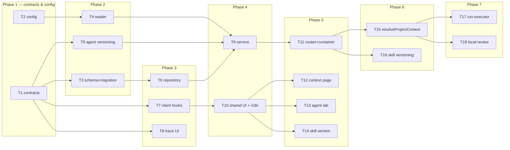

# Implementation Plan: Project Context

## Overview

Build the missing **producer** for a consumer that already exists. `reviewer-core`'s
`assemblePrompt` already renders a `## Project context` section from a `specs?: string[]` slot,
already records it in `PromptAssembly.specs`, `RunTrace.specs_read` already lives in
`@devdigest/shared`, and `client/.../TraceBody.tsx` already renders both — but the server writes
`specs_read: []` and never passes `specs`. This feature discovers Markdown documents in a repo's
clone, lets a human attach them to an agent or a skill, prices them in tokens against a budget,
detects drift since attach time, injects the live bodies as untrusted data at run time, and makes
every injection and omission auditable in the trace.

Source of requirements: `/Users/zhabskyi/AI/Neoversity/dev-digest/specs/2026-08-18-project-context.md`
(`SPEC-2026-08-18-project-context`, AC-1 … AC-44). This plan does not restate scope decisions — it
plans them.

## Execution mode

**multi-agent (parallel)** — chosen by the requesting orchestrator ("non-overlapping Owned paths per
task so `run-plan` can dispatch `implementer-backend` / `implementer-ui` in parallel"). The plan is
therefore phased into waves, contracts land first, and no two tasks that can run concurrently share
a file. 18 tasks across 7 phases; the widest wave is 4 concurrent tasks.

> The three decisions listed under *Open questions & recommendations* were proposed as defaults and
> **all three were confirmed by the user on 2026-08-18**. No task is pending a decision.

## Requirements (verified)

Every `AC-N` in the spec appears in exactly one R-item. None is out of scope.

**Discovery**

- **R1 (covers AC-1, AC-34, AC-2, AC-3):** Walk a repo's clone and return every `.md` file under a
  configured context-root directory segment (`specs`, `docs`, `insights`) at any depth, **plus**
  every file whose basename matches a configured conventional-filename allowlist (default
  `insights.md`, case-insensitive), typed by the convention it matched. Exclude any path containing
  a `clones`, `node_modules`, `.git`, `dist`, or `.next` segment. Drop any entry that, after symlink
  resolution, resolves outside the clone root.
- **R2 (covers AC-4, AC-5, AC-43):** No clone on disk → HTTP 200, empty list, machine-readable
  `not_cloned` reason. Cap discovery at a configured max document count and max per-file size, and
  report per-cap omission counters. A repo with zero matching documents renders an empty state that
  names the **configured** roots and conventional filenames (not hardcoded copy).
- **R3 (covers AC-6):** A user-triggered rescan re-walks the clone without a server restart and
  reflects files added, removed, or modified since the previous scan. Idempotent under concurrency.

**Metadata & token accounting**

- **R4 (covers AC-7, AC-8, AC-9):** Every discovered document exposes clone-relative `path`, `type`,
  `size_bytes`, `content_hash`, and an estimated `tokens`. The estimate comes from the workspace's
  configured token counter over the full raw body and is reused while the content hash is unchanged
  (a second list call over an unmodified clone counts **zero** documents). Every rendered token
  figure carries an approximation marker.
- **R5 (covers AC-10, AC-11):** A preview returns the markdown body up to a configured cap and the
  client renders it as formatted, **read-only** markdown. Each document reports how many distinct
  agents currently have it in their *effective* attachment set.

**Attaching**

- **R6 (covers AC-12, AC-13, AC-15, AC-14):** Toggling a document on an agent's `Context` tab or a
  skill's `Project context to use` section persists an attachment recording repository + path and
  **no text**. Re-attaching the same document is a no-op. Each attachment set has an explicit
  persisted order, which is the prompt render order.
- **R7 (covers AC-16, AC-17, AC-40, AC-41, AC-18):** An agent's *effective* context set = its own
  attachments, then the attachments of every skill both linked to it and globally enabled,
  de-duplicated by `(repo_id, path)` keeping the first occurrence's position. The summed token
  estimate renders **against the configured budget**; exceeding it shows an explicit over-budget
  state naming the tail documents AC-23 would drop, in the same order — advisory only, never
  blocking attach / save / run. A client-side filter narrows visible rows by path or filename
  without altering the set.

**Drift**

- **R8 (covers AC-35, AC-36, AC-37, AC-38):** Attaching records the content hash, size, and the
  clone's current commit revision. A scan/rescan whose current hash differs from the recorded hash
  marks the attachment changed-since-attached everywhere it is listed. Confirming advances the
  recorded hash/size and clears the marker **without touching the clone**. Drift detail shows the
  document at the recorded revision vs. now; an unresolvable revision degrades to
  current-content-plus-note and confirmation still works.

**Versioning**

- **R9 (covers AC-19):** Changing an agent's attachment set bumps `agents.version` and writes the
  resulting ordered path list into the immutable `AgentVersionConfig` snapshot.
- **R10 (covers AC-39, AC-42):** A skill's attachment set is snapshotted into `skill_versions`
  alongside its body. A new version is appended when the body changes, the attachment set changes,
  or both — and **not** when neither changes.

**Run-time injection**

- **R11 (covers AC-20, AC-21, AC-26, AC-27, AC-28):** A run reads each attached document's *current*
  content from the clone and supplies the bodies, in persisted order, to the existing prompt
  project-context slot as delimiter-wrapped untrusted data under the shared injection guard. An
  empty effective set produces a byte-identical prompt to today. Assembling project context issues
  **zero** model calls. The same resolution applies to the PR path, the local (no-PR) path, and the
  CI path — which is why it lives in the shared prompt-context builders, not in one executor.
- **R12 (covers AC-22, AC-23, AC-24, AC-25, AC-44):** Every failure degrades, never fails the run:
  missing / unreadable / escaping-the-clone → omitted with a reason; over-budget → inject the
  in-budget prefix and record the remainder; any single body truncated to a configured character
  cap and marked truncated; an attachment from a different repository than the run's PR → omitted
  as `wrong_repo`; content whose hash differs from the attach-time hash → **inject the live content
  anyway** and record `changed_unconfirmed`, using the content the run itself read.

**Trace & transparency**

- **R13 (covers AC-29, AC-30, AC-31, AC-32, AC-33):** The persisted trace carries, per document in
  the effective set, its path, token count, and outcome (`injected` | `missing` |
  `dropped_over_budget` | `truncated` | `wrong_repo` | `changed_unconfirmed`). The trace view lists
  the documents read in its configuration section; the Prompt Assembly panel presents the
  project-context block as a distinct labelled slot **marked untrusted**, expandable and copyable,
  omitted entirely when nothing was injected. Traces persisted before this feature load and render
  without error.

## Open questions & recommendations

Three decisions were proposed as defaults; **all three confirmed by the user on 2026-08-18**.
Nothing here blocks a task.

- **Q1 — Execution mode.** → **multi-agent (parallel)**, per the request's explicit framing. Settled.
- **Q2 — Where the scan result lives.** → **confirmed: a persisted `project_context_documents` table**
  (`repo_id, path, type, size_bytes, content_hash, tokens, scanned_at`, `UNIQUE (repo_id, path)`).
  Rationale: it is the only shape that makes AC-8's "zero token-counter calls on the second list"
  survive a restart, gives AC-6's rescan a real before/after, backs the `scanned_at` field the
  contract already specifies, and turns AC-11's `used_by_agents` into a join rather than an
  in-process scan. Alternative (in-memory `Map` keyed by content hash) is one less migration but
  makes the p95 < 200 ms cached-list NFR cold-start-dependent. **Confirmed 2026-08-18.**
- **Q3 — AC-34 conventional-filename allowlist default** (listed as *Still open* in the spec). →
  **confirmed: `insights.md` only**, exactly as AC-34 states, with `README.md` / `RFC*.md` /
  `ADR*.md` reachable through configuration but off by default. Widening the default to match
  `modules/reviews/intent/evidence.ts` would multiply per-repo document counts and push most repos
  straight into the AC-5 caps and the AC-40 over-budget state on day one. **Confirmed 2026-08-18.**

**Recommendations (not spec edits):**

- **Rec-1 — Delete the dead pre-existing surface rather than build beside it.** `SpecFile` and
  `IndexStatus` (`server/src/vendor/shared/contracts/platform.ts:259-273`) and the hooks
  `useContextFiles` / `useReindexContext` (`client/src/lib/hooks/core.ts:123-137`) already point at
  `GET /repos/:id/context` — an endpoint the server never implemented. `client/messages/en/context.json`
  likewise already exists and carries `chunks`, `reindex`, `mode.edit`, and `editor.save` keys that
  are now explicit **Non-goals**. Two competing "project context" surfaces is worse than one. T7
  removes the dead hooks and T10 rewrites the message catalogue; the `SpecFile`/`IndexStatus`
  contracts are left in place (removing exported contract symbols is a breaking change) but are
  documented as superseded.
- **Rec-2 — Give the trace item a single `outcome` plus two boolean flags.** The spec's contract
  collapses six mutually-exclusive outcomes into one field, but AC-24 (truncated) and AC-44
  (`changed_unconfirmed`) can hold for the *same* document, and so can AC-23 + AC-36 (the edge-case
  table already says a drifted-and-over-budget document is dropped for budget *and* keeps its drift
  marker). Plan resolves this as `outcome` (precedence `wrong_repo` > `missing` >
  `dropped_over_budget` > `changed_unconfirmed` > `truncated` > `injected`) **plus** optional
  `truncated: boolean` and `changed: boolean` flags, so no recorded fact is lost. Purely additive.
- **Rec-3 — Skill attachments must travel in the skill `PATCH` body.** AC-42's edge case ("body and
  attachment set changed in one save → exactly one new snapshot") is unsatisfiable if attachments
  are mutated through a separate endpoint. So skills get `PATCH /skills/:id { …, context }` while
  agents get a dedicated `PUT /agents/:id/context`. The asymmetry is forced by AC-42; the symmetric
  alternative (a shared attachment endpoint) would append two skill versions for one logical save.
- **Rec-4 — The AC-40 preview and the AC-23 run-time drop must share one pure function.** They are
  specified to produce the same ordered drop list; keeping two implementations in sync by hand is a
  guaranteed future divergence. T9 owns `modules/project-context/helpers.ts::planBudget()`, and T15
  consumes it rather than re-deriving.
- **Rec-5 — Contract gap resolved, flagging it explicitly.** AC-43 requires the empty state to name
  the *configured* roots, but the spec's "Document list response" contract has no field carrying
  them. The list response therefore gains `roots: string[]` and `conventional_filenames: string[]`
  (and `budget_tokens`, which AC-40 needs on the agent side anyway). The spec says field names are
  indicative, so this is a filled gap, not a deviation.
- **Rec-6 — There is no distinct CI review executor today.** `source: 'ci'` exists only as a
  `RunTrace.config.source` / `agent_runs.source` enum value (`server/src/db/schema/runs.ts:41`); no
  CI code path calls `reviewPullRequest`. AC-28 is therefore satisfied *by construction* — putting
  the resolution in `modules/reviews/prompt-context.ts` means any future CI executor inherits it —
  and its observable is demonstrable on the PR + local paths only. Flagged so `plan-verifier` does
  not hunt for a third executor.

## Affected modules & contracts

- **`server/` (`@devdigest/api`)** — new feature module `src/modules/project-context/` (reader,
  repository, service, routes, helpers, constants); two new tables + one column in `src/db/schema/`;
  new configuration keys in `src/platform/config.ts`; a new `container.projectContext` binding;
  run-time resolution in `src/modules/reviews/prompt-context.ts` consumed by `run-executor.ts` and
  `local-review.ts`; version-snapshot changes in `src/modules/agents/` and `src/modules/skills/`.
- **`client/` (`@devdigest/web`)** — new route `/repos/[repoId]/context`; a `Context` tab in the
  agent editor; a `Project context to use` section in the skill detail; shared attachment/budget/
  drift components; new TanStack Query hooks; the Prompt Assembly slot relabelled untrusted.
- **`reviewer-core/`** — **no change**. Verified against `reviewer-core/src/prompt.ts`: the `specs`
  slot (`PromptParts.specs`, line 63), its `wrapUntrusted('spec-N', …)` rendering (line 219-222),
  the `## Project context` section (line 239), and `PromptAssembly.specs` (line 261) are all already
  in place and are consumed unchanged. T15's acceptance re-verifies this by asserting the package is
  untouched.
- **`e2e/`, `mcp-server/`** — no change.
- **Contracts:**
  - **New:** `server/src/vendor/shared/contracts/project-context.ts` (mirrored to
    `client/src/vendor/shared/contracts/project-context.ts`).
  - **Edited (explicit callout — breaking-change risk, both handled in T1):**
    `contracts/trace.ts` gains an **optional** `RunTrace.project_context` array. It must be
    `.nullish()`: `buildRunTrace` (`server/src/platform/trace-builder.ts:56`) `.parse()`s the trace
    on write and `getRunTrace` casts rather than parses on read, so a required field would break
    AC-33 and every pre-existing trace.
    `contracts/knowledge.ts` gains `AgentVersionConfig.context` — which **must** carry
    `.default([])`, because `toAgentVersionDto` (`server/src/modules/agents/helpers.ts:39`) parses
    every stored `agent_versions.config_json` through this schema and would otherwise throw on every
    row written before this feature.
  - **Not edited:** `contracts/platform.ts` — `SpecFile`/`IndexStatus` stay as they are (see Rec-1).

## Architecture changes

Onion placement for every new piece (`server/`):

| Layer | File | Role |
|---|---|---|
| Ports / contracts | `server/src/vendor/shared/contracts/project-context.ts` | document, attachment, drift, effective-set, trace-item shapes |
| Infrastructure | `server/src/db/schema/context.ts` (+ migration) | `project_context_documents`, `context_attachments`; `skill_versions.attachments` in `schema/skills.ts` |
| Infrastructure | `server/src/modules/project-context/reader.ts` | filesystem walk, symlink containment, hashing, caps — the only fs-touching file in the module |
| Infrastructure | `server/src/modules/project-context/repository.ts` | the only file allowed to touch `db/schema` for these tables |
| Application | `server/src/modules/project-context/service.ts` | orchestration; reaches git/tokenizer **only** via `container.git` / `container.tokenizer` |
| Application (pure) | `server/src/modules/project-context/helpers.ts` | `planBudget()`, effective-set de-dup, outcome precedence — no I/O, unit-testable |
| Composition root | `server/src/platform/container.ts` | `container.projectContext` lazy getter + `ContainerOverrides.projectContext` |
| Transport | `server/src/modules/project-context/routes.ts` | Zod `params`/`querystring`/`body` via `fastify-type-provider-zod`; rescan carries `config: { rateLimit: { max: 6, timeWindow: '1 minute' } }` |
| Application (shared builders) | `server/src/modules/reviews/prompt-context.ts` | `resolveProjectContext()` — the single place all three review paths get project context from |

Cross-module edges go through the container facade, never through another module's internals:
`modules/skills/service.ts → container.projectContext` (AC-42's single-save snapshot) and
`modules/project-context/service.ts → container.agentsRepo` (AC-19's version bump).

Route surface:

```
GET   /repos/:id/context/documents              → ProjectContextListResponse      AC-1..7,11,43
POST  /repos/:id/context/rescan                 → ProjectContextListResponse      AC-6  (6/min)
GET   /repos/:id/context/documents/preview?path → ProjectContextPreview           AC-10
GET   /repos/:id/context/drift?owner_kind&owner_id&path → ProjectContextDrift     AC-38
POST  /repos/:id/context/confirm  {owner_kind, owner_id, path}                    AC-37
GET   /agents/:id/context                       → EffectiveProjectContext         AC-16,17,40
PUT   /agents/:id/context  {documents:[{repo_id,path}]}                           AC-12,14,15,19,35
GET   /skills/:id/context                       → skill attachments               AC-13
PATCH /skills/:id  (body gains `context`)                                         AC-13,39,42
```

Client structure: page `client/src/app/repos/[repoId]/context/page.tsx` (thin) →
`_components/ProjectContextView/`; shared, reused-by-three-screens pieces in
`client/src/components/project-context/`.



## Phased tasks

### Phase 1 — Contracts & configuration

- **T1**
  - **Action:** Add `server/src/vendor/shared/contracts/project-context.ts` defining:
    `ProjectContextDocType` (`specs|docs|insights`), `ProjectContextDocument`
    (`path, type, size_bytes, content_hash, tokens, used_by_agents, drift?`),
    `ProjectContextPreview` (adds `body`, `truncated`), `ProjectContextListResponse`
    (`documents, reason?: 'not_cloned', omitted?: {by_count,by_size}, scanned_at, roots,
    conventional_filenames, budget_tokens` — Rec-5), `ProjectContextRef` (`{repo_id, path}`),
    `ProjectContextAttachment` (`repo_id, path, order, attached_hash, attached_size,
    attached_revision, drift?` — **no body field**, AC-12), `ProjectContextDrift`
    (`path, attached_revision, previous?, current, previous_unavailable`),
    `EffectiveProjectContextDoc` (`repo_id, path, type, tokens, source: 'agent'|'skill',
    skill_id?, drift`), `EffectiveProjectContext` (`documents, total_tokens, budget_tokens,
    over_budget, dropped_paths`), `ProjectContextOutcome` (the six values of AC-29),
    `ProjectContextTraceItem` (`path, tokens, outcome, truncated?, changed?` — Rec-2). Export it
    from `server/src/vendor/shared/index.ts`. Extend `contracts/trace.ts` with
    `RunTrace.project_context: z.array(ProjectContextTraceItem).nullish()`. Extend
    `contracts/knowledge.ts` with `AgentVersionConfig.context: z.array(ProjectContextRef).default([])`
    and add the ordered attachment list to the skill-version DTO. Then **manually mirror all four
    files** into `client/src/vendor/shared/` — there is no sync script.
  - **Module:** server (contracts)
  - **Agent:** implementer-backend
  - **Skills to use:** zod, typescript-expert, onion-architecture, engineering-insights
  - **Owned paths:** `server/src/vendor/shared/contracts/project-context.ts`,
    `server/src/vendor/shared/contracts/trace.ts`, `server/src/vendor/shared/contracts/knowledge.ts`,
    `server/src/vendor/shared/index.ts`,
    `client/src/vendor/shared/contracts/project-context.ts`,
    `client/src/vendor/shared/contracts/trace.ts`, `client/src/vendor/shared/contracts/knowledge.ts`,
    `client/src/vendor/shared/index.ts`
  - **Depends-on:** none
  - **Risk:** medium — two existing contract files are edited; both are read by code that parses
    persisted JSON.
  - **Known gotchas:** `RunTrace.project_context` **must** be `.nullish()` — `buildRunTrace`
    (`server/src/platform/trace-builder.ts:56`) `.parse()`s the whole trace at write time and
    `getRunTrace` casts on read, so a required key breaks AC-33 and every historical trace.
    `AgentVersionConfig.context` **must** carry `.default([])` — `toAgentVersionDto`
    (`server/src/modules/agents/helpers.ts:39`) parses every stored `config_json`, and a required
    field throws on every pre-existing `agent_versions` row. `.default([])` is safe **here** but is
    forbidden on any contract passed as `schema:` to `llm.completeStructured` (server insight
    2026-08-08) — none of these are model-facing. `client/src/vendor/shared` is a hand-maintained
    copy; the canonical copy is the server one and both must end up identical.
  - **Acceptance:** `cd server && pnpm typecheck` and `cd client && pnpm typecheck` both pass;
    `diff -r server/src/vendor/shared/contracts client/src/vendor/shared/contracts` reports no
    differences; a node one-liner parsing `{}` through `AgentVersionConfig` for a legacy-shaped
    snapshot (no `context` key) succeeds and yields `context: []`; parsing a legacy `RunTrace`
    fixture with no `project_context` key succeeds.
    **→ satisfies AC-33** (partially; completed by T8)

- **T2**
  - **Action:** Add project-context configuration to `server/src/platform/config.ts` (Zod env
    schema + `AppConfig` fields), all defaulted, none constant: `projectContextRoots`
    (`PROJECT_CONTEXT_ROOTS`, default `specs,docs,insights`), `projectContextFilenames`
    (`PROJECT_CONTEXT_FILENAMES`, default `insights.md`), `projectContextBudgetTokens`
    (default `12000`), `projectContextDocCharCap` (default `16000`), `projectContextMaxDocs`
    (default `500`), `projectContextMaxFileBytes` (default `1048576`),
    `projectContextPreviewChars` (default `16000`). Document each in `server/.env.example`.
  - **Module:** server
  - **Agent:** implementer-backend
  - **Skills to use:** zod, typescript-expert, fastify-best-practices, engineering-insights
  - **Owned paths:** `server/src/platform/config.ts`, `server/.env.example`
  - **Depends-on:** none
  - **Risk:** low
  - **Known gotchas:** The measured defaults (16 000 chars / 12 000 tokens) are **configuration**, so
    no call site may hardcode them — every consumer reads `container.config.*`. Comma-separated env
    values need trimming and lower-casing for the case-insensitive filename match.
  - **Acceptance:** `cd server && pnpm exec vitest related --run src/platform/config.ts --exclude '**/*.it.test.ts' --reporter=dot` passes;
    `grep -n "12000\|16000" server/src/platform/config.ts` shows the numbers appear **only** as env
    defaults; `grep -rn "12000\|16000" server/src/modules server/src/adapters` returns nothing.
    **→ no AC — enabling work for AC-5, AC-23, AC-24, AC-40, AC-43**

### Phase 2 — Schema, reader, agent versioning

- **T3**
  - **Action:** Add to `server/src/db/schema/context.ts`:
    `project_context_documents` — `id uuid pk`, `repo_id uuid not null references repos(id) on
    delete cascade`, `path text not null`, `type text not null check (type in
    ('specs','docs','insights'))`, `size_bytes integer not null`, `content_hash text not null`,
    `tokens integer not null`, `scanned_at timestamptz not null default now()`,
    `unique (repo_id, path)`.
    `context_attachments` — `id uuid pk`, `workspace_id`, `agent_id uuid references agents(id) on
    delete cascade` (nullable), `skill_id uuid references skills(id) on delete cascade` (nullable),
    `repo_id uuid not null references repos(id) on delete cascade`, `path text not null`,
    `order integer not null default 0`, `attached_hash text not null`, `attached_size integer not
    null`, `attached_revision text not null`, `created_at timestamptz not null default now()`,
    `check ((agent_id is not null) <> (skill_id is not null))`, **no body/content column**;
    partial unique indexes `(agent_id, repo_id, path) where agent_id is not null` and
    `(skill_id, repo_id, path) where skill_id is not null`; plus `index (repo_id, path)` and a
    partial `index (skill_id)`. Add `attachments jsonb` (nullable) to `skill_versions` in
    `server/src/db/schema/skills.ts`. Generate + apply the migration.
  - **Module:** server
  - **Agent:** implementer-backend
  - **Skills to use:** postgresql-table-design, drizzle-orm-patterns, typescript-expert,
    onion-architecture, engineering-insights
  - **Owned paths:** `server/src/db/schema/context.ts`, `server/src/db/schema/skills.ts`,
    `server/src/db/migrations/**`
  - **Depends-on:** T1
  - **Risk:** medium — migrations never run on boot, and drizzle-kit's `check()` emission has
    previously been unreliable in this repo.
  - **Known gotchas:** Migrations are **not** applied on boot — run `cd server && pnpm db:generate`
    then `pnpm db:migrate` explicitly (root `CLAUDE.md`). After generating, **read the emitted
    `.sql`** and confirm the `CHECK` on `context_attachments` and the two partial unique indexes are
    actually present; drizzle-kit has silently omitted a `check()` here before (server insight
    2026-08-07). If a migration must be regenerated after it was already applied, restore its
    original `when` value in `meta/_journal.json` — the migrator decides by timestamp only, so a
    fresh `when` makes it re-run and fail with "already exists" (same insight). PostgreSQL does not
    auto-index FK columns; `skill_id` and `repo_id` need explicit indexes. `attachments` on
    `skill_versions` is nullable on purpose — rows written before this feature have none. Never run
    `docker compose down -v`.
  - **Acceptance:** `cd server && pnpm db:generate && pnpm db:migrate` succeeds against a fresh
    database; `psql -c '\d context_attachments'` shows the CHECK constraint, both partial unique
    indexes, and **no** text/bytea column holding document content;
    `grep -niE "body|content|text\('(body|content)'" server/src/db/schema/context.ts` finds no such
    column on `context_attachments`; `cd server && pnpm typecheck` passes.
    **→ satisfies AC-12 (no-text storage), AC-15 (uniqueness)**

- **T4**
  - **Action:** Create `server/src/modules/project-context/reader.ts` + `constants.ts`. `reader.ts`
    exports `scanDocuments(cloneRoot, opts)` returning
    `{ documents: {path,type,size_bytes,content_hash}[], omitted: {by_count, by_size} }`. It walks
    the clone recursively; skips any directory segment in `EXCLUDED_SEGMENTS`
    (`clones`, `node_modules`, `.git`, `dist`, `.next`); accepts a file when a *directory* segment of
    its relative path matches a configured root **and** the file ends in `.md` (type = the matched
    root), **or** when its basename case-insensitively matches the conventional-filename allowlist
    (type = that convention's type); `realpath`s the clone root once and re-checks containment of
    every candidate **after** symlink resolution; skips files over `maxFileBytes` (counting them in
    `omitted.by_size`); stops at `maxDocs` (counting the rest in `omitted.by_count`); computes a
    sha256 `content_hash` over the raw bytes with `node:crypto`. Every failure is a skip, never a
    throw.
  - **Module:** server
  - **Agent:** implementer-backend
  - **Skills to use:** security, typescript-expert, onion-architecture, engineering-insights
  - **Owned paths:** `server/src/modules/project-context/reader.ts`,
    `server/src/modules/project-context/constants.ts`
  - **Depends-on:** T2
  - **Risk:** high — this is the untrusted-input boundary of the whole feature, and the `clones`
    exclusion is a correctness requirement, not a nicety.
  - **Known gotchas:** **NEVER write a literal glob containing the two-character sequence that
    closes a block comment inside a `/** … */` comment** — it terminates the comment and produces a
    cascade of `TS1434`/`TS1443`/`TS1109` errors far below the real cause (server insight
    2026-08-07). Use `//` line comments for anything describing the discovery pattern. Path
    containment by string prefix is **insufficient**: resolve, then `realpath`, then re-check against
    `realpath(cloneRoot) + path.sep` — copy the exact two-guard shape from
    `server/src/modules/reviews/intent/docs.ts:65-72`, including realpath-ing the root itself (on
    macOS a `/tmp` clone realpaths to `/private/tmp`, and comparing unlike forms drops everything).
    The `clones` exclusion is load-bearing beyond noise: an imported repo may itself be a checkout of
    DevDigest, whose `server/clones/` holds full copies of every other imported repo, so omitting it
    multiplies the list and can inject an unrelated project's specs. `server/clones/**` must also be
    excluded from every grep/glob you run while working.
  - **Acceptance:** `cd server && pnpm exec vitest related --run src/modules/project-context/reader.ts --exclude '**/*.it.test.ts' --reporter=dot`
    passes with a fixture clone containing `specs/a.md`, `docs/nested/b.md`, `pkg/insights/c.md`,
    `README.md`, `specs/d.txt`, `insights.md`, `server/insights.md`,
    `clones/other-repo/specs/x.md`, `node_modules/pkg/docs/y.md`, and a symlink pointing outside the
    root: the result is exactly `a.md`, `b.md`, `c.md`, `insights.md`, `server/insights.md` — the
    last two typed `insights` — and an over-cap fixture returns non-zero `omitted.by_count` and
    `omitted.by_size`. `cd server && pnpm typecheck` passes (proving no stray `*/` in a block
    comment).
    **→ satisfies AC-1, AC-2, AC-3, AC-5, AC-34**

- **T5**
  - **Action:** Extend the agents module so a version snapshot carries the ordered attachment list.
    Add the ordered `context` refs to the snapshot built in `server/src/modules/agents/repository.ts`,
    thread it through `helpers.ts` (`toAgentVersionDto` already parses `AgentVersionConfig`; add the
    attachment dimension to `isConfigChange`/`ConfigChangePatch` so an attachment-set change counts
    as a config change), and expose a service/repository method
    `bumpVersionWithContext(agentId, orderedRefs)` that the project-context service will call.
  - **Module:** server
  - **Agent:** implementer-backend
  - **Skills to use:** drizzle-orm-patterns, typescript-expert, onion-architecture,
    engineering-insights
  - **Owned paths:** `server/src/modules/agents/helpers.ts`,
    `server/src/modules/agents/repository.ts`, `server/src/modules/agents/service.ts`,
    `server/src/modules/agents/routes.ts`
  - **Depends-on:** T1
  - **Risk:** medium — touches the version-bump rule every existing agent edit already goes through.
  - **Known gotchas:** Do **not** initialise a class field from a constructor parameter property
    (`private repo = this.container.x`) — declare the type and assign in the constructor **body**, or
    you get `TS2729: Property 'container' is used before its initialization` (server insight
    2026-08-07). The snapshot is immutable history: an agent whose attachments never changed must
    keep producing byte-identical snapshots apart from the new `context: []`.
  - **Acceptance:** `cd server && pnpm exec vitest related --run src/modules/agents/helpers.ts src/modules/agents/repository.ts src/modules/agents/service.ts --exclude '**/*.it.test.ts' --reporter=dot`
    passes; a unit test proves `isConfigChange` returns `true` when only the ordered attachment list
    differs and `false` when it does not; `toAgentVersionDto` still parses a legacy snapshot lacking
    `context`.
    **→ satisfies AC-19** (route wiring completed by T11)

### Phase 3 — Data access & client foundations

- **T6**
  - **Action:** Create `server/src/modules/project-context/repository.ts` — the **only** file
    touching these tables. Methods: `upsertDocuments(repoId, rows)` (bulk upsert on
    `(repo_id, path)`, `DO UPDATE` only when the hash actually changed), `deleteMissing(repoId,
    paths)`, `listDocuments(repoId)`, `getDocument(repoId, path)`,
    `usedByAgentCounts(repoId)` — one query returning, per path, the count of **distinct** agents
    whose effective set contains it, i.e. agents with a direct attachment `UNION` agents linked to a
    skill that is `enabled = true` and has that attachment (AC-11);
    `listAttachments({agentId|skillId})`, `replaceAttachments(ownerRef, rows)` (transactional
    delete-then-insert so `order` is always contiguous), `getAttachment(ownerRef, repoId, path)`,
    `updateAttachedHash(...)` (AC-37), and `driftedPaths(repoId)`.
  - **Module:** server
  - **Agent:** implementer-backend
  - **Skills to use:** drizzle-orm-patterns, postgresql-table-design, typescript-expert,
    onion-architecture, engineering-insights
  - **Owned paths:** `server/src/modules/project-context/repository.ts`
  - **Depends-on:** T3
  - **Risk:** medium — `usedByAgentCounts` is the one genuinely non-trivial query.
  - **Known gotchas:** Never interpolate a JS `Date` into a raw `sql\`\`` template — use the typed
    helpers (`eq`/`gte`/`lt`), or you get `The "string" argument must be of type string … Received an
    instance of Date` surfacing as a bare 500 (server insight 2026-08-05). `replaceAttachments` must
    run inside `db.transaction` so a partial write never leaves an owner with a gap-ridden `order`.
    The two-gate skill rule (linked **AND** `enabled = true`) is the same rule
    `resolveAgentSkills` already applies — mirror it, do not invent a third.
  - **Acceptance:** `cd server && pnpm exec vitest related --run src/modules/project-context/repository.ts --exclude '**/*.it.test.ts' --reporter=dot`
    passes; an `.it.test.ts` (testcontainers Postgres) proves `usedByAgentCounts` returns 2 for a
    document attached directly to agent A and via an enabled skill linked to agent B, and 1 once
    that skill is disabled; `replaceAttachments` called twice with the same list leaves exactly one
    row per `(owner, repo_id, path)`.
    **→ satisfies AC-11, AC-14 (persisted order), AC-15**

- **T7**
  - **Action:** Add `client/src/lib/hooks/project-context.ts` with TanStack Query hooks over the
    route surface above — `useProjectContextDocuments(repoId)`, `useRescanProjectContext(repoId)`,
    `useDocumentPreview(repoId, path)`, `useDocumentDrift(...)`, `useConfirmDrift(...)`,
    `useAgentContext(agentId)`, `useSetAgentContext(agentId)`, `useSkillContext(skillId)` — using
    query keys `["project-context", repoId]`, `["project-context-preview", repoId, path]`,
    `["agent-context", agentId]`, `["skill-context", skillId]`, and invalidating the sets that a
    mutation actually changes (attaching invalidates the document list too, because
    `used_by_agents` moves). Re-export from `client/src/lib/hooks/index.ts`. Remove the dead
    `useContextFiles` / `useReindexContext` hooks and their `SpecFile`/`IndexStatus` imports from
    `client/src/lib/hooks/core.ts` and `client/src/lib/types.ts` (Rec-1).
  - **Module:** client
  - **Agent:** implementer-ui
  - **Skills to use:** frontend-architecture, react-best-practices, next-best-practices,
    typescript-expert, engineering-insights
  - **Owned paths:** `client/src/lib/hooks/project-context.ts`, `client/src/lib/hooks/index.ts`,
    `client/src/lib/hooks/core.ts`, `client/src/lib/types.ts`
  - **Depends-on:** T1
  - **Risk:** low
  - **Known gotchas:** All server data goes through a hook in `src/lib/hooks/*` → `src/lib/api.ts`;
    never `fetch` from a component (`client/CLAUDE.md`). `apiFetch` only sets a JSON content-type
    when a body is present, so a body-less `POST /…/rescan` is fine as-is. Removing the dead hooks
    also requires removing their now-unused type re-exports, or `pnpm typecheck` fails on unused
    imports.
  - **Acceptance:** `cd client && pnpm typecheck` passes; `grep -rn "useContextFiles\|useReindexContext" client/src`
    returns nothing; `cd client && pnpm exec vitest related --run src/lib/hooks/project-context.ts --reporter=dot` passes.
    **→ no AC — enabling work for AC-6, AC-10, AC-12, AC-17, AC-37, AC-38**

- **T8**
  - **Action:** In `client/src/app/repos/[repoId]/pulls/[number]/_components/RunTraceDrawer/_components/TraceBody/TraceBody.tsx`,
    relabel the project-context Prompt Assembly slot so it reads as a distinct **untrusted** slot
    (AC-31) — the existing `PromptBlock` already provides expand + copy + fullscreen, so this is a
    label and message-key change, not a new component — and render the new optional
    `trace.project_context` array as a per-document outcome list inside the Configuration section
    next to `Specs read`. Guard every new read with a nullish check: the field is absent on every
    historical trace. Update `client/messages/en/runs.json` with the new keys
    (`trace.prompt.specs` → "Project context — attached specs (untrusted)", per-outcome labels) and
    extend `RunTraceDrawer.test.tsx` so a legacy trace fixture with neither `project_context` nor a
    `prompt_assembly.specs` value still renders.
  - **Module:** client
  - **Agent:** implementer-ui
  - **Skills to use:** react-best-practices, react-testing-library, frontend-architecture,
    typescript-expert, engineering-insights
  - **Owned paths:**
    `client/src/app/repos/[repoId]/pulls/[number]/_components/RunTraceDrawer/_components/TraceBody/TraceBody.tsx`,
    `client/src/app/repos/[repoId]/pulls/[number]/_components/RunTraceDrawer/RunTraceDrawer.test.tsx`,
    `client/messages/en/runs.json`
  - **Depends-on:** T1
  - **Risk:** low — the slot already renders and already omits itself when `specs` is null (AC-32
    holds today); this hardens the label and adds the outcome list.
  - **Known gotchas:** `trace.project_context` is `undefined`, not `[]`, on every trace written
    before this feature — the trace is stored as one jsonb document that is **cast, not parsed**, on
    read, so `undefined` is a real runtime value. Never hardcode a user-facing string; every label is
    a `next-intl` key in `messages/en/runs.json`.
  - **Acceptance:** `cd client && pnpm exec vitest related --run src/app/repos/\[repoId\]/pulls/\[number\]/_components/RunTraceDrawer/_components/TraceBody/TraceBody.tsx --reporter=dot`
    passes; a test named for AC-32 asserts no project-context block renders for a trace whose
    `prompt_assembly.specs` is null; a test named for AC-33 asserts a fixture lacking
    `project_context` renders without throwing; the rendered slot label contains the word
    "untrusted"; `grep -rn "Project context" client/src/app/repos` finds the string only in
    `messages/en/runs.json`.
    **→ satisfies AC-31, AC-32, AC-33**

### Phase 4 — Domain service & shared UI

- **T9**
  - **Action:** Create `server/src/modules/project-context/service.ts` + `helpers.ts`.
    `helpers.ts` (pure, no I/O): `planBudget(docs, budgetTokens)` → `{ injected, dropped }` using
    stop-at-first-overflow ordering, shared by AC-40's preview and AC-23's run-time drop (Rec-4);
    `mergeEffectiveSet(ownAttachments, skillAttachments)` implementing AC-16's agent-first,
    de-dup-by-`(repo_id, path)`, keep-first-position rule; `outcomePrecedence()` per Rec-2.
    `service.ts`: `list(workspaceId, repoId)` — returns `{documents:[], reason:'not_cloned'}` with a
    200 when `repos.clonePath` is null (AC-4); otherwise scans via `reader.scanDocuments`, upserts,
    reuses the persisted `tokens` while `content_hash` is unchanged and calls
    `container.tokenizer.count()` **only** for new/changed hashes (AC-8), joins `used_by_agents`
    (AC-11) and drift markers (AC-36), and returns the configured `roots`,
    `conventional_filenames`, and `budget_tokens` (AC-43, AC-40). `rescan()` — same walk, forced
    (AC-6). `preview(repoId, path)` — containment-checked read capped at
    `projectContextPreviewChars` (AC-10). `setAgentContext(agentId, refs)` — records
    `attached_hash`/`attached_size` from the current file and `attached_revision` from
    `container.git.currentHead()` (AC-35), persists order (AC-14), idempotent (AC-15), then calls
    `container.agentsRepo.bumpVersionWithContext` (AC-19). `setSkillContext(...)` — same, minus the
    version bump (T16 owns skill versioning). `effectiveContext(agentId)` — AC-16/17/40.
    `drift(ownerRef, repoId, path)` — `container.git.readFileAt(repo, attached_revision, path)`,
    degrading to `previous_unavailable: true` when the revision is gone (AC-38).
    `confirm(ownerRef, repoId, path)` — advances the stored hash/size/revision, **never writes the
    clone** (AC-37).
  - **Module:** server
  - **Agent:** implementer-backend
  - **Skills to use:** onion-architecture, security, typescript-expert, zod, engineering-insights
  - **Owned paths:** `server/src/modules/project-context/service.ts`,
    `server/src/modules/project-context/helpers.ts`
  - **Depends-on:** T4, T5, T6
  - **Risk:** high — the largest single surface, and the one place AC-16's two-gate rule and AC-8's
    cache semantics can silently go wrong.
  - **Known gotchas:** Reach git and the tokenizer **only** through `container.git` /
    `container.tokenizer` — never import `simple-git` or `js-tiktoken` here (onion rule). The
    two-gate skill rule (linked **AND** globally enabled) must mirror
    `server/src/modules/reviews/prompt-context.ts::resolveAgentSkills`, which is the existing
    precedent. Every path this service passes to a read must be containment-checked again, not
    trusted because it came out of the scan table — the table is written from user-controlled repo
    contents. `container.git.readFileAt` **rejects** when the path does not exist at that ref; that
    rejection is AC-38's `previous_unavailable`, not an error. Do not initialise a class field from
    a constructor parameter property (`TS2729`, server insight 2026-08-07).
  - **Acceptance:** `cd server && pnpm exec vitest related --run src/modules/project-context/service.ts src/modules/project-context/helpers.ts --exclude '**/*.it.test.ts' --reporter=dot`
    passes; unit tests prove — (a) a second `list()` over an unmodified fixture clone invokes a spy
    tokenizer **zero** times while the first invokes it once per document, and editing one file
    re-counts exactly one (AC-8); (b) `mergeEffectiveSet` for an agent with `security-baseline.md`
    direct + an enabled linked skill attaching `security-baseline.md` + `public-api.md` yields
    exactly two documents with `security-baseline.md` first, and disabling the skill drops
    `public-api.md` (AC-16); (c) `planBudget` over a set whose second document alone exceeds the
    budget returns `injected=[first]`, `dropped=[second, …rest]` (AC-23/AC-40 parity); (d) a repo
    row with `clonePath: null` returns `{documents: [], reason: 'not_cloned'}` (AC-4); (e) `confirm`
    leaves the fixture file's mtime and bytes unchanged (AC-37).
    **→ satisfies AC-4, AC-6, AC-7, AC-8, AC-10, AC-16, AC-17, AC-35, AC-36, AC-37, AC-38, AC-40**

- **T10**
  - **Action:** Create the client pieces reused by all three screens under
    `client/src/components/project-context/`: `AttachmentList` (keyboard-operable checkbox list —
    every row Tab-reachable, Space-toggleable, accessible name including the document path **and**
    its token estimate; reorder achievable without a pointer; drift and token state never carried by
    colour alone), `DocumentFilter` (AC-18, purely visual narrowing), `TokenBudgetBar` (`≈ N / M
    tokens`, over-budget state naming the tail documents that would be dropped, advisory only),
    `DriftBadge`, `DocumentPreview` (react-markdown + remark-gfm, **no** `rehype-raw`, read-only,
    no Edit affordance), and `DriftCompare` (a small pure LCS line differ in a colocated
    `helpers.ts` — no new dependency). Rewrite `client/messages/en/context.json` as the **complete**
    key set for the whole feature (page title, empty states for `not_cloned` and no-documents,
    filter placeholder, token/approximation labels, budget + over-budget copy, drift labels and
    confirm copy, tab/section titles for the agent and skill screens), dropping the stale
    `chunks` / `reindex` / `mode.edit` / `editor.*` keys that are now explicit Non-goals.
  - **Module:** client
  - **Agent:** implementer-ui
  - **Skills to use:** frontend-architecture, react-best-practices, react-testing-library,
    next-best-practices, security, typescript-expert, engineering-insights
  - **Owned paths:** `client/src/components/project-context/**`,
    `client/messages/en/context.json`
  - **Depends-on:** T7
  - **Risk:** medium — this task owns the message catalogue for three downstream tasks, so its key
    set must be complete before T12/T13/T14 start.
  - **Known gotchas:** The preview renders **untrusted** markdown from a third-party repository: use
    `react-markdown` (already a dependency) **without** `rehype-raw`, so embedded HTML and scripts
    never execute, and do not auto-load remote images. The `Edit` half of the `Preview | Edit`
    toggle is a Non-goal — it must be absent or visibly disabled. Every user-facing string is a
    `next-intl` key; document paths and bodies are data and are never translated. `"use client"`
    only where interactivity actually requires it.
  - **Acceptance:** `cd client && pnpm exec vitest related --run src/components/project-context --reporter=dot`
    passes; RTL tests prove — each attachment row is reachable via `user.tab()` and toggles on
    `user.keyboard('{ }')`, and its accessible name (`getByRole('checkbox', { name: /… ≈ \d+ tokens/ })`)
    contains both the path and the token estimate; every rendered token figure matches `/≈/`;
    a preview fed `<script>alert(1)</script>\n` renders the text and produces
    no `<script>` element (`container.querySelector('script')` is null); the over-budget state lists
    the dropped paths in order and no control is disabled by it.
    **→ satisfies AC-9, AC-18, AC-41** (and supplies the components AC-10/AC-40/AC-43 need)

### Phase 5 — Routes & feature screens

- **T11**
  - **Action:** Create `server/src/modules/project-context/routes.ts` exposing the nine endpoints
    listed under *Architecture changes*, each declaring `params`/`querystring`/`body`/`response`
    through `fastify-type-provider-zod` (never `Schema.parse` inside a handler). `POST
    /repos/:id/context/rescan` carries `config: { rateLimit: { max: 6, timeWindow: '1 minute' } }`.
    Resolve tenancy through `getContext` from `modules/_shared/context.ts`. Register a lazy
    `projectContext` getter on `server/src/platform/container.ts` plus a
    `ContainerOverrides.projectContext` field so tests can inject a double, and add
    `projectContext` to `server/src/modules/index.ts`.
  - **Module:** server
  - **Agent:** implementer-backend
  - **Skills to use:** fastify-best-practices, zod, security, onion-architecture, typescript-expert,
    engineering-insights
  - **Owned paths:** `server/src/modules/project-context/routes.ts`,
    `server/src/platform/container.ts`, `server/src/modules/index.ts`
  - **Depends-on:** T9
  - **Risk:** medium — `container.ts` and `modules/index.ts` are repo-wide files; nothing else may
    be editing them in this phase.
  - **Known gotchas:** Route-level `config: { rateLimit }` is **inert under `app.inject()`** —
    `app.ts:95` skips registering `@fastify/rate-limit` entirely when `nodeEnv === 'test'` (server
    insight 2026-08-09), so the rescan limit can never be asserted by a test; verify it by reading
    the route config, and never rely on it as a correctness fence. Routes must not touch
    `db/schema` or an adapter directly — go through the service. The `path` query parameter is
    attacker-influenced: validate it as a non-empty string with no leading `/` and no `..` at the
    schema layer, then let the service re-check containment after realpath (defence in depth, same
    as `intent/docs.ts`).
  - **Acceptance:** `cd server && pnpm exec vitest related --run src/modules/project-context/routes.ts src/platform/container.ts --exclude '**/*.it.test.ts' --reporter=dot`
    passes; a route-smoke test proves `GET /repos/:id/context/documents` for a repo with
    `clone_path = null` returns **200** with `{documents: [], reason: 'not_cloned'}` (AC-4) and that
    `?path=../../etc/passwd` on the preview route is rejected with 422 before the handler runs;
    `grep -n "rateLimit" server/src/modules/project-context/routes.ts` shows `max: 6`;
    `grep -rn "db/schema\|adapters/" server/src/modules/project-context/routes.ts` returns nothing.
    **→ satisfies AC-19 (wiring), AC-37, AC-38 (endpoints); completes AC-4**

- **T12**
  - **Action:** Add the route `client/src/app/repos/[repoId]/context/page.tsx` (thin) plus
    `_components/ProjectContextView/`, modelled on the sibling
    `app/repos/[repoId]/conventions/` page. It lists discovered documents grouped by type with
    path, size, `≈ tokens`, `Used by N agents`, and a drift marker; provides the filter, a read-only
    markdown preview panel, and a `Rescan` action; renders the `not_cloned` empty state (AC-4) and
    the **no-documents** empty state naming the configured `roots` and `conventional_filenames`
    returned by the API rather than hardcoded copy (AC-43); shows omission counters when the caps
    fired (AC-5); and opens the drift detail (previous vs. current, or the
    "earlier version unavailable" note) with a working confirm action (AC-37, AC-38). No create /
    edit / upload / delete affordances, and no coverage ring or chunk count.
  - **Module:** client
  - **Agent:** implementer-ui
  - **Skills to use:** next-best-practices, react-best-practices, frontend-architecture,
    react-testing-library, security, typescript-expert, engineering-insights
  - **Owned paths:** `client/src/app/repos/[repoId]/context/**`
  - **Depends-on:** T10
  - **Risk:** medium
  - **Known gotchas:** Pages stay thin — feature logic lives in the colocated `_components/<Name>/`
    folder with its own `*.test.tsx` (`client/CLAUDE.md`). Next 15 `params` is async. The empty-state
    copy **must** interpolate the roots the API returned; a hardcoded "specs/, docs/ and insights/"
    string fails AC-43 the moment configuration changes. Non-goals are load-bearing here: the
    screenshot's `+` / new-folder / upload buttons and the `Edit` toggle must not exist.
  - **Acceptance:** `cd client && pnpm exec vitest related --run src/app/repos/\[repoId\]/context --reporter=dot`
    passes; RTL tests prove — a repo with no documents renders copy containing every root string the
    mocked API returned and none that it did not (AC-43); a `not_cloned` response renders the
    distinct clone-absent state, not the no-documents one (AC-4); `Rescan` issues the mutation and
    the list grows by one when the mocked response does (AC-6); a drifted row shows a non-colour-only
    marker and its detail renders both versions, while a `previous_unavailable: true` response
    renders the note **and** still enables confirm (AC-38);
    `grep -riE "upload|new folder|\bEdit\b" client/src/app/repos/\[repoId\]/context` finds no such
    control.
    **→ satisfies AC-5 (counters surfaced), AC-6, AC-10, AC-11, AC-36, AC-37, AC-38, AC-43**

- **T13**
  - **Action:** Add a `Context` tab to the agent editor — new
    `client/src/app/agents/[id]/_components/AgentEditor/_components/ContextTab/` composed from T10's
    shared components, registered in `AgentEditor.tsx` alongside the existing Config / Skills / Stats
    tabs. It lists the repo's documents with checkboxes, shows the effective set with `source`
    (direct vs. inherited from a skill), supports explicit reordering, renders the running total as
    `≈ N / M tokens` against the budget with the over-budget state naming the tail documents that
    would be dropped, keeps attach/save enabled while over budget, shows drift markers, and persists
    through `useSetAgentContext`.
  - **Module:** client
  - **Agent:** implementer-ui
  - **Skills to use:** react-best-practices, frontend-architecture, react-testing-library,
    next-best-practices, typescript-expert, engineering-insights
  - **Owned paths:** `client/src/app/agents/[id]/_components/AgentEditor/AgentEditor.tsx`,
    `client/src/app/agents/[id]/_components/AgentEditor/_components/ContextTab/**`
  - **Depends-on:** T10
  - **Risk:** low
  - **Known gotchas:** The token total is **derived** — compute it during render from the effective
    set; never mirror it into `useState` + `useEffect` (the top React anti-pattern this repo's skill
    set flags). Inherited-from-skill rows are not independently removable here — removing them means
    detaching from the skill. Over-budget is advisory: nothing may be disabled by it (AC-41).
  - **Acceptance:** `cd client && pnpm exec vitest related --run src/app/agents/\[id\]/_components/AgentEditor --reporter=dot`
    passes; RTL tests prove — checking two documents renders a total equal to the sum of their
    estimates and matching `/≈ \d+ \/ \d+ tokens/` (AC-17, AC-40); attaching past the budget shows
    the over-budget state listing the same tail paths, in the same order, that the API reported as
    `dropped_paths`, while the save control stays enabled (AC-40, AC-41); typing `sec` in the filter
    hides non-matching rows and clearing it restores previously-checked rows still checked (AC-18);
    a document attached both directly and via a skill appears once, in the direct position (AC-16).
    **→ satisfies AC-12, AC-14, AC-15 (UI), AC-16 (UI), AC-17, AC-18, AC-40, AC-41**

- **T14**
  - **Action:** Add a `Project context to use` section to the skill detail — new
    `client/src/app/skills/_components/SkillDetail/_components/ContextTab/` composed from T10's
    shared components, registered in `SkillDetail.tsx` next to Config / Preview / Stats / Versions.
    It attaches documents to the skill and submits the ordered list as part of the skill save
    (`PATCH /skills/:id { …, context }`), so a body-and-attachments edit is one save (AC-42).
  - **Module:** client
  - **Agent:** implementer-ui
  - **Skills to use:** react-best-practices, frontend-architecture, react-testing-library,
    typescript-expert, engineering-insights
  - **Owned paths:** `client/src/app/skills/_components/SkillDetail/SkillDetail.tsx`,
    `client/src/app/skills/_components/SkillDetail/_components/ContextTab/**`
  - **Depends-on:** T10
  - **Risk:** low
  - **Known gotchas:** Attachments travel in the skill `PATCH` body, **not** through a separate
    mutation — sending them separately would append two `skill_versions` rows for one logical save
    and break AC-42 (Rec-3). Skills are workspace-scoped while documents are repo-scoped, so the
    section needs an explicit repository selector; a skill attached to repo A's documents is inert on
    a repo-B review (AC-25).
  - **Acceptance:** `cd client && pnpm exec vitest related --run src/app/skills/_components/SkillDetail --reporter=dot`
    passes; RTL tests prove a checked document survives a remount from the mocked API response
    (AC-13), and that editing the body **and** toggling a document issues exactly **one** `PATCH`
    (asserted on the mocked fetch call count) carrying both fields (AC-42).
    **→ satisfies AC-13, AC-42 (UI half)**

### Phase 6 — Run-time resolution & skill versioning

- **T15**
  - **Action:** Add `resolveProjectContext(container, agentId, repoId, log): Promise<{ bodies:
    string[]; specsRead: string[]; details: ProjectContextTraceItem[] }>` to
    `server/src/modules/reviews/prompt-context.ts`, alongside the existing `buildCallersDigest` /
    `buildRepoMapDigest` / `resolveAgentSkills` builders — so the PR path, the local path, and any
    future CI path all get identical behaviour from one place (AC-28). Per document of the effective
    set, in persisted order: `repo_id !== repoId` → `wrong_repo`, skip (AC-25); read fresh from the
    clone with the resolve-then-recheck-after-realpath guard → failure → `missing`, skip (AC-22);
    hash the content just read and compare to `attached_hash` → differ → flag `changed: true` and
    still inject (AC-44); truncate to `config.projectContextDocCharCap` → flag `truncated: true`
    (AC-24); apply `helpers.planBudget` → over-budget documents get `dropped_over_budget` and
    everything after them is dropped too (AC-23); otherwise `injected`. The whole function is
    best-effort: any unexpected throw is caught, logged, and degrades to an empty result — a
    project-context failure must never fail a run. No model call anywhere (AC-27).
  - **Module:** server
  - **Agent:** implementer-backend
  - **Skills to use:** onion-architecture, security, typescript-expert, engineering-insights
  - **Owned paths:** `server/src/modules/reviews/prompt-context.ts`
  - **Depends-on:** T11
  - **Risk:** high — this is the code that decides what an LLM actually reads.
  - **Known gotchas:** AC-44's comparison must use **the content this run just read**, not the last
    scan's stored hash, because a run may happen with no rescan in between. `reviewer-core` must not
    change: it receives an ordered array of **bodies only** — no paths, no repo identity, no
    filesystem access — and does its own `wrapUntrusted('spec-N', …)` + `INJECTION_GUARD`. Do not
    add any keyword denylist over document content; the defence is the trusted-rule-plus-wrapper
    design (`reviewer-core/CLAUDE.md`, `server/CLAUDE.md`). Every enrichment in this file already
    returns `undefined`/`''` rather than throwing — match that contract exactly. Local review may
    have no `repoId` at all, in which case every attachment is `wrong_repo` and the prompt is
    unchanged.
  - **Acceptance:** `cd server && pnpm exec vitest related --run src/modules/reviews/prompt-context.ts --exclude '**/*.it.test.ts' --reporter=dot`
    passes; unit tests prove — an empty effective set returns `{bodies: [], specsRead: [], details: []}`
    and a stubbed `reviewPullRequest` receives no `specs` key, so the assembled prompt is
    byte-identical to today's (AC-26); a deleted attached file yields a completed result with that
    path recorded `missing` and absent from `bodies` (AC-22); a 200 KB document contributes at most
    `projectContextDocCharCap` characters and is flagged `truncated` (AC-24); an attachment from
    another repo is recorded `wrong_repo` and injects nothing (AC-25); an edited-but-unconfirmed
    document injects the **new** bytes and is flagged `changed` with outcome `changed_unconfirmed`
    (AC-44); a spy `LLMProvider` records zero calls for the whole resolution (AC-27);
    `git status --porcelain reviewer-core/` is empty (AC-21 — the engine is consumed unchanged).
    **→ satisfies AC-16 (run-time), AC-21, AC-22, AC-23, AC-24, AC-25, AC-26, AC-27, AC-28, AC-44**

- **T16**
  - **Action:** Extend the skills module so an attachment-set change is version-snapshotted like a
    body change. `PATCH /skills/:id` accepts an optional ordered `context` array; the service
    persists it through `container.projectContext.setSkillContext` and the repository's update path
    appends **exactly one** `skill_versions` row — carrying both `body` and `attachments` — when the
    body changed, the attachment set changed, or both, and **none** when neither did.
  - **Module:** server
  - **Agent:** implementer-backend
  - **Skills to use:** drizzle-orm-patterns, fastify-best-practices, zod, onion-architecture,
    typescript-expert, engineering-insights
  - **Owned paths:** `server/src/modules/skills/routes.ts`, `server/src/modules/skills/service.ts`,
    `server/src/modules/skills/repository.ts`, `server/src/modules/skills/helpers.ts`
  - **Depends-on:** T11
  - **Risk:** medium — changes the "snapshot only on real change" rule that eval reproducibility
    depends on.
  - **Known gotchas:** Today `SkillsRepository.update` snapshots only when `body` changed
    (`repository.ts:96-126`); the change-detection predicate must become `bodyChanged ||
    attachmentsChanged` and the snapshot write must stay inside the same transaction so one save can
    never produce two versions. Attachment-set comparison is order-sensitive — reordering **is** a
    change. Reach the project-context capability through `container.projectContext`, never by
    importing `modules/project-context/` internals (onion rule 6).
  - **Acceptance:** `cd server && pnpm exec vitest related --run src/modules/skills --exclude '**/*.it.test.ts' --reporter=dot`
    passes; an `.it.test.ts` proves — editing only the body appends exactly one `skill_versions`
    row; changing only the attachment set appends exactly one row whose `attachments` matches the
    new ordered list; changing both in one `PATCH` appends exactly one row carrying both; saving
    with neither changed appends none (AC-42); and the appended row's `version` equals
    `skills.version` after the bump (AC-39).
    **→ satisfies AC-13 (persistence), AC-39, AC-42**

### Phase 7 — Executor wiring

- **T17**
  - **Action:** In `server/src/modules/reviews/run-executor.ts`, call `resolveProjectContext` inside
    a `runLog.step('Loading project context', …)` next to the existing "Loading skills" step, pass
    `...(projectContext.bodies.length ? { specs: projectContext.bodies } : {})` to
    `reviewPullRequest` (matching the omit-when-empty contract the `skills`/`callers`/`repoMap`
    slots already use), and replace the hardcoded `specs_read: []` at line 358 with
    `projectContext.specsRead` plus `project_context: projectContext.details`. Leave the failure-path
    `specs_read: []` in `traceFromBuffer` (line 449) as-is — that trace is built for runs that never
    resolved a context set.
  - **Module:** server
  - **Agent:** implementer-backend
  - **Skills to use:** onion-architecture, typescript-expert, engineering-insights
  - **Owned paths:** `server/src/modules/reviews/run-executor.ts`
  - **Depends-on:** T15
  - **Risk:** medium — the hot path of every review.
  - **Known gotchas:** `specs_read` lists the documents **actually injected**, in order — not the
    whole effective set; the per-document detail array is what carries the omissions. `buildRunTrace`
    `.parse()`s the trace on write, so a malformed `project_context` array fails loudly at write
    time. `resolveProjectContext` never throws, so no extra try/catch is needed here — adding one
    would mask a genuine bug.
  - **Acceptance:** `cd server && pnpm exec vitest related --run src/modules/reviews/run-executor.ts --exclude '**/*.it.test.ts' --reporter=dot`
    passes; an `.it.test.ts` proves a run for an agent with one injected and one deleted attachment
    completes, and its persisted trace lists both paths with distinct outcomes while `specs_read`
    contains only the injected one (AC-29, AC-30), and the assembled user message contains
    `## Project context` followed by `<untrusted source="spec-0">` (AC-20);
    `grep -n "specs_read: \[\]" server/src/modules/reviews/run-executor.ts` returns exactly one
    line, inside `traceFromBuffer`.
    **→ satisfies AC-20, AC-29, AC-30**

- **T18**
  - **Action:** In `server/src/modules/reviews/local-review.ts`, call the same
    `resolveProjectContext` (using the `repoId` the method already resolves, or skipping cleanly
    when there is none) and pass `...(bodies.length ? { specs: bodies } : {})` to
    `reviewPullRequest`. Add a `degraded` note when attachments exist but no repo was given, so the
    CLI explains why nothing was injected. No persistence — a local review has no run id and no
    trace.
  - **Module:** server
  - **Agent:** implementer-backend
  - **Skills to use:** onion-architecture, typescript-expert, engineering-insights
  - **Owned paths:** `server/src/modules/reviews/local-review.ts`
  - **Depends-on:** T15
  - **Risk:** low
  - **Known gotchas:** This path deliberately persists nothing (`reviews`/`findings`/`agent_runs`/
    `run_traces` all hang off a `pr_id`) — do not add a trace write here. When `req.repo` is absent
    every attachment is `wrong_repo` by AC-25, which is correct, not a bug; surface it through the
    existing `degraded` array rather than silently injecting nothing.
  - **Acceptance:** `cd server && pnpm exec vitest related --run src/modules/reviews/local-review.ts --exclude '**/*.it.test.ts' --reporter=dot`
    passes; a unit test proves a local review for an agent with attachments on the **same** repo
    produces a user message whose `## Project context` section is identical to the PR path's for the
    same agent and repo (AC-28), and that omitting `req.repo` injects nothing and adds a `degraded`
    entry.
    **→ satisfies AC-28**

## Phase gates

After each phase (not after each task), the orchestrator runs the project-wide gate — implementers
never do, because a project-wide `tsc` fails on another agent's in-flight file:

```
./scripts/verify.sh              # typecheck + unit, every package (~20s)
./scripts/verify.sh --it         # + server integration tests, before the final phase closes
```

Additional gate notes specific to this plan:

- **Before Phase 3** the migration from T3 must be applied: `cd server && pnpm db:migrate`. Nothing
  runs it on boot, and the symptom of forgetting is `relation "context_attachments" does not exist`
  from the API, not a test failure.
- **`nvm use` first.** Node ≥ 22 or Fastify 5 fails suite *collection* with
  `TypeError: diagnostics.tracingChannel is not a function` and Next refuses to boot.
- **`cd reviewer-core && pnpm install`** must have run, or `server`'s typecheck fails with `TS2307:
  Cannot find module '@devdigest/reviewer-core'` — the server type-checks reviewer-core's raw
  source through a path alias, and `server`'s own install never touches that directory.
- Implementers verify only their own Owned paths with
  `pnpm exec vitest related --run <files> --exclude '**/*.it.test.ts' --reporter=dot`. The
  `--exclude` is not optional: without it `related` pulls in `.it.test.ts` files and silently starts
  a testcontainers Postgres (16 files / 17.7 s vs 2 files / 1.4 s, measured).

## Testing strategy

`test-writer` runs after `plan-verifier` passes and names each test after the AC id it proves.

- **server-unit** (hermetic, `*.test.ts`) — the bulk. `reader.ts` against fixture clone trees
  (AC-1/2/3/5/34), `helpers.ts` budget + effective-set merge (AC-16/23/40), `service.ts` with a spy
  tokenizer and a mocked `GitClient` from `src/adapters/mocks.ts` (AC-4/8/37/38),
  `prompt-context.ts` with a stubbed `LLMProvider` (AC-21/22/24/25/26/27/44), route smoke on the new
  module (AC-4 status code, path-traversal rejection).
- **server-integration** (`*.it.test.ts`, testcontainers Postgres) — the SQL and wiring bugs:
  `usedByAgentCounts` two-gate correctness (AC-11), `replaceAttachments` idempotence and ordering
  (AC-14/15), skill version snapshot counts across the four save combinations (AC-39/42), and a full
  run whose persisted trace carries `specs_read` + `project_context` (AC-20/29/30). Remember a test
  importing `test/helpers/pg.ts` **must** carry the `.it.test.ts` suffix or the CI split breaks.
- **client** (vitest + jsdom + RTL, `fetch` mocked) — the attachment list's keyboard/a11y contract
  and approximation markers (AC-9/18), the agent tab's totals and over-budget behaviour
  (AC-17/40/41), the skill section's single-PATCH save (AC-13/42), the context page's two distinct
  empty states and drift detail (AC-4/6/36/37/38/43), the untrusted-markdown preview producing no
  `<script>` (AC-10), and the trace drawer's legacy-fixture tolerance (AC-31/32/33).
- **reviewer-core** — no new tests; AC-26's golden-prompt comparison is asserted from the server side
  (T15) precisely because the engine is unchanged.
- **Browser flows** (`./scripts/e2e.sh`) — **not** required. This adds a new page and two new tabs
  but changes no existing seeded user journey, and the seeded demo repo has no clone with matching
  documents. Worth a follow-up flow once seed data carries a document corpus.

## Risks & mitigations

- **The `clones` exclusion is silently catastrophic if missed** — an imported repo that is itself a
  DevDigest checkout carries full copies of every other imported repo, so a missing exclusion
  multiplies the list and can inject an unrelated project's specs into a review. → T4's acceptance
  fixture contains `clones/other-repo/specs/x.md` and asserts it is absent; the exclusion list is a
  named constant in `constants.ts`, not an inline literal.
- **A `*/` inside a block comment describing the discovery glob truncates the comment** and produces
  a cascade of parser errors far from the cause. → Called out in T4's Known gotchas; T4's acceptance
  includes a clean `pnpm typecheck`.
- **`AgentVersionConfig` without `.default([])` throws on every historical `agent_versions` row**,
  breaking the agent version history page for every existing agent. → T1 gotcha + explicit
  acceptance parsing a legacy-shaped snapshot.
- **`RunTrace.project_context` as a required field breaks every historical trace** (`buildRunTrace`
  parses on write, `getRunTrace` casts on read). → `.nullish()` mandated in T1; AC-33 asserted from
  both sides (T1 parse test, T8 render test).
- **AC-40's preview and AC-23's run-time drop diverging** — two implementations of "what gets
  dropped" will disagree eventually and the UI will lie about the run. → One pure `planBudget()` in
  `helpers.ts`, consumed by both (Rec-4), with parity asserted in T9.
- **Drizzle-kit omitting the `CHECK` constraint** on `context_attachments`, letting a row carry both
  or neither owner. → T3 reads the emitted SQL and asserts the constraint exists in the applied
  schema, not just in the TypeScript.
- **Filesystem latency on a large repo** blowing the p95 < 2 s rescan target. → The AC-5 caps bound
  the walk; `maxDocs`/`maxFileBytes` are configuration, and the spec itself flags that per-repo
  counts rest on a thin corpus and should be revisited against real customer repos.
- **T10 owning the message catalogue for three downstream tasks** — an incomplete key set blocks
  T12/T13/T14 or tempts them to hardcode strings. → T10's task text enumerates the required key
  groups; T12's acceptance greps for hardcoded copy.
- **Untrusted markdown preview** — a document body is third-party text rendered in the operator's
  browser. → `react-markdown` without `rehype-raw`, asserted by a test feeding `<script>` and
  `onerror` payloads.

## Red-flags check

- [x] Every requirement maps to a task (R1→T4; R2→T4/T9/T12; R3→T9/T12; R4→T4/T6/T9/T10; R5→T9/T12;
      R6→T3/T6/T9/T13/T14; R7→T9/T13; R8→T9/T11/T12; R9→T5/T11; R10→T16; R11→T15/T17/T18;
      R12→T15; R13→T8/T17)
- [x] Every spec `AC-N` is carried into an R-item and discharged by a task's Acceptance — all of
      AC-1..AC-44, none deliberately left out of scope
- [x] Every task names an `Agent` matching its module (server/contracts → implementer-backend;
      client → implementer-ui)
- [x] Every on-demand skill a task needs is named in its `Skills to use` — `postgresql-table-design`
      on T3 and T6, `security` on T4, T9, T10, T11, T12, T15, `react-testing-library` on every UI
      task with an RTL acceptance, `zod` on every contract/route/schema task
- [x] No specification was authored or edited — the spec at
      `specs/2026-08-18-project-context.md` was read as input and is untouched
- [x] Execution mode is recorded (multi-agent, per the request) and the plan is phased into
      parallel waves for it
- [x] Dependencies form a DAG (no cycles) — see the Mermaid graph; every `Depends-on` points to a
      strictly earlier phase
- [x] (multi-agent) Concurrent tasks have non-overlapping Owned paths — verified per phase:
      P1 {contracts | config}, P2 {db/schema+migrations | project-context/reader+constants |
      modules/agents}, P3 {project-context/repository | client/lib/hooks | client RunTraceDrawer},
      P4 {project-context/service+helpers | client/components/project-context+messages/context.json},
      P5 {project-context/routes+container+modules/index | app/repos/../context | app/agents/.. |
      app/skills/..}, P6 {reviews/prompt-context | modules/skills}, P7 {run-executor | local-review}
- [x] Every Acceptance is measurable — each names a runnable command plus a concrete assertion
- [x] Edits to existing shared contracts are explicitly called out — `contracts/trace.ts` and
      `contracts/knowledge.ts` in *Affected modules & contracts*, with the back-compat constraint
      (`.nullish()` / `.default([])`) that makes each safe
