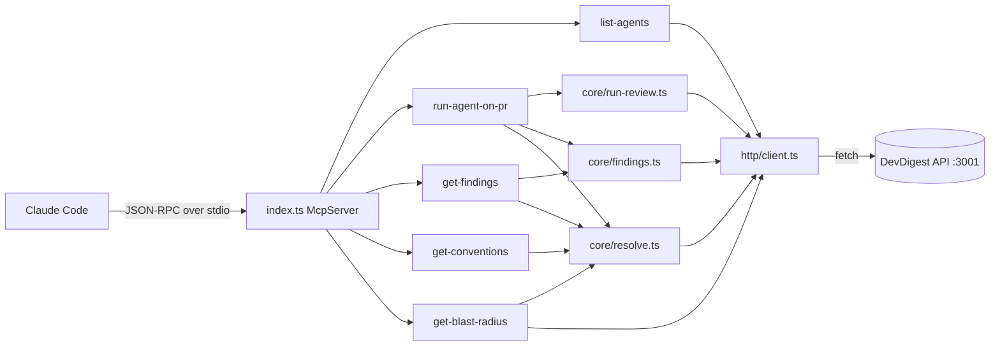
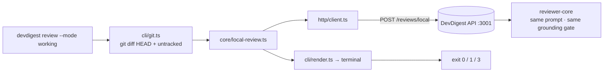

# DevDigest MCP Server

Two entry points over one HTTP client:

- **`src/index.ts`** — a local stdio MCP server exposing 5 code-review tools to Claude Code.
- **`src/cli/index.ts`** — the `devdigest review` CLI, which reviews your working
  copy *before* you push. See [CLI: `devdigest review`](#cli-devdigest-review).

Both are thin clients over the DevDigest API at `http://localhost:3001` — neither
holds business logic of its own. The reviewer, the prompt, the grounding gate, and
the blocking rule all live on the server.

## Architecture



## Prerequisites

The DevDigest API **must be running on port 3001** before any tool call will succeed.

```bash
# From the repo root — starts Postgres + API (seeded) + web
./scripts/dev.sh

# API only (no web client)
./scripts/dev.sh --no-seed   # skip demo data
```

## Install

```bash
cd mcp-server
pnpm install
```

Dependencies are already declared in `package.json`; no separate build step is required.
`tsx` runs TypeScript directly at runtime.

## Tools reference

| Tool | Args | Returns | Annotations |
|---|---|---|---|
| `devdigest_list_agents` | _(none)_ | `{ agents: [{ id, name, enabled, model }] }` | readOnly, idempotent, openWorld |
| `devdigest_run_agent_on_pr` | `repo: string`, `pr: number`, `agent: string` | completed: `{ verdict, score, counts, findings[] }`; timeout: `{ status:"running", run_id, message }` | NOT readOnly, NOT idempotent, openWorld |
| `devdigest_get_findings` | `repo: string`, `pr: number`, `run_id?: string`, `response_format?: "concise"\|"detailed"`, `offset?: number`, `limit?: number` | `{ verdict, score, total, returned, offset, counts, findings[] }` | readOnly, idempotent, openWorld |
| `devdigest_get_conventions` | `repo: string` | `{ repo, conventions: [{ rule, file, confidence, accepted }] }` | readOnly, idempotent, openWorld |
| `devdigest_get_blast_radius` | `repo: string`, `pr: number` | `{ status, reason, degraded, symbols[], endpoints[], crons[], totals, prior_prs[], summary }` | readOnly, idempotent, openWorld |

### Recommended call order

1. `devdigest_list_agents` — get a valid `agent` id.
2. `devdigest_run_agent_on_pr` — trigger a review; blocks until done (up to ~2 min).
3. `devdigest_get_findings` — retrieve or paginate findings for a completed run.
4. `devdigest_get_conventions` — check findings against the repo's house rules.

## CLI: `devdigest review`

Blast Radius and the MCP tools all start from a pull request. This command moves
the same review earlier — into the working copy, before `git push`.

```bash
cd mcp-server && pnpm install     # once

# from ANY git working copy on the machine:
node <repo>/mcp-server/bin/devdigest.mjs review --mode working

# or, from mcp-server/, against the CWD:
pnpm review --agent "Security Reviewer"
```

`pnpm link --global` inside `mcp-server/` puts `devdigest` on your `PATH`; the
examples below assume that.

### How it works



1. Find the repo root (`git rev-parse --show-toplevel`).
2. Collect the change-set. `git diff HEAD` covers **staged and unstaged** edits to
   tracked files. Untracked files are invisible to that command, so each one is
   additionally diffed against `/dev/null` (`git diff --no-index`, `.gitignore`
   respected) — `--no-untracked` opts out. Binary and >256 KB untracked files are
   skipped and reported by path. Nothing writes to the index: a review must not
   mutate the tree it is reviewing, which rules out the usual `git add -N .` trick.
   File **deletions** are not reviewed — they have no new-side lines, so no finding
   could be grounded on one (the server drops them for PRs too).
3. POST the diff to `/reviews/local`, where the **same** agent, prompt assembly,
   skills, repo-intel context, and citation-grounding gate run as for a PR.
4. Print each finding as `SEVERITY  path:line  title` with its rationale.
5. Exit with a code a hook can branch on.

### Exit codes

| Code | Meaning |
|---|---|
| `0` | Review ran; nothing at or above the gate. A clean working tree is also `0`. |
| `1` | Review ran; **blocking** findings. The only code that means "your code has a problem". |
| `2` | Usage error — unknown flag, unknown or unimplemented `--mode`, bad `--fail-on`. |
| `3` | Review could **not** run — not a git repo, git failed, API down, no usable agent, timeout. Says nothing about your code. |

The 1-vs-3 split is the contract's point: a pre-push hook must be able to tell
"the reviewer says no" from "the reviewer never ran", and block only on the first.

### Options

| Flag | Meaning |
|---|---|
| `--mode <working\|staged\|branch>` | Which local change-set. Only `working` is implemented; the others exit `2` with that message. |
| `--agent <id\|name>` | Reviewer agent. Default: the workspace's enabled agent, when exactly one is enabled. |
| `--repo <owner/name>` | Imported repo whose index supplies prompt context. Default: guessed from `origin`. |
| `--no-repo` | Review with no repo context at all. |
| `--fail-on <never\|critical\|warning\|any>` | Override what counts as blocking. Default: the agent's own `ci_fail_on`. |
| `--no-untracked` | Exclude untracked files from the diff. |
| `--json` | Emit the raw `LocalReviewResult` (plus `skipped[]`) instead of a report. |
| `--dry-run` | Collect and print the diff; review nothing (no model spend). |
| `--api-url <url>` | API base. Default `$DEVDIGEST_API_URL`, else `http://localhost:3001`. |
| `--timeout <seconds>` | How long to wait for the review (default 180). |

### As a pre-push hook

```bash
# .git/hooks/pre-push
#!/bin/sh
devdigest review --mode working || exit 1
```

Exit `3` (API down, not a git repo) also blocks here — swap in
`[ $? -eq 1 ] && exit 1` if you would rather only block on findings.

### Modes not yet implemented

`staged` (index vs HEAD) and `branch` (branch vs merge base) exist in the
vocabulary — in `cli/modes.ts` and in the `LocalReviewMode` contract the server
validates — but have no collector. Adding one is a single function in
`modes.ts`: no new flag, no new endpoint, no change to the exit contract.

## Design principles

1. **HTTP-wrap, not in-process.** The MCP server talks to `localhost:3001` over HTTP — it never imports the server's `Container` or touches the database.
2. **stdio transport; stderr only for logs.** For the MCP entry point, stdout is the JSON-RPC channel — any stray write to stdout corrupts the protocol. All logging routes through `src/log.ts` (`console.error`). The CLI is the one exception and inverts this deliberately: its reader is a human (or `jq`), so the report goes to stdout and progress/diagnostics to stderr.
3. **Errors lead forward.** Business failures are returned as tool results with `isError: true` and actionable messages (e.g. "Available repos: …", "Call `devdigest_list_agents` first"). Empty results are never errors.
4. **One composition root.** `src/index.ts` is the only place that constructs/wires concrete dependencies. Tools and core modules receive them by injection; nothing instantiates adapters on its own.

## Id-resolution strategy

Tool args use human-readable identifiers (`repo` as `owner/name` or bare name; `pr` as a PR number). Internally the API requires UUIDs.

Resolution is performed in `src/core/resolve.ts` via list-then-match:

- **repo → repoId**: `GET /repos` returns `Repo[]`; match `repo` case-insensitively against `full_name`, then `name`. Exactly one match → use its `id`. Ambiguous bare name → error asking for `owner/name`. No match → error listing available `full_name`s.
- **(repo, pr#) → pullId**: with the resolved `repoId`, `GET /repos/:repoId/pulls` returns `PrMeta[]`; match on `number === pr`. Not found → error with a few open PR numbers.

No direct lookup-by-name or lookup-by-number endpoint exists in the API; list-then-match is the only path.

## Verification

### MCP Inspector (interactive)

```bash
cd mcp-server

# Using the package script
pnpm inspect

# Or directly
npx @modelcontextprotocol/inspector tsx src/index.ts
```

Open the Inspector UI, confirm all 5 `devdigest_*` tools appear with their input schemas and annotations, then invoke each:

- `devdigest_list_agents` → array of `{id, name, enabled, model}`.
- `devdigest_get_conventions { repo: "owner/repo" }` → conventions list (or `isError` for an unknown repo).
- `devdigest_run_agent_on_pr { repo, pr, agent }` → blocks, then `{ verdict, score, findings[] }`; unknown agent → `isError` with valid ids.
- `devdigest_get_findings { repo, pr }` → concise findings; `response_format: "detailed"` for full fields.
- `devdigest_get_blast_radius { repo, pr }` → the PR's impact map from the repo index. An unindexed repo comes back `degraded: true` with a `reason` — a known limitation, not an error.

### One-shot MCP tool call (`scripts/call.mjs`)

For a quick one-shot MCP tool call without the Inspector — useful in scripts or smoke checks:

```bash
cd mcp-server
pnpm call devdigest_list_agents
pnpm call devdigest_get_conventions '{"repo":"owner/repo"}'
pnpm call devdigest_run_agent_on_pr '{"repo":"owner/repo","pr":42,"agent":"<agent-id>"}'
```

It spawns the server over stdio, performs the handshake, calls the one tool, prints the
result, and exits. Honors `DEVDIGEST_API_URL`; set `MAX_WAIT_MS` to extend the wait for
long reviews. See `scripts/call.mjs`.

### The `devdigest review` CLI

```bash
# In any working copy with uncommitted changes:
devdigest review --dry-run                 # what would be sent — no API, no model spend
devdigest review --agent "Security Reviewer"
echo $?                                    # 0 clean · 1 blocking · 2 usage · 3 could not run

devdigest review --mode staged; echo $?    # → 2, "not implemented yet"
devdigest review --api-url http://localhost:9; echo $?   # → 3, API unreachable
```

On a clean working tree the command prints "No local changes to review" and exits `0`
without calling the API.

### Inside Claude Code

The root `.mcp.json` registers the server automatically when Claude Code is opened from this repository.

```bash
# From the repo root
claude mcp list          # should show "devdigest" connected
```

Or type `/mcp` inside a Claude Code session — you should see `devdigest` listed with the 5 `devdigest_*` tools.

Then run a natural-language request:

```
List the available DevDigest agents, then run a review on PR #1 in my repo, 
and finally show me the findings.
```

Claude Code will invoke `devdigest_list_agents` → `devdigest_run_agent_on_pr` → `devdigest_get_findings` in sequence.

### Stdout-cleanliness check

```bash
# Must produce no stdout output (only stderr is allowed)
cd mcp-server && pnpm start </dev/null 2>/dev/null | head -c 200

# Check for accidental console.log usage
! grep -rn "console.log(" mcp-server/src && echo "clean"
```
