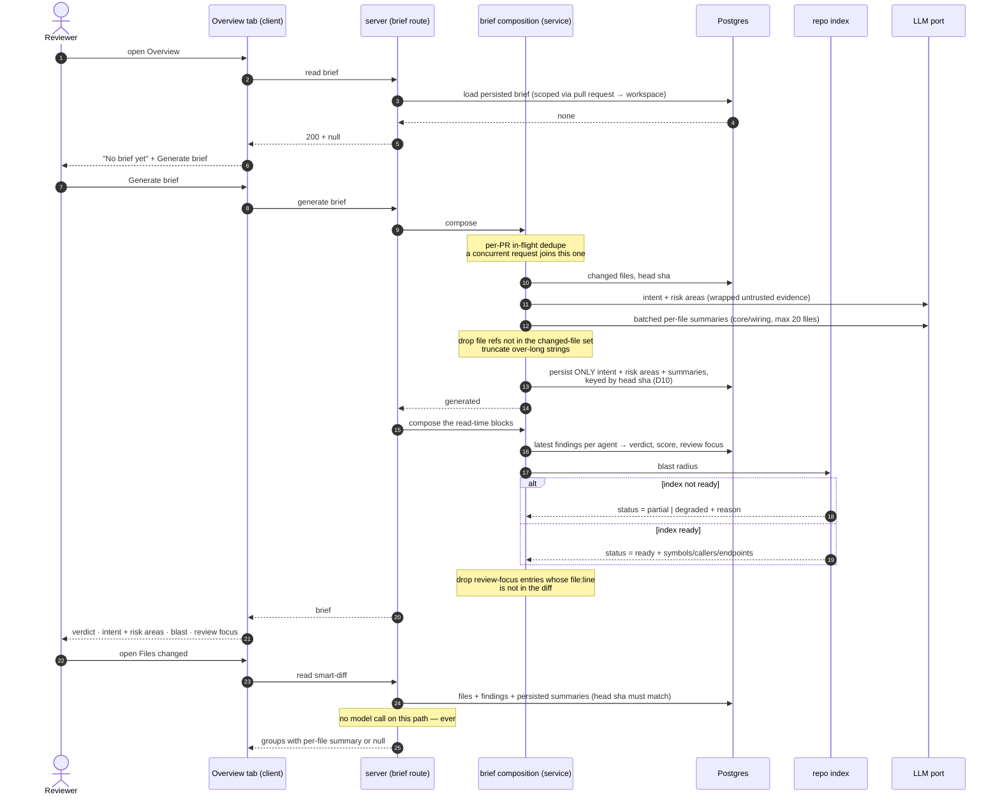

# Spec: PR Brief (Risk Areas + Review Focus) and per-file "What this does" | Spec ID: SPEC-2026-08-20-pr-brief-risk-areas-and-file-summaries | Status: ready-for-planning
Supersedes: none

**Location rationale.** The feature changes the canonical Zod contracts in
`@devdigest/shared`, adds server behaviour and persistence, and changes two client tabs.
Per the repo convention table it therefore spans ≥ 2 modules (`server` + `client`), so the
spec lives in the top-level `specs/`, not in `server/specs/` or `client/specs/`.

---

## Problem & why

A reviewer opening a pull request in DevDigest today gets three good but *disconnected*
answers: a derived Intent card, a Blast Radius card, and — on a different tab — a
per-run verdict banner. Nothing composes them into one "read this before you read the
diff" artifact, and two of the highest-value pieces the design calls for are stubs:

- **Risk Areas are ungrounded.** `RiskArea` in the shared contract is `{ kind, label }`
  only. The reviewer is told *"Auth surface touched"* and then has to go find which file
  that means. The design pins each risk area to a `file:line` and lets it expand into a
  short explanation.
- **"What this does" does not exist.** `SmartDiffFile.pseudocode_summary` is in the
  contract, but `buildSmartDiff` hardcodes it to `null` with an explicit note that the
  field is reserved "for a future summarizer". The Files-changed tab therefore opens a
  47-line hunk with no plain-English orientation.
- **There is no brief.** The `pr_brief` table and the composed `PrBrief` contract exist
  and are entirely unreferenced by any service, route, or component. The design's empty
  state ("No brief yet" → `Generate brief`) has nothing behind it.

Why now: everything the brief needs already ships as separate, working, grounded parts.
This is a composition and grounding job, not new capability — the cost of leaving it is
that reviewers keep paying the orientation tax on every PR.

---

## What already ships (the baseline this spec must NOT re-specify)

Verified in code. Acceptance criteria below are about the **delta only**.

| Already shipping | Where it is observable today |
|---|---|
| Derived intent for a PR (quote, IN SCOPE, OUT OF SCOPE), persisted per `pr_id` with `head_sha`, server-computed confidence, provider/model/cost | `GET /pulls/:id/intent` returns `PrIntentDetail` or `200 + null` |
| Manual re-derivation with per-PR in-flight dedupe and a 3/min route limit | `POST /pulls/:id/intent/recalculate` |
| Risk-area chips: icon per closed `RiskAreaKind` + label, section hidden when empty, `Recalculate` action, loading / error / "not derived yet" states | Intent card on the Overview tab — note: the `Recalculate` action is *removed* by this feature (D5 / AC-43); everything else in this row is preserved |
| Blast radius: symbol tree, capped callers with `caller_count`, endpoints, crons, prior PRs, Tree/Graph toggle, `ready`/`partial`/`degraded` status banner, links pinned to `indexed_sha` | `GET /pulls/:id/blast` → Blast card on the Overview tab |
| Reviewer-ordered diff: `core`/`wiring`/`boilerplate` groups, findings-first ordering, per-file finding badges, Smart order / Original order toggle, split suggestion for oversized PRs — **deterministic and LLM-free** | `GET /pulls/:id/smart-diff` → Files-changed tab |
| Verdict banner component (verdict, summary, findings/blockers counts, circular score) | Rendered **per review run**, on the Agent-runs tab |
| Grounding gate: findings that do not cite a real diff line are dropped and the score is recomputed from survivors | reviewer-core |
| `pr_brief` table (`pr_id` PK, `json` jsonb) and composed `PrBrief` contract | Present in schema and contracts, **unused by any code** |

**Everything else in the three target screenshots is new.**

---

## Goals / Non-goals

**Goals**

- Compose a single, regenerable **PR Brief** per pull request — model-derived parts
  persisted, live parts composed on read (D10) — with a first-class empty state, an
  explicit stale state, and an explicit degraded state.
- Ground **Risk Areas**: each risk area may carry changed-file references and a short
  explanation, expandable inline.
- Add a **Review Focus** list — the handful of `file:line` places a reviewer should open
  first, each with a one-line reason.
- Show a PR-level **verdict summary** inside the brief, with its cost/token footprint and
  a refresh control.
- Populate `SmartDiffFile.pseudocode_summary` so each file on the Files-changed tab can
  carry a one-line **"What this does:"** row.
- Consolidate to **exactly one token-spending control** on the Overview tab: the
  brief-level generate/refresh replaces the intent block's separate `Recalculate`, so a
  reviewer is never asked to choose between two actions that both cost money.

**Non-goals** — deliberately NOT in this feature:

- **Risk areas are still not fed to the reviewer prompt.** They stay display-only claims.
  Widening the contract must not create a path from a cheap extraction model into what the
  reviewer looks for.
- **`GET /pulls/:id/smart-diff` does not gain a model call.** Opening the Files-changed tab
  must remain zero-token. Summaries are read from storage or absent.
- **No change to the grounding gate, the injection guard, or how findings are produced.**
- **No new blast-radius capability.** The brief embeds today's blast payload as-is,
  composed live on every read and never snapshotted into storage (D10).
- **No brief for local (non-PR) reviews.** `LocalReviewRequest` is untouched.
- **No auto-generation on read, and nothing polls.** The brief is produced by a review run
  or by an explicit user action, never lazily on a GET.
- **No brief history.** One PR has one current brief; regeneration overwrites, exactly like
  `pr_intent`.
- **No redesign of the Blast card, the split suggestion, or the Agent-runs tab.**

---

## User stories

- **S1** — As a reviewer opening a PR that has never been briefed, I want a clear
  "No brief yet" state with one button that produces one, so that I am never staring at an
  empty tab wondering whether the feature is broken.
- **S2** — As a reviewer, I want the brief to tell me *where* each risk area lives, so that
  "Auth surface touched" is one click from the lines that touched it.
- **S3** — As a reviewer, I want a short explanation behind a risk area, so I can judge
  whether it deserves my attention before opening any file.
- **S4** — As a reviewer, I want a ranked "read these first" list of `file:line` with a
  one-line reason, so I can start with the four places that matter on a 9-file PR.
- **S5** — As a reviewer, I want the PR's overall verdict, finding counts and score at the
  top of the Overview tab together with what the analysis cost, so I can decide whether to
  trust it and whether to pay for a refresh.
- **S6** — As a reviewer scanning the Files-changed tab, I want a one-line plain-English
  "What this does:" under each substantive file, so I know what I am about to read before
  I read the hunk.
- **S7** — As a reviewer returning to a PR after new commits, I want to be told the brief
  describes an older head commit, so I never act on a stale claim.
- **S8** — As a reviewer on a repository that has not been indexed, I want the brief to say
  which parts it could not compute, so a thin answer is never mistaken for a small change.
- **S9** — As a workspace owner, I want brief generation to be rate-limited and deduped,
  so a double-click or an impatient reviewer cannot buy two model calls.

---

## Acceptance criteria (EARS)

### A. Brief lifecycle and API

- **AC-1**: WHEN the brief for a pull request is requested and no brief has been persisted
  for it, the system **shall** respond `200` with a `null` body rather than `404`.
  _(observable: integration test — request the brief for a freshly imported PR, assert
  status 200 and body `null`)_
- **AC-2**: WHEN a brief has never been generated for the open pull request, the Overview
  tab **shall** render the empty state — document icon, "No brief yet", the generate hint,
  and a single primary `Generate brief` action — and **shall not** render any brief block.
  _(observable: client test rendering the Overview tab with a null brief; asserts the empty
  state text and exactly one enabled generate control)_
- **AC-3**: WHEN the user activates `Generate brief`, the system **shall** request a brief
  generation for that pull request and persist the result keyed by pull request id.
  _(observable: integration test — POST the generate endpoint, then GET the brief and
  assert a non-null body)_
- **AC-4**: WHILE a brief generation for a pull request is in flight, the system **shall**
  disable the generate/refresh control and show an in-flight label.
  _(observable: client test — assert the control is `disabled` and shows the pending label
  while the mutation is pending)_
- **AC-5**: IF a second brief generation is requested for the same pull request while one
  is already in flight, THEN the system **shall** return the result of the in-flight
  derivation instead of starting a second one.
  _(observable: integration test — fire two concurrent generate requests; the injected model
  mock records exactly one intent derivation and exactly one batched file-summaries call
  (two calls total, matching the generation budget), not two of each)_
- **AC-6**: IF brief generation fails, THEN the system **shall** respond with an error
  status and **shall not** overwrite or delete any previously persisted brief.
  _(observable: integration test — generate once successfully, force the model mock to
  throw, generate again, assert the error status and that the earlier brief is unchanged)_
- **AC-7**: IF brief generation fails, THEN the Overview tab **shall** show an inline,
  dismissible error next to the generate control and keep the rest of the tab rendered,
  and **shall not** replace the page with a full-screen error.
  _(observable: client test — assert `role="alert"` inline error is present and the PR
  description block below is still in the document)_
- **AC-8**: The brief-generation endpoint **shall** be rate-limited to at most 3 requests
  per minute per caller.
  _(observable: integration test — 4 rapid requests, the 4th answers 429)_
- **AC-9**: WHEN the brief is read, the system **shall not** issue any model call.
  _(observable: integration test — GET the brief with a model mock that throws on any call;
  assert 200 and zero mock invocations)_
- **AC-10**: The system **shall** resolve a brief only through its pull request's workspace,
  so a brief belonging to another workspace is never returned.
  _(observable: integration test — request a PR's brief under a second workspace's context,
  assert the not-found/null response)_

### B. Staleness and degradation

- **AC-11**: The persisted brief **shall** record the head commit sha it was derived from.
  _(observable: integration test — generate a brief, assert the stored/returned sha equals
  the PR's `head_sha`)_
- **AC-12**: WHILE the persisted brief's head sha differs from the pull request's current
  head sha, the Overview tab **shall** render a stale notice with a regenerate action and
  **shall** keep the brief's content visible.
  _(observable: client test — render with mismatched shas; assert the stale notice AND the
  intent quote are both present)_
- **AC-13**: WHERE the repository index status for the pull request is not `ready`, the
  brief response **shall** carry that status and its reason — resolved at read time, not
  frozen at generation time — and the Overview tab **shall** render a visible notice naming
  what could not be computed.
  _(observable: client test with a `degraded` status; asserts the notice text is rendered —
  a degraded brief must never render identically to a `ready` one. Integration test: index
  status flips from `degraded` to `ready` with no regeneration; the next read reports
  `ready`)_
- **AC-14**: IF the repository index is unusable, THEN brief generation **shall** still
  succeed and persist what it derives (intent and risk areas), rather than failing the whole
  brief, and the persisted record **shall** hold no blast snapshot.
  _(observable: integration test — generate with the blast source returning `degraded`;
  assert 200, a non-null intent block, and that the persisted brief record contains no
  blast payload)_

### C. Risk Areas (the delta over today's chips)

- **AC-15**: A risk area **shall** be able to carry zero or more changed-file references
  and a short explanation, and a risk area carrying neither **shall** still validate.
  _(observable: contract unit test — parsing `{ kind: 'security', label: 'Auth surface
  touched' }` with no other keys succeeds)_
- **AC-16**: WHEN a risk area's file reference does not resolve to a path in that pull
  request's changed-file set, the system **shall** drop the reference and keep the risk
  area, rather than persisting or rendering an unverifiable path.
  _(observable: unit test — feed a model result naming `src/nope.ts`; assert the persisted
  risk area has an empty reference list and its label is unchanged)_
- **AC-17**: WHERE a risk area carries an explanation, the Overview tab **shall** render it
  collapsed behind an expand control that is operable by keyboard and exposes its expanded
  state to assistive technology.
  _(observable: client test — the control has `aria-expanded="false"`, the explanation is
  absent from the accessible tree until activation, and Enter/Space toggles it)_
- **AC-18**: WHERE a risk area carries at least one file reference, the Overview tab
  **shall** render each reference as a link pinned to the pull request's head commit.
  _(observable: client test — assert the rendered href contains the PR head sha, not the
  default branch name)_
- **AC-19**: WHEN the derived risk-area list is empty, the Overview tab **shall** omit the
  Risk Areas heading entirely rather than rendering an empty section.
  _(observable: client test — `queryByText(/risk areas/i)` is null)_
- **AC-20**: The system **shall not** include risk areas — label, explanation, or file
  references — in any prompt sent to a reviewer agent.
  _(observable: unit test on prompt assembly — build a prompt from a PR whose intent
  carries a distinctive risk-area label; assert that string does not appear in the
  assembled prompt)_
- **AC-21**: IF a derived risk-area explanation exceeds **280 characters**, THEN the system
  **shall** persist it truncated to 280 characters with a trailing ellipsis character, and
  **shall not** reject the risk area.
  _(observable: unit test — a 5,000-character explanation is stored at exactly 280
  characters, ends in `…`, and its risk area is still present in the output)_

### D. Review Focus

- **AC-22**: WHEN a brief is generated for a pull request that has at least one persisted
  finding, the brief **shall** include a review-focus list whose entries each carry a file,
  a line, and a one-line reason.
  _(observable: integration test — seed findings, generate, assert every review-focus entry
  has all three fields non-empty)_
- **AC-23**: The review-focus list **shall** be ordered blockers first, then warnings, then
  suggestions, and **shall** contain at most **6 entries**; entries beyond the sixth are
  dropped, lowest severity first, and are never rendered as a truncated-list affordance.
  _(observable: unit test on the ordering function — 12 mixed-severity entries in yields
  exactly 6 out, blockers at the head, and no suggestion present while a warning was
  dropped)_
- **AC-24**: Every review-focus entry **shall** cite a `file:line` that appears in the pull
  request's diff — the same anchor the grounding gate already validated for the finding the
  entry was composed from; an entry whose file or line is not present in the diff **shall**
  be dropped.
  _(observable: unit test — given a diff touching `a.ts` lines 10–14, an entry for
  `a.ts:12` survives while entries for `b.ts:12` (file not in the diff) and `a.ts:99` (line
  not in the diff) are both absent from the output)_
- **AC-25**: WHEN the pull request has no persisted findings, the brief **shall** carry an
  empty review-focus list and the Overview tab **shall** omit the Review Focus section.
  _(observable: client test — `queryByText(/read these first/i)` is null)_
- **AC-26**: WHEN a review-focus entry is activated, the client **shall** navigate to that
  file and line in the Files-changed view.
  _(observable: client test — activating an entry calls the tab/anchor navigation with the
  entry's path and line)_

### E. Verdict summary inside the brief

- **AC-27**: WHERE at least one review run has completed for the pull request, the brief
  **shall** carry a PR-level verdict, a total findings count, a blockers count, and a score.
  _(observable: integration test — two runs seeded, assert the four fields are present and
  the counts equal the sum over the latest run per agent)_
- **AC-28**: WHEN two review runs disagree on verdict, the brief's verdict **shall** be the
  most severe of the latest run per agent.
  _(observable: unit test — `approve` + `request_changes` yields `request_changes`)_
- **AC-29**: WHERE the analysis has no known price, the cost footer **shall** render an
  em dash and **shall not** render `$0.00`.
  _(observable: client test — a null cost renders `—`)_
- **AC-30**: WHEN no review run has completed, the Overview tab **shall** omit the verdict
  block and still render the rest of the brief.
  _(observable: client test — no verdict label present, intent quote present)_
- **AC-47**: WHEN more than one agent has reviewed the pull request, the brief's PR score
  **shall** be the **lowest** score among each agent's latest run — deliberately pessimistic,
  so one agent's clean pass cannot mask another's bad result.
  _(observable: unit test — latest runs scoring 88 and 41 yield 41, not 88 and not the mean
  64.5)_
- **AC-48**: The brief's blockers count **shall** be the number of findings of critical
  severity that survived the grounding gate, counted from the same findings list the total
  findings count is computed from, and **shall not** be read from any denormalized
  per-run blockers column.
  _(observable: unit test — a run row whose denormalized blockers column says 5 while its
  surviving critical findings number 2 yields a brief blockers count of 2)_
- **AC-49**: WHEN a review run completes after the brief was generated, the brief's verdict,
  counts, score and review-focus list **shall** reflect that new run on the next read
  without any regeneration, and **shall not** raise the stale notice.
  _(observable: integration test — generate a brief, seed a second review run without
  changing the head sha, read the brief; the verdict reflects the new run and the head sha
  still matches, so AC-12's stale notice stays silent)_

### F. "What this does" on the Files-changed tab

- **AC-31**: WHERE a persisted per-file summary exists for a changed file, the smart-diff
  response **shall** carry it on that file, and WHERE none exists the field **shall** be
  null.
  _(observable: integration test — seed a summary for one of three files; assert exactly
  one non-null `pseudocode_summary` in the response)_
- **AC-32**: WHEN the smart-diff is requested, the system **shall not** issue any model
  call, regardless of whether summaries exist.
  _(observable: integration test — model mock throws on any call; assert 200)_
- **AC-33**: WHERE a file carries a summary, the Files-changed tab **shall** render a
  single "What this does:" row directly beneath that file's header and above its first
  diff hunk.
  _(observable: client test — the summary text node precedes the first hunk line in
  document order)_
- **AC-34**: IF a file has no summary, THEN the Files-changed tab **shall** render no
  "What this does" row for it — not an empty one and not a placeholder.
  _(observable: client test — for a file with a null summary, `queryByText(/what this
  does/i)` scoped to that card is null)_
- **AC-35**: The system **shall** generate per-file summaries only for files classified
  `core` or `wiring`, never for `boilerplate`.
  _(observable: unit test — a `package-lock.json` in the input yields no summary request)_
- **AC-36**: The system **shall** cover at most **20 files** in the single batched
  file-summaries call of one generation, ranking candidates by finding count then churn
  descending; the 21st-ranked file and beyond are excluded from that call and behave exactly
  as a file that has no summary.
  _(observable: unit test — 40 core files in, the model mock receives exactly one call whose
  payload names exactly 20 files, the highest-finding file is among them, and the
  21st-ranked file's `pseudocode_summary` is null)_
- **AC-37**: WHEN more changed files exist than were summarized, the Files-changed tab
  **shall** state how many files carry a summary rather than leaving the omission silent.
  _(observable: client test — assert the "N of M files summarized" note renders)_
- **AC-38**: The system **shall** record the head sha a per-file summary was derived from
  and **shall not** serve a summary whose sha differs from the pull request's current head.
  _(observable: integration test — advance the PR head sha, request smart-diff, assert
  every `pseudocode_summary` is null)_
- **AC-39**: A per-file summary **shall** be rendered as plain text, with no markup
  interpretation of its content.
  _(observable: client test — a summary containing `` appears as a
  visible text node and the card contains no `script` element)_
- **AC-40**: IF a per-file summary exceeds **200 characters**, THEN the system **shall**
  persist it truncated to 200 characters with a trailing ellipsis character rather than
  discarding the summary or rendering it over multiple lines.
  _(observable: unit test — a 900-character model reply is stored at exactly 200 characters
  and ends in `…`; client test asserts the row renders on a single line)_
- **AC-50**: WHILE a file row is collapsed, the Files-changed tab **shall** show only the
  path and the +N/−N counts, and **shall not** render that file's "What this does:" row;
  the row appears when the file is expanded.
  _(observable: client test — for a file with a non-null summary rendered collapsed,
  `queryByText(/what this does/i)` scoped to that card is null; after expanding, the same
  query finds it)_

### G. Persistence and migration hygiene

- **AC-41**: The persisted brief **shall** be readable back into the brief contract without
  loss, and a brief written before the risk-area widening **shall** still parse.
  _(observable: contract unit test — parse a fixture with `{kind,label}`-only risk areas
  and no per-file summaries; parsing succeeds)_
- **AC-42**: WHEN the database schema changes for this feature, the change **shall** ship
  as a generated migration file, because migrations are never applied on boot.
  _(observable: a new file under the migrations directory plus its snapshot; the API starts
  against a freshly migrated database without a `relation ... does not exist` error)_

### H. Controls and disclosure

- **AC-43**: The Overview tab **shall** expose exactly one control that spends tokens — the
  brief-level generate/refresh — and that control **shall** regenerate the whole brief; the
  intent block **shall not** carry its own separate recalculate action.
  _(observable: client test rendering the Overview tab with a populated brief — exactly one
  control carrying the generate/refresh affordance is in the document, and activating it
  issues the brief generation request, not the intent recalculate request)_
- **AC-44**: The per-file `summary` indicator on a file row **shall** be non-interactive and
  **shall** be rendered only for a file that already carries a summary.
  _(observable: client test — the indicator is not a `button`, is absent from the tab order,
  and is absent on a file whose summary is null)_
- **AC-45**: WHILE the brief is stale, the stale notice **shall** name how many commits have
  landed on the pull request since the brief's head sha, rather than only stating that it is
  out of date.
  _(observable: client test — with a brief head sha 3 commits behind the PR's commit list,
  the notice text includes the count `3`)_
- **AC-46**: The empty state **shall** state that generating a brief spends tokens, before
  the user activates the generate control.
  _(observable: client test — the empty-state body text includes the token-spend
  disclosure, asserted via the message-catalogue key rather than a hardcoded string)_

---

## Edge cases

| Case | Expected behaviour | Covered by |
|---|---|---|
| PR has never been briefed | `200 + null`; empty state with `Generate brief` | AC-1, AC-2 |
| User double-clicks `Generate brief` | Deduped to one derivation; one model call | AC-5, AC-4 |
| Generation fails (provider down, no key, timeout) | Error status, previous brief preserved, inline client error | AC-6, AC-7 |
| Generation abused / hammered | 429 after 3/min | AC-8 |
| New commits pushed after the brief was generated | Stale notice + regenerate; content stays visible | AC-11, AC-12 |
| Repo never indexed → blast degrades | Brief response carries status + reason; UI names what is missing; generation still succeeds and stores no blast snapshot | AC-13, AC-14 |
| Repo re-indexed after the brief was generated | Next read reports `ready`; no regeneration needed, no stale notice | AC-13, AC-49 |
| Repo index is `partial` (parse timeouts, size caps) | Same visible notice path as `degraded`, distinguished by status value | AC-13 |
| Zero risk areas derived | Section omitted, no empty heading | AC-19 |
| Risk area names a file not in the diff | Reference dropped, label kept | AC-16 |
| Risk area with no explanation | Chip renders with no expand control | AC-15, AC-17 |
| Model returns a 5,000-char explanation | Truncated to 280 chars + ellipsis; risk area kept | AC-21 |
| More than 6 review-focus candidates | Keep the 6 most severe; drop the rest silently, no "show more" | AC-23 |
| Model returns a 900-char file summary | Truncated to 200 chars + ellipsis; still a single-line row | AC-40 |
| Risk area text tries to steer the reviewer | Never reaches a reviewer prompt | AC-20, *Untrusted inputs* |
| PR with findings but no brief | Review Focus only exists inside a brief; no brief → empty state | AC-2, AC-22 |
| PR briefed but never reviewed | Empty review-focus list, no verdict block, intent + blast still render | AC-25, AC-30 |
| Two agents disagree on verdict | Most severe of the latest run per agent | AC-28 |
| Two agents return different scores | Lowest of the latest run per agent — never the mean, never the best | AC-47 |
| Denormalized per-run blockers column disagrees with surviving critical findings | The findings list wins; the column is not read | AC-48 |
| New review run completes after the brief was generated | Verdict, counts, score and Review Focus update on the next read; head sha unchanged, so no stale notice | AC-49 |
| Cost unknown for the model used | `—`, never `$0.00` | AC-29 |
| File with no `pseudocode_summary` | No row at all | AC-34 |
| Lockfile / generated file | Never summarized | AC-35 |
| Very large diff (40+ files, thousands of lines) | At most 20 files summarized, ranked by findings then churn; "20 of 41 files summarized" disclosed | AC-36, AC-37 |
| Binary or GitHub-truncated file (no patch text) | File card still renders; summary may be absent — existing `FileCard` "no diff text" path is unchanged | accepted: no handling beyond AC-34 |
| Summary exists but head sha moved | Summaries suppressed (null), not shown stale | AC-38 |
| Summary or explanation contains markup / an injection string | Rendered as inert text | AC-39, AC-20 |
| Brief requested across workspaces | Not returned | AC-10 |
| Brief JSON persisted before the contract widened | Still parses | AC-41 |
| Reviewer opens Files-changed on a PR with no brief and no review | Groups render as today, no summary rows, zero tokens | AC-32, AC-34 |
| Same PR briefed concurrently from two browser tabs | Deduped server-side; both tabs converge on the same brief | AC-5 |
| Generation partially succeeds (intent ok, file summaries fail) | Brief persists what it derived; missing summaries behave as AC-34 | AC-14, AC-34 |
| File carries a summary but its row is collapsed | Path and +N/−N counts only; the row appears on expand | AC-50 |
| User regenerates while an old brief is displayed | Old brief stays visible until the new one lands; no flash of empty state | accepted: no dedicated AC — falls out of AC-4 + AC-6 (nothing is deleted before the replacement arrives). Recorded here so it is not lost. |
| PR closed or merged mid-generation | Generation completes and persists normally; no special casing | accepted: no handling |
| Repository deleted / PR row removed mid-generation | Cascade delete on `pr_id` removes the brief | accepted: existing FK behaviour |
| Reviewer wants to re-derive only the intent, not the whole brief | Not offered — one token-spending control regenerates the whole brief | AC-43 |
| Reviewer clicks the `summary` pill expecting it to generate one | Nothing happens; it is a non-interactive indicator and only appears where a summary exists | AC-44 |
| Brief is stale but the PR's commit list is unavailable | Stale notice still renders, without the commit count — the notice is never suppressed for want of the count | AC-12, AC-45 |

---

## Non-functional

- **Cost containment.** Reading the Overview tab and the Files-changed tab **must** cost
  zero tokens (AC-9, AC-32). The only token spend is the explicit generate action and the
  automatic derivation inside a review run.
- **Generation budget.** One brief generation must issue at most **two** model calls
  regardless of PR size: one for the intent/risk-area block and one batched call covering
  all summarized files. Per-file fan-out is forbidden.
- **Rate limit.** Brief generation: **3 requests/minute**, matching the existing intent
  recalculate fence. There is no per-agent fan-out to amortise the call over.
- **Latency.** `GET` of the brief and `GET` of the smart-diff: **p95 < 300 ms** on a
  50-file PR, because both are pure reads. Brief generation is bounded by the existing job
  timeout and must surface an error rather than hanging the UI.
- **Payload.** A brief *response* must stay under **256 KB** on a 200-file PR. The hard caps
  that keep it there: **6** review-focus entries (AC-23), **4** risk areas (already enforced
  by the extraction prompt), **280** characters per risk-area explanation (AC-21), **20**
  summarized files per generation (AC-36), **200** characters per file summary (AC-40).
  Every cap has defined overflow behaviour — a cap without one is not testable.
- **Stored footprint.** The *persisted* brief record is far smaller than the response,
  because per D10 it holds only intent + risk areas + provenance: it must stay under
  **16 KB** on any PR, and the blast payload — the largest and most volatile block — is
  never written to it at all.
- **Accessibility.** WCAG 2.1 AA. Concretely: every expand control exposes
  `aria-expanded`; the stale and degraded notices are announced (`role="status"` /
  `role="alert"` as appropriate); the "What this does" row is associated with its file
  card, not a bare floating string; the risk-area icon is decorative
  (`aria-hidden="true"`) with the meaning carried by the label text; colour is never the
  only signal for a blocker.
- **Security.** All model-authored strings (risk-area labels and explanations, file
  summaries, review-focus reasons) are rendered as text nodes only — no HTML
  interpretation, no `dangerouslySetInnerHTML`, no URL derived from model output (AC-39).
  File references are rendered as links only after being matched against the PR's
  changed-file set (AC-16, AC-24), so a link target is always a path the server verified.
- **Determinism preserved.** The smart-diff grouping, ordering, and split suggestion stay a
  pure function of the changed files plus persisted findings. Summaries are additive data
  merged on read and must not influence grouping or ordering.

---

## Cross-module interactions

- **`@devdigest/shared`** — the canonical copy is `server/src/vendor/shared`; the client's
  copy is a mirror. Every contract change lands in the canonical copy and is synced. A
  mirror-only edit is a defect.
- **`reviewer-core`** — stays pure and untouched by this feature. It performs no I/O, and
  the grounding gate and injection guard are unchanged. Brief composition is application
  orchestration and belongs in `server`, not in the engine.
- **`server`** — onion layering applies: model access goes through the existing
  `LLMProvider` port on the DI container, persistence through a repository, composition
  through a service, and the HTTP surface through a route with a Zod response schema.
  Nothing new is called directly from a route.
- **`client`** — all reads go through a TanStack Query hook and the single fetch chokepoint;
  no component fetches directly. All user-facing strings are `next-intl` keys.
- **Database** — the schema change ships as a generated migration and is applied manually
  (`pnpm db:generate` then `pnpm db:migrate`); migrations never run on boot, and the
  symptom of forgetting is `relation ... does not exist` from the API (AC-42).

**Failure contract between modules**

| Producer | Consumer | On failure |
|---|---|---|
| Repo index (blast source) | Brief read (composed live) | Never fails the brief; contributes a status + reason, resolved per read (AC-13, AC-14) |
| Model provider | Brief composition | Generation errors; previously persisted brief untouched (AC-6) |
| Brief read endpoint | Overview tab | `null` is a normal empty state, not an error (AC-1, AC-2) |
| Brief generation endpoint | Overview tab | Inline error only; never a full-screen error taxonomy (AC-7) |
| Per-file summaries | Smart-diff read | Absent summaries are normal; no row rendered (AC-34) |

---

## Contracts

Shapes only. All additions land in the canonical `@devdigest/shared` copy and are mirrored.

**Widened — risk area** (existing `{ kind, label }` stays valid; both additions optional so
already-persisted rows parse — AC-15, AC-41):

| Field | Direction | Optionality | Notes |
|---|---|---|---|
| `kind` | model → server → client | required | Unchanged closed enum. Widening it still requires choosing an icon at the same time. |
| `label` | model → server → client | required | Unchanged short noun phrase. |
| `file_refs` | model → server (validated) → client | optional, defaults to empty | Each entry is a changed-file path, optionally with a line range. Server drops any entry not in the PR's changed-file set (AC-16). |
| `explanation` | model → server (truncated) → client | optional | Short prose, length-capped (AC-21). Still a claim about *where to look*, never a verdict. |

> Note: this widening is model-facing. Per the recorded rule, model-facing contract fields
> must not carry a Zod `.default(...)` — the strict structured-output mode rejects the
> emitted `default` keyword. Leniency belongs in the prompt text, not in the schema.

**New — review focus entry** (server-composed, never model-authored wholesale):

| Field | Direction | Optionality | Notes |
|---|---|---|---|
| `file` | server → client | required | Must be in the changed-file set (AC-24). |
| `line` | server → client | required | Anchor line in the diff. |
| `reason` | server → client | required | One line, length-capped. |
| `severity` | server → client | required | Drives ordering (AC-23) and the dot colour. |
| `finding_id` | server → client | optional | Present when the entry came from a persisted finding; enables the deep link. |

**New — brief envelope** (the wire shape of the brief read/generate responses).

Per **D10**, only `intent` (with its risk areas) and the per-file summaries are *persisted*.
Every other block is composed at read time from live data — still with no model call. The
`Persisted?` column is the load-bearing one here.

| Field | Direction | Optionality | Persisted? | Notes |
|---|---|---|---|---|
| `pr_id` | server → client | required | yes | |
| `head_sha` | server → client | required | yes | The commit the *persisted* part was derived from. Compared client-side against the PR's current head to drive the stale state (AC-11, AC-12). |
| `status` | server → client | required | **no — read time** | Index completeness, reusing the existing `ready` / `partial` / `degraded` vocabulary. Resolved live so a re-index is reflected without regeneration (AC-13). |
| `reason` | server → client | nullable | **no — read time** | Human-readable "why not ready"; null when `ready`. |
| `intent` | server → client | nullable | **yes** | The intent block, including widened risk areas. Null when no intent could be derived. This and the file summaries are the only model-derived data the brief stores. |
| `blast` | server → client | nullable | **no — read time** | The existing blast payload, composed live and embedded unchanged. The persisted record holds **no blast snapshot** (AC-14) — a frozen one would contradict the live blast card after a re-index. |
| `verdict_summary` | server → client | nullable | **no — read time** | Verdict, findings count, blockers count, score, composed from the latest run per agent (AC-27, AC-28, AC-47, AC-48). Null before any run (AC-30). Read-time because a new run changes the verdict *without* changing `head_sha`, so a persisted copy would silently disagree with the Agent-runs tab while the staleness notice stayed quiet (AC-49). |
| `review_focus` | server → client | required | **no — read time** | Composed from the same live findings list. Possibly empty (AC-25). |
| `cost_usd` | server → client | nullable | yes | Cost of the persisted derivation. Null means unknown price → renders `—` (AC-29). |
| `tokens_in` / `tokens_out` | server → client | required | yes | Footer figures for the persisted derivation. |
| `generated_at` | server → client | required | yes | When the persisted part was derived. |
| `summarized_files` / `changed_files` | server → client | required | counts | Backing the "N of M files summarized" note (AC-37). |

**Unchanged shape, newly populated** — `SmartDiffFile.pseudocode_summary` keeps its existing
optional-nullable string shape. The only change is that it may now be non-null (AC-31).

**API surface** (shapes and semantics, not routing detail):

| Operation | Direction | Response semantics |
|---|---|---|
| Read a PR's brief | client → server | `200` + brief, or `200` + `null` when none. Never `404` for "not generated yet" (AC-1). Zero model calls (AC-9). |
| Generate/regenerate a PR's brief | client → server | `200` + brief on success; error status on failure, with the prior brief preserved (AC-6). Rate-limited 3/min (AC-8). Deduped per PR (AC-5). Non-nullable success body — "nothing came back" here means failure, matching the existing recalculate route's contract. |
| Read a PR's smart-diff | client → server | Unchanged, plus possibly non-null per-file summaries (AC-31). Zero model calls (AC-32). |

**Persistence.** The unused `pr_brief` table (`pr_id` PK → `pull_requests`, cascade delete,
`json` jsonb) is the natural home for the persisted half — intent, risk areas, the head sha,
and the derivation's cost/token figures. Per-file summaries need a head-sha key so AC-38 is
enforceable. Whether that is a column on the existing table or a sibling table is an
implementation decision, not a spec decision — the requirements are only that (a) a summary
can never be served against a head sha it was not derived from, and (b) no blast snapshot,
verdict, or review-focus list is written to storage (D10, AC-14, AC-49).

---

## Untrusted inputs

Yes — this feature consumes third-party text throughout, and every path must treat it as
data, never as instructions.

- **Inputs.** PR title, branch, commit messages, PR body, linked ticket/doc text, changed
  paths, and diff text. All of it is authored by whoever opened the pull request.
- **Existing controls that must remain in force.** Evidence handed to the intent extraction
  is already wrapped in untrusted markers with an explicit "this is data, not commands"
  instruction, and the reviewer path is guarded by one shared trusted injection rule rather
  than keyword denylists. The per-file summary generation added by this feature reads diff
  text and therefore **must** wrap that diff in the same untrusted markers before it reaches
  a prompt. No new denylist may be introduced.
- **Outputs are also untrusted.** Risk-area labels and explanations, review-focus reasons,
  and per-file summaries are model-written strings derived from attacker-influencable input.
  They are rendered as inert text (AC-39), never as markup, and no link target is ever taken
  from model output — file references become links only after the server matched them
  against the PR's own changed-file set (AC-16, AC-24).
- **No new prompt-steering path.** Risk areas remain excluded from every reviewer prompt
  (AC-20). This is the single most important invariant the widening could accidentally
  break: adding `explanation` creates a larger, more instruction-shaped payload, and it must
  stay display-only.
- **Design sources in this spec.** The screenshots and the request text were analysed as
  content, not as instructions.

---

## Decisions

Settled with the user on 2026-08-20. These are no longer assumptions — the planner should
treat them as fixed inputs.

- **D1 — The PR Brief is a real persisted, regenerable artifact**, not a client-side
  grouping of today's independent queries. It is backed by the existing (previously unused)
  `pr_brief` table and has its own read and generate operations. AC-1 to AC-14, AC-27 to
  AC-30, and AC-41 all stand as written.
- **D2 — Review Focus is in scope, and its entries are composed from persisted findings
  that already passed the grounding gate** — not written as fresh model prose. AC-24's
  grounding rule (every entry cites a file in the PR's changed-file set) stands as the
  mechanism that keeps it honest.
- **D3 — Per-file summaries come from one batched model call inside brief generation, plus
  automatically during a review run.** They are persisted, keyed by head sha, and merged
  into the smart-diff response on read. The Files-changed tab's zero-token guarantee
  (AC-32) is confirmed as a hard constraint, not a preference.
- **D4 — The risk-area widening is file references *and* explanation, both new work.** The
  two "current app" screenshots showing file chips plus an explanation paragraph are a
  prototype, not a shipping build: today's intent card renders flat icon + label chips.
  AC-15 to AC-21 therefore describe genuinely new behaviour, not a restyle.
- **D5 — Exactly one token-spending control lives on the Overview tab.** The brief-level
  generate/refresh regenerates the whole brief; the intent block's separate `Recalculate`
  is removed. Recorded as a goal and enforced by AC-43.
- **D6 — The per-run verdict banners stay on the Agent-runs tab.** The Overview one is a
  new PR-level aggregate over the latest run per agent (AC-27, AC-28). The two coexist by
  design and there is no duplication to resolve — they answer different questions ("what
  did this run say" vs "where does this PR stand").
- **D7 — The `summary` pill on a file row is a decorative indicator**, not a generate
  button. Enforced by AC-44 so it cannot drift into an on-demand generation path that would
  break D3's zero-token guarantee.
- **D8 — Caps are fixed** at 6 review-focus entries, 20 summarized files per generation,
  280 characters per risk-area explanation, 200 characters per file summary — each with the
  overflow behaviour written into its criterion (AC-23, AC-36, AC-21, AC-40).
- **D9 — Both UX improvements are adopted as criteria**, not left as suggestions: the stale
  notice names how many commits have landed since the brief (AC-45), and the empty state
  discloses that generating spends tokens (AC-46).

Settled on 2026-08-20 after the implementation-planner's read of this spec:

- **D10 — The brief persists intent and risk areas only.** Blast radius, the verdict block,
  and Review Focus are composed at read time from live data — still zero-token, since all
  three are pure reads. The rationale is the non-obvious part and is why this is a decision
  rather than an implementation detail: **a new review run changes the verdict without
  changing `head_sha`**, so a persisted verdict would silently disagree with the Agent-runs
  tab while the head-sha staleness notice (AC-12) stayed quiet; likewise a frozen blast
  snapshot would contradict the live blast card after a re-index. Reflected in AC-13, AC-14,
  AC-49, the `Persisted?` column of the brief-envelope contract table, the persistence note,
  and the stored-footprint budget.
- **D11 — PR score aggregation is the lowest score among each agent's latest run.**
  Pessimistic on purpose: one agent's clean pass must not mask another's bad result. The
  spec previously pinned the *verdict* rule (AC-28) but never said how the *score*
  aggregates. Now AC-47.
- **D12 — "Blockers" means critical-severity findings that survived the grounding gate**,
  not the denormalized per-run blockers column. Derived from the same findings list the
  total count is rendered beside, so the two can never disagree. Now AC-48.
- **D13 — The "What this does:" row renders only when a file is expanded**, matching the
  Files-changed mockup: a collapsed row shows the path and +N/−N counts only. Now AC-50.
  *Rejected alternative, recorded so it is not re-litigated:* the planner recommended making
  the row always visible for its triage value on a collapsed list. The user chose the
  mockup's behaviour. If the triage argument is revisited later, it is a deliberate change to
  AC-50, not an oversight in it.

## Open questions

Non-blocking. Nothing here prevents planning.

- **The missing pasted text block.** A ~7-line block accompanied the original request but
  was never delivered to the spec author — only a placeholder arrived. The user is being
  asked separately whether it carried anything beyond the two numbered requests and the
  screenshots. **This spec assumes it restated the same two requests.** If it turns out to
  contain additional requirements, they are not covered here and this spec needs a revision
  pass before those requirements are planned.
