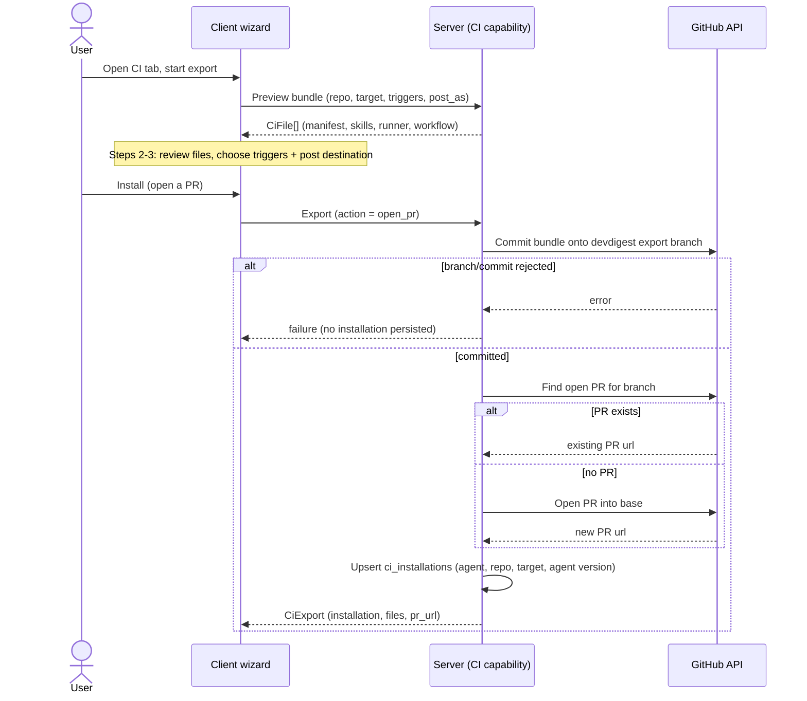
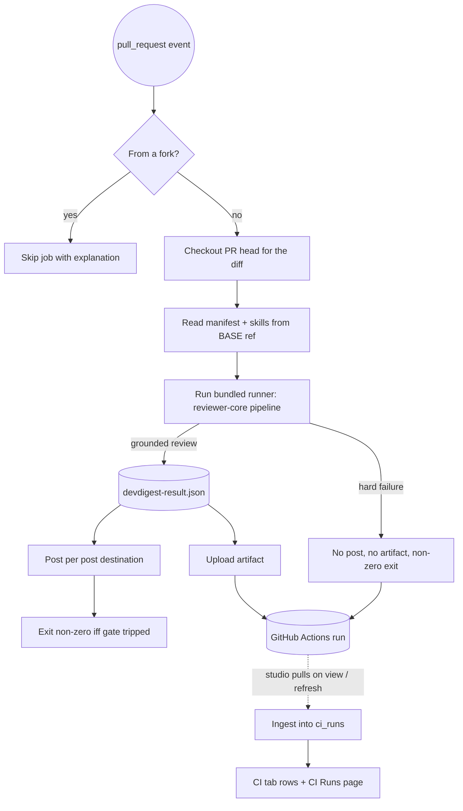

# Spec: Export a configured review agent to CI (GitHub Actions)   |   Spec ID: SPEC-2026-08-27-export-agent-to-ci   |   Status: draft
Supersedes: none

## Problem & why

A DevDigest agent today only reviews when a human opens the studio and presses **Run Review**.
Everything needed to run that same review unattended already exists: `agent-runner` is an
ncc-bundled CLI that executes the identical `reviewer-core` pipeline outside this repo's server,
DI graph, and Postgres; `@devdigest/shared` already carries the `CiTarget` / `CiFile` /
`AgentManifest` / `CiExportInput` / `CiExport` / `CiInstallation` / `CiRun` / `CiResultArtifact`
contracts; `ci_installations` and `ci_runs` tables exist; and `client/messages/en/ci.json` holds a
fully authored English catalogue for the wizard and the CI Runs page.

What does not exist is the connective tissue: nothing generates the bundle, nothing opens the PR
that installs it, nothing tells the runner how to post, and nothing brings run results back into
the studio. The runner is a working engine with no ignition. This spec defines that flow — an
**Export to CI** wizard that turns a configured agent into a checked-in, self-contained review job
in a target repository, plus the reporting loop that shows those runs back in DevDigest.

Doing it now is what converts DevDigest from a local review console into something a team's PRs
actually depend on. It is also the point at which a review agent starts producing merge-blocking
verdicts on other people's code, so the trust boundaries have to be specified rather than
discovered.

## Goals / Non-goals

- **Goal:** A user can take a configured, enabled agent and, from a **CI** tab on the agent detail
  page, deploy it to a GitHub repository through a four-step wizard (Target → Preview → Configure →
  Install) that ends in a pull request adding the agent's config, its skills, the runner bundle, and
  a `pull_request` workflow.
- **Goal:** The generated bundle is self-contained and reproducible: given the same agent version
  and the same wizard answers, the generated files are byte-identical.
- **Goal:** The Step-3 answers the user gives (triggers, post-results-as) actually reach the runner
  at execution time rather than being silently discarded.
- **Goal:** Re-exporting an already-installed agent updates the existing deployment idempotently
  instead of creating a second one.
- **Goal:** CI runs executed in the target repo are visible back in DevDigest — per-repo status on
  the agent's CI tab and an aggregate **CI Runs** page — including cost, findings count, and a link
  to the GitHub run.
- **Goal:** A user can understand, from the UI alone, what is still required outside DevDigest to
  make the deployment work and to make it block merges.
- **Non-goal:** CircleCI, Jenkins, and Generic CLI generation. `CiTarget` keeps all four values,
  but only `gha` is implemented; the other three render as visibly disabled "coming soon" cards in
  the wizard.
- **Non-goal:** Installing or rotating the LLM API key in the target repository. DevDigest never
  writes GitHub Actions secrets; it tells the user which secret to add.
- **Non-goal:** A GitHub App, a DevDigest-hosted service, or any inbound webhook. DevDigest is
  local-first and unreachable from GitHub's runners; all status flows are pull-based.
- **Non-goal:** Changing `reviewer-core`'s pipeline or any of its invariants. CI and studio reviews
  must stay in parity, not diverge.
- **Non-goal:** Exporting agent **memory**. `.devdigest/memory.jsonl` is dropped from the bundle
  entirely. The memory subsystem is an unimplemented stub (table + Zod contract only; no route,
  service, or producer; `run-executor` hardcodes `memory_pulled: []`) and `agent-runner` contains
  zero memory-reading code, so exporting it would commit unconstrained free text into a customer
  repository for no benefit. Revisit once memory ships server-side and the runner can consume it.
- **Non-goal:** Multi-agent CI deployments — one workflow runs exactly one agent, matching the
  runner's "expected exactly one agent manifest" rule.

## User stories

- **US-1** — As a developer who has tuned an agent locally, I want to see whether and where that
  agent is deployed to CI, so that I do not re-deploy something already running.
- **US-2** — As a developer, I want to pick a target repository and CI provider, so that the
  generated files match where they are going.
- **US-3** — As a developer, I want to read every file before it is created and edit the workflow,
  so that I am not blindly committing generated YAML into my repo.
- **US-4** — As a developer, I want to choose which PR events trigger the review and how results are
  posted, so that the agent fits my team's review etiquette.
- **US-5** — As a developer, I want DevDigest to open the installing pull request for me, so that I
  do not hand-copy five files into another repository.
- **US-6** — As a developer without write access (or who prefers manual control), I want to download
  the generated files, so that I can install them myself.
- **US-7** — As a tech lead, I want to set the severity at which CI fails and understand how to turn
  that into a merge block, so that the agent enforces our bar rather than just talking.
- **US-8** — As a developer, I want to see the outcome of CI reviews — per repo on the agent, and
  across everything on a CI Runs page — so that I can tell whether the deployment is healthy.
- **US-9** — As a developer who has since changed the agent's model, prompt, skills, or gate, I want
  DevDigest to tell me the deployed copy is stale and let me update it in one action.
- **US-10** — As a repository owner, I want the deployed gate to be resistant to a contributor
  weakening it inside the very pull request it is judging.
- **US-11** — As a maintainer of a public repo, I want pull requests from forks not to produce a
  wall of red failed checks caused by unavailable secrets.

## Acceptance criteria (EARS)

### A. CI tab — deployment overview (US-1, US-7, US-9)

- **AC-1:** The system **shall** present a `CI` tab on the agent detail page, selected via the
  existing `?tab=` query-parameter mechanism and listed alongside Config / Skills / Context / Evals /
  Stats / Versions.
  _(observable: navigating to an agent with `?tab=ci` renders the CI panel and marks the CI tab
  active; an unknown `?tab=` value still falls back to the default tab.)_
- **AC-2:** **WHERE** the agent has at least one CI installation, the CI tab **shall** render one row
  per installation showing the repository full name, the target type, the status of that
  installation's most recent known CI run, and a relative timestamp for that run.
  _(observable: with two installations seeded, two rows render with the repo names, target labels,
  status labels and relative times.)_
- **AC-3:** **WHERE** the agent has at least one CI installation, the system **shall** display a
  summary badge stating the number of distinct repositories the agent is active in.
  _(observable: two installations across two repos render a badge reading "Active in 2 repos"; one
  installation renders the singular form.)_
- **AC-4:** **IF** the agent has no CI installations, **THEN** the CI tab **shall** render an empty
  state that explains what export does and offers the export action, and **shall not** render the
  deployments table or the active-repos badge.
  _(observable: an agent with zero installations renders the empty-state copy and no table.)_
- **AC-5:** **WHEN** the user changes the **Fail CI on** control on the CI tab, the system **shall**
  persist the value to the agent's existing `ci_fail_on` field — the same field the Config tab edits
  — and **shall not** introduce a second, CI-only copy of that setting.
  _(observable: changing it on the CI tab and reloading the Config tab shows the new value, and vice
  versa; one persisted field, two surfaces.)_
- **AC-6:** The **Fail CI on** control **shall** offer every value of the `CiFailOn` contract
  (`never`, `critical`, `warning`, `any`), each with a label stating exactly which severities block.
  _(observable: the control renders four options; selecting each persists the matching enum value.)_
- **AC-7:** The system **shall** display, adjacent to the **Fail CI on** control, an explanation that
  failing CI alone does not block a merge and that a required status check must be configured in the
  repository's branch protection to do so.
  _(observable: the explanatory text is present in the CI tab and references branch protection.)_
- **AC-8:** **IF** a CI installation's stored agent version differs from the agent's current version,
  **THEN** the system **shall** mark that installation row as out of date and **shall** offer an
  update action for it.
  _(observable: bumping the agent's version — e.g. by editing its system prompt — flips the row to a
  stale indicator without any change to the installation record itself.)_

### B. Wizard — Step 1 Target (US-2)

- **AC-9:** **WHEN** the user starts an export, the system **shall** open a modal wizard with four
  ordered steps — Target, Preview, Configure, Install — whose current position is always visible.
  _(observable: the wizard renders the four step labels and marks step 1 current on open.)_
- **AC-10:** Step 1 **shall** require the user to identify a target repository as `owner/name` before
  continuing.
  _(observable: Continue is disabled until a repository is chosen/entered; a value failing the
  `owner/name` shape is rejected with an inline message.)_
- **AC-11:** **WHERE** a CI target other than GitHub Actions is offered, the system **shall** render
  it as visibly unavailable and **shall not** allow it to be selected.
  _(observable: clicking the CircleCI, Jenkins, or Generic CLI card leaves GitHub Actions selected
  and does not advance the wizard.)_
- **AC-12:** **IF** a request reaches the export endpoint with a `target` other than `gha`, **THEN**
  the system **shall** reject it with a client error naming the unsupported target and **shall not**
  create an installation or contact GitHub.
  _(observable: an API call with `target: "jenkins"` returns a 4xx and leaves `ci_installations`
  unchanged.)_

### C. Wizard — Step 2 Preview (US-3)

- **AC-13:** **WHEN** the user reaches Step 2, the system **shall** generate the complete file bundle
  and render every file's path in a selectable list with the selected file's full contents shown,
  **without** creating a branch, commit, pull request, or installation record.
  _(observable: reaching Step 2 produces the file list and contents; no GitHub write call is made and
  no installation row is created.)_
- **AC-14:** The generated bundle **shall** contain the agent manifest at
  `.devdigest/agents/<agent-slug>.yaml`, one file per attached skill at
  `.devdigest/skills/<skill-slug>.md`, the runner bundle, and the GitHub Actions workflow at
  `.github/workflows/devdigest-review.yml`, and **shall not** contain any other file.
  _(observable: for an agent with two skills, the returned bundle contains exactly those five paths
  and nothing else.)_
- **AC-14b:** The generated bundle **shall not** contain an agent memory file.
  _(observable: no bundle path ends in `memory.jsonl`; an agent with memory rows still exports the
  same five paths.)_
- **AC-15:** The generated bundle **shall** contain exactly one file under `.devdigest/agents/`,
  matching the runner's requirement of exactly one manifest.
  _(observable: the bundle never contains a second `*.yaml` under `.devdigest/agents/`.)_
- **AC-16:** The generated manifest **shall** validate against the `AgentManifest` contract and its
  `name`, `provider`, `model`, `system_prompt`, `skills`, `strategy`, and `ci_fail_on` **shall** equal
  the agent's current persisted values.
  _(observable: parsing the generated YAML with `AgentManifest` succeeds and every field matches the
  agent record.)_
- **AC-17:** Every skill slug written into the manifest **shall** match the runner's accepted slug
  shape (alphanumerics, underscore, hyphen) and **shall** have a corresponding
  `.devdigest/skills/<slug>.md` file in the same bundle.
  _(observable: a skill whose name would produce an out-of-shape slug is normalised or rejected at
  generation time, never emitted; every manifest slug resolves to a bundled file.)_
- **AC-18:** The system **shall** mark exactly the workflow file as editable in the preview and mark
  the manifest, skill files, and runner bundle as non-editable.
  _(observable: the returned `CiFile[]` has `editable: true` only for the workflow path.)_
- **AC-19:** **WHEN** the same agent at the same version is previewed twice with identical wizard
  answers, the system **shall** produce byte-identical file contents.
  _(observable: two preview calls return the same contents for every path, including no embedded
  timestamp, nonce, or ordering variance.)_

### D. Wizard — Step 3 Configure (US-4, US-7)

- **AC-20:** Step 3 **shall** let the user select any non-empty subset of the pull-request event
  types `opened`, `synchronize`, and `reopened`, and **shall** prevent continuing with an empty
  selection.
  _(observable: deselecting all three disables Continue; the chosen subset appears in the workflow's
  `on.pull_request.types` list.)_
- **AC-21:** Step 3 **shall** let the user choose exactly one result destination from `github_review`,
  `pr_comment`, and `none`, defaulting to `github_review`.
  _(observable: the wizard opens with `github_review` selected; the choice round-trips into the
  export request.)_
- **AC-22:** The generated workflow **shall** convey the chosen result destination to the runner at
  execution time.
  _(observable: choosing `pr_comment` produces a workflow whose runner step carries a
  post-destination value of `pr_comment`; the runner, given that workflow's environment, posts a PR
  comment rather than a review. This closes the known gap where `post_as` was captured by the wizard
  but never reached the runner, which silently defaulted to `github_review`.)_
- **AC-23:** Step 3 **shall** display guidance stating that blocking merges requires setting **Fail
  CI on** so the run exits non-zero and then adding a required status check in the repository's
  GitHub branch protection, and **shall** state that no GitHub App is required.
  _(observable: the note is rendered and does not claim a GitHub App is needed.)_
- **AC-24:** The system **shall** display, before the install step completes, the name of the LLM API
  key secret that must exist in the target repository's Actions secrets, and **shall** state that the
  GitHub token is supplied automatically by Actions.
  _(observable: the secret name is rendered in the wizard; the copy distinguishes the user-supplied
  LLM key from the automatic token.)_

### E. Wizard — Step 4 Install (US-5, US-6)

- **AC-25:** Step 4 **shall** offer exactly two install methods — opening a pull request in the
  target repository, and downloading the generated files — with opening a pull request selected by
  default.
  _(observable: both options render; the PR option is pre-selected.)_
- **AC-26:** **WHEN** the user confirms installation with the pull-request method, the system
  **shall** commit the generated files onto a dedicated DevDigest branch in the target repository as
  a single atomic commit, open a pull request from that branch into the chosen base branch, and
  return the pull request URL.
  _(observable: a successful install returns a non-null `pr_url`; the commit contains every bundle
  file and no others.)_
- **AC-27:** **IF** a DevDigest export branch already exists in the target repository, **THEN** the
  system **shall** update that branch and reuse its open pull request if one exists, rather than
  creating a duplicate branch or a second pull request.
  _(observable: exporting twice in a row yields the same `pr_url` and one additional commit, not two
  pull requests.)_
- **AC-28:** **WHEN** an installation succeeds, the system **shall** persist a `ci_installations`
  record carrying the agent, the repository, the target type, the install timestamp, and the agent
  version that was exported.
  _(observable: after install, the installation row exists and its stored agent version equals the
  agent's version at export time.)_
- **AC-29:** **WHEN** the user installs for a repository that already has an installation of the same
  agent, the system **shall** update the existing record rather than inserting a second one.
  _(observable: two installs for the same agent+repo leave exactly one row, with a refreshed
  timestamp and version.)_
- **AC-30:** **WHEN** the user chooses the download method, the system **shall** deliver the same
  bundle as a single archive preserving each file's relative path, **without** contacting GitHub.
  _(observable: the archive expands to the bundle's paths; no GitHub write call is made.)_
- **AC-31:** **IF** the download method is used, **THEN** the system **shall** record the deployment
  as an installation only after the user explicitly confirms the files were installed, and **shall
  not** silently claim the agent is active in that repository.
  _(observable: choosing download alone does not add a row to the CI tab's deployments table.
  **[NEEDS CLARIFICATION: Q6 — alternative is to record it immediately as an unverified
  installation.]**)_
- **AC-32:** **IF** the GitHub token is missing, lacks access to the target repository, or GitHub
  rejects the branch, commit, or pull-request call, **THEN** the system **shall** surface the failure
  with the repository name and the underlying reason, **shall not** persist an installation record,
  and **shall** leave the wizard on the Install step with the user's answers intact.
  _(observable: with a rejecting GitHub client, the wizard shows an actionable error, no installation
  row is written, and pressing Install again retries without re-answering steps 1–3.)_

### F. Generated workflow behaviour (US-10, US-11)

- **AC-33:** The generated workflow **shall** trigger only on the selected `pull_request` event types
  and **shall not** use a trigger that grants secrets to pull requests from forks.
  _(observable: the generated YAML's trigger is `pull_request` with the chosen types, and is not
  `pull_request_target`.)_
- **AC-34:** **IF** the pull request originates from a fork, **THEN** the review job **shall** be
  skipped with an explanatory message rather than attempted and failed.
  _(observable: a fork pull request produces a skipped, non-red job; no runner invocation and no
  missing-secret error.)_
- **AC-35:** The generated workflow **shall** read `.devdigest/**` — the agent manifest, the skill
  bodies, and therefore `ci_fail_on` and the system prompt — from the pull request's **base ref**,
  never from its head, while still reviewing the head's diff. A pull request that modifies
  `.devdigest/**` **shall** take effect only after it merges.
  _(observable: a pull request that edits `.devdigest/agents/*.yaml` to `ci_fail_on: never` is still
  gated by the previously merged policy, and a pull request that adds a new skill file is reviewed
  without that skill.)_
- **AC-36:** The generated workflow **shall** upload the runner's result artifact so that DevDigest
  can retrieve it after the run.
  _(observable: the workflow contains an artifact-upload step for the runner's result file with a
  stable, documented artifact name.)_
- **AC-37:** The generated workflow **shall** pin its Node.js major version and every third-party
  action it uses to an explicit version rather than a floating reference.
  _(observable: the generated YAML contains no unpinned action reference and no implicit Node
  version.)_
- **AC-38:** The system **shall** exclude DevDigest's own exported files from the diff the agent
  reviews.
  _(observable: a pull request that only touches `.devdigest/**` and the generated workflow yields a
  review over an empty diff, not a review of the runner bundle. Provided today by the runner's own
  strip step; the spec records it as required behaviour, not an accident.)_

### G. Reporting CI runs back into DevDigest (US-8)

- **AC-39:** The system **shall** obtain CI run outcomes by pulling from GitHub — never by receiving
  an inbound call — because the studio runs locally and is not reachable from GitHub's runners.
  _(observable: no inbound endpoint accepts unauthenticated run results; ingest is initiated by
  DevDigest.)_
- **AC-40:** **WHEN** the user opens the CI Runs page or the agent's CI tab, or invokes the refresh
  action, the system **shall** fetch recent workflow runs for each known installation, ingest each
  completed run's result artifact, and persist one `ci_runs` record per run.
  _(observable: with a stubbed GitHub client returning one completed run and one artifact, one
  `ci_runs` row is written carrying the PR number, timestamp, findings count, cost, and run URL.)_
- **AC-41:** **WHILE** a workflow run for a known installation is queued or in progress, the system
  **shall** represent it with the `running` status rather than omitting it.
  _(observable: an in-progress run appears with a running indicator; an empty completed-runs list is
  never rendered as "no CI configured".)_
- **AC-42:** **WHEN** ingesting a completed run, the system **shall** derive its status from the
  presence and contents of the result artifact — `no_findings` when the artifact reports zero
  findings, `succeeded` when it reports findings without a hard failure, and `failed` when the run
  completed without a valid result artifact — and **shall not** derive it from the job's exit code
  alone.
  _(observable: a gate-triggered run, which exits non-zero but does write a valid artifact, is
  reported as `succeeded` — the run completed and the gate doing its job is not a failure of the
  run; a crashed run, which exits non-zero and writes nothing, is reported as `failed`.)_
- **AC-43:** **IF** a downloaded result artifact fails `CiResultArtifact` validation, **THEN** the
  system **shall** record the run as `failed` with the reason and **shall not** persist partial
  metrics.
  _(observable: a malformed artifact produces a failed row with no findings count or cost, and does
  not throw.)_
- **AC-44:** The system **shall** ingest each workflow run at most once, so that repeated refreshes
  do not duplicate `ci_runs` records.
  _(observable: refreshing three times over the same completed run leaves exactly one row.)_
- **AC-45:** **IF** GitHub is unreachable, rate-limits the request, or returns an error during
  ingest, **THEN** the system **shall** keep and display the last known run data, surface the refresh
  failure separately, and **shall not** delete or blank existing rows.
  _(observable: an ingest failure leaves previously ingested rows rendered and shows a refresh-failed
  indication.)_
- **AC-46:** The CI Runs page **shall** list runs across all installations with timestamp, pull
  request, source, findings count, cost, and status, **shall** offer filtering by time window, agent,
  repository, and status, and **shall** offer a link to the underlying GitHub run for each row.
  _(observable: the page renders the six columns, the four filters, and a per-row link.)_
- **AC-47:** **IF** no CI runs have ever been ingested, **THEN** the CI Runs page **shall** render an
  empty state explaining that runs appear after an agent is exported to CI.
  _(observable: with zero rows, the empty-state copy renders instead of an empty table.)_
- **AC-48:** The system **shall** add a **CI Runs** entry to the global navigation that routes to the
  CI Runs page and is highlighted while that page is active.
  _(observable: the nav entry renders, navigates to the CI Runs route, and the shell marks it active
  — the shell's route matcher already anticipates this route.)_

### H. Updating a deployment (US-9)

- **AC-49:** **WHEN** the user invokes the update action for an installation, the system **shall**
  regenerate the bundle from the agent's current configuration and re-run the pull-request install
  path against the same repository and base branch, reusing the existing branch and pull request.
  _(observable: after changing the agent's model, update produces a commit whose manifest carries the
  new model, on the same branch, under the same pull request.)_
- **AC-50:** **WHEN** an update succeeds, the system **shall** record the newly exported agent version
  on the installation so that the stale indicator clears.
  _(observable: the row's out-of-date marker disappears after a successful update.)_
- **AC-51:** **WHILE** an export or update is in flight, the system **shall** disable the initiating
  control and show progress, so that a second concurrent export for the same agent and repository
  cannot be started from the UI.
  _(observable: the install control is disabled and shows a progress label until the request settles.)_

### I. Untrusted content and secrets

- **AC-52:** The system **shall not** write the GitHub token, the LLM API key, or any other secret
  value into any generated file, and the generated workflow **shall** reference secrets only by name.
  _(observable: no generated file contains a secret value; the workflow's secret references are
  name-only.)_
- **AC-53:** The system **shall not** include a secret value in any API response, log line, error
  message, persisted run record, or posted pull-request content.
  _(observable: an install failure caused by a bad token produces an error mentioning authorization
  without echoing the token.)_
- **AC-54:** **WHEN** the runner assembles the review prompt in CI, the system **shall** wrap the
  pull-request diff, title, and body as untrusted data behind the shared injection guard, and
  **shall** apply the mandatory grounding gate before any finding is posted.
  _(observable: parity tests show the CI path and the studio path produce equivalent grounded output
  for the same diff. Already enforced inside `reviewer-core`/`agent-runner`; recorded here because
  export must never introduce a path that bypasses it.)_
- **AC-55:** The system **shall** treat the pull-request title and body reaching the runner as data
  only, and **shall not** allow instructions embedded in them to change the agent's gate, model, or
  system prompt.
  _(observable: a pull request whose body instructs the reviewer to approve everything still produces
  the deterministic gate outcome from grounded findings.)_

### J. Preview edits (US-3)

- **AC-56:** **WHEN** the user edits the workflow file in the preview, the system **shall** apply
  those edits to this single export only, and **shall not** persist them against the installation or
  reapply them to any later export or update.
  _(observable: installing with an edited workflow commits the edited contents; a subsequent update
  for the same installation regenerates the workflow from the agent's current configuration and the
  edit is gone. This keeps AC-19's determinism and AC-49's regenerate-from-current-config behaviour
  intact.)_
- **AC-57:** **IF** an edited workflow file is not valid YAML, **THEN** the system **shall** block
  the install with an inline error identifying the problem and **shall not** commit anything to the
  target repository.
  _(observable: mangling the workflow into invalid YAML disables/rejects Install and produces a
  parse error; no GitHub write call is made.)_

## Edge cases

- Agent has no skills attached → the bundle contains a manifest with an empty skills list and no
  skill files; the runner tolerates it. → AC-14, AC-16
- Agent has a skill whose name does not reduce to a safe slug → normalise or reject at generation;
  never emit a slug the runner's traversal guard will refuse. → AC-17
- Agent is disabled (toggle off) at export time → **[NEEDS CLARIFICATION: Q8 — block export, or
  allow it and warn that the studio toggle does not gate CI?]**
- Agent is deleted after export → `ci_installations` cascade-delete removes the record, but the
  target repo still contains a working workflow that will keep running. → **[NEEDS CLARIFICATION:
  Q7 — is there an uninstall / remove-from-CI path, and does it open a removal PR?]**
- Target repository does not exist, is private beyond the token's grant, or the token has no write
  access → surfaced as an actionable install failure, no installation persisted. → AC-32
- Target repository has no branch matching the chosen base → surfaced as an install failure naming
  the missing base branch. → AC-32
- Target repository already contains a `.github/workflows/devdigest-review.yml` from a different
  agent → **[NEEDS CLARIFICATION: Q9 — overwrite, or name the workflow per agent so two agents can
  coexist? The runner's "exactly one manifest" rule makes a shared `.devdigest/agents/` directory a
  hard conflict.]**
- Export branch exists but its pull request was closed without merging → reuse the branch, open a
  fresh pull request. → AC-27
- Two exports for the same agent and repository race → the second updates rather than duplicates;
  the UI prevents the common case. → AC-29, AC-51
- Fork pull request → job skipped, not failed. → AC-34
- Pull request that edits `.devdigest/**` → gate policy comes from an unmodifiable reference. → AC-35
- Pull request that only edits `.devdigest/**` and the workflow → diff strips to empty; a
  zero-finding approve, not an error. → AC-38
- Runner hard-fails (invalid manifest, missing skill file, LLM error, diff fetch error) → nothing is
  posted, no artifact is written, and DevDigest records the run as failed. → AC-42, AC-43
- Grounding drops every finding → a valid zero-finding result, ingested as `no_findings`, never as an
  error. → AC-42
- LLM API key secret absent in the target repo → the run fails in CI; DevDigest shows it as failed
  and the wizard already warned which secret was required. → AC-24, AC-42
- Result artifact expired or was never uploaded (retention window passed) → run recorded as failed
  with the reason; existing rows untouched. → AC-43, AC-45
- GitHub rate limit hit mid-ingest → partial ingest is kept, failure surfaced, nothing blanked. →
  AC-45
- A very large number of installations makes refresh slow → bounded by the per-refresh API budget in
  *Non-functional*. → AC-40
- Workflow run belongs to a repo whose installation was since deleted → `ci_runs.ci_installation_id`
  is nullable; the run remains listed with its repo label. → AC-40
- User edits the workflow YAML in the preview into something invalid → install is blocked with a
  parse error, nothing is committed. → AC-57
- User edits the workflow in the preview, installs, then later runs update → the edit applies to that
  one export and is not carried forward. → AC-56
- User navigates back from Step 3 to Step 1 and changes the repository → the bundle is regenerated;
  stale preview contents are never installed. → AC-13, AC-19
- Agent's `ci_fail_on` is `never` → the run never exits non-zero; the review is still posted and
  still ingested. → AC-6, AC-42
- Same pull request reviewed repeatedly by `synchronize` → each run is a separate `ci_runs` record,
  deduplicated by workflow run, not by pull request. → AC-44
- Non-English locale → accepted: only an `en` catalogue exists today; new keys are added to `en` and
  the feature inherits the app's existing single-locale posture.

## Non-functional

- **Preview generation** (no network): p95 < 300 ms, p99 < 800 ms for an agent with up to 10 skills.
- **Install (open PR)**: p95 < 10 s end to end, dominated by GitHub API latency; the UI must show
  progress from the first 300 ms.
- **Ingest budget**: at most 2 GitHub REST calls per installation per refresh (list runs, fetch
  artifact), and at most 1 artifact download per newly completed run. A refresh over 50 installations
  completes in < 5 s p95.
- **Auto-refresh**: the CI Runs page and the agent's CI tab refresh at most once every 30 s while
  visible, and **shall** suspend refreshing while the document is hidden.
- **Exported runner bundle size**: ≤ 5 MB, so the installing pull request stays reviewable and well
  inside GitHub's per-file limits. Regressions above this are a spec violation, not a build detail.
- **Generated workflow runtime overhead**: the generated job's non-review steps (checkout, Node
  setup, artifact upload) **shall** add ≤ 60 s to the run; the review itself is model-bound.
- **Determinism**: identical inputs produce byte-identical bundles (AC-19) — a hash over the bundle
  is a valid regression test.
- **Security**: no secret value in any generated file, response, log, error, record, or posted
  comment (AC-52, AC-53). The generated workflow requests the minimum token permissions needed for
  the chosen post destination — read-only when `post_as` is `none`.
- **Accessibility**: WCAG 2.1 AA. The wizard modal traps focus, restores focus to the invoking
  control on close, closes on `Escape`, exposes the current step and total steps to assistive
  technology, and the deployment/run status indicators convey status by text as well as colour.
- **Testability**: every acceptance criterion above is verifiable with the client's mocked-`fetch`
  vitest setup or the server's hermetic/testcontainers split, except AC-54's parity claim, which
  needs a stubbed LLM provider rather than a live model, and AC-34/AC-35/AC-37, whose full proof is
  the behaviour of a real GitHub Actions run — for those, assert on the generated YAML's structure
  and record the live behaviour as manually verified.

## Cross-module interactions

**Modules involved:** `client` (CI tab, wizard, CI Runs page), `server` (a new CI capability owning
generation, install, and ingest), `@devdigest/shared` (contracts, canonical copy in
`server/src/vendor/shared`), `agent-runner` (the bundled CI executor), `reviewer-core` (the pipeline
the runner calls), and the **target repository's** GitHub Actions — which is outside this system
entirely.

**Data crossing boundaries**

| From → To | What crosses | Failure contract |
|---|---|---|
| client → server | `CiExportInput` (repo, target, action, post_as, triggers, base) | 4xx with a message the wizard renders inline; wizard state preserved (AC-32) |
| server → client | `CiExport` (installation, `CiFile[]`, `pr_url`) | never partially applied — either an installation exists with a PR URL, or neither does |
| server → GitHub | branch + atomic commit + pull request in the target repo | idempotent by branch reuse (AC-27); any rejection aborts before persistence (AC-32) |
| GitHub Actions → runner | env-conveyed repo, PR number, post destination, secrets | missing required env or secret is a hard failure: nothing posted, no artifact (AC-42) |
| runner → GitHub PR | review or comment, per post destination | posting failure does not lose the already-written artifact |
| runner → artifact | `CiResultArtifact` | validated at write time by the same contract ingest validates with |
| GitHub → server | workflow run list + result artifact | pull-based only (AC-39); failure preserves existing rows (AC-45) |
| server → client | `CiRun[]` + installation status | stale-but-present beats empty-on-error (AC-45) |

**Install flow**

**Execution and reporting loop**

## Contracts

Shapes only. Everything below already exists in `@devdigest/shared` unless marked **new** or
**change**.

**Existing, reused unchanged**

- `CiTarget` — `gha | circle | jenkins | cli`. Only `gha` is accepted by the API (AC-12).
- `CiFailOn` — `never | critical | warning | any`. Lives on the agent, not on the installation (AC-5).
- `CiFile` — `{ path, contents, editable }`.
- `AgentManifest` — `{ name, provider, model, system_prompt, skills[], strategy, ci_fail_on }`; the
  studio writes it, the runner validates it. One schema, both ends.
- `CiExportInput` — `{ repo, target, action: open_pr | files, post_as, triggers[], base }`.
- `CiExport` — `{ installation, files[], pr_url | null }`.
- `CiInstallation` — `{ id, agent_id, repo, target_type, installed_at }`.
- `CiRunStatus` — `succeeded | failed | no_findings | running`.
- `CiRun` — `{ id, ci_installation_id?, pr_number?, ran_at?, status?, findings_count?, cost_usd?,
  github_url?, source?, agent?, duration_s? }`.
- `CiResultArtifact` — `{ findings_count, critical?, warning?, suggestion?, cost_usd, duration_ms?,
  agent, version?, pr_number? }`.

**Changes required**

- **change — installation carries the exported agent version.** Drift detection (AC-8, AC-50) needs
  the version that was exported alongside the installation. `CiInstallation` gains an exported-agent-
  version field, and the persisted installation record gains the matching column. Without it, "out of
  date" is unknowable.
- **change — the persisted CI run must be able to express what the contract exposes.** `CiRun`
  surfaces an agent label and a duration that the persisted run record has no home for today; either
  the record gains them or they are documented as derived at read time. Ingested runs also need a
  stable identifier for the underlying workflow run so that AC-44's at-most-once ingest is possible.
- **change — the post destination must reach the runner.** `AgentManifest` deliberately has no
  post-destination field, and the runner accepts it as an explicit parameter resolved from its
  environment. The generated workflow is therefore the carrier (AC-22). The spec's requirement is
  that the user's Step-3 choice is honoured at execution; whether that is achieved by an environment
  value in the workflow or by adding the field to the manifest is an implementation decision, but
  silently defaulting to `github_review` is a defect.
- **new — installation status for the CI tab.** The CI tab rows (AC-2, AC-3, AC-8) need, per
  installation: the installation, its most recent run summary (status + timestamp), and whether it is
  out of date. Direction: server → client, read-only.
- **new — preview response.** Step 2 needs a bundle without side effects (AC-13). Input is the same
  target/trigger/post-destination answers as export; output is `CiFile[]` plus the resolved target
  repository. No installation, no `pr_url`.
- **new — CI runs query.** The CI Runs page (AC-46) needs a filtered, paginated list across
  installations: filters for time window, agent, repository, and status; each item is a `CiRun` plus
  enough repo/agent labelling to render a row without a second call.

**Runner execution contract** (already established by `agent-runner`, recorded here because the
generated workflow must satisfy it): the runner requires the target repository identifier, the pull
request number, an LLM credential, and — for any post destination other than `none` — a GitHub
token; it optionally accepts overrides for the `.devdigest` directory, the result file location, and
the post destination. It writes exactly one result file and exits non-zero when the gate trips **or**
when it hard-fails — which is precisely why ingest must key on the artifact, not the exit code
(AC-42).

## Untrusted inputs

This feature handles untrusted content on three distinct surfaces, and they must not be conflated.

1. **The pull-request diff, title, and body**, read inside CI. Author-controlled. Wrapped as
   untrusted data behind the shared injection guard before reaching the prompt, and every finding
   passes the mandatory grounding gate before it can be posted (AC-54, AC-55). The runner already
   folds the PR title into the wrapped description precisely because an earlier version let the title
   ride into the prompt unwrapped.
2. **The checked-in `.devdigest/**` manifest and skill bodies**, read inside CI. These reach the
   prompt in the *trusted* tier — skill bodies are joined into the rules section with no untrusted
   wrapper. That makes them a policy surface, not data: whoever can edit them can rewrite the
   agent's instructions and its gate. Hence AC-35 (read them from the **base ref**, so a pull request
   cannot weaken the gate that is judging it) and the runner's existing slug allowlist plus
   path-containment check, which exist because a manifest-supplied slug could otherwise read an
   arbitrary file into the trusted rules section.
3. **The target repository identifier** supplied in the wizard. User-supplied free text that becomes
   API path segments and drives writes into a third-party repository. It must be shape-validated
   (AC-10) and the resulting install must fail closed on any authorization error (AC-32).

Exporting **memory** would add a fourth, worse surface: memory content is unconstrained free text
that can be derived from pull-request material, and it renders in the same trusted tier as skills.
Since nothing consumes it in CI today, exporting it is pure downside — hence the decision to drop
`.devdigest/memory.jsonl` from the bundle entirely (AC-14b).

## Decisions (resolved during spec review, 2026-08-27)

- **D1 — Target scope.** GitHub Actions only. CircleCI, Jenkins, and Generic CLI cards are shown but
  disabled ("coming soon"); `CiTarget` keeps all four values and the API rejects non-`gha` targets.
  → Non-goals, AC-11, AC-12
- **D2 — Memory.** `.devdigest/memory.jsonl` is dropped from the export bundle entirely; the bundle
  is the manifest, the skill files, the runner bundle, and the workflow. Revisit once memory ships
  server-side and the runner can consume it. → Non-goals, AC-14, AC-14b
- **D3 — Run status.** Pull-based polling; auto-refresh every 30 s while the CI tab or CI Runs page
  is visible, suspended when hidden. A gate-tripped run is labelled `succeeded` — the run completed,
  and the gate doing its job is not a failure of the run. → AC-40, AC-42, Non-functional
- **D4 — Manifest trust.** The workflow reads `.devdigest/**` (manifest, skills, `ci_fail_on`, system
  prompt) from the **base ref**, never the PR head, while reviewing the head's diff. A PR modifying
  `.devdigest/**` takes effect only after merge. → AC-35, Untrusted inputs
- **D5 — Preview edits.** This-export-only: validated as YAML, applied to the single export, then
  discarded. Never persisted per installation, so update-regeneration stays deterministic. → AC-56,
  AC-57

## Open questions

- **Q6 (non-blocking)** — [NEEDS CLARIFICATION: Does the zip-download path create an installation
  record? Recommended: no — do not claim the agent is active in a repo DevDigest never wrote to.]
- **Q7 (non-blocking)** — [NEEDS CLARIFICATION: Is there an uninstall / remove-from-CI path? The
  design shows no way to delete a deployment row, and deleting the agent removes DevDigest's record
  while leaving a live workflow in the target repository.]
- **Q8 (non-blocking)** — [NEEDS CLARIFICATION: Can a disabled agent be exported? The studio's on/off
  toggle has no effect on a checked-in workflow, so an exported disabled agent still reviews. Block,
  or allow with a warning?]
- **Q9 (non-blocking)** — [NEEDS CLARIFICATION: Two agents exported to the same repository. The
  runner requires exactly one manifest under `.devdigest/agents/`, so a second export to the same
  repo is a hard conflict. Overwrite the first, refuse, or restructure the layout so multiple agents
  can coexist?]
- **Q10 (non-blocking)** — [NEEDS CLARIFICATION: The message catalogue contains a second, simpler
  publish dialog alongside the four-step wizard. Confirm the wizard is the shipping surface and the
  simpler dialog's keys are retired.]
- **Q11 (non-blocking)** — [NEEDS CLARIFICATION: The catalogue currently claims blocking merges
  "requires a GitHub App — not available with PAT in local mode", which contradicts the design's
  branch-protection guidance in AC-23. Confirming the design is authoritative means that copy is
  stale and should be replaced.]
- **Q12 (non-blocking)** — [NEEDS CLARIFICATION: The design's preview shows a Node 20 setup step,
  while this repo standardises on Node 22. Recommended: generate the version the runner bundle is
  built and tested against, and state it explicitly rather than inheriting the screenshot.]
