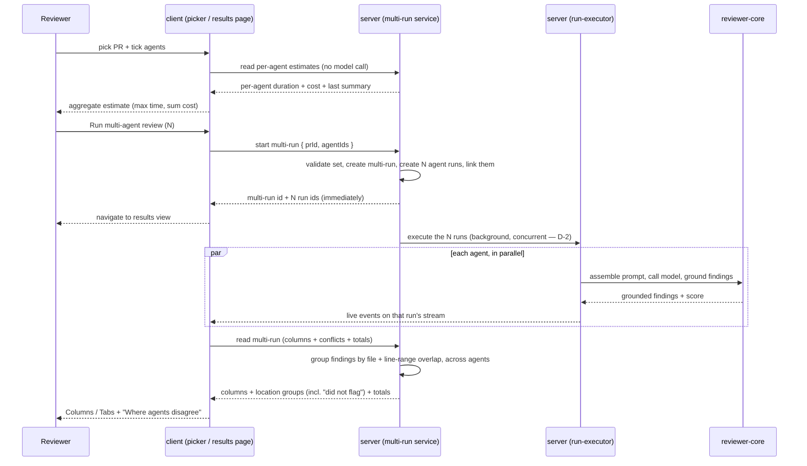

# Spec: Multi-Agent Review   |   Spec ID: SPEC-2026-08-27-multi-agent-review   |   Status: draft
Supersedes: none

Scope note: this spec covers **worktree A** of Lab 7 — the agent picker, the multi-run
grouping, the cross-agent conflict view, and the Multi-Agent Review page. The `ci/` and
`agent-runner/` engines are explicitly out of scope (see Non-goals).

## Problem & why

DevDigest can already run several review agents over one pull request, but the product has
no concept of *a set of agents run together*. Three consequences:

1. **No choice before spending money.** `Run Review` offers "one agent" or "all enabled
   agents". There is no way to pick a subset, and no way to see what a run will cost or how
   long it will take before pressing the button. Pre-run cost/time estimation does not exist
   anywhere in the product today.
2. **No grouping.** Runs are recorded individually in `agent_runs`. The `multi_agent_runs`
   table exists but is never written to or read from, so N agents on one PR are N unrelated
   runs — nothing ties them together, and there is no per-multi-run total time or cost.
3. **Results don't compose.** Each agent's findings are read separately. When four agents
   flag the same line, the reader sees four near-duplicate cards and cannot tell whether the
   agents agree, disagree, or simply weren't looking. The signal that matters most — *these
   agents looked at the same spot and reached different conclusions* — is invisible.

Solving this now also lays the data foundation for later work: finding→agent attribution
survives into the grouped output, which is the raw material Per-Agent Stats needs, and the
per-finding actions become the hooks for the Memory and evals lessons.

## Goals / Non-goals

- **Goal:** let a reader pick an explicit subset of agents to run on a PR, from two places —
  a quick picker on the PR detail page and a full "Configure run" page.
- **Goal:** show a per-agent and aggregate time/cost estimate *before* the run, derived from
  the agent's own past runs, with no model call.
- **Goal:** persist a multi-run record that groups the agent runs it spawned, and expose it
  as one read (columns + conflicts + totals).
- **Goal:** group findings from different agents that land on the same code location, and
  render every participating agent's verdict for that location — including an explicit
  "did not flag".
- **Goal:** one Multi-Agent Review results page with two modes — Columns (live parallel
  lanes) and Tabs + detail (per-finding actions).
- **Goal:** preserve finding→agent attribution end to end in the grouped output.
- **Goal:** make the executor genuinely concurrent — the spawned agent runs of one multi-run
  execute in parallel, preserving the existing per-run failure isolation (decision D-2; the
  change is confined to the server's run-executor, not `reviewer-core`).

- **Non-goal:** changing the review engine's prompt assembly, the grounding gate, or
  `reviewer-core` in any way. The engine is reused as-is.
- **Non-goal:** the `ci/` and `agent-runner/` engines. Nothing in this feature enters them.
- **Non-goal:** the **Compose Review drawer** (curating findings before publishing a review
  to GitHub). It is a separate feature in the same design and is not part of this work.
- **Non-goal:** Per-Agent Stats / Agent Performance dashboards. This feature only guarantees
  that the attribution data they need exists.
- **Non-goal:** implementing the `learn` and `reply` finding actions server-side (today
  `actOnFinding` rejects both with a 400). They are surfaced as visible, unavailable hooks.
- **Non-goal:** cross-PR or cross-repo multi-runs. A multi-run is scoped to exactly one PR.
- **Non-goal:** re-running a subset of a completed multi-run in place ("retry this agent").
- **Non-goal:** "similarity of substance" in the cross-agent grouping rule. Grouping in this
  scope is file + line-range overlap only (decision D-4); a deterministic textual-similarity
  refinement is recorded as follow-up work, not built here.

## User stories

- **US-1** As a reviewer on a PR detail page, I want to tick the agents I actually want and
  start them from one button, so that I don't have to choose between one agent and all of them.
- **US-2** As a reviewer, I want to see roughly what a selection will cost and how long it
  will take before I start it, so that I can trade breadth against budget.
- **US-3** As a reviewer, I want to see, per agent, what that agent said about this PR last
  time, so that I can decide whether it is worth running again.
- **US-4** As a reviewer, I want the agents I picked to be recorded as one run, so that I can
  come back to *that comparison* rather than to N unrelated runs.
- **US-5** As a reviewer, I want to watch the agents progress live, side by side, so that I
  can see which lane is slow and open its trace while it runs.
- **US-6** As a reviewer, I want findings from different agents at the same code location
  collapsed into one group, so that duplicates stop being noise.
- **US-7** As a reviewer, I want to see where agents *disagree* — including which agents
  looked and chose not to flag — so that I know which calls are contested and worth my judgement.
- **US-8** As a reviewer, I want to open a single finding and act on it (accept, dismiss, turn
  into an eval case), so that my decision is captured where I made it.
- **US-9** As a reviewer, I want to reload the page mid-run without losing the live feed, so
  that a refresh is never destructive.

## Acceptance criteria (EARS)

### Configure run page (US-1, US-2, US-3)

- **AC-1:** WHILE no pull request is selected on the Configure run page, the system **shall**
  disable the run action and render a "Pick a pull request first" placeholder in place of the
  agent list.
  _(observable: component test — render with no selection; run control is disabled and the placeholder is present)_
- **AC-2:** WHEN a pull request is selected, the system **shall** list every agent in the
  active workspace as a checkbox card carrying the agent's name, icon, a one-line summary of
  that agent's most recent completed run on *that pull request* (omitted when the agent has
  never completed a run on it), and that agent's duration and cost estimate derived from the
  agent's recent completed runs workspace-wide (decision D-3).
  _(observable: component test — with a fixture of 5 agents, 5 cards render, each showing summary + estimate; an agent with workspace history but no run on this PR shows an estimate and no summary line)_
- **AC-3:** WHEN the user activates "Select all", the system **shall** check every listed
  agent and update the run action's count to the number of listed agents.
  _(observable: component test — click "Select all"; all checkboxes checked and the label reads the full count)_
- **AC-4:** WHILE zero agents are checked, the system **shall** disable the run action.
  _(observable: component test — uncheck all; run control is disabled)_
- **AC-5:** The run action's label **shall** always state the number of currently checked
  agents.
  _(observable: component test — check 2 of 5; label reads "(2)")_
- **AC-6:** WHILE at least one agent with an estimate is checked, the system **shall** show
  an aggregate pre-run estimate whose duration is the **maximum** per-agent duration estimate
  among checked agents and whose cost is the **sum** of their per-agent cost estimates.
  _(observable: unit test on the aggregation — inputs {8.2,7.4,6.9,7.1}s / {.06,.05,.04,.05} → 8.2s / $0.20)_
- **AC-7:** IF a listed agent has no completed prior run anywhere in the workspace to
  estimate from, THEN the system
  **shall** render "—" for that agent's duration and cost and **shall** exclude it from the
  aggregate estimate rather than treating it as zero.
  _(observable: unit test — an agent with zero history contributes nothing to max or sum)_
- **AC-8:** IF at least one checked agent has no estimate, THEN the system **shall** mark the
  aggregate estimate as a lower bound rather than presenting it as a complete figure.
  _(observable: component test — with one estimate-less agent checked, the aggregate carries a "at least"/incomplete marker)_
- **AC-9:** IF an agent's most recent completed run recorded a null cost, THEN the system
  **shall** render "—" for that agent's cost and **shall never** render "$0.00".
  _(observable: component test — fixture run with `cost_usd: null`; the string "$0.00" does not appear)_
- **AC-10:** WHEN the user submits the run from the Configure run page, the system **shall**
  start exactly one multi-agent run containing exactly the checked agents, and **shall**
  navigate to the results view for the selected pull request.
  _(observable: component test — submit sends one request whose agent set equals the checked set, then routes to the results view)_
- **AC-11:** The pull-request dropdown on the Configure run page **shall** list only pull
  requests belonging to the currently active repository.
  _(observable: component test — fixture with two repos; only the active repo's PRs are offered)_

### Quick picker on the PR detail page (US-1)

- **AC-12:** WHEN the user opens "Run Review" on a PR detail page, the system **shall**
  present a checkbox row per workspace agent with that agent's duration estimate, a "Clear"
  action, a primary run action labelled with the checked count, and a link to the Configure
  run page.
  _(observable: component test on the picker — all five elements present)_
- **AC-13:** WHEN the user activates "Clear" in the quick picker, the system **shall** uncheck
  every agent and disable the run action.
  _(observable: component test — click "Clear"; no checkbox checked, run control disabled)_
- **AC-14:** The quick picker **shall** replace the previous "run one agent / run all enabled
  agents" trigger, and **shall not** offer a single-agent-only or an all-agents-only run entry.
  _(observable: component test — the old "Run all agents" and per-agent immediate-run entries are absent)_
- **AC-15:** WHEN the quick picker's run action is submitted, the system **shall** start a
  multi-agent run identical to the one the Configure run page would start for the same
  selection on the same pull request.
  _(observable: component test — both surfaces issue the same request shape and agent set)_
- **AC-16:** WHERE the pull request is already merged or closed, the quick picker **shall**
  still permit the run and **shall** show a non-blocking warning.
  _(observable: component test — merged fixture; warning is present and the run control is enabled)_

### Multi-run grouping (US-4)

- **AC-17:** WHEN a multi-agent run is started, the system **shall** persist one multi-run
  record scoped to the workspace and the pull request, and **shall** link every agent run it
  spawned to that record.
  _(observable: DB-backed integration test — after a start, one multi-run row exists and every spawned agent run resolves back to it)_
- **AC-18:** The system **shall** return the latest multi-run for a pull request — its
  per-agent columns, its cross-agent location groups, and its totals — in a single read.
  _(observable: DB-backed integration test — one request returns columns + conflicts + totals)_
- **AC-19:** IF a pull request has no multi-run yet, THEN the read **shall** answer 200 with
  an empty result rather than 404.
  _(observable: integration test — a never-run PR returns 200 and a null/empty body)_
- **AC-20:** IF the requested pull request or any requested agent belongs to another
  workspace, THEN the system **shall** answer as not found and **shall not** disclose the
  record.
  _(observable: DB-backed integration test — cross-workspace read returns 404 and no row data)_
- **AC-21:** IF the requested agent set is empty, contains a duplicate id, or contains an id
  that is not an agent of the caller's workspace, THEN the system **shall** reject the request
  with a validation error and **shall not** create a multi-run or any agent run.
  _(observable: integration test — three rejection cases return 4xx; no rows created)_
- **AC-22:** The multi-run's reported total duration **shall** be the wall-clock span from the
  first spawned agent run's start to the last one's completion, and its total cost **shall**
  be the sum of the spawned runs' costs, treating an unpriced run as unknown rather than as
  zero.
  _(observable: unit test on the aggregation — runs with a null cost yield a null total, not a smaller number)_
- **AC-23:** The multi-run start endpoint **shall** be rate-limited to no more than 10
  requests per minute per caller, matching the existing single-review trigger.
  _(observable: integration test — the 11th call within a minute is rejected)_
- **AC-24:** WHEN a multi-agent run is started, the system **shall** return the identifiers of
  every spawned agent run in the start response, before any review has completed.
  _(observable: integration test — the start response carries one run id per selected agent and returns without waiting for the model)_

### Concurrent execution (US-2, US-5) — added by decision D-2

- **AC-49:** WHEN a multi-agent run is started, the executor **shall** execute the spawned
  agent runs concurrently rather than sequentially, and a failure or rejection in one run
  **shall not** interrupt, cancel, or fail any other run in the same multi-run.
  _(observable: integration test with N stubbed agents whose reviews each take ~t — total wall-clock time is ~t (max), not ~N·t (sum); a run that throws leaves the others completing normally)_

### Cross-agent grouping and conflicts (US-6, US-7)

- **AC-25:** The system **shall** group two findings from *different* agents in the same
  multi-run into one location group WHEN they cite the same file AND their line ranges
  intersect (inclusive), reusing the existing file-plus-range-overlap match rule.
  _(observable: unit test on the grouper — `a.ts:10-14` and `a.ts:12-20` group; `a.ts:10-14` and `a.ts:30` do not; `a.ts:10` and `b.ts:10` do not)_
- **AC-26:** The system **shall not** group two findings that came from the *same* agent run
  into one another's location group.
  _(observable: unit test — two same-agent findings at the same line remain two entries, not one group with a duplicated agent)_
- **AC-27:** For every location group, the system **shall** include one verdict entry per
  agent that completed successfully in the multi-run — the agent's severity where it flagged
  the location, and an explicit "did not flag" marker where it did not.
  _(observable: unit test — a 4-agent multi-run where 1 agent flags produces a group with 4 entries, 3 of them "did not flag")_
- **AC-28:** IF an agent's run in the multi-run failed or was cancelled, THEN that agent
  **shall** be omitted from every location group's verdict list rather than recorded as "did
  not flag".
  _(observable: unit test — a failed agent contributes no verdict entry to any group)_
- **AC-29:** WHILE "Show only conflicts" is enabled, the system **shall** display only groups
  in which the agents' verdicts diverge, and **shall** hide groups in which every
  participating agent flagged the location at the same severity.
  _(observable: component test — toggle on; a unanimous group disappears, a divergent group remains)_
- **AC-30:** The grouped output **shall** carry the originating agent id for every finding it
  contains.
  _(observable: contract/unit test — every entry in the grouped payload resolves to exactly one agent id)_
- **AC-31:** The system **shall** compute location groups and conflicts deterministically from
  persisted findings, with zero model calls and no new persisted table.
  _(observable: unit test with a mock LLM provider asserting zero invocations during a grouped read)_
- **AC-50:** WHERE an agent's verdict entry in a location group is "did not flag" AND that
  agent's run recorded a grounding-gate-rejected finding whose file and line range match the
  group's location, the entry's note **shall** carry that rejection's reason; otherwise the
  entry **shall** carry no note and render as plain "did not flag" (decision D-1).
  _(observable: unit test — a rejected finding at the grouped location yields a note with its reason; no rejection at that location yields a note-less entry; no model call either way)_

### Results page (US-5, US-8, US-9)

- **AC-32:** The results view **shall** offer exactly two modes — Columns and Tabs — and
  **shall** preserve the selected mode across a reload of the same results view.
  _(observable: component test — select Tabs, remount, Tabs is still selected)_
- **AC-33:** WHILE in Columns mode, the system **shall** render one column per agent in the
  multi-run showing the agent's name, score, duration, cost, its findings as title +
  `file:line` cards, a findings count, and a link to that agent's run trace.
  _(observable: component test — a 4-agent fixture renders 4 columns with all seven elements)_
- **AC-34:** WHILE an agent's run is in progress, its column header **shall** show a live
  running status driven by that run's existing event stream, and **shall** switch to the
  terminal status without a manual reload when the run completes.
  _(observable: component test with a mocked event source — emit a done event; the header transitions without a refetch-triggering user action)_
- **AC-35:** WHEN the user opens "View trace" from a column or an agent summary card, the
  system **shall** open the existing run-trace surface for that specific agent run.
  _(observable: component test — click on column 3's trace link; the trace surface receives column 3's run id)_
- **AC-36:** IF the results view is mounted while a multi-run is still in progress, THEN the
  system **shall** restore each agent's current status from the server and resume the live
  feed from the stream's replay buffer, without dropping events emitted before the mount.
  _(observable: component test — mount mid-run with a replay fixture; pre-mount events appear in the feed)_
- **AC-37:** IF one agent's run in the multi-run fails, THEN its column **shall** show a
  failed state carrying the recorded reason, and every other agent's column **shall** continue
  to its own terminal state.
  _(observable: component test — a fixture with one failed and three done columns renders one failure and three results)_
- **AC-38:** IF the multi-run's shared pre-work fails (for example the diff cannot be loaded)
  and therefore every spawned run fails, THEN the results view **shall** show the shared
  reason once at the multi-run level rather than repeating an identical error in every column.
  _(observable: component test — all-failed fixture with an identical reason renders one run-level error banner)_
- **AC-39:** WHILE in Tabs mode, the system **shall** render one tab per agent labelled with
  the agent's name and score, an agent summary card carrying score, summary, duration, cost
  and a trace link, and the agent's findings as collapsible cards.
  _(observable: component test — 4 tabs, each selecting a summary card + finding list)_
- **AC-40:** WHEN the user expands a finding card, the system **shall** show that finding's
  severity, category, `file:line`, confidence, full description, and suggested fix.
  _(observable: component test — expand; all six fields are present)_
- **AC-41:** WHEN the user accepts or dismisses an expanded finding, the system **shall**
  persist the decision through the existing finding-action path and reflect the finding's new
  state without a full page reload.
  _(observable: component test — click Accept; one action request is issued and the card renders its accepted state)_
- **AC-42:** WHEN the user turns an expanded finding into an eval case, the system **shall**
  create the case from that finding through the existing eval-case-from-finding path and
  confirm the outcome to the user.
  _(observable: component test — click "Turn into eval case"; the seeded-create request carries the finding id and a confirmation renders)_
- **AC-43:** WHERE a finding action is not implemented server-side, the system **shall** render
  its control as visibly unavailable and **shall not** issue a request that the server would
  reject.
  _(observable: component test — the unimplemented actions are disabled and clicking them issues no request)_
- **AC-44:** The "Where agents disagree" block **shall** be present in both Columns mode and
  Tabs mode.
  _(observable: component test — the block renders in each mode)_
- **AC-45:** IF a completed multi-run produced no findings from any agent, THEN the "Where
  agents disagree" block **shall** render an empty state rather than disappearing.
  _(observable: component test — zero-finding fixture renders the empty state)_
- **AC-46:** The results view header **shall** state the number of agents in the multi-run,
  the multi-run's total duration and its total cost, and the pull request it belongs to.
  _(observable: component test — header renders all four)_

### Cross-cutting

- **AC-47:** Every user-facing string introduced by this feature **shall** be resolved through
  the existing localisation catalogue and **shall not** be hard-coded in a component.
  _(observable: repo grep over the feature's own files finds no user-facing literal outside the message catalogue)_
- **AC-48:** The system **shall** render all agent-authored and third-party-authored text
  (finding titles, descriptions, suggested fixes, PR titles, file paths) as inert data and
  **shall not** allow it to be interpreted as markup or as instructions.
  _(observable: component test — a finding whose title contains a script tag and an "ignore previous instructions" line renders as visible text, executes nothing)_

## Edge cases

| Case | Expected behaviour | Coverage |
|---|---|---|
| No pull request selected on Configure run | Agent step shows placeholder, run disabled | AC-1 |
| Zero agents checked | Run disabled; no request issued | AC-4, AC-13 |
| Workspace has no agents at all | Agent step shows an empty state pointing at agent creation; run disabled | **[NEEDS CLARIFICATION — see Open questions Q6]** |
| Agent has never run → no estimate | "—" for time and cost; excluded from the aggregate | AC-7 |
| Agent has run, but never on *this* PR → no summary line | Card renders its workspace-wide estimate but no summary line — it never borrows another PR's summary | AC-2 (decision D-3) |
| Agent's last run has `cost_usd = null` (unpriced model) | "—", never "$0.00"; the aggregate cost becomes a lower bound | AC-9, AC-8 |
| Every checked agent lacks an estimate | Aggregate shows "—" and is marked incomplete | AC-7, AC-8 |
| Duplicate agent id in the submitted set | Rejected as invalid; nothing created | AC-21 |
| Agent id from another workspace | Rejected as not found; nothing created | AC-20, AC-21 |
| PR from another workspace | Not found; record not disclosed | AC-20 |
| Double-click on the run button | Rate limit bounds the damage; a second multi-run is a legal, separate record | AC-23 — **accepted: no client-side idempotency key** |
| One agent fails mid-run | That column fails with its reason; the others complete | AC-37 |
| Shared pre-work fails → all runs fail identically | One run-level error, not N identical column errors | AC-38 |
| An agent is cancelled mid-run | Excluded from conflict verdicts; its column shows a cancelled terminal state | AC-28, AC-37 |
| Page reloaded while the multi-run is in flight | Status restored from the server; live feed resumed from the replay buffer | AC-36 |
| Multi-run completes with zero findings from every agent | Columns render empty; disagreement block renders an empty state | AC-45 |
| Two findings from the *same* agent at the same line | Not grouped with each other | AC-26 |
| A location group where every agent flagged at the same severity | Hidden when "Show only conflicts" is on | AC-29 |
| A finding whose file is not in the diff | Cannot occur — the mandatory grounding gate drops it before persistence | **accepted: no additional handling; relies on the existing invariant** |
| Agent-authored text containing markup or prompt-injection prose | Rendered as inert text | AC-48 |
| PR with no prior runs at all (first-ever multi-run) | All estimates "—"; run still permitted | AC-7, AC-8 |
| Merged / closed PR | Run permitted with a non-blocking warning | AC-16 |
| Very large agent set (e.g. 12 agents) selected | Columns mode remains usable via horizontal scroll; Tabs mode remains usable via tab overflow | **[NEEDS CLARIFICATION — see Open questions Q7]** |
| A previous multi-run exists and a new one is started | The results view shows the newest; older ones remain readable by id | AC-18 — **accepted: no multi-run history browser in this scope** |

## Non-functional

- **No model calls on the read path.** Estimates, location grouping, conflicts and totals are
  computed deterministically from persisted rows — zero LLM invocations (AC-31).
- **Estimate read latency:** p95 < 300 ms server-side for a workspace with ≤ 20 agents, since
  it is a pure aggregate over `agent_runs`.
- **Grouped read latency:** p95 < 500 ms server-side for a multi-run of ≤ 8 agents and ≤ 200
  total findings.
- **Rate limit:** the multi-run start endpoint is capped at 10 requests / minute per caller,
  matching the existing `POST /pulls/:id/review` fence (AC-23).
- **Workspace isolation:** every read and write in this feature is workspace-scoped; a
  cross-workspace request is indistinguishable from a missing record (AC-20).
- **Accessibility:** WCAG 2.1 AA. The Columns/Tabs mode switch and the agent tabs are
  keyboard-operable with a visible focus indicator; severity is never conveyed by colour
  alone (each severity carries an icon and a text label); the "Show only conflicts" toggle
  exposes its state to assistive technology.
- **Localisation:** all new user-facing strings live in the message catalogue (AC-47).
- **Engine invariants (unchanged, must not be bypassed):** the citation-grounding gate remains
  a mandatory step for every agent run in a multi-run, and untrusted PR/diff text is wrapped
  before it reaches a prompt. This feature neither disables nor routes around either.

## Cross-module interactions

Modules involved: **client** (both surfaces + the results page), **server** (multi-run
service, routes, grouping), **@devdigest/shared** (the contracts both sides read),
**reviewer-core** (reused unchanged, reached only through the existing executor).

Data crossing the boundaries:

- client → server: the selected pull-request id and the selected agent id set.
- server → client: the spawned run ids (immediately), then the multi-run record — per-agent
  columns with status/score/duration/cost/findings, location groups with per-agent verdicts,
  and the multi-run totals.
- server → client (live): the existing per-run event stream, one subscription per column.
- server → reviewer-core: unchanged; the executor's existing per-agent call.

Failure contract:

- A failure inside one agent run is isolated: that run is persisted as failed with its
  reason, its column reflects that, and the multi-run still completes with the surviving
  columns (AC-37).
- A failure in the shared pre-work (diff load, and any other step shared across the batch)
  fails every spawned run with the same reason; the results view surfaces it once at the
  multi-run level (AC-38).
- A failure of the live event stream degrades to the server-side status read — the columns
  still reach their terminal state; only the line-by-line feed is lost.
- A validation failure on the start request creates nothing at all (AC-21).

## Contracts

Shapes only. Field names below are the *meaning* that must cross the boundary, not a
prescription of the implementation.

**Start a multi-agent run** — client → server, one pull request:
- in: the pull-request identifier; a non-empty, duplicate-free set of agent identifiers.
- out (immediately, before any review finishes): the multi-run identifier, and for each
  selected agent an entry of { run identifier, agent identifier, agent name }.

**Read the latest multi-run for a pull request** — server → client:
- out: `null`/empty when none exists (AC-19); otherwise the multi-run identifier, the pull
  request it belongs to and its number, when it ran, the agent count, the total wall-clock
  duration, the total cost (nullable), the per-agent columns, and the location groups.
- per-agent **column**: run identifier, agent identifier, agent name, provider, model,
  status, verdict, score (nullable), summary (nullable), duration (nullable), cost
  (nullable), and its findings.
- per-column **finding**: identifier, severity, category, title, file, start line, end line,
  confidence, kind, description, suggested fix (nullable).
- **location group**: file, the line *range* the group covers, a short human label, and one
  verdict entry per participating agent.
- **verdict entry**: agent identifier, agent display name, either a severity (the agent
  flagged) or an explicit "did not flag" marker, and an optional note — for a "did not flag"
  entry the note exists only when that agent's run had a grounding-gate-rejected finding at
  the grouped location, and then carries that rejection's reason (AC-50, decision D-1).

**Read per-agent pre-run estimates for a pull request** — server → client (new surface):
- in: the pull-request identifier.
- out: per agent — agent identifier, name, an estimated duration (nullable), an estimated
  cost (nullable), and a one-line summary from that agent's most recent completed run on this
  pull request (nullable). Duration and cost are aggregated over the agent's last N completed
  runs **workspace-wide** (decision D-3; N fixed by the planner); the summary is strictly
  PR-specific and null when the agent has never completed a run on this pull request.
- Nullability is load-bearing: `null` means "no basis for an estimate" and must render as
  "—", never as zero (AC-7, AC-9).

**Reused unchanged:** the finding accept/dismiss action surface, the eval-case-from-finding
surface, the per-run event stream (with its replay buffer), and the per-run trace document.

### Contract gaps found against today's code

These are recorded so the planner resolves them explicitly rather than discovering them:

1. **`agent_runs` has no link to `multi_agent_runs`.** The `multi_agent_runs` table holds only
   `id`, `workspace_id`, `pr_id`, `ran_at`; `agent_runs` has no column pointing back at it.
   AC-17's "link every agent run to that record" therefore requires a schema addition. The
   spec asserts the *relationship must exist and be queryable in both directions*; how it is
   expressed is the planner's call.
2. **The stub `MultiAgentRun` contract has no overall status field.** A view that must
   distinguish "in flight" from "complete" (AC-34, AC-36, AC-38) needs one, or must derive it
   from the columns' statuses.
3. **The stub `AgentColumn.status` enum is `done | failed | running`.** `agent_runs` also
   produces `cancelled`, and a queued-but-not-started run has neither. AC-28 and AC-37 need
   the fuller set.
4. **The stub `AgentColumnFinding` lacks `end_line`, `confidence`, `rationale` and
   `suggestion`.** Tabs + detail mode (AC-40) requires all four, and the range-overlap match
   rule (AC-25) requires `end_line`.
5. **The stub `Conflict` carries a single `line`.** The match rule this feature reuses is
   file + *range* overlap, so a group spans a range, not a point.
6. **The stub `ConflictTake` has a required free-text `note`.** For an agent that did *not*
   flag a location, no such text exists in the data today. **Resolved by decision D-1:** the
   note becomes optional and, when present on a "did not flag" entry, is sourced from that
   agent's grounding-gate-rejected finding at the same location (AC-50).
7. **`run-executor.executeRuns` iterates its jobs sequentially with `await`.** The design
   copy, the pre-run estimate formula (AC-6: max, not sum) and the header text
   ("parallel fan-out", "N agents in parallel") all assume concurrent execution.
   **Resolved by decision D-2:** the executor is made genuinely concurrent as part of this
   work (AC-49); AC-6's max-duration formula and the "parallel" copy stand as written.
8. **`actOnFinding` rejects `learn` and `reply` with a 400** while `FindingActionKind` already
   enumerates them. AC-43 covers the UI consequence; implementing them is a Non-goal.
9. **Existing localisation strings for this page assume the old shape** — "Run all agents",
   "every enabled agent in parallel", and "fan-out via p-queue". The design says a picked
   subset and "fan-out via worktrees". With D-2 resolved, "parallel" wording is honest; the
   mechanism suffix must be replaced with whatever the concurrent executor actually uses —
   see Open question Q5.

## Untrusted inputs

Yes — this feature renders three classes of text it does not control:

- **Agent-authored text**: finding titles, descriptions, suggested fixes, run summaries, and
  the per-agent one-line summaries on the Configure page. This is model output and must be
  treated as data (AC-48).
- **Third-party repository text**: file paths and pull-request titles originating from the
  imported repo.
- **Grouping inputs**: the file paths and line numbers the grouping rule keys on come from
  model output that has already passed the grounding gate, but the *label* of a location
  group is derived from agent-authored titles and is therefore untrusted text too.

None of it may be interpreted as markup or as instructions, in the UI or anywhere it is
re-injected. The engine-side invariants are unchanged and must not be bypassed: the
citation-grounding gate stays mandatory for every run in a multi-run, and diff / PR-body text
is wrapped as untrusted before reaching a prompt. This feature adds no new path from
third-party text into a prompt.

## Decisions (resolved with the product owner, 2026-08-27)

The four formerly-blocking open questions (Q1–Q4) were put to the product owner; each was
resolved with the spec's recommended option. The ACs and contracts above already reflect
these decisions.

- **D-1 (was Q1) — "did not flag" notes come from grounding-gate rejections.** The design's
  explanatory notes for non-flagging agents ("Not a security concern.") have no source in the
  data. Decision: when the non-flagging agent's run recorded a grounding-gate-rejected
  finding at the grouped location, surface that rejection's reason as the note; otherwise
  render plain "did not flag" with no note. No model calls on the read path — AC-31 stands.
  (AC-50; contract gap 6.)
- **D-2 (was Q2) — execution becomes genuinely concurrent in this scope.** The requirement
  listed parallel execution as "Reuse", but `run-executor.executeRuns` is a sequential
  `for … await` loop; only multi-agent support and failure isolation exist today. Decision:
  make the executor concurrent as part of this work (still inside worktree A — the change is
  the server's run-executor, not `ci/` or `agent-runner/`), keep AC-6's max-duration
  aggregate, and keep the "parallel fan-out" copy, which is now honest. (AC-49; contract
  gap 7.)
- **D-3 (was Q3) — estimates are workspace-wide, summaries are PR-specific.** Per-agent
  duration/cost estimates aggregate the agent's last N completed runs across any PR in the
  workspace (N fixed by the planner); the one-line summary comes only from that agent's most
  recent completed run on the selected PR and is omitted when none exists. (AC-2, AC-7,
  estimate contract.)
- **D-4 (was Q4) — grouping is file + line-range overlap only.** "Similarity of substance"
  has no implementation anywhere and is not testable as phrased; the design's own example
  groups are explained by file + range overlap alone. Decision: ship the deterministic rule
  as specified in AC-25 and record a textual-similarity threshold as a possible follow-up if
  grouping proves too coarse. (AC-25; Non-goals.)

## Open questions

- **[NEEDS CLARIFICATION — Q5 (non-blocking, copy only): "fan-out via worktrees" vs
  "fan-out via p-queue".]** The results header in the design reads "fan-out via worktrees";
  the existing message catalogue for this page reads "fan-out via p-queue". The executor uses
  neither today — reviews run over a loaded diff, not a per-agent git checkout. With D-2
  resolved, "parallel" wording is truthful; the mechanism suffix must name whatever the
  concurrent executor actually uses. **Recommended: derive the string from whatever the
  implementation actually does, and never ship a mechanism name the code does not implement.**

- **[NEEDS CLARIFICATION — Q6 (non-blocking): the zero-agents-in-workspace empty state.]** The
  design never shows the Configure run page for a workspace with no agents. The existing
  catalogue has a "Enable agents to run reviews → Go to Agents" empty state from the earlier
  shape of this page. **Recommended: reuse it.**

- **[NEEDS CLARIFICATION — Q7 (non-blocking): behaviour beyond ~5 agents.]** The design shows
  four columns and five agent cards. Neither Columns overflow nor Tabs overflow is drawn.
  **Recommended: horizontal scroll for Columns and a scrollable tab strip for Tabs; no column
  cap.**

- **[NEEDS CLARIFICATION — Q8 (non-blocking): where the Multi-Agent Review page lives.]** The
  design puts "Multi-Agent Review" in the *global* sidebar section with a PR picker inside the
  page, while the client's existing active-nav rule keys off a PR-scoped path. Both can be
  true (a global entry that routes into a PR-scoped view), but the planner should confirm the
  route shape rather than infer it. **Recommended: a global entry whose configure view selects
  a PR and whose results view is addressed by that PR.**

- **[NEEDS CLARIFICATION — Q9 (non-blocking): the shared contracts file is annotated
  "A5 owns this file".]** `contracts/observability.ts` already holds the `MultiAgentRun`,
  `AgentColumn`, `Conflict` and `ConflictTake` stubs this feature must extend (see Contract
  gaps 2–6), but is marked as owned by a different worktree. The canonical copy lives in
  `server/src/vendor/shared` and is mirrored into `client/src/vendor/shared`, so edits touch
  two trees. **Recommended: confirm ownership before the plan assigns those edits.**
